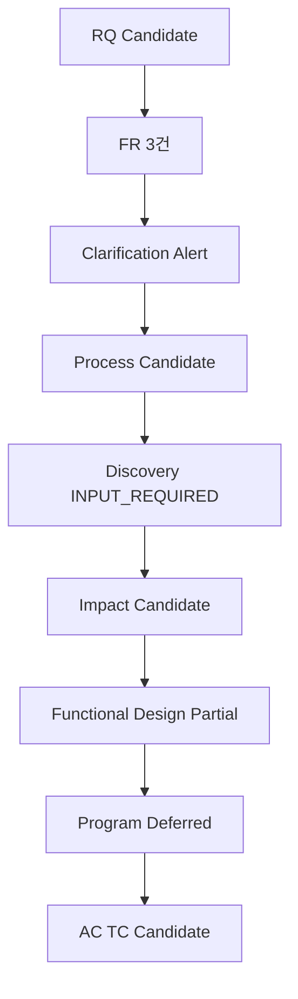
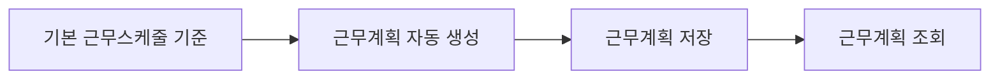

# RQ-CAND-0001 최초근무계획 자동 설정 Vertical Slice 검증

## Quick Start

- Source RQ Candidate: `RQ-CAND-0001`
- Stable Key: `rqgrp:sha256:22f2212234ab759c3ed13350cace166d68141772e1fb63607f1f35d4f943bcaf`
- Scope: Requirement evidence만으로 가능한 단계까지 수행
- Brownfield Application Source: **INPUT_REQUIRED**
- 종합: **PARTIAL / CONDITIONAL PASS**

## 1. GIVEN Requirement

- Level1: `근태관리`
- Level2: `근무계획 수립(탄력근로제)`
- 요구사항명: **탄력근로제 개선 최초근무계획 자동 설정하는 기능**

| External ID | FR Candidate | Source Requirement |
|---|---|---|
| REQ_TM_FL001 | FR-CAND-00001 | 탄력근로제 근무계획 저장 |
| REQ_TM_FL002 | FR-CAND-00002 | 탄력근로제 근무계획 조회 |
| REQ_TM_FL003 | FR-CAND-00003 | 기본 근무스케줄에 따라 근무계획 생성 자동 저장 |

## 2. Clarification / Assumption

- `current_problem`: OPEN
- 왜 최초 근무계획 자동 설정이 필요한지, 생성 시점/대상/예외/수정 허용 조건은 Source에서 확인되지 않았다.
- Process를 막지 않고 `WARNING` 상태로 다음 Candidate 분석을 진행한다.
- 업무 규칙을 임의 확정하지 않는다.

## 3. Process Candidate

Requirement 문구만으로 다음 흐름을 **INFERRED CANDIDATE**로 둘 수 있다.

이 순서는 Requirement 텍스트의 의미를 조합한 Candidate이며 실제 AS-IS/Transaction 순서를 의미하지 않는다.

## 4. Discovery / Impact

- DISCOVERY: **INPUT_REQUIRED** — Application Source Repository가 없다.
- IMPACT: **CANDIDATE** — 프로그램명, 클래스, Mapper, Procedure, Table을 생성하거나 확정하지 않는다.
- Existing Asset 재사용 여부: Source 확보 전 판단 불가.

## 5. Functional Design Partial

| 항목 | Candidate | 상태 |
|---|---|---|
| 목표 동작 | 기본 근무스케줄을 근거로 최초 근무계획을 자동 생성하고 저장하며 조회 가능 | INFERRED |
| 입력 | 대상자/기간/기본 스케줄 정보가 필요할 가능성 | OPEN |
| Validation | 중복 생성, 기존 계획 존재, 적용기간 규칙 확인 필요 | OPEN |
| Data Change | 저장 기능이 있으므로 Persistence 변화 가능 | CANDIDATE |
| Transaction | 자동생성+저장의 원자성 여부 | OPEN |
| Authorization | 조회/저장 권한 | OPEN |
| Logging/Audit | 자동 생성 이력 요구 여부 | OPEN |

## 6. Program / Development

- PROGRAM: **DEFERRED**
- DEVELOPMENT: **DEFERRED**
- 이유: 실제 Source Evidence 없이 PGM/ART/DATA를 만들어내면 Brownfield Truth를 위반한다.

## 7. AC / TC Candidate

| AC Candidate | TC Candidate | 상태 |
|---|---|---|
| 최초 근무계획 자동 생성 결과가 저장된다 | 기본 스케줄이 있는 대상에 대해 자동 생성 후 저장 결과 검증 | PARTIAL |
| 저장된 근무계획을 조회할 수 있다 | 생성/저장된 계획을 조회해 기대 내용 확인 | PARTIAL |
| 기존 계획/예외 조건은 확인된 정책을 따른다 | 중복/예외 케이스는 업무 규칙 확인 후 구체화 | OPEN |

## 8. 결론

이 RQ는 `INTAKE → DECOMPOSE → CLARIFY → PROCESS → DESIGN(PARTIAL) → TEST(PARTIAL)`까지 Requirement Evidence만으로 진행 가능하다. `DISCOVERY/IMPACT/PROGRAM/DEVELOPMENT/VERIFY`의 확정에는 실제 Application Source가 필요하며, 해당 입력 부재는 전체 Workflow를 차단하지 않는다.
