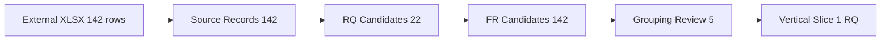

# 요구사항 실파일 Intake 검증 보고서

## Quick Start

- 검증 Source: `요구사항목록.xlsx`
- 실행 Branch: `SDLC_DESIGN_SESSION_FIRST/validation/v1.5.2-requirement-intake-poc-v0.3`
- 결론: **CONDITIONAL PASS**
- 실제 Source Hash: `sha256:d7dd76d786e97b66435bf4b9dc03fe04b8d55c580b565f2d45817893349ba39f`

## 1. 실파일 Import 결과

| 검증 항목 | 결과 | 판정 |
|---|---:|---|
| Source Requirement 행 | 142 | PASS |
| Import 성공 | 142 | PASS |
| Invalid 행 | 0 | PASS |
| Duplicate External ID | 0 | PASS |
| RQ Candidate | 22 | PASS |
| FR Candidate | 142 | PASS |
| Grouping Review | 5 | PASS / REVIEW |

External ID는 `REQ_TM_FL001~039` 39건과 `REQ_TM_TE001~103` 103건이 모두 연속적으로 보존되었다. 시작일/종료일/담당자는 142건 모두 비어 있었지만 Optional field로 처리되어 Import를 막지 않았다.

원문 보존 검증에서는 NBSP/trim 정규화로 53개 Source Record의 normalized 값이 원문과 달라졌지만, `raw` 필드에 원문이 그대로 남아 있고 normalized 값이 `raw -> NBSP 치환 + trim` 규칙과 142건 모두 일치했다. 따라서 원문 손실은 확인되지 않았다.

## 2. Exact Grouping 결과

| RQ Candidate | FR 수 | Level2 | 요구사항명 |
|---|---:|---|---|
| RQ-CAND-0001 | 3 | 근무계획 수립(탄력근로제) | 탄력근로제 개선 최초근무계획 자동 설정하는 기능 |
| RQ-CAND-0002 | 4 | 근무계획 수립(탄력근로제) | 탄력근로제 개선 고과제 예외사항 요청하는 기능 |
| RQ-CAND-0003 | 6 | 근무계획 수립(탄력근로제) | 탄력근로제 개선 연봉제 예외사항 요청하는 기능 |
| RQ-CAND-0004 | 8 | 근무계획 수립(탄력근로제) | 탄력근로제 개선 고과제/연봉제 예외사항 요청하는 기능 |
| RQ-CAND-0005 | 4 | 근무계획 수립(탄력근로제) | 탄력근로제 개선 근무계획 확정/안내하는 기능 |
| RQ-CAND-0006 | 1 | 근무계획 수립(탄력근로제) | 탄력근로제 개선 운영이력 조회하는 기능 |
| RQ-CAND-0007 | 1 | 근태/휴가 (ESS) | 탄력근로제 개선 확정 조회하는 기능 |
| RQ-CAND-0008 | 8 | 근태 Report | 탄력근로제 개선 검증 Report 조회하는 기능 |
| RQ-CAND-0009 | 1 | Interface | 탄력근로제 개선 데이터 HR Analytics 송신하는 기능 |
| RQ-CAND-0010 | 1 | 근태기록 | 탄력근로제 개선 휴가내역 근태 집계하는 기능 |
| RQ-CAND-0011 | 1 | 근태기록 | 탄력근로제 개선 근무내역 근태 집계하는 기능 |
| RQ-CAND-0012 | 1 | 근태기록 | 탄력근로제 개선 출장/교육내역 집계하는 기능 |
| RQ-CAND-0013 | 9 | 근태/휴가 (ESS) | 10분단위 근무계획 개선 근무계획 반영을 구현 |
| RQ-CAND-0014 | 1 | 선택적근무제 | 10분단위 근무계획 개선 선택적근무관리 반영을 구현 |
| RQ-CAND-0015 | 1 | 선택적근무제 | 10분단위 근무계획 개선 선택적근무관리 반영하는 기능 |
| RQ-CAND-0016 | 4 | 근태기록 | 10분단위 근무계획 개선 근태기록 반영을 구현 |
| RQ-CAND-0017 | 39 | 근태마감 | 10분단위 근무계획 개선 근태마감 반영을 구현 |
| RQ-CAND-0018 | 22 | 근태현황/통계 | 10분단위 근무계획 개선 근태현황/통계 반영을 구현 |
| RQ-CAND-0019 | 23 | Batch | 10분단위 근무계획 개선 근무집계 반영을 구현 |
| RQ-CAND-0020 | 1 | Interface | 10분단위 근무계획 개선 Yellow Page 송신 반영을 구현 |
| RQ-CAND-0021 | 2 | 근태/휴가 (ESS) | 10분단위 근무계획 개선 입출문시간 정보에 반영을 구현 |
| RQ-CAND-0022 | 1 | 메인화면 | 10분단위 근무계획 개선 주간스케쥴 반영을 구현 |

기존 구조 분석의 약 22개 예상과 실제 importer 결과가 일치했다. 이 숫자는 기대값에 맞춘 것이 아니라 `(Level1, Level2, 요구사항명)` exact grouping 결과다.

## 3. Grouping Review

| A | B | 유사도 | 자동 병합 |
|---|---|---:|---|
| 탄력근로제 개선 고과제 예외사항 요청하는 기능 | 탄력근로제 개선 연봉제 예외사항 요청하는 기능 | 0.9000 | 아니오 |
| 탄력근로제 개선 고과제 예외사항 요청하는 기능 | 탄력근로제 개선 고과제/연봉제 예외사항 요청하는 기능 | 0.9302 | 아니오 |
| 탄력근로제 개선 연봉제 예외사항 요청하는 기능 | 탄력근로제 개선 고과제/연봉제 예외사항 요청하는 기능 | 0.9302 | 아니오 |
| 탄력근로제 개선 휴가내역 근태 집계하는 기능 | 탄력근로제 개선 근무내역 근태 집계하는 기능 | 0.8947 | 아니오 |
| 10분단위 근무계획 개선 선택적근무관리 반영을 구현 | 10분단위 근무계획 개선 선택적근무관리 반영하는 기능 | 0.8511 | 아니오 |

유사 문구는 자동 병합하지 않고 `GROUPING_REVIEW`로 유지한다.

## 4. Stage별 재판정

| Stage | 판정 | 근거 / 다음 조건 |
|---|---|---|
| INTAKE | PASS | 142/142 Source Record, External ID, provenance 확보 |
| DECOMPOSE | CONDITIONAL PASS | Exact grouping으로 RQ 22, FR 142 생성. Business Goal/문제정의는 미확정 |
| CLARIFY | PASS / WARNING | 미확정 업무 맥락은 Alert + OPEN으로 계속 진행 가능 |
| PROCESS | CONDITIONAL PASS | Requirement 문구 기반 Candidate 흐름만 가능. AS-IS 확정 Evidence 없음 |
| DISCOVERY | INPUT_REQUIRED | 실제 Application Source Repository 미제공 |
| IMPACT | CANDIDATE | Source 없는 상태에서 프로그램/테이블 확정 금지 |
| DESIGN | PARTIAL | Requirement 기반 기능 동작 Candidate는 가능, Transaction/Data 상세는 Deferred |
| PROGRAM | DEFERRED | 실제 Source Evidence 필요 |
| DEVELOPMENT | DEFERRED | 실제 Source 및 안전한 write target 필요 |
| TEST | PARTIAL | FR 기반 AC/TC Candidate는 가능, 실행 Test는 Source/환경 필요 |
| VERIFY | DEFERRED | Code/Test Evidence 필요 |
| KNOWLEDGE | GIVEN | 요구사항 원문은 GIVEN 저장 가능, Confirmed 승격 불가 |
| PM Tracking | PASS | 담당자/일정 비어 있어도 진행 가능 |
| Worklist MD↔Excel | PASS / REGRESSION REQUIRED | 기존 계약 유지, CI에서 회귀 테스트 수행 |

## 5. 새 설계 Gap

### GAP-RI-004 Stable Re-import Candidate Identity

- 분류: **Contract Gap**
- 문제: 기존 `RQ-CAND-0001` 같은 순번 ID만으로는 Source 행/그룹 순서 변화 시 review 판단과 downstream 참조가 흔들릴 수 있다.
- 대응: v0.3에서 exact group key 기반 `stable_key = rqgrp:sha256:...`를 additive하게 추가했다. 표시용 `candidate_id`는 유지한다.
- 상태: **ENHANCED / PoC IMPLEMENTED**

### GAP-RI-005 Group Header Provenance Execution

- 분류: **Configuration Gap + Implementation Gap**
- 문제: profile에 `preserve_group_header_row: true`가 있었지만 v0.2 importer output에는 1행 그룹 Header provenance가 없었다.
- 대응: v0.3에서 `source_metadata.group_header_rows`와 `effective_headers`를 보존하도록 구현했다.
- 상태: **ENHANCED / PoC IMPLEMENTED**

## 6. 종합 판정

**CONDITIONAL PASS**

Requirement Intake 자체는 실제 142건 입력에서 PASS 수준으로 검증되었다. 후반 Stage는 Harness 설계 문제가 아니라 실제 Brownfield Application Source/Evidence가 없는 현재 입력 조건 때문에 `INPUT_REQUIRED / DEFERRED`다. 전체 Process는 막지 않고 Vertical Slice의 분석/설계 Candidate까지 계속 진행한다.
