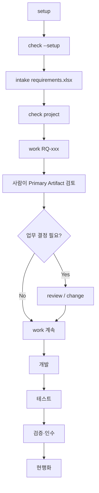

# Standard Scaffold 사용 가이드

## 1. 문서 목적

Framework 설계자의 설명 없이 일반 SI/SM 프로젝트 참여자가 Standard Scaffold를 `setup → intake → work → review → development → verify`까지 사용하는 방법을 설명한다. 사용자는 Harness 내부 Stage를 선택하지 않고 Human Artifact와 결정사항을 검토한다.

## 2. 언제 읽는가

- Harness를 처음 적용하는 프로젝트
- 고객사 Custom 문서가 아직 정해지지 않은 프로젝트
- 우선 Standard로 Pilot한 뒤 Custom Gap을 찾으려는 프로젝트

## 3. 선행조건

- `.sdlc/project.yaml` 생성 가능
- 요구사항 원본 XLSX 준비
- Brownfield면 Source root와 Build/Test 확인
- 프로젝트 Branch 정책 확인

## 4. 단계별 실행



### 4.1 Setup

```bash
python sdlc/scripts/harness.py setup --name hris --mode BROWNFIELD
python sdlc/scripts/harness.py check --setup
```

Setup 직후 `.sdlc/project.yaml`에서 실제 프로젝트 정보를 확인한다.

### 4.2 Standard Tailoring 선택

처음 적용하는 일반 프로젝트는 다음을 권장한다.

```yaml
delivery:
  profile: STANDARD
change:
  level_policy: AUTO
documents:
  internal:
    profile: STANDARD_5
  customer:
    profile: CUSTOMER_STANDARD_3
  pm:
    profile: PM_STANDARD
  machine:
    visibility: HIDDEN
```

`STANDARD_5`가 너무 많거나 고객 단위 문서가 3종이면 `STANDARD_3`으로 바꿀 수 있다. 내부 Stage는 바뀌지 않는다.

### 4.3 Intake

```bash
python sdlc/scripts/harness.py intake requirements.xlsx
```

확인할 Human 결과:

- 요구사항 인입 결과
- RQ Extraction Manifest
- 생성된 RQ ID
- 유사 그룹 Human Review 필요 여부

유사 제목은 자동 병합하지 않는다.

### 4.4 Project View

```bash
python sdlc/scripts/harness.py check project
```

최소 확인 항목:

- 전체 RQ
- 현재 사용자 상태
- Change Level
- 사람 결정 필요 건수
- 기술 Gap / Impact Coverage
- 개발/검증/인수 상태
- 담당자
- Next Action

### 4.5 RQ 작업

```bash
python sdlc/scripts/harness.py work --target RQ-001
```

일반 사용자는 `--stage`와 `--artifact`를 입력하지 않는다. Runtime이 내부 실행 위치를 판단하고 Tailoring Profile이 현재 사람이 검토할 Primary Artifact를 고른다.

### 4.6 Review와 Change

사람은 빈 Template을 처음부터 작성하는 대신 Agent 초안을 검토한다.

- 업무정책/범위/인수 판단: 사람 권위
- 기능설계: Agent draft + 설계자 review
- Source/Hash/Trace: Machine-derived + 개발자 확인

확정된 요구의 의미가 바뀌면 `/change`를 사용한다.

### 4.7 Development / Test / Verify

반복 `/work`로 다음 사용자 상태로 진행한다. 개발 중 예상 외 Legacy 영향이 발견되면 Change Level이 상향될 수 있다.

## 5. 실제 Config 예제

### 3종

```yaml
documents:
  internal:
    profile: STANDARD_3
```

- 업무정의서
- 상세설계서
- 화면설계서(`HAS_UI` 조건)

### 5종

```yaml
documents:
  internal:
    profile: STANDARD_5
```

- 요구사항정의서
- 업무프로세스설계서
- 기능·화면설계서
- 프로그램설계서
- 테스트·인수결과서

### Full

```yaml
documents:
  internal:
    profile: STAGE_ORIENTED_FULL
```

기존 Stage-oriented 문서 체계와 가까운 호환 Profile이다.

## 6. 생성되는 결과

Human Primary:

- Profile에 정의된 INTERNAL_IT 문서
- PM/RQ Human Control View
- 고객 커뮤니케이션이 필요하면 CUSTOMER Projection

Machine 영역:

- Stage Result
- Canonical Delta
- Change Level Evidence/History
- Source Hash/Trace
- Projection freshness metadata

## 7. 역할별 Action

- PM: `/check project`에서 Next Action과 사람 결정 중심으로 관리
- BA/설계자: 업무/기능 초안 Review
- 개발자: Program/Source 구현 및 Legacy Discovery 보고
- 테스트: AC/TC와 실제 결과 검토
- 고객: CUSTOMER Projection의 업무 의미/인수 판단
- Harness 관리자: Stage/Runtime/Machine Evidence 디버그

## 8. 자주 틀리는 부분

- 모든 Stage 문서를 다 읽으려 하지 않는다.
- L1/L4를 문서 1개/4개 의미로 해석하지 않는다.
- Profile을 바꾸려고 Core Stage Contract를 복제하지 않는다.
- 개발 중 영향이 커져도 기존 Change Level을 억지로 유지하지 않는다.
- Generated Customer View에 새 업무 사실을 직접 추가해 SSOT로 만들지 않는다.

## 9. Validation 방법

```bash
python sdlc/scripts/harness.py check --setup
python sdlc/scripts/tailoring_runtime.py validate-profile --profile STANDARD_5
python sdlc/scripts/harness.py check project
```

개발/검증 완료 전에는 Build/Test와 Canonical 적용 성공을 별도로 확인한다.

## 10. Standard 완료 기준

- 사용자가 Stage를 직접 선택하지 않는다.
- RQ마다 Change Level 이유/Evidence가 남는다.
- PM은 Runtime JSON 없이 RQ 상태를 이해한다.
- 설계/개발자는 Profile의 Primary 문서만 검토하면 된다.
- Customer 문서는 파생 View이며 Business Truth를 새로 만들지 않는다.
- Canonical이 바뀐 오래된 Generated View는 `STALE_VIEW`로 검출된다.
