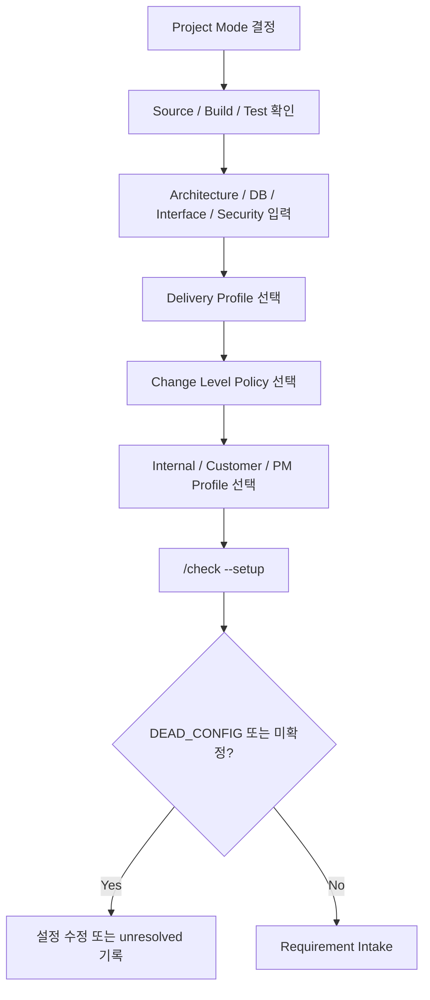

# 프로젝트 설정 가이드 — `.sdlc/project.yaml`

## 1. 문서 목적

이 문서는 프로젝트 사용자가 관리해야 하는 유일한 Human-maintained Harness 설정 파일인 `.sdlc/project.yaml`을 설명한다. v1.9에서는 내부 Stage/Template 경로 대신 프로젝트 성격과 Artifact Profile ID만 설정한다.

## 2. 언제 읽는가

- 최초 `setup` 직후
- Greenfield/Brownfield/Hybrid 모드를 확정할 때
- Source root, Build/Test, DB/Interface/Security 정보를 보완할 때
- Delivery Profile, Change Level Policy, Internal/Customer/PM Artifact Profile을 바꿀 때

## 3. 선행조건

- Repository 구조를 대략 알고 있어야 한다.
- Brownfield면 현재 Source root와 Build/Test 명령을 실제로 확인한다.
- 업무정책과 기술정보를 구분한다.
- 알 수 없는 값을 예시로 추정하지 말고 `unresolved`에 남긴다.

## 4. 설정 흐름



## 5. 실제 Config 예제

```yaml
schema_version: 1
project:
  name: "hris-enhancement"
  mode: "BROWNFIELD"
  description: "기존 HRIS 고도화"

delivery:
  profile: "STANDARD"

change:
  level_policy: "AUTO"

agent:
  execution: "INTERACTIVE"

technology:
  language: "Java"
  framework: "Spring"
  build:
    - "./mvnw -q -DskipTests package"
  test:
    - "./mvnw test"

source:
  roots:
    - "src/main/java"
  test_roots:
    - "src/test/java"
  resource_roots:
    - "src/main/resources"
  excludes:
    - "target/**"

architecture:
  style: "Layered"

git:
  branch_strategy: "project-defined"
  protected_branches:
    - "main"

data:
  database: "Oracle"

interface:
  api: "REST"
  batch: "Spring Batch"

security:
  standard: "고객사 보안표준"

documents:
  language: "ko-KR"
  internal:
    profile: "STANDARD_5"
  customer:
    profile: "CUSTOMER_STANDARD_3"
  pm:
    profile: "PM_STANDARD"
  machine:
    visibility: "HIDDEN"

unresolved:
  - "운영 Batch 실행주기 확인 필요"
```

### Project Mode

- `GREENFIELD`: 신규 구축. Source Evidence가 없는 구간을 기존 Source처럼 가정하지 않는다.
- `BROWNFIELD`: 기존 시스템 고도화. Current Source/DB/Config/Runtime Evidence를 AS-IS 기술 권위로 사용한다.
- `HYBRID`: 신규와 기존 영역이 섞여 있다.
- `AUTO`: 초기 정보가 부족할 때 사용하되, 실제 프로젝트에서는 가능한 빨리 명시값으로 확정한다.

### Delivery Profile

- `FAST`: 소규모/운영성 변경의 실행 깊이를 줄인다.
- `STANDARD`: 일반 SI/SM 기본.
- `FULL`: 대형/고위험 변경에서 전체 내부 Stage를 사용한다.

**Delivery Profile은 Change Level이나 문서 개수와 동일하지 않다.**

### Change Level Policy

`AUTO`는 RQ마다 Evidence를 바탕으로 L1~L5를 판정한다.

- `L1 MICRO`
- `L2 LOCAL`
- `L3 FEATURE`
- `L4 PROCESS`
- `L5 ARCH`

`MANUAL`은 프로젝트 사유상 사람이 분류를 통제해야 할 때만 사용한다. 자동 Downgrade는 하지 않으며 영향이 커지면 Development Discovery에서 Escalation할 수 있다.

### Artifact Profile

- `documents.internal.profile`: 설계/개발자가 검토하는 문서 구조
- `documents.customer.profile`: 고객 커뮤니케이션 Projection
- `documents.pm.profile`: PM/Reviewer View
- `documents.machine.visibility`: 일반 사용자는 `HIDDEN` 권장

## 6. 생성되는 결과

Config는 Runtime에서 다음 Machine-effective 파일로 파생된다.

- `.sdlc/runtime/effective/project-profile.json`
- `.sdlc/runtime/effective/source-profile.json`
- `.sdlc/runtime/effective/project-context.json`
- `.sdlc/runtime/effective/config-usage.json`
- `.sdlc/runtime/effective/tailoring-config.json`

이 파일들은 사람이 직접 수정하지 않는다.

## 7. 역할별 Action

- PM: Delivery/Profile 선택의 프로젝트 운영 적합성을 확인한다.
- 아키텍트: Source root, Architecture, DB, Interface, Security를 검토한다.
- 개발 리드: Build/Test 명령이 실제로 동작하는지 확인한다.
- Harness 관리자: Profile ID가 실제 Tailoring Profile로 resolve되는지 검증한다.
- 일반 개발자/설계자: Runtime effective JSON을 직접 편집하지 않는다.

## 8. 자주 틀리는 부분

- `.sdlc/project.yaml` 외에 `project-profile.yaml`을 사람이 이중 관리하지 않는다.
- 존재하지 않는 Profile ID를 적지 않는다.
- `documents.internal.profile`에 Template 경로를 적지 않는다.
- Source root를 모른다고 Repository 전체를 임의로 `.`로 잡지 않는다.
- Build/Test가 불명확하면 실제 확인 전까지 완료로 간주하지 않는다.
- `extensions.*` 이외의 임의 Config key는 `DEAD_CONFIG`로 실패한다.

## 9. Validation 방법

```bash
python sdlc/scripts/harness.py check --setup
```

설정 Key 분류 확인:

```bash
cat .sdlc/runtime/effective/config-usage.json
```

Profile 확인:

```bash
python sdlc/scripts/tailoring_runtime.py validate-profile --profile STANDARD_5
```

## 10. 완료 기준

- `.sdlc/project.yaml` 하나만 Human-maintained Config로 사용한다.
- 모든 Runtime switch는 실제 Consumer가 있다.
- 미사용 Key는 조용히 무시되지 않고 실패한다.
- Project Mode/Source/Build/Test/Delivery/Change/Profile이 확인되어 있다.
- 사용자가 Stage 이름이나 Template 경로를 설정하지 않는다.
