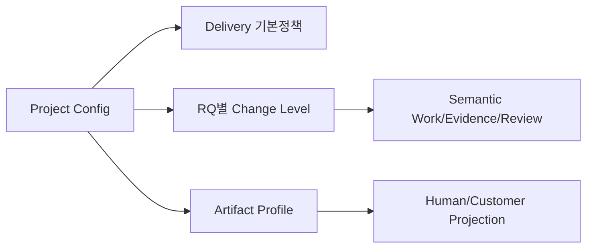

# 프로젝트 설정 가이드 — `.sdlc/project.yaml`

## 1. 문서 목적

프로젝트 사용자가 관리하는 유일한 Harness 설정인 `.sdlc/project.yaml`을 설명한다. 사용자는 Stage/Template 경로나 Machine Runtime JSON을 설정하지 않는다.

## 2. 설정 원칙

Config 책임은 세 층으로 나눈다.

1. **Delivery Profile** — 프로젝트 공통 기본 정책/호환 경계
2. **Change Level Policy** — RQ별 실제 Semantic Work/Evidence/Review 깊이
3. **Artifact Profile** — 사람이 보는 Internal/Customer/PM 문서 구성

Delivery Profile이 L1~L5를 대신하지 않으며, Artifact Profile도 Semantic Work를 줄이지 않는다.



## 3. 실제 Config 예제

```yaml
schema_version: 1
project:
  name: "hris-enhancement"
  mode: "BROWNFIELD"

delivery:
  profile: "STANDARD"

change:
  level_policy: "AUTO"

agent:
  execution: "INTERACTIVE"

technology:
  language: "Java"
  framework: "Spring"
  build:
    - "./mvnw -q -DskipTests package"
  test:
    - "./mvnw test"

source:
  roots:
    - "src/main/java"
  test_roots:
    - "src/test/java"
  resource_roots:
    - "src/main/resources"
  excludes:
    - "target/**"

documents:
  language: "ko-KR"
  internal:
    profile: "STANDARD_5"
  customer:
    profile: "CUSTOMER_STANDARD_3"
  pm:
    profile: "PM_STANDARD"
  machine:
    visibility: "HIDDEN"

unresolved:
  - "운영 Batch 실행주기 확인 필요"
```

## 4. Project Mode

- `GREENFIELD`: Source가 없는 구간을 기존 Source처럼 가정하지 않는다.
- `BROWNFIELD`: Current Source/DB/Config/Runtime을 AS-IS 기술 Evidence로 사용한다.
- `HYBRID`: 신규와 기존 영역이 섞여 있다.
- `AUTO`: 최초 탐색용이며 가능한 빨리 실제 Mode로 확정한다.

Brownfield Source Observation은 Business Truth가 아니다.

## 5. Delivery Profile

- `FAST`: 프로젝트 공통 운영 제약이 가벼운 경우의 기본 정책
- `STANDARD`: 일반 SI/SM 기본
- `FULL`: 대형/고위험 프로젝트에서 강한 검증/호환 정책

**Delivery Profile만 보고 Stage 수나 문서 수를 결정하지 않는다.** 실제 RQ의 작업량은 Change Level과 Typed Evidence가 결정한다.

## 6. Change Level Policy

`AUTO`는 RQ마다 Typed/Structural Evidence로 L1~L5를 판정한다. 자유문자 keyword는 후보 탐색에만 사용한다.

- `L1 MICRO`
- `L2 LOCAL`
- `L3 FEATURE`
- `L4 PROCESS`
- `L5 ARCH`

L1/L2도 Source를 실제 수정하기 전에 다음은 필수다.

- Requirement Intent Decomposition
- AS-IS Source Analysis
- Impact Check

별도 Stage 문서를 생략할 수 있을 뿐 분석 자체를 생략할 수 없다. 자동 Downgrade는 하지 않으며 개발 중 예상 밖 영향이 발견되면 Level을 상향할 수 있다.

## 7. Artifact Profile

기본값은 다음과 같다.

- `documents.internal.profile: STANDARD_5`
- `documents.customer.profile: CUSTOMER_STANDARD_3`
- `documents.pm.profile: PM_STANDARD`
- `documents.machine.visibility: HIDDEN`

`STAGE_ORIENTED_FULL`은 Legacy/Formal Contract/기존 고객 양식 호환용이며 신규 프로젝트 기본값이 아니다.

## 8. Program Spec와 Source 검증

신규 Standard의 Program readiness는 `Core Required 6 + Risk-triggered Conditional`이다. 17개 전체 필드는 `LEGACY_FULL_17`에서만 요구한다.

Source에서 재생성 가능한 Query/Table/Symbol/Hash는 Machine-derived로 관리한다. 실제 Source가 변경된 DEVELOPMENT run에만 Build/Test를 필수 검증하며, Source가 변경되지 않은 문서/분석-only run 때문에 불필요하게 Build/Test를 요구하지 않는다.

## 9. 생성되는 Machine Config

다음은 사람이 직접 수정하지 않는다.

- `.sdlc/runtime/effective/project-profile.json`
- `.sdlc/runtime/effective/source-profile.json`
- `.sdlc/runtime/effective/project-context.json`
- `.sdlc/runtime/effective/config-usage.json`
- `.sdlc/runtime/effective/tailoring-config.json`
- `sdlc/runtime/change-level/*.json`

## 10. 자주 틀리는 부분

- `.sdlc/project.yaml`과 legacy project/source profile을 이중 관리하지 않는다.
- `documents.internal.profile`에 Template 경로를 쓰지 않는다.
- L1을 “분석 생략”으로 설정하지 않는다.
- Source root가 불명확하다고 Repository 전체를 임의로 `.`로 지정하지 않는다.
- 관련 없는 Program Spec 조건부 항목을 N/A로 채우지 않는다.
- `extensions.*` 외 임의 Config key는 `DEAD_CONFIG`로 실패한다.

## 11. Validation

```bash
python sdlc/scripts/harness.py check --setup
python sdlc/scripts/tailoring_runtime.py validate-profile --profile STANDARD_5
```

완료 기준은 Config가 존재하는 것이 아니라 **Config의 값이 Runtime Consumer, Guide, Template, Projection Profile과 같은 의미를 가지는 것**이다.
