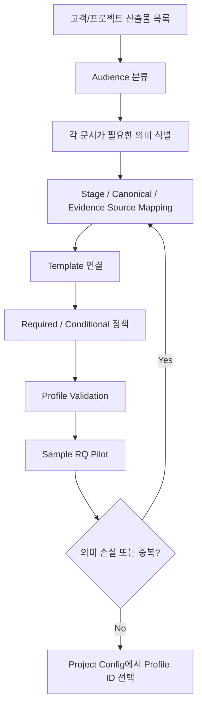

# Tailoring 설정 가이드

## 1. 문서 목적

프로젝트마다 3종/5종/Full 등 서로 다른 Human Artifact 체계를 사용하면서도 Core Stage, Canonical, Evidence, Guard를 유지하는 방법을 설명한다.

핵심 식은 다음이다.

> `Stage / Canonical / Evidence → Tailoring Profile → Human Artifact`

Template만 추가하는 것은 Tailoring 완료가 아니다.

## 2. 언제 읽는가

- 고객사 표준 문서 수/이름/구성이 Harness 기본과 다를 때
- 여러 Stage 정보를 하나의 문서로 합치려 할 때
- 하나의 Stage 정보를 내부/PM/고객 여러 문서로 나눌 때
- Change Level에 따라 조건부 문서를 만들 때

## 3. 선행조건

- 프로젝트의 실제 산출물 목록과 Audience를 알고 있어야 한다.
- 각 문서가 어떤 업무 의미/기술 Evidence를 필요로 하는지 식별한다.
- Core Stage를 고객 문서 이름으로 바꾸지 않는다는 원칙에 동의한다.

## 4. Tailoring 판단 흐름



## 5. 실제 Tailoring Profile 예제

```yaml
schema_version: 1
profile_id: HRIS_UNIT_3
name: "HRIS Unit 3종"
output_root: "docs/10_산출물"

artifacts:
  business_definition:
    audience: INTERNAL_IT
    template: "sdlc/custom/project/templates/unit/01_업무정의서.md"
    output_path: "docs/10_산출물/{target}/01_업무정의서.md"
    visibility: PRIMARY
    authoring: AGENT_DRAFT_HUMAN_REVIEW
    order: 10
    sources:
      stages: [DECOMPOSE, CLARIFY, PROCESS, DISCOVERY, IMPACT]

  detail_design:
    audience: INTERNAL_IT
    template: "sdlc/custom/project/templates/unit/02_상세설계서.md"
    output_path: "docs/10_산출물/{target}/02_상세설계서.md"
    visibility: PRIMARY
    authoring: AGENT_DRAFT_HUMAN_REVIEW
    order: 20
    sources:
      stages: [DESIGN, PROGRAM, DEVELOPMENT, TEST, VERIFY]

  screen_design:
    audience: INTERNAL_IT
    template: "sdlc/custom/project/templates/unit/03_화면설계서.md"
    output_path: "docs/10_산출물/{target}/03_화면설계서.md"
    condition: HAS_UI
    visibility: PRIMARY
    authoring: AGENT_DRAFT_HUMAN_REVIEW
    order: 30
    sources:
      stages: [DESIGN, PROGRAM, DEVELOPMENT, TEST]
```

Project Config에는 복잡한 Mapping을 복사하지 않는다.

```yaml
documents:
  internal:
    profile: HRIS_UNIT_3
```

## 6. 3종 / 5종 / Full 차이

| Profile | 사람에게 보이는 구조 | 내부 Stage | 적합한 상황 |
|---|---|---|---|
| `STANDARD_3` | 업무정의/상세설계/화면설계 | 유지 | Unit 단위 문서가 강한 프로젝트 |
| `STANDARD_5` | 요구/Process/기능·화면/Program/Test·인수 | 유지 | 일반 SI/SM |
| `STAGE_ORIENTED_FULL` | Stage별 세분 문서 | 유지 | 기존 상세 산출물 체계와 호환 필요 |

문서 수가 달라도 Canonical 의미와 Guard는 동일해야 한다.

## 7. Mapping 패턴

### N Stage → 1 Artifact

업무정의서가 `DECOMPOSE + CLARIFY + PROCESS + IMPACT`를 받을 수 있다. Stage를 합친 것이 아니라 여러 Stage의 의미를 한 문서에 Projection한 것이다.

### 1 Stage → N Artifact

`DESIGN`이 상세설계서와 조건부 화면설계서 모두에 영향을 줄 수 있다. Runtime은 Primary 작업면과 영향을 받는 Projection 목록을 구분한다.

### Conditional Artifact

지원 조건 예:

- `HAS_UI`
- `HAS_INTERFACE`
- `HAS_BATCH`
- `HAS_DATA_CHANGE`
- `HAS_SECURITY_IMPACT`
- `CHANGE_LEVEL_AT_LEAST_L4`

## 8. 역할별 Action

- 프로젝트 PM: 계약상 필요한 문서 목록과 승인 주체 정의
- BA/설계 리드: Stage 의미가 어느 문서 Section으로 들어갈지 결정
- 개발 리드: Program/Source/Test Evidence가 빠지지 않는지 확인
- 고객 담당자: CUSTOMER 문서가 Internal/Canonical에서 파생되는지 확인
- Harness 관리자: Profile Schema/Template 존재/Stage 이름/조건식 검증

## 9. 자주 틀리는 부분

- 문서 이름과 Stage 이름을 1:1로 만들 필요가 없다.
- 3종 문서를 위해 Core Stage를 3개로 줄이지 않는다.
- 고객사마다 `run_work.py`를 복사하지 않는다.
- Template 안에 Business Truth를 하드코딩하지 않는다.
- CUSTOMER Profile이 독립 Source가 되지 않게 한다.
- L4라고 무조건 문서를 더 많이 만드는 식으로 묶지 않는다.

## 10. Validation 방법

```bash
python sdlc/scripts/tailoring_runtime.py validate-profile --profile STANDARD_3
python sdlc/scripts/tailoring_runtime.py validate-profile --profile STANDARD_5
python sdlc/scripts/tailoring_runtime.py validate-profile --profile STAGE_ORIENTED_FULL
```

특정 RQ/Stage의 실제 Mapping:

```bash
python sdlc/scripts/tailoring_runtime.py resolve --target RQ-001 --stage DESIGN
```

완료 기준은 “Template 파일이 존재함”이 아니라 다음이다.

1. 모든 Artifact가 Stage Source를 가진다.
2. Template이 실제 존재한다.
3. Audience가 명시된다.
4. 조건부 문서 정책이 테스트된다.
5. 3/5/Full에서 동일 Canonical 의미가 손실되지 않는다.
