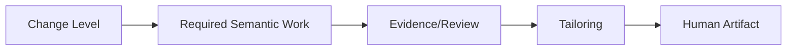

# Tailoring 설정 가이드

## 1. 문서 목적

프로젝트마다 3종/5종/호환 Full 등 서로 다른 Human Artifact 체계를 사용하면서도 같은 Canonical/Evidence/Guard를 유지하는 방법을 설명한다.

핵심 식은 다음이다.

> `Semantic Work / Canonical / Evidence → Tailoring Profile → Human Artifact`

Tailoring은 **문서 Projection 정책**이다. Change Level의 필수 분석을 삭제하는 정책이 아니다.

## 2. 반드시 구분할 것

- **Change Level**: 실제로 해야 하는 Semantic Work/Evidence/Review를 결정한다.
- **Tailoring Profile**: 그 결과를 어떤 사람용 문서로 보여줄지 결정한다.
- **Template**: 각 문서의 Section 구조를 정의한다.

따라서 L1/L2에서 별도 Stage 문서를 줄여도 `Intent → AS-IS Source → Impact` 분석은 남는다. 반대로 STANDARD_3를 선택했다고 내부 Semantic Work가 3단계가 되는 것도 아니다.



## 3. 기본 Profile

신규 프로젝트 기본값:

- Internal: `STANDARD_5`
- Customer: `CUSTOMER_STANDARD_3`
- PM: `PM_STANDARD`

`STAGE_ORIENTED_FULL`은 다음 경우에만 사용한다.

- Legacy compatibility
- Formal contract compatibility
- Existing customer document mapping

신규 프로젝트에서 Full을 기본값으로 두지 않는다.

## 4. 실제 Profile 예제

```yaml
schema_version: 1
profile_id: HRIS_UNIT_3
name: "HRIS Unit 3종"
output_root: "docs/10_산출물"

artifacts:
  business_definition:
    audience: INTERNAL_IT
    template: "sdlc/custom/project/templates/unit/01_업무정의서.md"
    output_path: "docs/10_산출물/{target}/01_업무정의서.md"
    visibility: PRIMARY
    authoring: AGENT_DRAFT_HUMAN_REVIEW
    order: 10
    sources:
      stages: [DECOMPOSE, CLARIFY, PROCESS, DISCOVERY, IMPACT]

  detail_design:
    audience: INTERNAL_IT
    template: "sdlc/custom/project/templates/unit/02_상세설계서.md"
    output_path: "docs/10_산출물/{target}/02_상세설계서.md"
    visibility: PRIMARY
    authoring: AGENT_DRAFT_HUMAN_REVIEW
    order: 20
    sources:
      stages: [DESIGN, PROGRAM, DEVELOPMENT, TEST, VERIFY]

  screen_design:
    audience: INTERNAL_IT
    template: "sdlc/custom/project/templates/unit/03_화면설계서.md"
    output_path: "docs/10_산출물/{target}/03_화면설계서.md"
    condition: HAS_UI
    visibility: PRIMARY
    authoring: AGENT_DRAFT_HUMAN_REVIEW
    order: 30
    sources:
      stages: [DESIGN, PROGRAM, DEVELOPMENT, TEST]
```

Project Config에는 Mapping 전체를 복사하지 않는다.

```yaml
documents:
  internal:
    profile: HRIS_UNIT_3
```

## 5. 3종 / 5종 / Compatibility Full

| Profile | 사람에게 보이는 구조 | 용도 |
|---|---|---|
| `STANDARD_3` | 업무정의/상세설계/화면설계 | Unit 중심 프로젝트 |
| `STANDARD_5` | 요구/Process/기능·화면/Program/Test·인수 | 일반 SI/SM 기본 |
| `STAGE_ORIENTED_FULL` | Stage별 세분 문서 | 기존 계약/고객 양식 호환 |

문서 수가 달라도 Business Truth, Source Evidence, Guard의 의미는 같아야 한다.

## 6. Mapping 패턴

### N Stage → 1 Artifact

여러 내부 의미를 하나의 사람 문서에 Projection한다. 이것은 Stage를 하나로 합치는 것이 아니다.

### 1 Stage → N Artifact

하나의 내부 의미가 Internal/PM/Customer 여러 View를 stale하게 만들 수 있다.

### Conditional Artifact

대표 조건:

- `HAS_UI`
- `HAS_INTERFACE`
- `HAS_BATCH`
- `HAS_DATA_CHANGE`
- `HAS_SECURITY_IMPACT`
- `CHANGE_LEVEL_AT_LEAST_L4`

조건이 없다고 빈 문서나 N/A 문서를 생성하지 않는다.

## 7. Customer Projection

`CUSTOMER_STANDARD_3`의 active View는 다음 세 가지다.

- `solution_agreement` → A01 요구·업무·기능 합의
- `delivery_scope` → A02 영향·개발범위 공유
- `acceptance_handover` → A03 테스트·인수·운영 결과

모두 `GENERATED_VIEW`이며 독립 Business Truth가 아니다. Internal/Canonical 변경 시 `STALE_VIEW`가 되고 재생성/Review 후 `CURRENT`가 된다.

## 8. Validation

```bash
python sdlc/scripts/tailoring_runtime.py validate-profile --profile STANDARD_3
python sdlc/scripts/tailoring_runtime.py validate-profile --profile STANDARD_5
python sdlc/scripts/tailoring_runtime.py validate-profile --profile STAGE_ORIENTED_FULL
```

완료 기준:

1. Profile Template 경로가 실제 존재한다.
2. Audience/authoring이 명확하다.
3. Customer Profile의 artifact ID/template/stage 범위가 Customer Document Contract와 모순되지 않는다.
4. Tailoring이 Change Level Semantic Work를 우회하지 않는다.
5. 신규 기본값은 `STANDARD_5`, Full은 compatibility로 유지된다.
