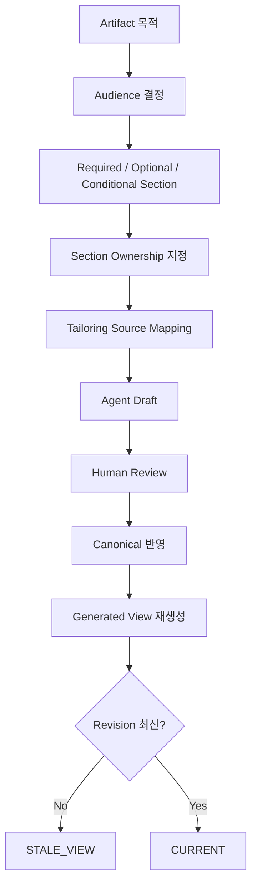

# Template 및 산출물 가이드

## 1. 문서 목적

Template, Tailoring, Audience, Section Ownership을 분리하여 사람이 어디를 검토·수정할 수 있고 Machine이 어디를 재생성하는지 설명한다.

## 2. 언제 읽는가

- 신규 Template을 만들거나 기존 고객 양식을 옮길 때
- 한 문서 안에 사람 판단과 Source-derived 값이 섞일 때
- Generated View가 오래된 상태인지 판단해야 할 때

## 3. 선행조건

- Tailoring Profile의 Artifact 목록이 정의되어 있어야 한다.
- 문서의 실제 승인/검토 책임자를 알고 있어야 한다.
- Canonical과 Machine Evidence가 문서 본문과 다른 책임을 가진다는 점을 이해한다.

## 4. Template 설계 흐름



## 5. Section Ownership

| Ownership | 의미 | 수정 원칙 |
|---|---|---|
| `HUMAN_AUTHORITATIVE` | 업무정책·요구 목적·결정 | Agent는 제안 가능, 자동 확정 금지 |
| `HUMAN_REVIEWED` | Agent 초안을 사람이 책임 검토 | Reviewer가 확정/수정 |
| `SHARED` | Machine Evidence와 사람 판단 결합 | Evidence는 보존, 결론은 검토 |
| `MACHINE_DERIVED` | Hash/Trace/Query/Table 등 | Source에서 재생성, 직접 덮어쓰기 지양 |
| `GENERATED_VIEW` | PM/Customer 등 파생 View | Canonical/Internal에서 재생성 |

대표 예:

- 요구 목적 / 업무 규칙 / 고객 결정 → `HUMAN_AUTHORITATIVE`
- 기능 설계 → `HUMAN_REVIEWED`
- Program Mapping → `SHARED`
- Query/Table/Source Hash/Traceability → `MACHINE_DERIVED`
- 고객 표현 / PM 요약 → `GENERATED_VIEW`

## 6. 실제 Template 예제

```markdown
## 업무 규칙과 결정
### 필수 · HUMAN_AUTHORITATIVE
| 항목 | 내용 | 상태 | 근거/결정자 |
|---|---|---|---|

## Query·Table·Source 구현 근거
### 조건부 · MACHINE_DERIVED
- Source Locator / Hash:
- Query / Table / Column:

## 미확정 사항·주의·가정
### 필수 · HUMAN_REVIEWED
- 사람 결정 필요:
- 기술 조사 필요:
```

Template은 “무슨 의미가 들어오는가”를 결정하지 않는다. 그 관계는 Tailoring Profile의 `sources`가 결정한다.

## 7. Freshness

Generated/Human View에는 최소 다음을 추적한다.

```text
canonical_revision
generated_from_revision
generated_at
```

`canonical_revision > generated_from_revision`이면 `STALE_VIEW`다. 기본 검토/승인 기준에서 제외하고 재생성한다.

Runtime metadata 위치:

```text
sdlc/runtime/projections/*.json
```

## 8. Audience별 산출물

### MACHINE
Stage Result, Canonical Delta, Source Hash, Confidence, Trace, Coverage Gap. 일반 사용자의 Primary 문서에서 숨긴다.

### INTERNAL_IT
설계/개발자가 실제 검토하는 문서. Agent 초안 + Human Review가 기본이다.

### PM_REVIEW
전체 RQ 상태, 사람 결정, 기술 Gap, Next Action 중심. Stage 이름은 기본 숨김이다.

### CUSTOMER
Canonical/Internal Artifact 기반 Projection. 새 Business Truth를 자체 생성하지 않는다.

## 9. 자주 틀리는 부분과 Validation

자주 틀리는 부분:

- Generated View에 고객이 값을 고쳤다고 Canonical이 자동 바뀐 것으로 간주하지 않는다.
- Machine-derived Hash를 사람이 임의 값으로 수정하지 않는다.
- Human authoritative Section을 재생성으로 덮지 않는다.
- Optional과 Conditional을 같은 개념으로 보지 않는다.

Validation:

```bash
python sdlc/scripts/tailoring_runtime.py validate-profile --profile STANDARD_5
python sdlc/scripts/harness.py check project
```

`stale_human_view_count`가 0인지 확인한다.

## 10. 완료 기준

- 모든 주요 Section의 Ownership을 설명할 수 있다.
- Template과 Tailoring의 책임이 섞이지 않는다.
- Customer/PM View가 새 업무 사실을 만들지 않는다.
- 오래된 View가 `STALE_VIEW`로 탐지된다.
- 사람은 Machine Runtime JSON을 직접 편집하지 않는다.
