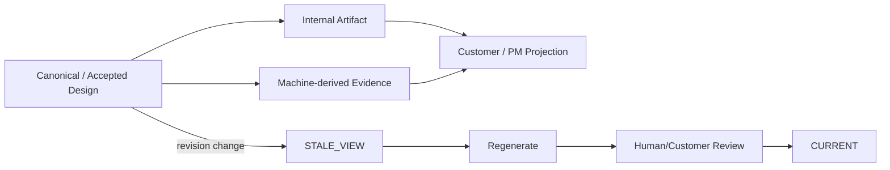

# Template 및 산출물 가이드

## 1. 문서 목적

Template, Tailoring, Section Ownership, Projection Lifecycle을 분리하여 사람이 무엇을 판단하고 Machine이 무엇을 재생성하는지 정의한다.

## 2. 책임 분리



- Template은 **문서 Section 구조**를 정의한다.
- Tailoring은 **어떤 내부 의미가 어떤 Artifact에 들어가는지** 정의한다.
- Change Level은 **어떤 Semantic Work/Evidence/Review가 필요한지** 정의한다.
- Projection은 **확정/관찰된 내용을 Audience에 맞춰 보여준다.** 새 Business Truth를 만들지 않는다.

## 3. Section Ownership

| Ownership | 의미 | 수정 원칙 |
|---|---|---|
| `HUMAN_AUTHORITATIVE` | 업무정책·요구 목적·결정 | Agent 제안 가능, 자동 확정 금지 |
| `HUMAN_REVIEWED` | Agent 초안을 사람이 책임 검토 | Reviewer가 확정/수정 |
| `SHARED` | Machine Evidence와 사람 판단 결합 | Evidence 보존, 결론 검토 |
| `MACHINE_DERIVED` | Hash/Trace/Query/Table/Symbol 등 | Source에서 재생성, 사람이 이중 유지하지 않음 |
| `GENERATED_VIEW` | PM/Customer 파생 View | Canonical/Internal에서 재생성 |

대표 예:

- 업무 목적/정책/고객 결정 → `HUMAN_AUTHORITATIVE`
- 기능 설계 → `HUMAN_REVIEWED`
- Program Delta → `SHARED`
- Query/Table/Source Hash/Trace → `MACHINE_DERIVED`
- A01/A02/A03 및 PM 요약 → `GENERATED_VIEW`

## 4. Program Spec Template 규칙

신규 Standard는 `Core Required 6 + Risk-triggered Conditional`이다.

Core:

1. 기능/요구 설계 기준
2. 실제 구현 대상
3. Source Evidence
4. 개발 Delta·변경 Source
5. AC/Test
6. OPEN/Guard

Conditional:

- Data/Mapping
- Transaction
- Concurrency
- Interface
- Error
- Security
- Observability
- NFR/Migration
- Architecture/Standard

Typed Trigger가 없으면 해당 Section/row를 최종 문서에서 제거한다. 관련 없는 항목을 N/A로 채우기 위해 Agent token과 Human review 시간을 사용하지 않는다.

`LEGACY_FULL_17`만 17개 전체 항목을 유지한다.

## 5. L1/L2 Template 사용

L1/L2에서도 Intent/AS-IS Source/Impact 분석은 필수다. 다만 이 분석을 각각 별도 Human Artifact로 만들 필요는 없다.

실제 Source가 바뀌는 Fast Path에서 Agent는 `stage-result.json` 안에 다음 Machine 요약을 남긴다.

```json
{
  "pre_write_analysis": {
    "INTENT_DECOMPOSED": {"status": "PASS", "evidence_refs": ["RQ-001"]},
    "AS_IS_SOURCE_ANALYZED": {"status": "PASS", "evidence_refs": ["src/...#method"]},
    "IMPACT_CHECKED": {"status": "PASS", "evidence_refs": ["impact:RQ-001"]}
  }
}
```

이 JSON은 개발자가 작성하는 문서가 아니다. 현재 Agent가 이미 수행한 분석의 Machine Evidence다.

## 6. Customer Projection

표준 고객 View는 세 가지다.

- A01 `solution_agreement`
- A02 `delivery_scope`
- A03 `acceptance_handover`

Projection Template의 Section은 Customer Document Contract와 일치해야 한다. Customer View에서 사람이 업무정책을 수정하면 즉시 Canonical을 덮어쓰지 않고 Decision/Review 대상으로 반환한다.

## 7. Freshness

Generated View에는 최소 다음을 추적한다.

```text
canonical_revision
generated_from_revision
generated_at
review_status
```

`canonical_revision > generated_from_revision`이면 `STALE_VIEW`다. 재생성 후에도 Human/Customer Review가 끝나기 전에는 `CURRENT`로 간주하지 않는다.

## 8. Audience별 기본 산출물

### MACHINE
Stage Result, Canonical Delta, Source Hash, Change Facts, Coverage Gap. 일반 사용자의 Primary 문서에서 숨긴다.

### INTERNAL_IT
설계/개발자가 실제 검토하는 문서. Agent Draft + Human Review가 기본이다.

### PM_REVIEW
무엇이 바뀌었는지, 무엇이 불확실한지, 누가 결정해야 하는지, Release blocker와 stale View가 무엇인지 보여준다. Stage 완료율을 중심으로 만들지 않는다.

### CUSTOMER
Canonical/Internal Artifact 기반 Generated View다. 독립 SSOT가 아니다.

## 9. Validation

```bash
python sdlc/scripts/tailoring_runtime.py validate-profile --profile STANDARD_5
python sdlc/scripts/harness.py check project
```

완료 기준:

- Config 기본 Profile과 Runtime default가 같다.
- Program readiness Config와 Program Template의 필수/조건부 정책이 같다.
- Customer Profile artifact ID/template이 Customer Document Contract와 일치한다.
- Generated View가 Business Truth를 생성하지 않는다.
- Machine-derived 정보를 사람이 이중 유지하지 않는다.
