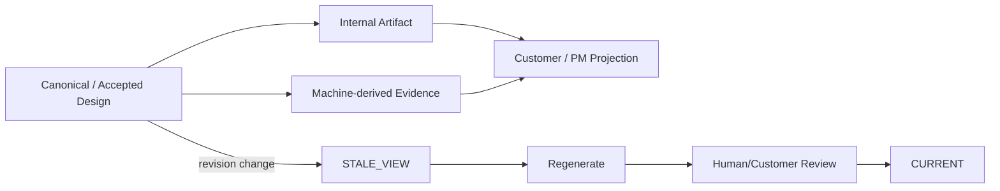
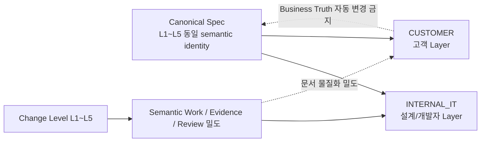

# Template 및 산출물 가이드

## 1. 문서 목적

Template, Tailoring, Section Ownership, Projection Lifecycle을 분리하여 사람이 무엇을 판단하고 Machine이 무엇을 재생성하는지 정의한다.

## 2. 책임 분리



- Template은 **문서 Section 구조**를 정의한다.
- Tailoring은 **어떤 내부 의미가 어떤 Artifact에 들어가는지** 정의한다.
- Change Level은 **어떤 Semantic Work/Evidence/Review가 필요한지** 정의한다.
- Projection은 **확정/관찰된 내용을 Audience에 맞춰 보여준다.** 새 Business Truth를 만들지 않는다.

## 3. Canonical Spec과 Change Level 불변성

Canonical Spec은 L1~L5에 따라 축약된 별도 사본을 만들지 않는다. 같은 RQ의 업무 의미, 확정 결정, 수용 조건, 관계와 Provenance는 하나의 Canonical semantic identity로 유지한다.

Change Level이 바꾸는 것은 다음이다.

- 필요한 Semantic Work 깊이
- Source/Evidence 조사 범위
- Human Review 강도
- 실제로 생성하거나 갱신할 Human Artifact의 밀도

Change Level이 바꾸지 않는 것은 다음이다.

- Confirmed Business Truth
- Canonical Entity/Relation의 의미
- 같은 RQ의 확정 결정
- 낮은 Level이라는 이유로 이미 존재하는 Canonical 의미를 삭제하는 행위

따라서 L1 문서에 어떤 Section이 보이지 않더라도 **Canonical에서 그 의미가 삭제되었다는 뜻이 아니다.** 해당 View에서 별도 문서/Section으로 물질화하지 않았거나 비적용인 것이다.



표준 Profile 기준으로 L1~L5 전체에서 Projection topology가 유지되는지는 다음 명령으로 확인한다.

```bash
python sdlc/scripts/validate_canonical_projection_invariant.py \
  --store sdlc/samples/tailoring/comparison-canonical.example.json \
  --target RQ-COMP-001
```

검증기는 같은 target의 Canonical fingerprint가 L1~L5에서 동일한지, Projection resolve가 Canonical Store를 변경하지 않는지, 설계/개발자 5종과 고객 3종의 문서군 관계가 Level에 따라 뜻하지 않게 갈라지지 않는지 확인한다.

## 4. 설계/개발자 Layer와 고객 Layer

### INTERNAL_IT — 설계/개발자용

기본 `STANDARD_5`는 다음 5종 Human Artifact로 Canonical 의미를 설계/개발 문맥에 투영한다.

1. `requirement_definition` — 요구사항 정의
2. `process_design` — 업무 프로세스/영향 설계
3. `functional_screen_design` — 기능·화면 설계
4. `program_design` — 프로그램 구현 설계
5. `test_acceptance` — 테스트·검증·인수 결과

기본 Authoring은 `AGENT_DRAFT_HUMAN_REVIEW`다. 업무 의미와 구현 판단을 사람이 검토할 수 있는 상세 View이며 Source Evidence, 기능 설계, Program Delta, AC/Test 등 기술적 맥락을 충분히 유지한다.

단, L1/L2처럼 작은 변경은 이 5종을 모두 매번 새로 작성해야 한다는 뜻이 아니다. Canonical은 그대로 유지하고 Change Level이 필요한 Semantic Work와 실제 갱신 대상 문서를 최소화한다.

### CUSTOMER — 고객 커뮤니케이션용

기본 `CUSTOMER_STANDARD_3`은 다음 3종 Generated View다.

1. `solution_agreement` — A01 요구·업무·기능 합의
2. `delivery_scope` — A02 영향·개발범위 공유
3. `acceptance_handover` — A03 테스트·인수·운영 결과

Customer Profile은 Canonical selector를 사용한다.

- A01: `RQ / FR / BR / PROC / AC`
- A02: `RQ / PGM / DATA`
- A03: `RQ / AC / TC`

고객 문서는 내부 문서 수를 그대로 복제하는 계층이 아니다. 같은 Canonical 의미와 내부 Evidence를 고객이 판단하기 쉬운 자연어 문맥으로 재구성하며 내부 ID, Source Hash, Machine Taxonomy, 구현 세부를 숨길 수 있다.

중요한 경계는 다음과 같다.

- Customer 문서는 `GENERATED_VIEW`다.
- Customer 문서 자체는 독립 SSOT가 아니다.
- 고객이 문서 내용을 수정해도 Canonical이 자동 변경되지 않는다.
- 업무정책 변경은 Decision/Review 후보로 돌아간 뒤 Confirmed Evidence 절차를 거쳐 Canonical에 반영한다.

즉 **Canonical은 동일하고, Audience에 따라 표현의 깊이와 언어만 다르다.**

## 5. Section Ownership

| Ownership | 의미 | 수정 원칙 |
|---|---|---|
| `HUMAN_AUTHORITATIVE` | 업무정책·요구 목적·결정 | Agent 제안 가능, 자동 확정 금지 |
| `HUMAN_REVIEWED` | Agent 초안을 사람이 책임 검토 | Reviewer가 확정/수정 |
| `SHARED` | Machine Evidence와 사람 판단 결합 | Evidence 보존, 결론 검토 |
| `MACHINE_DERIVED` | Hash/Trace/Query/Table/Symbol 등 | Source에서 재생성, 사람이 이중 유지하지 않음 |
| `GENERATED_VIEW` | PM/Customer 파생 View | Canonical/Internal에서 재생성 |

대표 예:

- 업무 목적/정책/고객 결정 → `HUMAN_AUTHORITATIVE`
- 기능 설계 → `HUMAN_REVIEWED`
- Program Delta → `SHARED`
- Query/Table/Source Hash/Trace → `MACHINE_DERIVED`
- A01/A02/A03 및 PM 요약 → `GENERATED_VIEW`

## 6. Program Spec Template 규칙

신규 Standard는 `Core Required 6 + Risk-triggered Conditional`이다.

Core:

1. 기능/요구 설계 기준
2. 실제 구현 대상
3. Source Evidence
4. 개발 Delta·변경 Source
5. AC/Test
6. OPEN/Guard

Conditional:

- Data/Mapping
- Transaction
- Concurrency
- Interface
- Error
- Security
- Observability
- NFR/Migration
- Architecture/Standard

Typed Trigger가 없으면 해당 Section/row를 최종 문서에서 제거한다. 관련 없는 항목을 N/A로 채우기 위해 Agent token과 Human review 시간을 사용하지 않는다.

`LEGACY_FULL_17`만 17개 전체 항목을 유지한다.

## 7. L1/L2 Template 사용

L1/L2에서도 Intent/AS-IS Source/Impact 분석은 필수다. 다만 이 분석을 각각 별도 Human Artifact로 만들 필요는 없다.

실제 Source가 바뀌는 Fast Path에서 Agent는 `stage-result.json` 안에 다음 Machine 요약을 남긴다.

```json
{
  "pre_write_analysis": {
    "INTENT_DECOMPOSED": {"status": "PASS", "evidence_refs": ["RQ-001"]},
    "AS_IS_SOURCE_ANALYZED": {"status": "PASS", "evidence_refs": ["src/...#method"]},
    "IMPACT_CHECKED": {"status": "PASS", "evidence_refs": ["impact:RQ-001"]}
  }
}
```

이 JSON은 개발자가 작성하는 문서가 아니다. 현재 Agent가 이미 수행한 분석의 Machine Evidence다.

## 8. Customer Projection

표준 고객 View는 세 가지다.

- A01 `solution_agreement`
- A02 `delivery_scope`
- A03 `acceptance_handover`

Projection Template의 Section은 Customer Document Contract와 일치해야 한다. Customer View에서 사람이 업무정책을 수정하면 즉시 Canonical을 덮어쓰지 않고 Decision/Review 대상으로 반환한다.

## 9. Freshness

Generated View에는 최소 다음을 추적한다.

```text
canonical_revision
generated_from_revision
generated_at
review_status
```

`canonical_revision > generated_from_revision`이면 `STALE_VIEW`다. 재생성 후에도 Human/Customer Review가 끝나기 전에는 `CURRENT`로 간주하지 않는다.

Target 단위 의미동등성 검증이 필요할 때는 `validate_canonical_projection_invariant.py`가 Canonical target fingerprint를 계산한다. Change Level이나 Projection Profile은 이 fingerprint의 입력이 아니다.

## 10. Audience별 기본 산출물

### MACHINE
Stage Result, Canonical Delta, Source Hash, Change Facts, Coverage Gap. 일반 사용자의 Primary 문서에서 숨긴다.

### INTERNAL_IT
설계/개발자가 실제 검토하는 문서. Agent Draft + Human Review가 기본이다.

### PM_REVIEW
무엇이 바뀌었는지, 무엇이 불확실한지, 누가 결정해야 하는지, Release blocker와 stale View가 무엇인지 보여준다. Stage 완료율을 중심으로 만들지 않는다.

### CUSTOMER
Canonical/Internal Artifact 기반 Generated View다. 독립 SSOT가 아니다.

## 11. Validation

```bash
python sdlc/scripts/tailoring_runtime.py validate-profile --profile STANDARD_5
python sdlc/scripts/validate_canonical_projection_invariant.py \
  --store sdlc/samples/tailoring/comparison-canonical.example.json \
  --target RQ-COMP-001
python sdlc/scripts/harness.py check project
```

완료 기준:

- Config 기본 Profile과 Runtime default가 같다.
- Canonical target fingerprint가 L1~L5 Projection resolution에서 동일하다.
- Projection resolution이 Canonical Store를 변경하지 않는다.
- 설계/개발자 Layer와 고객 Layer의 Standard 문서 topology가 L1~L5에서 의미 없이 갈라지지 않는다.
- Program readiness Config와 Program Template의 필수/조건부 정책이 같다.
- Customer Profile artifact ID/template이 Customer Document Contract와 일치한다.
- Generated View가 Business Truth를 생성하지 않는다.
- Machine-derived 정보를 사람이 이중 유지하지 않는다.
