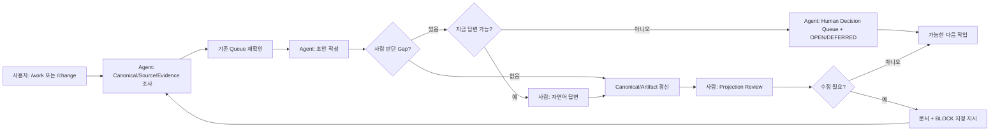

# 이해관계자별 작업 가이드

## 1. 문서 목적

PM, BA, 설계자, 개발자, 테스트 담당자, 아키텍트, 고객 업무담당자, Harness 관리자가 무엇을 보고 무엇을 결정해야 하는지 역할별로 설명한다.

이 가이드의 핵심 원칙은 다음과 같다.

> 일반 참여자는 Template 빈칸을 직접 작성하는 사람이 아니다. Agent가 먼저 조사·초안을 만들고, 사람은 필요한 질문에 답하고 생성된 문서를 Review한다. 지금 답할 수 없는 질문은 Human Decision Queue로 남겨 다음 단계에서 다시 확인한다.

## 2. 언제 읽는가

- 프로젝트 Kick-off와 역할 분담 시
- 신규 참여자가 Harness에 투입될 때
- “누가 이 Section을 확정해야 하는가?”가 불분명할 때
- 생성 문서에서 수정하고 싶은 부분이 있을 때
- Agent 질문에 지금 바로 답할 수 없을 때

## 3. 선행조건

- `.sdlc/project.yaml`과 Engineering/Customer Profile이 선택되어 있어야 한다.
- 고객/프로젝트의 실제 승인체계가 있으면 그 체계를 우선 반영한다.
- Semantic Template은 Agent의 Stage 의미 구조이고, 사람이 주로 보는 문서는 Engineering/Customer/PM Projection이라는 점을 이해한다.
- Projection은 입력 Form이 아니라 Review Surface다.
- Human Decision Queue도 별도 원장이 아니라 Canonical OPEN/DEFERRED를 사람이 보기 쉽게 보여주는 Review Surface다.

## 4. 기본 HITL 협업 흐름



사람에게 묻기 전에 Agent가 기술적으로 조사 가능한 내용은 먼저 확인한다.

## 5. 질문에 답하는 방법

Agent 질문은 보통 한 번에 1~3개만 제시한다.

질문에는 다음이 포함되어야 한다.

- 왜 이 질문이 필요한가
- 현재 확인된 사실
- 답변이 반영될 `[BLOCK:...]`
- 답이 없을 때 진행 가능한지 또는 Source Write가 제한되는지
- 다음에 다시 확인할 `Recheck At`

사용자는 자연어로 짧게 답하면 된다.

예:

```text
Q1. [BLOCK:WU-BUSINESS-RULE]
월 마감 후 자동 재계산을 허용할까요?

답: 급여 마감 전까지만 허용하고, 급여 마감 이후에는 오류 메시지를 보여줘.
```

사람이 Table의 `Java Method`, `XML Query`, `Table Column`을 찾아서 답할 필요는 없다. 이런 값은 Agent가 Source에서 조사한다.

### 5.1 지금 바로 답할 수 없을 때

다음처럼 자연어로 말하면 된다.

```text
지금은 모르겠어. 고객에게 확인해서 다음 DESIGN 단계에서 다시 물어봐줘.
```

```text
DBA 확인 전이라 아직 결정 못해. Source 수정 전에 다시 확인해줘.
```

```text
이건 이번에는 보류하고 TEST 전에 다시 확인하자.
```

Agent는 답을 추정하지 않고 같은 Question ID를 문서의 **Human Decision Queue**에 남긴다.

Queue에는 `관련 Block / 질문 / 현재 확인값·제안 / 결정 담당 / SOURCE_BLOCK·ITERATE·ALERT / Recheck At / 상태`가 표시된다. 다음 Agent는 `Recheck At`에 도달한 기존 Queue를 신규 질문보다 먼저 확인한다.

- `SOURCE_BLOCK`: 이 답에 의존하는 Source/Action만 제한
- `ITERATE`: 큰 방향은 정해져 있어 다음 단계 진행 가능, 지정 경계에서 재확인
- `ALERT`: 현재 실행은 가능하지만 계속 추적

사용자가 아직 모른다고 한 것을 `ASSUMED` Business Truth로 자동 확정하지 않는다.

## 6. 생성 문서를 수정하는 방법

오탈자를 제외하면 직접 파일을 수정하기보다 **Target/문서 + Block ID + 원하는 변경**을 Agent에게 말한다.

예:

```text
RQ-0042 Work Unit SDD의 [BLOCK:WU-BUSINESS-RULE]에서
월 마감 정책을 "급여 마감 전까지만 허용"으로 변경해줘.
```

```text
PGM-001 Program Spec의 [BLOCK:PGM-SOURCE-EVIDENCE]를
현재 Source 기준으로 다시 조사해줘.
```

```text
HRIS 작업지시서의 [BLOCK:B-AUTH]에서
저장 권한 처리만 다시 검토해줘.
```

```text
RQ-0042의 [BLOCK:WU-HITL-QUEUE]에서
HITL-RQ-0042-02는 아직 미확정이니 PROGRAM 단계에서 다시 확인해줘.
```

Agent는 다음처럼 Routing한다.

| 요청 종류 | 처리 |
|---|---|
| Requirement/Business Rule/TO-BE/AC/Scope 변경 | `/change` + Canonical Delta |
| Source/DB/Mapping/AS-BUILT 재분석 | `/work` + Evidence/Provenance |
| Queue 상태/Recheck At 조정 | Queue metadata 갱신, Business Truth 변화 없음 |
| Queue 질문에 실제 답변 | 의미에 따라 `/change` 또는 `/work`, Canonical/Provenance 반영 |
| 오탈자/표현/레이아웃 | Projection-only |

Block을 지정하지 않아도 문맥이 명확하면 Agent가 자신이 해석한 Block을 먼저 알려주고 진행한다. 여러 후보가 있을 때만 Block 선택을 짧게 묻는다.

## 7. 현행 Config 예제

역할은 Config에 사람 이름을 하드코딩하기보다 Project Authority/업무 운영 규칙에 따라 관리한다. 문서 Profile은 audience별 View를 분리한다.

```yaml
documents:
  engineering:
    profile: ENGINEERING_SDD_COMPACT
  customer:
    profile: CUSTOMER_STANDARD_3
  pm:
    profile: PM_STANDARD
```

Engineering과 Customer Profile은 서로 독립이며 문서 수나 파일 순번을 맞출 필요가 없다.

## 8. 역할별 작업

### PM

**본다**
- `/check project`
- `/check RQ-xxx`
- 사람 결정 필요 건수와 Human Decision Queue
- Change Level / Risk / Impact Coverage
- 개발·검증·인수 상태

**답변/결정한다**
- 범위, 우선순위, 일정, 고객 의사결정 경로
- Agent가 제시한 Scope/Release Decision 질문

**하지 않는다**
- Canonical JSON, Stage Result, Source Hash 직접 관리
- 모든 산출물 Template 직접 작성

**명령 사용**
- `/check`: 매일/회의 전 상태 확인
- `/work`: 특정 RQ 진행 요청
- `/change`: 확정 Scope/업무 의미가 변경될 때

### 업무 분석가 / BA

**본다**
- Requirement/Process 관련 Engineering Projection
- 원본 요구사항과 RQ 생성근거
- 사람 결정 필요사항 / Human Decision Queue

**답변/확정한다**
- 업무 목적, 업무 규칙, 예외, 용어, TO-BE 의미
- Agent가 Source/문서를 조사한 뒤 남긴 Business Authority 질문

**하지 않는다**
- 업무정의서 빈 표를 처음부터 작성
- Source 동작을 업무정책으로 자동 확정

문서에서 의미가 잘못됐으면 관련 Block을 지정해 `/change`를 요청한다. 즉시 확정할 수 없으면 다음 합의/설계 단계의 `Recheck At`을 지정해 Queue로 보류할 수 있다.

### 설계자

**본다**
- Work Map / Work Unit SDD / 필요한 Program Spec
- Process/Impact/Source Evidence
- AC
- 현재 DESIGN/PROGRAM에서 재확인해야 할 Queue

**검토/결정한다**
- 기능 흐름, Data 의미, 상태/예외, 권한, Interface/Transaction 요구
- Agent가 Evidence를 먼저 조사한 뒤 남긴 설계 Decision 질문

**하지 않는다**
- Program Spec의 Source Mapping을 수동으로 처음부터 채우기

설계/Evidence/Program Mapping 보완은 `/work`, Requirement/Business Rule/TO-BE 변경은 `/change`로 처리한다.

### 개발자

**본다**
- Work Unit SDD / 필요한 Program Spec
- 관련 Source/Trace/Standard
- TASK/AC/TC Mapping
- `BEFORE_SOURCE_WRITE` Queue

**수정한다**
- 허용 Source root 내부의 실제 구현
- `/work`를 통한 Program Mapping/AS-BUILT Evidence

**답변한다**
- Architecture Exception, 운영 제약 등 개발자/아키텍트 판단이 필요한 질문

**보고한다**
- 예상 외 Legacy 영향
- Source/설계 불일치
- Build/Test 실패

예상 외 영향이 커지면 Change Level Escalation Evidence가 된다. `SOURCE_BLOCK` Queue가 걸린 Source/Action은 결정 전까지 수정하지 않는다.

### 테스트 담당자

**본다**
- AC/TC
- Engineering Verification 정보
- 고객용 테스트·인수 Projection
- 실제 Runtime Test Evidence
- `BEFORE_TEST` Queue

**확정 책임**
- Test Result 사실과 Coverage Gap
- 합격 기준이 업무적으로 불명확할 때 Agent 질문에 답변

TC 문서를 처음부터 작성하기보다 Agent가 AC에서 만든 Test 초안을 Review한다.

### 프로젝트 아키텍트

**집중 확인**
- L4/L5
- Cross-domain
- Interface/Batch
- Schema/Transaction
- Security/Privacy
- Architecture Deviation
- Architecture Decision Queue

기술적으로 조사 가능한 구조는 Agent가 먼저 조사하고, 아키텍트는 대안 선택/예외 승인에 집중한다.

### 고객 업무담당자

**본다**
- Customer Projection
- 자신이 결정해야 하는 Human Decision Queue

**확정 책임**
- 고객 업무정책, 범위, 인수 판단

**주의**
- Customer Projection은 독립 SSOT가 아니다.
- 고객이 업무 의미를 변경하거나 확정한 내용은 관련 Section/Block을 지정해 `/change` 또는 Customer Decision Round-trip으로 Canonical Provenance/Decision에 반영한다.
- 고객에게 내부 Engineering Template을 채우도록 요구하지 않는다.
- 회의 중 즉시 결정하지 못한 사항은 Queue로 남겨 다음 합의/인수 경계에서 다시 확인할 수 있다.

### Harness 관리자

**본다**
- Machine Evidence
- Tailoring Profile
- Config Usage
- CI/Regression
- `--debug-stage`
- OPEN/DEFERRED와 Human Decision Queue 정합성

**수정한다**
- Contract/Resolver/Profile/Template Framework

**수정하지 않는다**
- 고객 업무 의미를 기술적 판단으로 임의 확정

## 9. 생성되는 결과

역할마다 같은 RQ에 대해 서로 다른 View를 본다.

- PM → PM/Review View
- BA/설계/개발 → Engineering Projection
- 고객 → Customer Projection
- Harness 관리자/Agent → Machine Runtime/Evidence

각 View는 같은 Canonical/Evidence를 근거로 하되 표현 목적이 다르다. Human Decision Queue 역시 별도 SSOT가 아니라 같은 OPEN/Decision 상태를 사람이 볼 수 있게 투영한 것이다.

## 10. 자주 틀리는 부분

- PM이 모든 Stage 산출물을 직접 읽어 상태를 관리하지 않는다.
- BA/설계자가 Template을 빈칸부터 직접 작성하지 않는다.
- 개발자가 업무정책을 Source로 “확정”하지 않는다.
- 고객이 Customer Projection에 수정한 문장이 자동 Canonical 변경이라고 보지 않는다.
- 사람의 HITL 답변을 문서에만 쓰고 Canonical/Provenance 갱신을 생략하지 않는다.
- 사용자가 답하지 못한 질문을 대화에서만 기억하고 문서 Queue/OPEN에 남기지 않는다.
- 같은 미해결 질문을 단계마다 새 ID로 복제하지 않는다.
- `DEFERRED`를 승인이나 확정으로 취급하지 않는다.
- Harness 관리자가 설계자의 업무 판단권한을 대체하지 않는다.
- `MACHINE_DERIVED` 정보는 사람이 편의를 위해 고정값으로 관리하지 않는다.
- Semantic Template을 고객/개발자 제출 문서로 오해하지 않는다.

## 11. Validation 방법

PM View:

```bash
python sdlc/scripts/harness.py check project
python sdlc/scripts/harness.py check RQ-001
```

Harness 관리자만 Stage 디버그:

```bash
python sdlc/scripts/tailored_check.py RQ-001 --debug-stage
```

## 12. 역할별 완료 기준

- 각 역할이 “보는 문서 / Agent 질문에 답할 내용 / 최종 확정 책임”을 설명할 수 있다.
- 일반 참여자는 Runtime JSON/Canonical JSON을 직접 관리하지 않는다.
- Business Authority와 Technical Evidence Authority가 섞이지 않는다.
- 기술적으로 조사 가능한 질문은 사람에게 오지 않는다.
- 사람 결정이 필요한 항목은 HITL 질문/Human Decision Queue/Next Action으로 드러난다.
- 지금 답하지 못한 항목은 `Recheck At`과 함께 다음 Semantic Work로 carry-forward된다.
- 생성 문서 수정 시 Target/Block을 지정해 Agent에게 지시할 수 있다.
- 의미 변경 답변은 Canonical Delta/Provenance로 연결된다.
