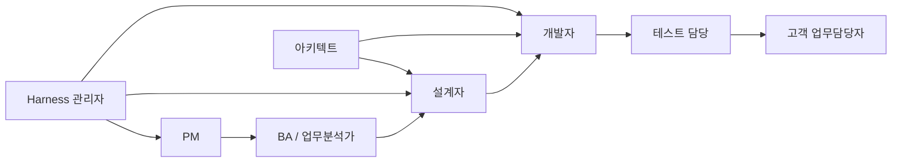

# 이해관계자별 작업 가이드

## 1. 문서 목적

PM, BA, 설계자, 개발자, 테스트 담당자, 아키텍트, 고객 업무담당자, Harness 관리자가 무엇을 보고 무엇을 수정하며 무엇을 승인해야 하는지 역할별로 설명한다.

## 2. 언제 읽는가

- 프로젝트 Kick-off와 역할 분담 시
- 신규 참여자가 Harness에 투입될 때
- “누가 이 Section을 확정해야 하는가?”가 불분명할 때

## 3. 선행조건

- `.sdlc/project.yaml`과 Engineering/Customer Profile이 선택되어 있어야 한다.
- 고객/프로젝트의 실제 승인체계가 있으면 그 체계를 우선 반영한다.
- Semantic Template은 Agent의 Stage 의미 구조이고, 사람이 주로 보는 문서는 Engineering/Customer/PM Projection이라는 점을 이해한다.

## 4. 역할 협업 흐름



## 5. 현행 Config 예제

역할은 Config에 사람 이름을 하드코딩하기보다 Project Authority/업무 운영 규칙에 따라 관리한다. 문서 Profile은 audience별 View를 분리한다.

```yaml
documents:
  engineering:
    profile: ENGINEERING_SDD_COMPACT
  customer:
    profile: CUSTOMER_STANDARD_3
  pm:
    profile: PM_STANDARD
```

Engineering과 Customer Profile은 서로 독립이며 문서 수나 파일 순번을 맞출 필요가 없다.

## 6. 역할별 작업

### PM

**본다**
- `/check project`
- `/check RQ-xxx`
- 사람 결정 필요 건수
- Change Level / Risk / Impact Coverage
- 개발·검증·인수 상태

**수정/결정한다**
- 범위, 우선순위, 담당, 일정, 고객 의사결정 경로

**수정하지 않는다**
- Canonical JSON, Stage Result, Source Hash

**명령 사용**
- `/check`: 매일/회의 전 상태 확인
- `/work`: 특정 RQ 진행 요청
- `/change`: 확정 Scope/업무 의미가 변경될 때

### 업무 분석가 / BA

**본다**
- Requirement/Process 관련 Engineering Projection
- 원본 요구사항과 RQ 생성근거
- 사람 결정 필요사항

**확정 책임**
- 업무 목적, 업무 규칙, 예외, 용어, TO-BE 의미

**주의**
- Source 동작을 업무정책으로 자동 확정하지 않는다.

### 설계자

**본다**
- Work Map / Work Unit SDD / 필요한 Program Spec
- Process/Impact/Source Evidence
- AC

**수정/검토한다**
- 기능 흐름, Data 의미, 상태/예외, 권한, Interface/Transaction 요구

**확정 책임**
- 구현기술에 독립적인 TO-BE 기능 의미

설계/Evidence/Program Mapping 보완은 `/work`, Requirement/Business Rule/TO-BE 변경은 `/change`로 처리한다.

### 개발자

**본다**
- Work Unit SDD / 필요한 Program Spec
- 관련 Source/Trace/Standard
- TASK/AC/TC Mapping

**수정한다**
- 허용 Source root 내부의 실제 구현
- `/work`를 통한 Program Mapping/AS-BUILT Evidence

**보고한다**
- 예상 외 Legacy 영향
- Source/설계 불일치
- Build/Test 실패

예상 외 영향이 커지면 Change Level Escalation Evidence가 된다.

### 테스트 담당자

**본다**
- AC/TC
- Engineering Verification 정보
- 고객용 테스트·인수 Projection
- 실제 Runtime Test Evidence

**확정 책임**
- Test Result 사실과 Coverage Gap

### 프로젝트 아키텍트

**집중 확인**
- L4/L5
- Cross-domain
- Interface/Batch
- Schema/Transaction
- Security/Privacy
- Architecture Deviation

### 고객 업무담당자

**본다**
- Customer Projection

**확정 책임**
- 고객 업무정책, 범위, 인수 판단

**주의**
- Customer Projection은 독립 SSOT가 아니다.
- 고객이 업무 의미를 변경하거나 확정한 내용은 `/change` 또는 Customer Decision Round-trip을 통해 Canonical Provenance/Decision으로 반영한다.

### Harness 관리자

**본다**
- Machine Evidence
- Tailoring Profile
- Config Usage
- CI/Regression
- `--debug-stage`

**수정한다**
- Contract/Resolver/Profile/Template Framework

**수정하지 않는다**
- 고객 업무 의미를 기술적 판단으로 임의 확정

## 7. 생성되는 결과

역할마다 같은 RQ에 대해 서로 다른 View를 본다.

- PM → PM/Review View
- BA/설계/개발 → Engineering Projection
- 고객 → Customer Projection
- Harness 관리자/Agent → Machine Runtime/Evidence

각 View는 같은 Canonical/Evidence를 근거로 하되 표현 목적이 다르다.

## 8. 자주 틀리는 부분

- PM이 모든 Stage 산출물을 직접 읽어 상태를 관리하지 않는다.
- 개발자가 업무정책을 Source로 “확정”하지 않는다.
- 고객이 Customer Projection에 수정한 문장이 자동 Canonical 변경이라고 보지 않는다.
- Harness 관리자가 설계자의 업무 판단권한을 대체하지 않는다.
- `MACHINE_DERIVED` 정보는 사람이 편의를 위해 고정값으로 관리하지 않는다.
- Semantic Template을 고객/개발자 제출 문서로 오해하지 않는다.

## 9. Validation 방법

PM View:

```bash
python sdlc/scripts/harness.py check project
python sdlc/scripts/harness.py check RQ-001
```

Harness 관리자만 Stage 디버그:

```bash
python sdlc/scripts/tailored_check.py RQ-001 --debug-stage
```

## 10. 역할별 완료 기준

- 각 역할이 “보는 문서 / 수정 가능한 내용 / 최종 확정 책임”을 설명할 수 있다.
- 일반 참여자는 Runtime JSON/Canonical JSON을 직접 관리하지 않는다.
- Business Authority와 Technical Evidence Authority가 섞이지 않는다.
- 사람 결정이 필요한 항목은 Next Action으로 드러난다.
- BA/설계/개발은 `Engineering`, 고객은 `Customer`, PM은 `PM` Projection이라는 현행 용어를 사용한다.
