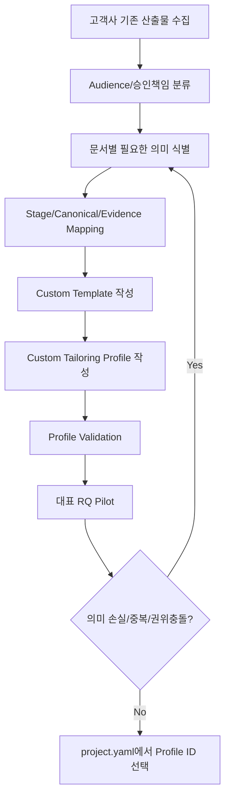

# Custom Scaffold 적용 가이드

## 1. 문서 목적

고객사마다 다른 3종/5종/13종 문서 체계를 Core Stage 복제 없이 적용하는 절차를 설명한다. Customizing의 단위는 Template 파일이 아니라 **Artifact Profile + Template + Section Ownership + Mapping**이다.

## 2. 적용 원칙

- Core Stage/Canonical/Evidence/Guard는 유지한다.
- 고객사 문서 이름을 Stage 이름으로 바꾸지 않는다.
- `.sdlc/project.yaml`에는 복잡한 Mapping 대신 Profile ID만 둔다.
- Custom Profile은 `sdlc/custom/project/tailoring/`, Custom Template은 `sdlc/custom/project/templates/` 아래에 둔다.
- Customer View는 Internal/Canonical에서 파생하며 독립 Business Truth Source가 아니다.



## 3. 고객 문서 분석 체크리스트

각 기존 문서마다 다음을 확인한다.

1. 문서 Audience: INTERNAL_IT / PM_REVIEW / CUSTOMER / MACHINE
2. 최종 승인자와 실제 수정 책임자
3. 필수/선택/조건부 Section
4. 어떤 업무 의미와 기술 Evidence가 들어가는지
5. 기존 문서가 독립 SSOT인지, 다른 문서의 파생 View인지
6. Source/DB/Interface/Batch/Security Evidence 필요 여부
7. 변경 시 어느 다른 문서를 재생성해야 하는지

## 4. Custom Profile 예제

```yaml
schema_version: 1
profile_id: CUSTOMER_A_INTERNAL_3
name: "고객사 A 내부 3종"
output_root: "docs/10_산출물"

artifacts:
  business_definition:
    audience: INTERNAL_IT
    template: "sdlc/custom/project/templates/customer-a/01_업무정의서.md"
    output_path: "docs/10_산출물/{target}/01_업무정의서.md"
    visibility: PRIMARY
    authoring: AGENT_DRAFT_HUMAN_REVIEW
    order: 10
    sources:
      stages: [DECOMPOSE, CLARIFY, PROCESS, DISCOVERY, IMPACT]

  detail_design:
    audience: INTERNAL_IT
    template: "sdlc/custom/project/templates/customer-a/02_상세설계서.md"
    output_path: "docs/10_산출물/{target}/02_상세설계서.md"
    visibility: PRIMARY
    authoring: AGENT_DRAFT_HUMAN_REVIEW
    order: 20
    sources:
      stages: [DESIGN, PROGRAM, DEVELOPMENT, TEST, VERIFY]

  ui_design:
    audience: INTERNAL_IT
    template: "sdlc/custom/project/templates/customer-a/03_화면설계서.md"
    output_path: "docs/10_산출물/{target}/03_화면설계서.md"
    condition: HAS_UI
    visibility: PRIMARY
    authoring: AGENT_DRAFT_HUMAN_REVIEW
    order: 30
    sources:
      stages: [DESIGN, PROGRAM, DEVELOPMENT, TEST]
```

Project Config는 다음처럼 단순하게 유지한다.

```yaml
documents:
  internal:
    profile: CUSTOMER_A_INTERNAL_3
```

## 5. 13종 전체 문서가 필요한 경우

문서가 많아져도 Stage를 13개 고객사 전용 Stage로 복제하지 않는다. 동일 Stage가 여러 Artifact에 영향을 줄 수 있고, 하나의 Artifact가 여러 Stage를 받을 수 있다.

예를 들어 DESIGN은 화면설계서·인터페이스설계서·권한설계서에 동시에 Projection될 수 있고, 프로그램설계서는 DESIGN+PROGRAM+DISCOVERY Evidence를 결합할 수 있다.

## 6. Overlay 우선순위

Custom은 Core를 수정하기보다 다음 우선순위를 사용한다.

```text
core
→ standard profile
→ project profile
→ project overlay
→ domain overlay
→ local override
```

고객사별 차이는 가능한 한 `sdlc/custom/project/` 아래에 격리한다.

## 7. Validation

```bash
python sdlc/scripts/tailoring_runtime.py validate-profile --profile CUSTOMER_A_INTERNAL_3
python sdlc/scripts/tailoring_runtime.py resolve --target RQ-001 --stage DESIGN
python sdlc/scripts/harness.py check project
```

Pilot에서는 최소 L1/L3/L4 RQ와 UI/Interface/Batch 조건부 문서를 확인한다.

## 8. 완료 기준

- 고객사 문서 수가 달라도 Core Stage는 복제되지 않는다.
- 모든 Artifact에 Audience/Template/Source Mapping이 있다.
- Human authoritative Section이 Machine 재생성으로 덮이지 않는다.
- 같은 Canonical 의미가 Standard/Custom View에서 변형되지 않는다.
- Profile 교체만으로 3종/5종/13종 등 문서 체계를 변경할 수 있다.
