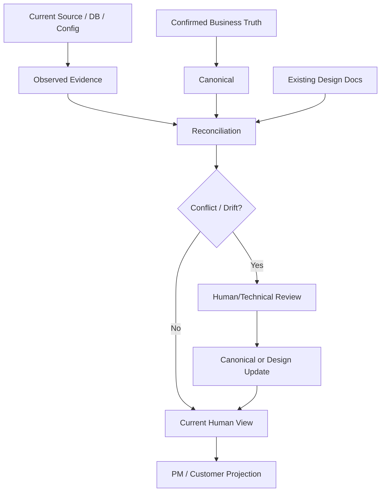

# Brownfield SSOT 및 현행화 가이드

## 1. 문서 목적

기존 시스템 고도화에서 Business Truth, Source Evidence, 설계 문서, Generated View의 권위를 분리하고 Source Drift가 발생했을 때 안전하게 현행화하는 방법을 설명한다.

## 2. 권위 원칙

- **Confirmed Business Truth**: 고객/업무 권위자가 확정한 정책·범위·결정
- **Current Source/DB/Config Evidence**: 실제 AS-IS 기술 구현의 관찰 근거
- **Internal Design Artifact**: Canonical/Evidence를 사람이 검토할 수 있게 표현한 작업 문서
- **Customer/PM View**: Internal/Canonical에서 파생된 Generated View

Source가 현재 동작을 보여준다고 해서 업무정책을 자동 변경하지 않는다. 반대로 문서가 오래되었다고 Source 관찰을 무시하지 않는다.



## 3. Brownfield Authority Matrix

| 정보 | 기본 권위 | 자동 수정 가능 여부 |
|---|---|---|
| 업무 정책/범위/승인 | Confirmed Business Truth | 아니오 |
| 실제 Class/Method/Query/Table | Current Source/DB Evidence | 관찰값 갱신 가능 |
| 설계 의도/To-Be 기능 의미 | Human-reviewed Design/Canonical | 사람 검토 필요 |
| 고객 표현/요약 | Generated View | 재생성 가능 |
| Source Hash/Locator | Machine-derived Evidence | 재생성 가능 |

## 4. Source Drift 절차

첫 Baseline:

```bash
python sdlc/scripts/run_source_reverse_check.py \
  --source-root <source-root> \
  --artifact-root <artifact-root> \
  --source-ref <baseline-ref> \
  --baseline sdlc/runtime/reverse/baseline.json \
  --output sdlc/runtime/reverse/result.json \
  --create-baseline
```

이후 비교:

```bash
python sdlc/scripts/run_source_reverse_check.py \
  --source-root <source-root> \
  --artifact-root <artifact-root> \
  --source-ref <current-ref> \
  --baseline sdlc/runtime/reverse/baseline.json \
  --output sdlc/runtime/reverse/result.json
```

Drift 결과는 자동 Business Truth 수정 지시가 아니라 **Reconciliation Candidate**다.

## 5. Reconciliation 판단

### Source만 바뀐 경우

Source Hash/Locator와 기술 Evidence를 갱신하고 관련 Internal Artifact를 `STALE_VIEW`로 표시한다. 업무 의미가 그대로라면 Business Truth는 변경하지 않는다.

### Source와 설계가 충돌하는 경우

1. Source가 실제 운영 기준인지 확인
2. 설계 문서가 오래된 것인지 확인
3. 업무정책 변경이 있었는지 확인
4. 기술 구현 오류인지 확인
5. 권위자 Review 후 Canonical 또는 설계를 명시적으로 변경

### 업무정책과 Source가 충돌하는 경우

Source를 근거로 업무정책을 자동 덮어쓰지 않는다. 이 경우 가장 중요한 결과는 “누가 어떤 판단을 해야 하는가”라는 Human Next Action이다.

## 6. Change Level Escalation

개발 중 다음이 발견되면 기존 Change Level을 자동 유지하지 않는다.

- 예상하지 못한 다중 Module/Program 영향
- Interface/Batch 변경
- Schema/Transaction 영향
- Security/Privacy 영향
- Architecture boundary 변경

이때 L1/L2가 L3~L5로 상향될 수 있다. 자동 Downgrade는 하지 않는다.

## 7. Human Control Plane에서 보는 항목

```bash
python sdlc/scripts/harness.py check project
python sdlc/scripts/harness.py check RQ-001
```

PM/Reviewer가 확인할 핵심은 다음이다.

- Change Level과 판정 사유
- Impact Coverage
- Source Drift / Technical Gap
- 사람 결정 필요 항목
- 오래된 Human/Customer View 수
- Next Action / Owner

내부 Stage는 기본적으로 숨긴다.

## 8. 자주 틀리는 부분

- 현재 Source를 곧바로 업무 요구사항으로 승격하지 않는다.
- 과거 설계 문서가 있다고 현재 Source보다 기술적 사실 권위가 높다고 가정하지 않는다.
- Drift 검출 결과로 Functional/Business 문서를 자동 rewrite하지 않는다.
- 고객용 Generated View에서 직접 수정한 문장을 SSOT로 간주하지 않는다.
- `STALE_VIEW`를 승인 기준 문서로 사용하지 않는다.

## 9. 완료 기준

- Business Truth와 Source Evidence의 권위가 분리되어 있다.
- Drift는 Candidate/Gap으로 기록되고 자동 역갱신하지 않는다.
- Reconciliation에 Human Authority가 필요한 경우 Next Action으로 노출된다.
- Source/Canonical 변경 후 관련 Generated View의 freshness를 재검증한다.
- 변경 영향이 커지면 Change Level Escalation Evidence가 남는다.
