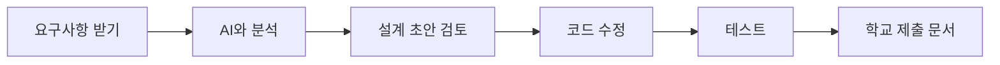
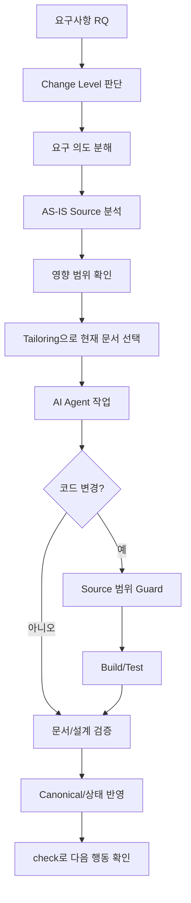

# 중학생 5명을 위한 Cursor + AI Agent Brownfield 프로젝트 가이드

> 기준: `SDLC_DESIGN_SESSION_FIRST/tailoring-control-plane/v1.9.0`
>
> 대상: JSP / Java / XML 기반의 기존(AS-IS) 시스템을 조금씩 개선하는 학교 IT 프로젝트
>
> 목표: **프레임워크를 외워서 문서를 쓰는 것이 아니라, 요구사항을 넣고 AI Agent의 초안을 검토하면서 코드와 학교 제출 문서까지 안전하게 만드는 것**

---

# 0. 이것만 먼저 기억하세요

이 프레임워크를 자동차에 비유하면 다음과 같습니다.

- **학생**: 어디로 갈지 정한다. 무엇을 바꿀지 결정한다.
- **Cursor AI Agent**: 운전을 돕는다. 소스를 찾고 설계 초안을 만들고 코드를 수정한다.
- **SDLC Harness**: 안전장치다. AI가 엉뚱한 파일을 고치거나 중요한 근거를 빠뜨리지 않았는지 확인한다.
- **문서**: 왜 바꿨고, 무엇을 바꿨고, 결과가 어땠는지 보여 주는 기록이다.

학생이 매번 내부 Stage 이름이나 Canonical JSON을 외울 필요는 없습니다.

기본 명령은 다음 흐름만 기억합니다.

```text
setup → intake → work → check
                    ↘ change
```

- `setup`: 프로젝트를 처음 준비
- `intake`: 요구사항 등록
- `work`: 다음 필요한 작업 진행
- `check`: 현재 상태 확인
- `change`: 이미 등록된 요구사항의 내용이 바뀌었을 때 사용

가장 중요한 규칙은 세 가지입니다.

1. **모르면 지어내지 않는다.** → `OPEN`으로 남기고 사람에게 묻거나 소스를 조사한다.
2. **작은 수정도 코드를 보기 전에 요구 의도, 현재 소스, 영향 범위를 확인한다.**
3. **`main`/`master`에서 바로 코드를 고치지 않는다.** 작업용 Branch를 사용한다.

---

# 1. 프로젝트 조장이 먼저 이해해야 할 전체 구조

## 1.1 사람에게 보이는 흐름

학생이 보는 흐름은 매우 단순합니다.



하지만 Harness 내부에서는 안전하게 만들기 위해 조금 더 많은 일을 합니다.



조장은 이 내부 흐름을 이해하고 조원에게 다음처럼 설명하면 됩니다.

> “우리는 `/work`만 시키지만, 안에서는 AI가 먼저 요구사항을 이해하고 기존 JSP/Java/XML을 확인한 뒤 어디까지 영향을 받는지 조사한다. 그다음 필요한 문서와 코드만 고치고, 마지막에 Harness가 범위와 테스트를 검사한다.”

## 1.2 Change Level이란?

Change Level은 **문서 개수**가 아니라 **이번 변경을 얼마나 깊게 분석해야 하는지**입니다.

| Level | 쉬운 뜻 | 학교 프로젝트 예시 |
|---|---|---|
| L1 MICRO | 아주 작은 수정 | 버튼 글자, 간단한 조건문 한 줄 |
| L2 LOCAL | 한 화면/한 기능의 작은 수정 | JSP + 연결 Java 일부 수정 |
| L3 FEATURE | 하나의 기능을 제대로 변경 | 화면, Service, Mapper XML이 같이 바뀜 |
| L4 PROCESS | 여러 기능의 업무 흐름 변경 | 신청 → 승인 → 결과 처리 흐름 변경 |
| L5 ARCH | 시스템 구조 수준 변경 | 새 모듈, 큰 구조 변경, 핵심 Architecture 변경 |

기본 설정은 `AUTO`입니다. 학생이 매번 L1/L2를 직접 고르지 않는 것을 권장합니다.

작업 중 예상보다 영향이 커지면 L2에서 L3/L4로 올라갈 수 있습니다. 반대로 AI가 마음대로 낮추지는 않습니다.

## 1.3 Tailoring과 Template은 무엇인가?

세 개를 구분해야 합니다.

```text
Change Level = 얼마나 깊게 조사하고 검토할까?
Tailoring Profile = 사람에게 어떤 문서 묶음을 보여 줄까?
Template = 그 문서 안에 어떤 칸과 제목을 둘까?
```

예를 들어 내부 분석은 충분히 해도, 학교에 제출할 문서는 3개로 줄일 수 있습니다.

```text
내부 의미/근거
    ↓
Tailoring Profile
    ↓
학교 제출용 3개 문서
```

즉, **문서를 줄인다고 분석을 생략하는 것은 아닙니다.**

---

# 2. 폴더 구조 — 어디를 보고, 어디는 건드리지 말아야 하나?

학교 프로젝트에서 알아야 할 부분만 간단히 보면 다음과 같습니다.

```text
PROJECT_ROOT/
├─ src/ 또는 실제 기존 Source 폴더
│  ├─ .../*.java
│  ├─ .../*.jsp
│  └─ .../*.xml
│
├─ docs/
│  ├─ 00_시작/              ← 사용법
│  ├─ 10_산출물/            ← 내부 설계/개발 문서
│  └─ 20_고객/ 또는 학교용   ← 외부 제출/설명용 View
│
├─ .sdlc/
│  └─ project.yaml           ← 학생이 관리하는 가장 중요한 설정 파일
│
├─ sdlc/
│  ├─ agent/                 ← AI Agent의 핵심 작업 규칙
│  ├─ tailoring/
│  │  └─ standard/           ← STANDARD_3, STANDARD_5 등 문서 묶음 정의
│  ├─ templates/             ← 표준 문서 양식
│  ├─ custom/project/        ← 우리 프로젝트 전용 Custom 영역
│  ├─ canonical/             ← RQ/기능/프로그램/테스트 관계 원장
│  ├─ runtime/               ← 실행 중 생성되는 Machine Evidence
│  └─ scripts/               ← harness.py 등 실행 프로그램
│
└─ .cursor/
   └─ skills/                ← Cursor가 /work, /change, /check를 사용하는 연결 규칙
```

## 조원이 직접 수정해도 되는 곳

- 실제 프로젝트 Source
- 사람이 검토해야 하는 `docs/**` 문서
- `.sdlc/project.yaml`
- 프로젝트별 Custom이 필요할 때 `sdlc/custom/project/**`

## 조원이 직접 고치면 안 되는 곳

초심자는 다음을 직접 편집하지 않는 것이 원칙입니다.

- `sdlc/canonical/**`
- `sdlc/runtime/**`
- Machine JSON
- Source Hash / Trace 결과
- Core Skill / Core Contract

이것들은 Harness가 관리합니다.

---

# 3. 5명 역할 나누기

처음에는 역할을 너무 전문적으로 나누지 않습니다.

| 역할 | 주 역할 | 꼭 하는 일 |
|---|---|---|
| 조장 | PM + Harness 담당 | 요구사항 ID 관리, `/check`, Branch/작업 순서 관리 |
| 조원 A | 화면 담당 | JSP, 화면 동작, 입력/출력 확인 |
| 조원 B | Java 담당 | Controller/Service 등 Java 흐름 확인 |
| 조원 C | XML/Data 담당 | Mapper XML, Query, Table 영향 확인 |
| 조원 D | Test + 문서 담당 | 테스트 케이스, 결과, 학교 제출 문서 검토 |

모든 학생이 코드를 볼 수는 있어야 합니다. 역할은 “이 사람만 수정 가능”이라는 뜻이 아니라 **주 책임자**라는 뜻입니다.

조장은 매일 시작할 때 딱 세 가지를 확인합니다.

```text
1. 지금 처리 중인 RQ는 무엇인가?
2. 오늘 누가 어떤 파일/기능을 맡는가?
3. /check에서 사람 결정 필요 또는 막힌 항목이 있는가?
```

---

# 4. 최초 세팅 — 학교 과제용으로 가장 쉽게 시작하기

## 4.1 작업 Branch를 만든다

기존 시스템의 `main` 또는 `master`에서 직접 수정하지 않습니다.

예:

```bash
git checkout -b task/school-project-start
```

학교에서 Git 사용이 아직 어렵다면 최소한 조장 한 명이 Branch를 만들고, 조원에게 “기본 Branch에서 직접 수정하지 않는다”는 규칙을 알려 줍니다.

## 4.2 Setup 실행

기존 시스템 개선이므로 우선 `BROWNFIELD`를 사용합니다.

```bash
python sdlc/scripts/harness.py setup --name school-legacy-improvement --mode BROWNFIELD --delivery STANDARD
python sdlc/scripts/harness.py check --setup
```

Setup 후 핵심은 `.sdlc/project.yaml`입니다.

## 4.3 JSP / Java / XML 프로젝트 설정 예시

아래는 예시입니다. 실제 Source 폴더와 Build 명령은 **현재 프로젝트 구조에 맞게** 바꿔야 합니다.

```yaml
schema_version: 1

project:
  name: "school-legacy-improvement"
  mode: "BROWNFIELD"

delivery:
  profile: "STANDARD"

change:
  level_policy: "AUTO"

agent:
  execution: "INTERACTIVE"

technology:
  language: "Java"
  framework: "Legacy JSP/Servlet or Spring"
  build:
    - "mvn -q -DskipTests package"
  test:
    - "mvn test"

source:
  roots:
    - "src/main/java"
    - "src/main/webapp"
    - "src/main/resources"
  test_roots:
    - "src/test/java"
  resource_roots:
    - "src/main/resources"
    - "src/main/webapp"
  excludes:
    - "target/**"

documents:
  language: "ko-KR"
  internal:
    profile: "STANDARD_3"
  customer:
    profile: "CUSTOMER_STANDARD_3"
  pm:
    profile: "PM_STANDARD"
  machine:
    visibility: "HIDDEN"
```

### Maven인지 모르면?

Cursor에게 다음처럼 요청합니다.

```text
이 프로젝트가 Maven/Gradle/기타 중 무엇으로 빌드되는지 pom.xml, build.gradle, 기존 README를 근거로 확인해줘.
확인된 실제 build/test 명령만 알려주고 추측하지 마.
```

`pom.xml`이 있다고 무조건 위 명령이 동작한다고 가정하지 말고, 기존 프로젝트에서 실제로 사용하는 명령을 확인합니다.

## 4.4 왜 내부 문서는 STANDARD_3인가?

중학생 프로젝트에는 우선 3종이면 충분합니다.

1. **업무정의서** — 왜 바꾸는지, AS-IS/TO-BE가 무엇인지
2. **상세설계서** — 어떤 기능/Java/XML/Data가 바뀌는지
3. **화면설계서** — JSP 화면 변경이 있을 때만 생성

화면 변경이 없으면 빈 화면설계서를 억지로 만들 필요가 없습니다.

## 4.5 학교 제출 문서 Custom 권장 방식

첫 번째 RQ는 `CUSTOMER_STANDARD_3`으로 끝까지 Pilot하는 것을 권장합니다. 이 구조는 외부 사람이 보기 위한 3종 문서이므로 선생님 제출 자료와 역할이 비슷합니다.

표준 3종은 다음 의미입니다.

```text
A01 요구·업무·기능 합의
A02 영향·개발범위
A03 테스트·인수·운영 결과
```

학교 양식에 제목이 꼭 맞아야 한다면 두 번째 단계에서 Custom합니다.

권장 학교 제출 이름 예:

```text
01_과제개요_및_요구사항.md
02_시스템개선_설계_및_구현.md
03_테스트_결과_및_회고.md
```

Custom 파일은 Core를 수정하지 않고 다음 아래에 둡니다.

```text
sdlc/custom/project/
├─ tailoring/
│  └─ SCHOOL_SUBMISSION_3.yaml
└─ templates/
   └─ school/
      ├─ 01_과제개요_및_요구사항.md
      ├─ 02_시스템개선_설계_및_구현.md
      └─ 03_테스트_결과_및_회고.md
```

그리고 `.sdlc/project.yaml`에는 복잡한 Mapping을 넣지 않고 Profile ID만 둡니다.

```yaml
documents:
  customer:
    profile: "SCHOOL_SUBMISSION_3"
```

단, v1.9.0의 `customer-view` 전용 helper는 `CUSTOMER_STANDARD_3` 중심 구현이 남아 있으므로 **학교 Custom Profile을 만들었다면 대표 RQ 1건으로 profile validation과 실제 생성 결과를 반드시 Pilot**합니다. Custom 이름만 바꾸고 자동 생성까지 된다고 가정하지 않습니다.

검증 예:

```bash
python sdlc/scripts/tailoring_runtime.py validate-profile --profile SCHOOL_SUBMISSION_3
python sdlc/scripts/harness.py check project
```

---

# 5. 요구사항부터 코드와 최종 제출 문서까지 — 전체 Lifecycle

이 절은 조장이 가장 잘 이해해야 합니다.

## 단계 1. 요구사항을 받는다

요구사항은 처음부터 기술적으로 멋지게 쓸 필요가 없습니다.

좋은 예:

```text
요구사항명: 학생 검색 개선
현재 문제: 학생 이름을 정확히 입력해야만 검색된다.
원하는 결과: 이름 일부만 입력해도 검색되었으면 좋겠다.
유지 조건: 기존 학생 상세 화면은 바꾸지 않는다.
```

나쁜 예:

```text
StudentService.java 153줄에 LIKE %name% 넣기
```

왜냐하면 “무엇을 원하는지”와 “어떻게 구현할지”는 먼저 분리해야 하기 때문입니다.

## 단계 2. 요구사항 XLSX를 Intake 한다

예:

```bash
python sdlc/scripts/harness.py intake requirements.xlsx
```

Harness는 원본 요구사항을 보존하면서 `RQ-001` 같은 Target을 만듭니다.

비슷한 문장이 여러 줄 있다고 AI가 마음대로 합쳐 확정하지 않습니다. 후보를 만들고 사람 검토가 필요한 것은 남깁니다.

조장은 반환된 실제 RQ ID를 기록합니다.

## 단계 3. 현재 상태 확인

```bash
python sdlc/scripts/harness.py check project
python sdlc/scripts/harness.py check RQ-001
```

조장이 볼 것은 내부 JSON이 아니라 다음입니다.

- Change Level
- 지금까지 확인된 내용
- 아직 모르는 내용
- 사람에게 물어볼 내용
- 다음 추천 행동

## 단계 4. `/work`를 시작한다

```bash
python sdlc/scripts/harness.py work --target RQ-001
```

Cursor에서는 더 쉽게 이렇게 말해도 됩니다.

```text
SDLC Harness 규칙에 따라 RQ-001의 다음 작업을 진행해줘.
먼저 harness.py work --target RQ-001로 준비하고,
work-context에서 필요한 항목만 읽은 뒤 작업하고 finalize까지 수행해줘.
```

### 내부에서는 무슨 일이 일어나나?

1. RQ-001이 진짜 존재하는지 찾는다.
2. 이번 변경의 Change Level을 본다.
3. 관련 RQ/기능/프로그램 관계만 Context로 가져온다.
4. 필요한 Template 하나를 고른다.
5. 기존 JSP/Java/XML에서 관련 파일/메서드부터 조사한다.
6. 요구 의도, AS-IS, Impact를 확인한다.
7. 문서 초안 또는 Source 변경을 만든다.
8. 실제 Source가 바뀌었으면 Build/Test 근거를 확인한다.
9. Finalize에서 범위 밖 수정, 오래된 기준점, Business Truth 오염 등을 검사한다.
10. 성공한 경우에만 Canonical/상태를 반영한다.

### 중요한 상태

`INTERACTIVE_HANDOFF_READY`는 **끝났다는 뜻이 아닙니다.**

Cursor Agent가 문서/소스 작업을 한 뒤 Finalize까지 통과해야 합니다.

완료라고 말할 수 있는 대표 상태:

```text
APPLIED
IDEMPOTENT
NO_CHANGE
DRY_RUN_VALIDATED (검증 목적)
```

## 단계 5. 조원이 AI 초안을 검토한다

학생은 빈 문서를 처음부터 채우는 사람이 아닙니다.

AI가 작성한 초안을 보고 아래만 확인합니다.

```text
- 우리가 말한 요구가 맞게 적혔나?
- AI가 모르는 내용을 지어낸 곳은 없나?
- AS-IS 설명이 실제 소스와 맞나?
- 바꾸지 말아야 할 기능까지 바꾼다고 하지 않았나?
- 테스트 방법이 이해 가능한가?
```

## 단계 6. 코드 변경

작은 수정도 `/work` 안에서 진행하는 것을 기본으로 합니다.

AI에게 다음처럼 요청합니다.

```text
RQ-001 기준으로 코드 변경 단계까지 진행해줘.
관련 JSP/Java/XML만 먼저 찾아서 설명하고,
수정 전에 요구 의도, 현재 소스 동작, 직접 영향 범위를 확인해줘.
관련 없는 리팩터링은 하지 마.
```

AI가 Repository 전체를 처음부터 다 읽게 하지 않습니다.

우선 관련 파일/메서드부터 찾게 합니다.

## 단계 7. 테스트

실제 Source가 바뀌면 Build/Test가 필요합니다.

최소 학교 수준 테스트는 다음 세 종류로 생각합니다.

```text
1. 정상 입력 → 원하는 결과가 나오는가?
2. 잘못된 입력/빈 값 → 오류가 안전하게 처리되는가?
3. 기존 기능 → 우리가 건드리지 않은 기능이 그대로 동작하는가?
```

자동 테스트가 없는 Legacy 프로젝트라면 수동 테스트라도 **입력, 기대 결과, 실제 결과**를 기록합니다.

## 단계 8. 다시 `/check`

```bash
python sdlc/scripts/harness.py check RQ-001
```

남은 OPEN, 테스트 누락, stale 문서, 다음 Action을 확인합니다.

## 단계 9. 학교 제출 문서 생성/정리

최종 문서는 Source에서 새 사실을 만들어 내는 문서가 아닙니다.

이미 확인된 다음 내용을 학생/선생님이 읽기 쉽게 정리합니다.

```text
요구사항 + AS-IS/TO-BE + 영향 + 실제 구현 + 테스트 결과
```

학교 제출용 Custom Profile을 쓴다면 제출 전에 반드시 최신 Canonical/내부 결과에서 다시 생성하고 검토합니다.

오래된 문서가 `STALE_VIEW`라면 그대로 제출하지 않습니다.

---

# 6. 이미 만든 Source를 다시 수정해야 할 때

예:

```text
처음에는 이름 포함 검색으로 만들었는데,
선생님 피드백으로 학번 검색도 추가해야 한다.
```

이럴 때 기존 문서를 몰래 고치고 Source만 다시 수정하지 않습니다.

확정 요구의 의미가 달라졌다면 `/change`를 사용합니다.

```bash
python sdlc/scripts/harness.py change \
  --target RQ-001 \
  --change "학생 이름 검색뿐 아니라 학번 검색도 지원한다"
```

먼저 영향만 보고 싶으면:

```bash
python sdlc/scripts/harness.py change \
  --target RQ-001 \
  --change "학생 이름 검색뿐 아니라 학번 검색도 지원한다" \
  --plan-only
```

그다음 다시 `/work` 합니다.

```bash
python sdlc/scripts/harness.py work --target RQ-001
```

내부적으로는 기존 문서/설계/테스트 중 영향을 받은 것이 `STALE` 또는 재검토 대상으로 바뀔 수 있습니다.

---

# 7. 약식 Template에 없는 내용을 추가하고 싶을 때

예를 들어 학교에서 다음을 요구할 수 있습니다.

- 팀원 역할
- 수행 일정
- 화면 캡처
- 어려웠던 점
- AI를 어떻게 사용했는지
- 느낀 점/회고

이런 내용이 기본 업무정의서/상세설계서에 없을 수 있습니다.

## 절대 하지 말 것

Core Template을 바로 뜯어고치지 않습니다.

```text
sdlc/templates/...  ← 바로 수정하지 않기
```

## 올바른 방법

1. 필요한 Standard Template을 복사한다.
2. `sdlc/custom/project/templates/` 아래에 둔다.
3. 필요한 Section을 추가한다.
4. Custom Tailoring Profile에서 새 Template 경로를 지정한다.
5. Profile Validation을 한다.
6. 대표 RQ 1건으로 실제 생성 결과를 확인한다.

## 추가 Section의 성격을 표시한다

쉬운 뜻으로 아래처럼 나눕니다.

| 구분 | 의미 | 예시 |
|---|---|---|
| HUMAN_AUTHORITATIVE | 사람이 결정하는 사실 | 과제 목표, 요구사항, 팀 결정 |
| HUMAN_REVIEWED | AI 초안을 사람이 검토 | 설계 설명, 테스트 해석 |
| SHARED | 소스 근거 + 사람 판단 | 어떤 Java/XML이 영향받는지 |
| MACHINE_DERIVED | 소스에서 다시 만들 수 있음 | Source 경로, Hash, Trace |
| GENERATED_VIEW | 다른 확정 내용으로 만든 요약 | 학교 제출 요약본 |

“느낀 점”처럼 SDLC 사실관계와 무관한 학교 과제 Section은 제출 Template에만 두고 Canonical Business Truth로 만들지 않습니다.

---

# 8. 무엇을 적어야 할지 모를 때

가장 위험한 행동은 **그럴듯하게 상상해서 적는 것**입니다.

모르면 다음 셋 중 하나로 분류합니다.

```text
A. 사람에게 물어봐야 하는 것
B. Source에서 확인할 수 있는 것
C. 지금은 모르므로 OPEN으로 남길 것
```

Cursor에 다음처럼 요청합니다.

```text
이 문서에서 아직 근거가 없는 항목을 채우지 마.
각 항목을
1) 사람이 결정해야 함,
2) 소스에서 조사 가능,
3) 현재 OPEN
으로 나눠서 알려줘.
소스에서 확인 가능한 것은 파일/메서드 근거를 찾아줘.
```

예:

```text
“검색 결과는 최대 몇 건인가?”
```

- 요구사항/선생님 지시가 있으면 → 사람 근거
- XML Query에 제한이 있으면 → Source Observation
- 아무 근거가 없으면 → OPEN

**Source에 구현되어 있다고 그것이 반드시 원래 업무 규칙인 것은 아닙니다.** 현재 구현과 원하는 정책이 다를 수 있기 때문입니다.

---

# 9. 아주 간단한 Source 수정만 필요할 때

예:

- 오타 수정
- 버튼 문구 변경
- 간단한 조건 한 줄
- 작은 JSP 표시 변경

이런 변경은 보통 L1 또는 L2가 될 수 있습니다.

하지만 다음 세 가지는 여전히 확인합니다.

```text
1. 무엇을 왜 바꾸는가?         → Intent
2. 지금 Source는 어떻게 동작하나? → AS-IS Source
3. 다른 곳에 영향은 없나?       → Impact
```

L1/L2가 가벼운 이유는 분석을 안 하기 때문이 아니라 **별도 문서를 여러 개 만들지 않고 한 번에 처리할 수 있기 때문**입니다.

권장 요청:

```text
RQ-002는 작은 수정으로 보이지만 임의로 분석을 생략하지 말고,
Harness의 Change Level 판정을 따르면서 L1/L2 Fast Path로 처리해줘.
관련 Source만 확인하고 관련 없는 문서는 만들지 마.
```

---

# 10. 내가 Source를 직접 수정해 버렸을 때

초심자 프로젝트에서 자주 생깁니다.

## 아직 Commit하지 않았다면

1. 더 수정하지 않는다.
2. `git diff`로 바뀐 파일을 확인한다.
3. 왜 바꿨는지 메모한다.
4. 가능하면 변경을 임시 보관(`git stash`)하거나 되돌린다.
5. 올바른 RQ를 만들거나 기존 RQ에 `/change`를 등록한다.
6. `/work`로 안전한 변경 범위를 준비한다.
7. 그 범위 안에서 변경을 다시 적용하고 Test/Finalize한다.

이유: Harness는 이미 dirty한 작업공간이나 준비되지 않은 Source write를 기본적으로 막을 수 있습니다.

## 이미 Commit했거나 다른 사람 변경과 섞였다면

Source를 곧바로 “새 업무정책”으로 인정하지 않습니다.

Source Drift / Reverse Check로 무엇이 달라졌는지 먼저 확인합니다.

예:

```bash
python sdlc/scripts/run_source_reverse_check.py \
  --source-root <source-root> \
  --artifact-root <artifact-root> \
  --source-ref <current-ref> \
  --baseline sdlc/runtime/reverse/baseline.json \
  --output sdlc/runtime/reverse/result.json
```

그 결과를 보고 기존 설계와 다시 맞추는 Reconciliation을 합니다.

---

# 11. Cursor AI Agent에게 요청하는 가장 쉬운 문장들

## 새 요구사항 진행

```text
SDLC Harness 규칙에 따라 RQ-001을 다음 단계로 진행해줘.
필요한 Context만 읽고, 모르는 업무 사실은 OPEN으로 남기고,
관련 Source가 있으면 근거 파일/메서드를 확인해줘.
작업 후 finalize와 check 결과까지 보여줘.
```

## 코드 수정

```text
RQ-001의 구현을 진행해줘.
수정 전에 요구 의도, 현재 Source 동작, 영향 범위를 확인하고,
관련 JSP/Java/XML만 수정해줘.
관련 없는 리팩터링은 하지 말고 테스트까지 수행해줘.
```

## 이해가 안 되는 코드 설명

```text
이 기능이 JSP → Java → XML/Query로 어떻게 이어지는지
중학생도 이해할 수 있게 순서대로 설명해줘.
각 단계마다 실제 파일 경로와 메서드/구문 근거를 같이 보여줘.
```

## 문서 검토

```text
이 산출물을 중학생이 검토한다고 가정하고,
우리가 결정해야 하는 내용만 5개 이하로 뽑아줘.
Source에서 자동 확인 가능한 내용은 질문하지 마.
```

## 테스트 만들기

```text
RQ-001의 완료 조건을 기준으로
정상/오류/기존기능 회귀 테스트를 각각 만들어줘.
각 테스트는 입력, 실행 방법, 기대 결과, 실제 결과를 기록할 수 있게 해줘.
```

---

# 12. 조장이 조원에게 10분 안에 설명하는 방법

조장은 프레임워크 전체를 강의할 필요가 없습니다.

다음 순서로 설명합니다.

### 1분 — 왜 쓰는가

> “AI가 코드를 빨리 만들 수 있지만 엉뚱한 파일을 고치거나 이유를 잊을 수 있어서, 요구사항과 코드와 테스트를 연결하는 안전장치를 같이 쓴다.”

### 2분 — 우리가 쓰는 명령

```text
setup / intake / work / check / change
```

### 2분 — 우리 문서

```text
내부: 업무정의서 / 상세설계서 / 필요 시 화면설계서
제출: 과제개요 / 개선설계·구현 / 테스트·결과
```

### 2분 — 작은 수정도 지키는 3단계

```text
왜 바꿈? → 지금 어떻게 되어 있음? → 어디에 영향?
```

### 2분 — 모르면?

```text
추측 금지 → 사람에게 질문 / Source 조사 / OPEN
```

### 1분 — 완료 기준

> “AI가 ‘다 했어요’라고 말하는 것이 완료가 아니라, Harness finalize와 Test를 통과하고 `/check`에서 남은 문제가 없는지 확인해야 끝이다.”

---

# 13. 프로젝트 진행 예시

예시 요구사항:

```text
RQ-001 학생 검색 개선
현재 문제: 이름 전체를 입력해야 검색 가능
원하는 결과: 이름 일부만 입력해도 검색 가능
유지 조건: 상세 화면은 변경하지 않음
```

진행:

```text
1. intake → RQ-001 생성
2. check RQ-001
3. work RQ-001
4. AI가 JSP/Java/XML의 현재 검색 흐름 조사
5. 업무정의서 초안 생성 → 학생 검토
6. 상세설계 → 수정 대상 Program/Source 확인
7. Source 수정
8. Build/Test
9. check RQ-001
10. 제출용 문서 최신화
```

Source 흐름이 예를 들어 다음처럼 확인될 수 있습니다.

```text
studentList.jsp
  ↓ 검색 요청
StudentController.java
  ↓
StudentService.java
  ↓
StudentMapper.xml
  ↓
STUDENT table
```

이 흐름은 예시일 뿐입니다. 실제 파일과 메서드는 반드시 현재 프로젝트 Source에서 확인합니다.

---

# 14. 팀 규칙 — 이것만은 지키기

1. 한 번에 하나의 RQ를 명확히 잡고 작업한다.
2. `main/master`에 바로 수정하지 않는다.
3. AI에게 Repository 전체를 무조건 읽으라고 하지 않는다.
4. 작은 변경도 Intent / AS-IS / Impact를 확인한다.
5. Source에 있다고 업무정책으로 단정하지 않는다.
6. 모르는 내용은 `OPEN`으로 둔다.
7. 학교용 문서를 수정해서 Canonical 사실을 몰래 바꾸지 않는다.
8. 관련 없는 리팩터링을 시키지 않는다.
9. 실제 Source를 바꿨으면 Build/Test 근거를 남긴다.
10. `INTERACTIVE_HANDOFF_READY`를 완료라고 생각하지 않는다.
11. 작업 전후로 `/check`를 사용한다.
12. 제출 직전에 문서가 `STALE_VIEW`인지 확인한다.

---

# 15. 조장용 체크리스트

## 프로젝트 최초 1회

```text
[ ] 작업 Branch 생성
[ ] setup 실행
[ ] .sdlc/project.yaml 확인
[ ] 실제 Java/JSP/XML Source root 확인
[ ] 실제 Build/Test 명령 확인
[ ] internal = STANDARD_3 확인
[ ] customer = CUSTOMER_STANDARD_3 또는 검증된 학교 Custom Profile 확인
[ ] check --setup PASS 여부 확인
```

## 요구사항마다

```text
[ ] 요구사항 원문 보존
[ ] intake 후 실제 RQ ID 기록
[ ] check로 Change Level/OPEN 확인
[ ] work 실행
[ ] AI 초안에서 추측 내용 확인
[ ] Source 수정 전 Intent/AS-IS/Impact 확인
[ ] Source 변경 범위 확인
[ ] Build/Test 수행
[ ] finalize 성공 상태 확인
[ ] check로 남은 문제 확인
[ ] 학교 제출 View 최신화
```

---

# 16. 조원이 정말 최소한으로 기억할 내용

조원에게는 아래 한 문장만 기억시켜도 됩니다.

> **“RQ 번호를 기준으로 `/work`하고, 모르면 추측하지 말고, 코드 바꾸기 전 현재 소스와 영향 범위를 확인하고, 끝나면 Test와 `/check`를 한다.”**

이 규칙만 지켜도 프레임워크 내부의 복잡한 Stage를 모두 외우지 않고 프로젝트를 진행할 수 있습니다.

---

# 17. 문제 발생 시 우선순위

문제가 생기면 아래 순서로 해결합니다.

```text
1. /check로 현재 상태 확인
2. RQ가 맞는지 확인
3. Git Branch/dirty 상태 확인
4. OPEN 또는 사람 결정 필요사항 확인
5. 관련 Source 근거 확인
6. 변경 범위가 커졌으면 Change Level escalation 허용
7. Build/Test 실패 원인 확인
8. 문서가 stale이면 재생성/검토
```

프레임워크 내부 JSON을 직접 고치는 것은 마지막 수단이 아니라 **초심자에게는 하지 않는 일**입니다.

---

# 18. 최종 목표

학교 과제에서 좋은 결과는 “AI가 코드를 많이 만들었다”가 아닙니다.

다음이 연결되어 있으면 좋은 프로젝트입니다.

```text
왜 바꿨는지
   ↓
무엇을 바꾸기로 했는지
   ↓
기존 시스템이 어떻게 되어 있었는지
   ↓
어떤 JSP/Java/XML을 왜 수정했는지
   ↓
어떻게 테스트했고 결과가 어땠는지
   ↓
학교 제출 문서에서 쉽게 설명할 수 있는지
```

이 Harness는 바로 그 연결을 유지하기 위한 도구입니다.
