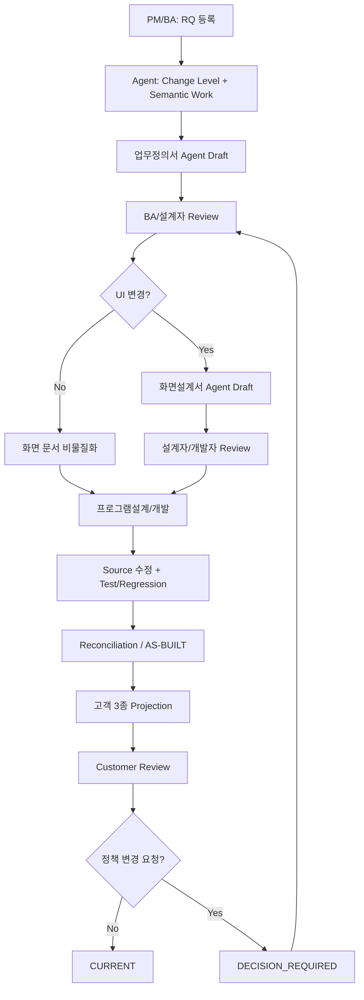

# Custom 3×3 Template Pilot — 02. 이해관계자별 실행 프로세스

## 1. 목적

개발용 3종/고객용 3종 Custom Template을 실제 RQ에 적용할 때 PM, BA/업무담당, 설계자, 개발자, Tester, 고객이 무엇을 해야 하는지 설명한다.

일반 사용자는 내부 Stage 순서를 관리하지 않는다. 정상 시작 명령은 다음 두 가지다.

```bash
python sdlc/scripts/harness.py work --target RQ-001
python sdlc/scripts/harness.py check RQ-001
```

`--stage`는 이번 Template Pilot에서 특정 문서 Mapping을 강제로 확인할 때만 사용한다.

## 2. 전체 Flow



## 3. 단계 0 — PM/프로젝트 리더: Pilot 준비

### 해야 할 일

1. `.sdlc/project.yaml`을 실제 프로젝트 값으로 설정한다.
2. 대표 RQ를 최소 3개 선택한다.
   - L1 또는 L2 Local 변경 1건
   - UI가 포함된 L3 변경 1건
   - Program/Batch/Interface 영향이 있는 L3~L4 변경 1건
3. 고객에게 보여줄 문서명/승인자를 확인한다.

### 확인 명령

```bash
python sdlc/scripts/harness.py check --setup
python sdlc/scripts/harness.py check project
```

### PM이 보는 것

- RQ 전체 목록
- Change Level
- 미확정 항목
- Release Blocker
- Build/Test/Regression/Customer Acceptance 상태
- STALE View
- 다음 행동

PM은 Canonical JSON이나 Stage Result를 직접 편집하지 않는다.

## 4. 단계 1 — BA/업무담당: 요구사항 등록과 업무 인터뷰

신규 RQ가 요구사항 파일에 있으면 Intake를 수행한다.

```bash
python sdlc/scripts/harness.py intake requirements.xlsx
```

여러 RQ가 공통 업무정책을 공유하면 인터뷰 결과를 각 문서에 복사하지 않는다. 공통 결정은 Evidence/Decision으로 한 번 기록하고 관련 RQ Work에서 재사용한다.

### BA가 확인할 것

- 원본 요구가 정확한가
- 업무 목적과 기대 결과가 명확한가
- AS-IS와 TO-BE가 구분되는가
- 업무 규칙과 예외가 확정/미확정으로 구분되는가
- AC가 실제 고객 확인 기준인가

## 5. 단계 2 — Agent + BA/설계자: 업무정의서

### 정상 프로젝트 사용

```bash
python sdlc/scripts/harness.py work --target RQ-001
```

Change Level이 필요한 Semantic Work를 결정하고 현재 RQ에 필요한 Human Artifact를 선택한다.

### Custom Template 자체를 검증하는 Pilot

업무정의서 Mapping을 명시적으로 확인하려면 다음처럼 내부 Stage를 지정할 수 있다.

```bash
python sdlc/scripts/harness.py work --target RQ-001 --stage IMPACT
```

이 `--stage IMPACT`는 Template 연결 확인용이다. 일반 프로젝트 사용자는 매번 Stage를 선택하지 않는다.

INTERACTIVE 실행의 첫 결과에는 다음이 포함된다.

- `artifact_path`
- `template_path`
- `context_path`
- `result_path`
- `finalize_command`

현재 IDE/ChatGPT/Cursor Agent는 `work-context.json`과 선택된 Custom Template만 사용해 문서와 `stage-result.json`을 작성한다.

작성 후 출력된 `finalize_command`를 그대로 실행한다.

예시 형태:

```bash
python sdlc/scripts/harness.py work \
  --target RQ-001 \
  --finalize \
  --run-dir <prepare에서 출력된 run-dir>
```

### BA/설계 Review

```bash
python sdlc/scripts/harness.py review \
  --target RQ-001 \
  --by "업무담당자" \
  --approve
```

추가 답변이 필요하면:

```bash
python sdlc/scripts/harness.py review \
  --target RQ-001 \
  --by "업무담당자" \
  --answer "VIP 고객도 동일 정책을 적용한다."
```

Review 명령은 Business Truth 필드를 직접 수정하지 않는다. 다음 Work가 Confirmed Evidence로 사용한다.

## 6. 단계 3 — 설계자: 화면설계서

화면설계서는 `HAS_UI`가 있을 때만 활성화한다. 화면이 없는 SQL/Batch/Local Method 변경에 빈 화면설계서를 만들지 않는다.

### Template Pilot 강제 확인

```bash
python sdlc/scripts/harness.py work --target RQ-001 --stage DESIGN
```

Expected Internal Artifact:

```text
docs/10_산출물/RQ-001/02_화면설계서.md
```

### 설계자가 Review할 핵심

- 화면 목적과 사용자
- AS-IS / TO-BE 화면
- 필드와 입력 조건
- 이벤트/Validation
- 권한/상태/예외
- AC/Test 연결

### 설계자가 직접 유지하지 않는 것

- Source Hash
- Trace JSON
- Canonical JSON
- Method/Query 목록의 Machine-derived 부분

이 정보는 Source Evidence에서 생성하고 설계자는 의미와 정확성만 Review한다.

## 7. 단계 4 — 개발자: 프로그램설계와 Source 수정

### Template Pilot 강제 확인

```bash
python sdlc/scripts/harness.py work --target RQ-001 --stage PROGRAM
```

Expected Internal Artifact:

```text
docs/10_산출물/RQ-001/03_프로그램설계서.md
```

프로그램설계서에는 다음을 연결한다.

```text
업무/화면 Intent
  ↓
Actual Implementation Target
  ↓
AS-IS Source Evidence
  ↓
Implementation Delta
  ↓
Source Change
  ↓
AC / TC
```

L1/L2 Source 변경도 Intent Decomposition, AS-IS Source Analysis, Impact Check 없이 바로 쓰지 않는다. 다만 이를 별도 문서 3개로 만들지는 않는다.

### 개발 중 예상 밖 영향 발견

예:

```bash
python sdlc/scripts/harness.py discover-impact \
  --target RQ-001 \
  --component ATT_CLOSE_BATCH \
  --key OVERTIME_MIN_UNIT
```

Framework가 가능한 범위에서 다음을 갱신한다.

- Historical Impact Candidate
- Change Level 재평가/상향
- Regression Scope
- STALE View
- Reconciliation 필요상태

## 8. 단계 5 — Tester/개발자: Test와 Reconciliation

Build/Test/Regression 결과는 서로 다른 Evidence다.

예시:

```bash
python sdlc/scripts/harness.py delivery mark \
  --target RQ-001 \
  --event TEST_PASSED \
  --evidence test:RQ-001

python sdlc/scripts/harness.py delivery mark \
  --target RQ-001 \
  --event REGRESSION_PASSED \
  --evidence regression:RQ-001
```

Technical Verification이 통과해도 Customer Acceptance로 간주하지 않는다.

Source와 설계가 다르면 다음 원칙을 따른다.

- 기술 설명 차이: Source-derived Program View 재생성 가능
- 업무 의미 차이: `CONFLICT` 또는 `CHECK_REQUIRED`
- Source Observation으로 Business Truth 자동 overwrite 금지

## 9. 단계 6 — 고객용 3종 Projection 생성

고객 문서는 Internal/Canonical Evidence에서 생성한다.

### A01 고객 업무정의서

```bash
python sdlc/scripts/harness.py customer-view \
  --target RQ-001 \
  --type solution_agreement \
  --input docs/10_산출물/RQ-001/01_업무정의서.md \
  --out docs/20_고객/RQ-001/A01_업무정의서.md \
  --short-name "RQ-001 변경"
```

### A02 고객 화면설계서

```bash
python sdlc/scripts/harness.py customer-view \
  --target RQ-001 \
  --type delivery_scope \
  --input docs/10_산출물/RQ-001/02_화면설계서.md \
  --out docs/20_고객/RQ-001/A02_화면설계서.md \
  --short-name "RQ-001 변경"
```

### A03 고객 프로그램설계서

```bash
python sdlc/scripts/harness.py customer-view \
  --target RQ-001 \
  --type acceptance_handover \
  --input docs/10_산출물/RQ-001/03_프로그램설계서.md \
  --out docs/20_고객/RQ-001/A03_프로그램설계서.md \
  --short-name "RQ-001 변경"
```

별도 `--contract`, `--profile`을 매번 입력할 필요가 없다. `.sdlc/project.yaml`의 `documents.customer.*`를 기본으로 사용한다.

생성 결과에서 다음을 확인한다.

```text
customer_tailoring_profile = CUSTOM_PILOT_CUSTOMER_3
template_path = sdlc/custom/project/templates/pilot-3x3/customer/...
business_truth_authority = false
customer_edit_auto_updates_canonical = false
lifecycle = PENDING_REVIEW
```

## 10. 단계 7 — 고객 Review

Projection 상태 확인:

```bash
python sdlc/scripts/harness.py projection status --target RQ-001
```

고객 승인:

```bash
python sdlc/scripts/harness.py projection review \
  --target RQ-001 \
  --artifact-id A01 \
  --reviewer "고객 업무담당자" \
  --accept
```

A02/A03도 같은 방식으로 승인한다.

고객이 업무정책을 변경했다면 `--accept`로 끝내지 않는다.

```bash
python sdlc/scripts/harness.py projection review \
  --target RQ-001 \
  --artifact-id A01 \
  --reviewer "고객 업무담당자" \
  --business-policy-edit "승인 한도를 100만원에서 200만원으로 변경"
```

이 경우 상태는 `DECISION_REQUIRED`이며 Canonical은 자동 수정되지 않는다.

## 11. Canonical 변경 이후

Canonical revision이 증가하면 이전 Generated View는 `STALE_VIEW`가 된다.

```text
Canonical 변경
→ A01/A02/A03 STALE_VIEW
→ 필요한 View 재생성
→ Human/Customer Review
→ CURRENT
```

고객 승인된 파일을 뒤에서 몰래 수정하지 않는다.

## 12. 역할별 최소 행동 수

| 역할 | 기본 행동 |
|---|---|
| PM | `check project`, Blocker/Decision 확인 |
| BA/업무담당 | RQ/업무 의미 Review, 필요한 Decision 답변 |
| 설계자 | 업무/화면 의미 Review |
| 개발자 | `work --target`, Source 변경, Unexpected Discovery 보고 |
| Tester | Test/Regression Evidence 확인 |
| 고객 | A01/A02/A03 Review/Decision |
| Harness Admin | 최초 Config/Profile/Template 설정과 Validation |

일반 개발자에게 Profile YAML, Canonical Store, Projection metadata를 수동 관리하게 하면 Pilot 실패로 간주한다.

## 13. Pilot 완료 기준

- Custom Internal 3종이 선택된 Template 경로로 생성된다.
- UI 없는 변경은 화면설계서를 강제하지 않는다.
- Customer 3종이 선택된 Custom Template으로 생성된다.
- Customer metadata에 `CUSTOM_PILOT_CUSTOMER_3`가 기록된다.
- Customer 문서에 unresolved `{{...}}`가 없다.
- Customer 문서가 Business Truth를 자동 수정하지 않는다.
- Canonical 변경 후 Customer View가 STALE로 검출된다.
- Standard Profile로 되돌려도 Core Runtime 복사/수정이 필요 없다.

테스트 결과를 ChatGPT에 전달해 분석하는 방법은 `10_CUSTOM_3X3_03_TEST_및_ChatGPT_분석가이드.md`를 따른다.
