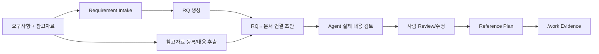

# 프로젝트 Input 자료 준비 가이드

이 문서는 요구사항 Excel과 기존 고객 문서처럼 **프로젝트 시작 시 또는 진행 중 Harness에 제공하는 자료**를 준비하는 방법을 설명한다. 원본을 Harness 전용 Template으로 다시 작성하지 않는 것이 기본 원칙이다.

## 1. 정형 요구사항 Excel

표준 요구사항 XLSX/CSV는 원본을 그대로 제공하고 공식 진입점으로 Intake한다.

```bash
python sdlc/scripts/harness.py intake <요구사항목록.xlsx>
```

Harness는 원본 행과 외부 요구사항 ID를 보존하고 RQ/FR Candidate를 만든다. 각 행을 곧바로 확정 Business Truth로 승격하지 않는다.

### 기본 원칙

- 외부 요구사항 ID와 원문을 보존한다.
- 동일한 명칭/업무구분을 이용한 Grouping은 Candidate다.
- 유사 문구는 자동 병합하지 않고 `GROUPING_REVIEW`로 남긴다.
- 일정/담당자 등 비필수 필드는 비어 있어도 Intake를 막지 않는다.
- 중복 외부 ID는 조용히 overwrite하지 않는다.
- 현재 문제, Business Rule, 기대 결과처럼 원문에 없는 사실을 Agent가 임의 확정하지 않는다.

표준 컬럼을 인식할 수 없는 고객 Excel만 별도 Column Mapping을 사용한다.

```text
sdlc/config/requirement-intake-columns.example.yaml
```

이 파일은 복사해야 하는 필수 프로젝트 설정이 아니라 **비표준 입력을 위한 선택 Mapping 예시**다.

## 2. 요구사항과 함께 받은 PPTX/XLSX/DOCX 등 참고자료

실제 프로젝트에서는 다음처럼 요구사항 파일과 참고자료가 같은 전달 패키지에 들어오는 경우가 일반적이다.

```text
고객 전달 패키지
├─ 요구사항목록.xlsx
├─ 기능개선안.pptx
├─ 현행업무정리.xlsx
├─ 운영회의결정.docx
└─ 업무규정.pdf
```

이 경우 **RQ가 아직 없기 때문에 RQ 기준 연결 Excel을 사람이 사전에 작성하지 않는다.**

사용자는 Agent에게 다음처럼 요청하면 된다.

```text
요구사항목록.xlsx와 같이 받은 PPTX/XLSX/DOCX/PDF도 같이 Intake해줘.
RQ가 만들어지면 참고문서 연결 초안을 만들고 실제 내용을 확인해서 검토해줘.
```

내부 Flow:



CLI에서는 참고자료를 함께 전달할 수 있다.

```bash
python sdlc/scripts/harness.py intake 요구사항목록.xlsx \
  --reference 기능개선안.pptx \
  --reference 현행업무정리.xlsx \
  --reference 운영회의결정.docx
```

참고자료가 한 폴더에 모여 있으면:

```bash
python sdlc/scripts/harness.py intake 요구사항목록.xlsx \
  --reference-dir br-input/originals
```

Requirement 파일 자체는 참고문서 후보에서 제외한다.

### 2.1 Intake 시 Harness가 하는 일

1. 요구사항을 먼저 Intake하여 실제 RQ를 만든다.
2. 함께 받은 PPTX/XLSX/DOCX/PDF/CSV/MD/TXT를 원본 그대로 보존한다.
3. 참고자료를 `br-input/manifest.yaml`에 안정적인 `document_id`로 등록한다.
4. Slide/Sheet/Cell range/Paragraph/Page 등의 Evidence Chunk를 추출한다.
5. RQ 원문과 문서 내용에서 관찰 가능한 단서로 관련 후보를 좁힌다.
6. 후보를 `검토상태=제안`으로 남긴다.
7. Agent가 실제 RQ 의미와 추출 문서 내용을 읽어 `확정/제외/보정`한다.

Runtime의 단어/ID 매칭은 **검색 후보를 줄이는 Prefilter**일 뿐 업무 의미 확정이 아니다.

### 2.2 사람이 검토하는 파일

Intake 직후 다음 Review Surface가 생성될 수 있다.

```text
docs/00_관리/RQ_참고문서_초안검토.md
```

대표 컬럼:

```text
RQ | 문서ID | 사용목적 | 참고위치 | 필수여부 | 검토상태 | 제안이유 | 비고
```

검토상태:

- `제안`: Runtime/Agent가 관련 가능성이 있다고 본 초안
- `확정`: Agent/사람이 실제 Reference Plan으로 확인
- `제외`: 검토 결과 해당 RQ의 참고자료가 아님

사람은 Markdown 표를 직접 수정하거나, Agent에게 자연어로 행 추가/삭제/변경을 요청하거나, Excel/CSV로 Export하여 검토할 수 있다.

Markdown 수정 후에도 Import 가능하다.

```bash
python sdlc/scripts/harness.py rq-ref import \
  docs/00_관리/RQ_참고문서_초안검토.md
```

Excel 검토가 편하면:

```bash
python sdlc/scripts/harness.py rq-ref export \
  --format xlsx \
  --output docs/00_관리/RQ_참고문서_연결관리.xlsx
```

상세 방법은 `13_RQ_참고문서_레지스트리_가이드.md`를 본다.

### 2.3 Registry와 Canonical Provenance는 다르다

```text
RQ Reference Registry
= 이 RQ를 분석할 때 이 문서를 참고할 계획이다

Canonical Provenance
= 실제로 문서의 특정 위치를 읽어 특정 사실/판단의 근거로 사용했다
```

따라서 `검토상태=확정`이어도 문서의 모든 내용이 Business Truth가 되는 것은 아니다.

실제 RQ 작업에서 해당 문서를 조사한 뒤 관련 의미를 `/work` Evidence로 사용하고 `document_id / locator / source_hash / evidence class`를 Provenance 또는 Stage Evidence에 남긴다.

## 3. 비정형 고객 문서 / BR의 보관 구조

PDF, DOCX, XLSX, PPTX, Markdown, TXT, CSV 등은 특정 BR Template로 다시 작성하도록 요구하지 않는다. 원본은 원형 그대로 보존한다.

권장 구조:

```text
br-input/
├─ originals/
│  ├─ 규정.pdf
│  ├─ 운영매뉴얼.docx
│  ├─ 기능개선안.pptx
│  └─ 현행업무정리.xlsx
├─ manifest.yaml
├─ context.md       # 선택
├─ glossary.csv     # 선택
└─ decisions/       # 선택
```

Manifest의 최소 항목은 다음 두 개다.

```yaml
documents:
  - document_id: DOC-001
    path: originals/규정.pdf
```

Intake 자동 등록을 사용하면 기본 `document_id/path/title/source_hash`를 Harness가 만든다. 문서 제목, 종류, 권위, 유효 여부, 담당부서, 적용범위, 관련 시스템 등의 Metadata를 알고 있다면 사람이 나중에 보강할 수 있다. 모르는 값은 비우거나 `UNKNOWN`으로 둔다.

## 4. 프로젝트 전반 공통 참고자료

RQ 하나에 종속되지 않는 자료는 성격을 구분한다.

```text
sdlc/custom/project/standards/   # Java/DB/Test/Security/개발 표준, 코딩·운영 가이드
sdlc/custom/project/rules/       # Agent가 지켜야 할 프로젝트 금지사항/Architecture 규칙
br-input/originals/              # 회사 내규, 업무규정, 운영매뉴얼, 정책 원본 등 Evidence 자료
br-input/context.md              # 프로젝트/업무 배경을 설명하는 선택 Context
br-input/glossary.csv            # 프로젝트/고객 용어집
```

구분 원칙:

- **개발자가 따라야 하는 Normative Standard** → `sdlc/custom/project/standards/`
- **Agent 실행/설계에 강제할 Rule** → `sdlc/custom/project/rules/`
- **업무 판단의 근거가 될 원본 회사 규정/내규** → `br-input/originals/`
- **단순 배경 설명** → `br-input/context.md`

Core Framework 파일에 고객사 표준 전체를 직접 넣지 않는다.

## 5. 원문과 정규화 결과의 관계

원문을 덮어쓰지 않는다.

```text
Original Source
  ↓ Evidence / Locator / Hash 보존
Normalized Candidate
  ↓ Review / Evidence 보강
Canonical Spec
```

BR 후보에서는 가능한 범위에서 조건, 주체, 행동/판단, 기대결과, 예외, 적용기간, 원본 위치를 분리한다. 서로 다른 문서가 충돌하면 자동으로 최신 문서를 정답으로 선택하지 않고 `BR_CONFLICT`와 확인 질문을 만든다.

## 6. 사람이 보는 결과와 Machine 결과

대표 결과는 다음처럼 분리된다.

```text
docs/00_관리/요구사항_인입결과.md          # 사람이 보는 Requirement Intake 결과
docs/00_관리/RQ_생성근거.md               # RQ Grouping/원본 행 설명
docs/00_관리/RQ_참고문서_초안검토.md      # Intake 직후 Agent/사람 Review Surface
docs/00_관리/RQ_참고문서_연결목록.md      # 현재 RQ↔문서 Registry View
docs/00_관리/RQ_작업목록.md               # PM/이해관계자용 배정·진척 목록
sdlc/runtime/intake/reference-evidence/     # 참고문서 기계 추출 결과
sdlc/runtime/intake/rq-reference-agent-review.json # Agent 검토 Context
sdlc/runtime/intake/...                    # 기타 Intake Machine 결과
sdlc/canonical/store.json                  # Canonical Candidate/Truth Store
```

`docs/00_관리`는 Framework 검증보고서를 보관하는 폴더가 아니라 **실제 프로젝트에서 생성되는 PM/사용자용 관리 View 위치**로 사용한다.

## 7. Intake 다음 작업

참고자료가 함께 들어왔다면 첫 `/work` 전에 Agent가 `RQ_참고문서_초안검토.md`와 실제 Evidence Chunk를 확인한다.

그 다음 Intake가 반환한 실제 Target을 그대로 사용한다.

```bash
python sdlc/scripts/harness.py rq-list export --format xlsx --output docs/00_관리/RQ_작업관리.xlsx
python sdlc/scripts/harness.py work --target RQ-001
```

담당자 배정과 RQ List 운영은 `12_RQ_작업목록_운영가이드.md`, 참고문서 연결 초안/검토는 `13_RQ_참고문서_레지스트리_가이드.md`를 따른다.

Source Repository가 아직 제공되지 않은 Brownfield 프로젝트라면 Source Evidence가 필요한 Impact/Implementation 확정은 보류하고, 확인 가능한 Requirement/Business Context까지만 Candidate로 진행한다.

## 8. 프로젝트 진행 중 요구사항/참고자료가 추가된 경우

최초 Intake가 일회성이라는 전제는 없다. 운영 중 새 요구사항과 그 요구사항의 참고 PPTX/XLSX가 함께 오면 같은 Intake Flow를 다시 사용한다.

```bash
python sdlc/scripts/harness.py intake 추가요구사항.xlsx \
  --reference 추가기능설명.pptx \
  --reference 추가현행자료.xlsx
```

기존 RQ는 stable key를 기준으로 재사용하고 새 RQ는 새 ID를 받는다. 기존 `CONFIRMED_BUSINESS`는 재-Intake 자료만으로 덮어쓰거나 낮추지 않는다.

요구사항 없이 참고자료만 추가된 경우에는 Manifest/Registry에 기존 RQ 기준으로 추가하고 Agent가 관련성을 검토한다.

## 9. 완성 예시

- `examples/요구사항_인입_완성예시.md`
- `examples/요구사항_정의_완성예시.md`

예시는 작성 양식이 아니라 Agent가 Evidence 범위 안에서 어디까지 초안을 작성하고 어디를 OPEN으로 남기는지 보여주는 참고자료다.
