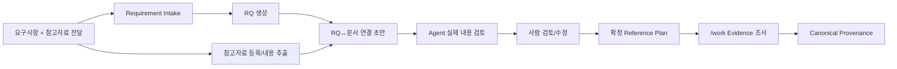

# RQ 참고문서 레지스트리 가이드

## 1. 핵심 원칙

RQ 참고문서는 **RQ가 만들어진 뒤에 연결**한다. 따라서 Requirement를 받기 전에 PM이 RQ 기준 Excel을 미리 작성하는 흐름을 기본으로 하지 않는다.

실제 프로젝트에서는 요구사항 파일과 참고자료가 함께 전달되는 경우가 많다.

```text
고객 전달 패키지
├─ 요구사항목록.xlsx          # Requirement Intake 대상
├─ 근무계획_개선안.pptx      # 참고자료
├─ 현행업무정리.xlsx          # 참고자료
└─ 운영회의결정.docx          # 참고자료
```

권장 Flow:



연결 초안과 확정 Reference Plan 모두 **Business Truth가 아니다**. 실제 `/work`에서 문서를 읽고 특정 사실의 근거로 사용한 뒤에야 Canonical Provenance가 된다.

## 2. Intake 시 자동 초안 생성

사용자가 Agent에게는 자연어로 다음 정도만 요청하면 된다.

```text
요구사항목록.xlsx와 같이 받은 PPTX/XLSX/DOCX 참고자료까지 같이 Intake해줘.
RQ가 생성되면 참고문서 연결 초안도 만들어서 검토해줘.
```

Agent는 내부적으로 Requirement 파일과 참고자료를 구분해 `intake`에 전달한다.

CLI 예시는 다음과 같다.

```bash
python sdlc/scripts/harness.py intake 요구사항목록.xlsx \
  --reference 근무계획_개선안.pptx \
  --reference 현행업무정리.xlsx \
  --reference 운영회의결정.docx
```

참고자료가 한 폴더에 모여 있으면:

```bash
python sdlc/scripts/harness.py intake 요구사항목록.xlsx \
  --reference-dir br-input/originals
```

Requirement 파일 자체는 참고문서 후보에서 제외한다.

지원 형식:

- PPTX
- XLSX
- DOCX
- PDF
- CSV
- Markdown
- TXT

## 3. Intake Runtime과 Agent의 역할 분리

자동화는 두 단계다.

### 3.1 Runtime이 먼저 하는 일

- Requirement Intake 후 실제 RQ ID를 확보한다.
- 함께 받은 참고자료를 `br-input/manifest.yaml`에 등록한다.
- 문서 원문을 변경하지 않는다.
- 각 문서에서 Slide/Sheet/Cell range/Paragraph/Page 등의 Evidence Chunk를 추출한다.
- RQ 의미와 문서 내용의 관찰 가능한 공통어/외부 요구ID 등을 이용해 후보를 좁힌다.
- 후보를 `검토상태=제안`으로 저장한다.
- 매칭되지 않은 RQ도 숨기지 않고 Agent Review Context에 남긴다.

Runtime 후보 점수는 **검색용 Prefilter**일 뿐 Semantic 판단이 아니다.

### 3.2 Agent가 반드시 하는 일

Intake 결과에 `agent_review_required=true`가 있으면 Agent는 첫 `/work` 전에 다음을 수행한다.

1. 해당 RQ의 Requirement 원문/의도를 읽는다.
2. 후보 문서의 실제 Evidence Chunk를 읽는다.
3. 관련성이 맞으면 `확정`으로 바꾸고 사용목적/참고위치를 보정한다.
4. 관련이 없으면 `제외`로 바꾸거나 연결 행을 제거한다.
5. 자동 후보에서 빠진 문서가 실제 관련되면 행을 추가한다.
6. 판단 근거가 부족하면 `제안` 상태를 유지하고 사람에게 확인한다.
7. Registry 검토만으로 Requirement/Business Rule을 Canonical에 확정하지 않는다.

Agent Review Context:

```text
sdlc/runtime/intake/rq-reference-agent-review.json
```

추출 결과:

```text
sdlc/runtime/intake/reference-evidence/<DOCUMENT_ID>.json
```

## 4. 사람이 보는 초안

Intake 후 다음 파일이 생성된다.

```text
docs/00_관리/RQ_참고문서_초안검토.md
```

대표 컬럼:

| 컬럼 | 의미 |
|---|---|
| RQ | Intake 후 생성된 RQ |
| 문서ID | Manifest에 등록된 문서 식별자 |
| 사용목적 | 왜 참고할지 |
| 참고위치 | Slide/Sheet/Page/Paragraph 등 |
| 필수여부 | 필수/선택 |
| 검토상태 | 제안 / 확정 / 제외 |
| 제안이유 | Runtime/Agent가 연결한 이유 |
| 비고 | 사람이 남기는 메모 |

`제안`은 아직 확정 연결이 아니다.

## 5. 수정·검토 방법

### 방법 A — Agent에게 자연어로 수정 요청

가장 쉬운 방식이다.

```text
RQ-012에서 현행업무정리.xlsx는 관련 없으니 제외해줘.
근무계획_개선안.pptx는 RQ-012, RQ-018 모두 참고하도록 바꿔줘.
RQ-018의 참고위치는 5~7번 슬라이드로 수정해줘.
```

Agent는 Registry만 수정하며 Canonical Business Truth는 변경하지 않는다.

### 방법 B — Markdown 직접 수정 후 Import

`RQ_참고문서_초안검토.md`의 표를 수정한 뒤:

```bash
python sdlc/scripts/harness.py rq-ref import \
  docs/00_관리/RQ_참고문서_초안검토.md
```

Markdown도 정식 Review Input으로 지원한다.

### 방법 C — Excel/CSV로 검토

```bash
python sdlc/scripts/harness.py rq-ref export \
  --format xlsx \
  --output docs/00_관리/RQ_참고문서_연결관리.xlsx
```

수정 후:

```bash
python sdlc/scripts/harness.py rq-ref import \
  docs/00_관리/RQ_참고문서_연결관리.xlsx
```

한 행이 하나의 `RQ ↔ 문서` 연결이다. 하나의 문서는 여러 RQ에, 하나의 RQ는 여러 문서에 연결할 수 있다.

## 6. 검토상태

```text
제안
→ Runtime/Agent가 관련 가능성이 있다고 판단한 초안

확정
→ Agent/사람 검토 후 실제 Reference Plan으로 사용

제외
→ 검토했으나 해당 RQ 참고문서로 사용하지 않음
```

`확정` 상태라고 해도 문서 내용 전체가 Business Truth라는 뜻은 아니다.

## 7. 문서 Manifest

자동 Intake를 사용하면 함께 전달된 참고자료는 `br-input/manifest.yaml`에 안정적인 `document_id`로 등록된다.

기존에 사람이 만든 Manifest가 있으면 그대로 사용하며, 이미 같은 경로/Hash의 문서는 중복 등록하지 않는다.

예:

```yaml
documents:
  - document_id: CUST-AUTO-1A2B3C4D5E
    path: "br-input/originals/근무계획_개선안.pptx"
    title: "근무계획_개선안"
    document_type: SUPPORTING_MATERIAL
    authority: UNKNOWN
    lifecycle_status: CURRENT
    source_hash: "sha256:..."
```

문서 권위/유효기간/담당부서 등을 알고 있다면 나중에 Manifest Metadata를 보강할 수 있다.

## 8. 저장 위치와 권위

```text
Requirement Source
→ RQ 생성의 입력

br-input/manifest.yaml
→ 참고문서 식별/원본 위치

sdlc/runtime/intake/reference-evidence/
→ 참고문서 기계 추출 결과

sdlc/runtime/intake/rq-reference-agent-review.json
→ Agent 연결 검토 Context

docs/00_관리/RQ_참고문서_초안검토.md
→ Intake 직후 사람/Agent Review Surface

.sdlc/management/rq-references.json
→ 검토상태를 포함한 RQ↔문서 Reference Plan

docs/00_관리/RQ_참고문서_연결목록.md
→ 현재 Registry 사람용 View

sdlc/canonical/store.json / Provenance
→ 실제 분석에 사용된 Evidence와 Business 의미
```

따라서 `rq-references.json`이나 검토 Markdown을 변경해도 Requirement/Business Rule이 자동 변경되지 않는다.

## 9. `/work`에서의 사용

Agent가 RQ 작업에 들어가면 다음 순서가 권장된다.

1. 현재 RQ와 Canonical 관계
2. `확정` Reference Plan
3. 남아 있는 `제안` 후보가 현재 작업에 중요하면 추가 검토
4. 실제 첨부문서 Evidence Chunk/원문
5. 기존 Canonical Provenance
6. Source/Program/Data Evidence
7. 현재 Projection Profile

문서의 특정 사실을 실제 설계/업무 판단 근거로 사용하면 `document_id + locator + source_hash + evidence class`를 Provenance/Evidence로 남긴다.
