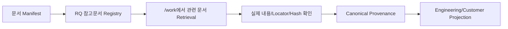

# RQ 참고문서 레지스트리 가이드

## 1. 목적

Requirement를 실제로 분석하기 전에 PM/BA가 **"이 RQ는 어떤 원본 자료를 참고해야 하는가"**를 미리 지정할 수 있게 한다.

원본 문서는 RQ별로 복사하지 않는다.

```text
br-input/originals/근태규정.pdf
        ↑ DOC-003
        ├─ RQ-001
        ├─ RQ-004
        └─ RQ-012
```

하나의 RQ에 여러 문서를 연결할 수도 있다.

이 연결은 **참고 계획**이며 Business Truth가 아니다. Agent가 `/work`에서 실제 내용을 읽고 Locator/Hash와 함께 Evidence를 남긴 뒤에야 Canonical Provenance가 된다.

## 2. 선행조건: 문서 Manifest

원본은 다음처럼 등록한다.

```text
br-input/
├─ originals/
│  ├─ 근태규정.pdf
│  └─ 운영회의록.docx
└─ manifest.yaml
```

예:

```yaml
documents:
  - document_id: DOC-003
    path: originals/근태규정.pdf
    title: 근태규정
    locator_hint: page

  - document_id: DOC-004
    path: originals/운영회의록.docx
    title: 운영회의록
    locator_hint: paragraph
```

`document_id`가 문서의 안정적인 식별자다.

## 3. Excel/CSV로 연결 관리

일반 사용자 권장 방식이다.

### 3.1 편집 파일 Export

```bash
python sdlc/scripts/harness.py rq-ref export \
  --format xlsx \
  --output docs/00_관리/RQ_참고문서_연결관리.xlsx
```

또는 CSV:

```bash
python sdlc/scripts/harness.py rq-ref export \
  --format csv \
  --output docs/00_관리/RQ_참고문서_연결관리.csv
```

### 3.2 컬럼

| 컬럼 | 필수 | 의미 |
|---|---|---|
| RQ | Y | 연결할 Canonical RQ |
| 문서ID | Y | `manifest.yaml`의 document_id |
| 사용목적 | N | 예: 업무규칙 확인, AS-IS 확인, 고객합의 근거 |
| 참고위치 | N | 예: 4장, Sheet 근무계획, page 12-18 |
| 필수여부 | N | 필수/선택 |
| 비고 | N | PM/BA 메모 |

한 행이 하나의 `RQ ↔ 문서` 연결이다.

### 3.3 Import

```bash
python sdlc/scripts/harness.py rq-ref import docs/00_관리/RQ_참고문서_연결관리.xlsx
```

Import 전에 모든 RQ와 문서ID를 검증하고, 잘못된 행이 있으면 전체 반영을 중단한다.

## 4. Agent/고급 사용자 단일 연결

```bash
python sdlc/scripts/harness.py rq-ref link \
  --target RQ-012 \
  --document-id DOC-003 \
  --purpose "근무계획 업무규칙 확인" \
  --locator-hint "4장" \
  --required
```

연결 해제:

```bash
python sdlc/scripts/harness.py rq-ref unlink \
  --target RQ-012 \
  --document-id DOC-003
```

## 5. 사람이 보는 결과

```text
docs/00_관리/RQ_참고문서_연결목록.md
```

대표 컬럼:

```text
RQ | 요구사항명 | 문서ID | 문서명 | 원본경로 | 사용목적 | 참고위치 | 필수여부 | Evidence 상태 | 비고
```

Evidence 상태는 다음처럼 구분한다.

- `참고 예정`: RQ에 연결했지만 아직 실제 근거 사용이 확인되지 않음
- `근거 사용 확인`: 해당 RQ의 Provenance에서 문서 사용 흔적이 확인됨

## 6. 저장 위치와 권위

```text
br-input/manifest.yaml
→ 문서 식별/원본 위치

.sdlc/management/rq-references.json
→ PM/BA가 정한 참고 계획

sdlc/runtime/management/rq-reference-registry.json
→ Machine 합성 결과

docs/00_관리/RQ_참고문서_연결목록.md
→ 사람용 View

sdlc/canonical/store.json / Provenance
→ 실제 분석에 사용된 Evidence
```

따라서 `rq-references.json`을 변경해도 Business Rule이나 Requirement 의미가 자동으로 바뀌지 않는다.

## 7. 실제 작업 시 사용 Flow



Agent는 RQ를 처리할 때 다음 순서로 본다.

1. RQ와 연결된 Canonical 의미/관계
2. RQ 참고문서 Registry의 필수/선택 자료
3. 기존 Canonical Provenance의 실제 근거
4. 관련 Source/Program/Data Evidence
5. 현재 선택된 Projection Profile

Projection 문서는 Business Truth의 입력 원장이 아니라 현재 Canonical/Evidence를 사람이 보기 좋게 보여주는 Review Surface다.
