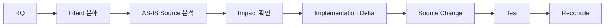

# SDLC Harness 시작하기 — v1.9

## 1. 문서 목적

이 문서는 PM, BA, 설계자, 개발자, 테스트 담당자가 내부 Stage/Canonical JSON을 직접 관리하지 않고 Harness를 사용하는 첫 진입점이다.

v1.9에서 반드시 구분한다.

- **Change Level**: RQ별 실제 Semantic Work와 Evidence/Review 깊이를 정한다.
- **Stage**: 내부 taxonomy/debug/re-entry 단위다. 일반 사용자가 모든 Stage를 순서대로 실행하지 않는다.
- **Template**: 사람에게 보여 줄 문서 구조다.
- **Tailoring Profile**: 같은 내부 의미를 프로젝트에 맞는 Human Artifact로 Projection한다.
- **Delivery Profile**: 프로젝트 공통 실행 기본값/호환 정책이다. 개별 RQ의 Semantic Work를 대신 결정하지 않는다.

## 2. 기본 원칙

**문서를 줄이는 것과 분석을 줄이는 것은 다르다.**

L1/L2는 별도 DECOMPOSE/DISCOVERY/IMPACT 문서를 차례로 만들지 않을 수 있지만 Source를 실제로 바꾸기 전 다음 세 가지는 반드시 수행한다.

1. Requirement Intent Decomposition
2. AS-IS Source Analysis
3. Impact Check

이 결과는 별도 사람이 작성하는 문서가 아니라 Work Context/Stage Result의 Machine Evidence로 남는다. 실제 Source가 바뀌는 경우에만 이 Gate와 Build/Test 검증이 강제된다.



## 3. 사용자 기본 흐름

```bash
python sdlc/scripts/harness.py setup --name <project> --mode <GREENFIELD|BROWNFIELD|HYBRID|AUTO>
python sdlc/scripts/harness.py check --setup
python sdlc/scripts/harness.py intake <requirements.xlsx>
python sdlc/scripts/harness.py check project
python sdlc/scripts/harness.py work --target RQ-001
python sdlc/scripts/harness.py check RQ-001
```

일반 개발자는 `--stage`, Template 경로, Canonical JSON, Trace/Provenance JSON, Source Hash를 직접 유지하지 않는다.

## 4. 기본 Config

`.sdlc/project.yaml`이 유일한 Human-maintained Config다.

```yaml
schema_version: 1
project:
  name: HRIS
  mode: BROWNFIELD

delivery:
  profile: STANDARD

change:
  level_policy: AUTO

documents:
  language: ko-KR
  internal:
    profile: STANDARD_5
  customer:
    profile: CUSTOMER_STANDARD_3
  pm:
    profile: PM_STANDARD
  machine:
    visibility: HIDDEN
```

신규 프로젝트 기본 문서 Profile은 `STANDARD_5 / CUSTOMER_STANDARD_3 / PM_STANDARD`다. `STAGE_ORIENTED_FULL`은 Legacy/Formal Contract/기존 고객 문서 호환용이지 신규 기본값이 아니다.

## 5. L1/L2가 가벼운 이유

L1/L2는 **분석을 생략해서** 가벼운 것이 아니다. 한 Work Run 안에서 필수 분석을 수행하고 불필요한 사람 문서/검토를 만들지 않기 때문에 가볍다.

- L1: Intent + AS-IS Source + Impact sanity + Implementation Delta + Test + Reconcile
- L2: Intent + AS-IS Source + Impact + Implementation Delta + Test + Reconcile
- 실제 Source가 바뀌지 않은 문서/분석-only DEVELOPMENT run에는 Build/Test를 강제하지 않는다.
- 실제 Source가 바뀌면 Intent/AS-IS/Impact 근거가 없을 경우 fail-closed 한다.
- Change Level이 불확실하면 L1로 낙관적으로 낮추지 않고 최소 L2 safety floor를 사용한다.

## 6. Program Spec 정책

신규 Standard는 `17개 항목 전체 필수`가 아니다.

**Core Required 6개 + Risk-triggered Conditional**을 사용한다.

Core:

- 기능/요구 설계 기준
- 실제 구현 대상
- Source Evidence
- 개발 Delta·변경 Source
- AC/Test
- OPEN/Guard

Conditional은 Data, Transaction, Concurrency, Interface, Security, Observability, Migration, Architecture 등 실제 Typed Risk가 있을 때만 추가한다. Source에서 재생성 가능한 Query/Table/Symbol Mapping은 Machine-derived가 기본이다.

`LEGACY_FULL_17`만 기존 17개 전체 확인을 유지한다.

## 7. 문서와 Projection

- Internal Artifact는 설계/개발 Review용이다.
- Customer Artifact는 `A01 요구·업무·기능 합의 / A02 영향·개발범위 / A03 테스트·인수·운영 결과` 3종이 표준이다.
- Customer 문서는 Canonical/Internal에서 생성되는 View이며 독립 Business Truth가 아니다.
- Canonical/Internal이 바뀌면 관련 View는 `STALE_VIEW → Regeneration → Human/Customer Review → CURRENT` lifecycle을 따른다.
- Customer 문서에서 사람이 정책을 바꿔도 Canonical을 자동 overwrite하지 않는다. Decision/Review가 필요하다.

## 8. 역할별 최소 행동

| 역할 | 기본 행동 |
|---|---|
| PM | `/check project`에서 blocker/decision/release/stale 상태 확인 |
| BA/설계자 | Agent가 정리한 업무 의미와 Human Decision만 검토 |
| 개발자 | `work --target RQ-xxx`; 예상 밖 영향 발견 시 해당 RQ와 Component만 보고 |
| Tester | AC/Test 결과 검증 |
| Customer | A01/A02/A03 검토/합의/인수 |
| Harness 관리자 | Config/Profile/Contract/Runtime 정합성과 예외 관리 |

## 9. 하지 말아야 할 것

- L1이므로 Source 분석을 건너뛰지 않는다.
- 문서 수 감소를 Semantic Work 감소와 동일시하지 않는다.
- `STAGE_ORIENTED_FULL`을 신규 프로젝트 기본값으로 쓰지 않는다.
- 관련 없는 Program Spec Conditional 항목을 N/A로 채우기 위해 작업하지 않는다.
- Source Observation을 Business Truth로 자동 승격하지 않는다.
- Customer Projection에서 새로운 업무 사실을 만들지 않는다.
- CI PASS를 External Agent/Human empirical PASS로 해석하지 않는다.

## 10. Validation

```bash
python sdlc/scripts/harness.py check --setup
python sdlc/scripts/harness.py check project
```

Harness 관리자가 Profile을 직접 검증할 때만 실행한다.

```bash
python sdlc/scripts/tailoring_runtime.py validate-profile --profile STANDARD_5
```

## 11. 다음 문서

- `01_STANDARD_SCAFFOLD_사용가이드.md`
- `02_PROJECT_설정가이드.md`
- `03_TAILORING_설정가이드.md`
- `04_TEMPLATE_및_산출물_가이드.md`
- `05_이해관계자별_작업가이드.md`
- `06_CUSTOM_SCAFFOLD_적용가이드.md`
- `07_BROWNFIELD_SSOT_현행화가이드.md`
