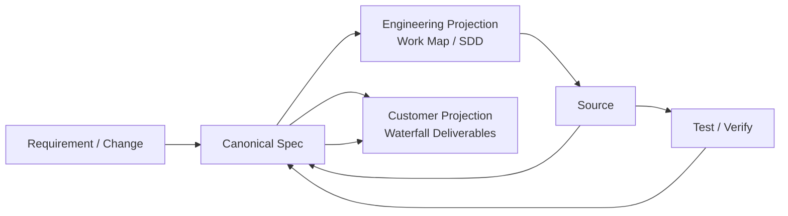

# SDLC Harness 시작하기 — v1.10 Projection Separation

## 1. 3가지만 먼저 이해한다

- **Canonical Spec**: 프로젝트 의미와 관계의 원장(Source of Truth)
- **Engineering Projection**: 개발자/Agent가 구현하기 위해 보는 Living Spec
- **Customer Projection**: 고객과 협의·제출·인수하기 위한 Human-oriented View

Engineering과 Customer는 같은 Canonical을 보지만 **문서 수, 순번, Template, Lifecycle이 서로 독립**이다.



## 2. 일반 사용자가 하는 일

```bash
python sdlc/scripts/harness.py setup --name <project> --mode <AUTO|GREENFIELD|BROWNFIELD|HYBRID>
python sdlc/scripts/harness.py intake <requirements.xlsx>
python sdlc/scripts/harness.py work --target RQ-001
python sdlc/scripts/harness.py check RQ-001
```

설계/Evidence/Program Mapping을 보완할 때는 `/work` 흐름을 사용한다. Requirement, Business Rule, Scope, TO-BE Behavior가 바뀌면 `/change` 흐름을 사용한다.

L1/L2 Fast Path에서 Source를 수정하기 전에도 최소 분석은 생략하지 않는다. Agent는 **Requirement Intent Decomposition → AS-IS Source Analysis → Impact Check** 순서로 의도, 현행 근거, 영향 범위를 확인한 뒤 Source 변경으로 진행한다.

일반 사용자는 내부 Stage 전체 taxonomy, Canonical JSON Schema, Runtime Python 호출 관계를 배울 필요가 없다.

## 3. 신규 Project Config 기본값

`.sdlc/project.yaml`이 Human-maintained 설정의 기준이다.

```yaml
documents:
  engineering:
    profile: ENGINEERING_SDD_COMPACT
    manual_edit_policy: TYPO_ONLY
    freshness: CANONICAL_REVISION

  customer:
    profile: CUSTOMER_STANDARD_3
    scope: RQ
    freshness: CANONICAL_AND_AS_BUILT
    final_review:
      human_editable: true

  pm:
    profile: PM_STANDARD

  machine:
    visibility: HIDDEN
```

신규 프로젝트에서는 `documents.engineering.profile`을 사용한다. `STANDARD_3`, `STANDARD_5`, `STAGE_ORIENTED_FULL`은 기존 Formal 문서 체계를 유지해야 할 때만 사용하는 Legacy Profile이며 신규 기본값이 아니다.

## 4. Engineering 기본 문서

`ENGINEERING_SDD_COMPACT`의 기본 구조는 다음과 같다.

```text
docs/10_engineering/<TARGET>/
├─ 00_work-map.md
├─ specs/<TARGET>.md
└─ programs/<TARGET>.md   # 필요할 때만
```

- `00_work-map.md`: RQ → Work → TASK → PGM → Source → AC/TC 연결판
- `specs/...`: 기능/업무 단위 Living SDD
- `programs/...`: 실제 Source 구현 Delta가 별도로 필요한 경우만 생성

Engineering Projection은 `semantic_owner: CANONICAL`, `projection_owner: AGENT`, 기본 `manual_edit_policy: TYPO_ONLY`다. 오탈자 외 직접 수정은 Canonical을 자동 변경하지 않으며 Projection 상태에서 경고 대상으로 취급한다.

## 5. Customer 기본 문서

기본 `CUSTOMER_STANDARD_3`:

- A01 요구·업무·기능 합의서
- A02 영향·개발범위 공유서
- A03 테스트·인수·운영 결과서

필요하면 `CUSTOMER_WATERFALL_FULL` 8종을 선택할 수 있고, 프로젝트 Custom Profile로 1/3/5/8/13/N종을 정의할 수 있다.

Customer Runtime은 Engineering Profile ID, Engineering 문서 수/순번, expected path를 사용하지 않는다. Customer Profile + Canonical/Semantic metadata/Evidence를 사용한다.

## 6. Semantic Template과 Human Projection은 다르다

```text
sdlc/templates/semantic/
= Agent가 Stage에서 어떤 의미와 Evidence를 작성할지 정의

sdlc/templates/engineering/
= 개발자/설계자용 최종 Projection Template

sdlc/templates/customer/
= 고객용 Projection Template

sdlc/tailoring/standard/*.yaml
= 어떤 Template을 어떤 조합으로 사용할지 정하는 Profile
```

Semantic Template 자체를 고객 제출 문서나 개발자용 최종 문서로 해석하지 않는다.

## 7. `/work`와 `/change` 경계

### `/work`

Canonical Business 의미는 유지하면서 다음을 보완한다.

- AS-IS Source Evidence
- 상세 설계
- Program/Source Mapping
- Development Task
- AS-BUILT
- Test/Verification

### `/change`

Canonical 의미가 바뀌는 경우다.

- Requirement 변경
- Business Rule 변경
- TO-BE Behavior 변경
- Scope/정책 변경

`/change` 후 영향 Engineering/Customer Projection은 `STALE_VIEW`가 되고 재생성/재검수가 필요하다.

## 8. Customer Final Review

Customer Projection은 진행 중 `PENDING_REVIEW → CURRENT`로 관리할 수 있다. 최종 제출 직전에는 `FINAL_REVIEW`에서 사람이 문구/표현을 수정할 수 있다.

Final Review 이후 Canonical이 바뀌면 자동 overwrite하지 않는다.

```text
FINAL_REVIEW + Canonical Change
→ STALE_VIEW
→ Human Edit 존재 표시
→ Regenerate / Re-review 필요
```

업무 정책 자체를 바꾼 Human Edit은 `/change`로 되돌린다.

## 9. Change Level / Stage / Document는 다르다

- Change Level = 실행 깊이 / Evidence / Review 필요성
- Stage = 내부 Execution Semantic
- Projection Profile = 사람에게 어떤 Artifact를 보여줄지

따라서 `Stage = Document`, `Change Level = Document Count`로 해석하지 않는다.

## 10. Framework와 배포 Project의 경계

실제 프로젝트에는 Runtime/Profile/Template/User Guide 등 필요한 자산만 배포하고 Framework Test/Pilot/Design History는 제외한다.

Framework 관리자가 다른 Repository용 Project Scaffold를 만들 때는 **Framework Repository에서만** 다음 도구를 사용한다.

```bash
python sdlc/scripts/build_project_scaffold.py --root . --output <outside-target-directory>
```

`build_project_scaffold.py`와 `project-scaffold-contract.json`은 Framework distribution tool이므로 생성된 Project Scaffold 안에는 포함되지 않는다. 배포받은 프로젝트 참여자가 자기 프로젝트 안에서 다시 Scaffold를 생성하는 흐름이 아니다.

## 11. 다음 문서

- Input 자료 준비: `11_INPUT_자료_준비가이드.md`
- 프로젝트 설정: `02_PROJECT_설정가이드.md`
- Profile/Customizing: `03_TAILORING_설정가이드.md`
- Semantic/Engineering/Customer Template: `04_TEMPLATE_및_산출물_가이드.md`
- 이해관계자별 사용: `05_이해관계자별_작업가이드.md`
- Brownfield SSOT/Source Drift: `07_BROWNFIELD_SSOT_현행화가이드.md`

`01_STANDARD_SCAFFOLD_사용가이드.md`와 `06_CUSTOM_SCAFFOLD_적용가이드.md`는 Framework Repository에 남아 있는 과거 경로 Compatibility Notice이며 신규 Project Scaffold에는 배포되지 않는다.
