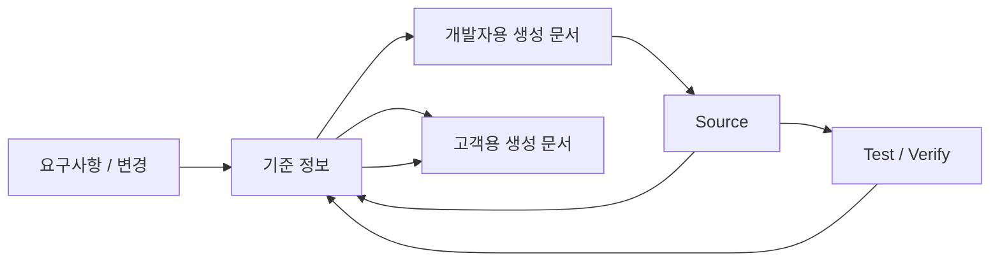

# SDLC Harness 시작하기 — v1.10.1

## 1. 3가지만 먼저 이해한다

- **기준 정보(Canonical Spec)**: 프로젝트 요구사항·업무규칙·관계의 기준
- **개발자용 생성 문서(Engineering Projection)**: 설계·개발·테스트를 위해 계속 갱신하는 문서
- **고객용 생성 문서(Customer Projection)**: 고객과 협의·제출·인수하기 위한 문서

개발자용 문서와 고객용 문서는 같은 기준 정보를 사용하지만 **문서 수, 순번, Template, 갱신 시점이 서로 독립**이다.



## 2. 일반 사용자가 주로 쓰는 명령

```bash
python sdlc/scripts/harness.py setup --name <project> --mode <AUTO|GREENFIELD|BROWNFIELD|HYBRID>
python sdlc/scripts/harness.py intake <requirements.xlsx>
python sdlc/scripts/harness.py rq-list export --format xlsx --output docs/00_관리/RQ_작업관리.xlsx
python sdlc/scripts/harness.py work --target RQ-001
python sdlc/scripts/harness.py check RQ-001
```

PM은 `docs/00_관리/RQ_작업관리.xlsx` 또는 CSV를 Export하여 담당자·일정·WBS·메모 등 **프로젝트가 원하는 PM 컬럼을 자유롭게 추가/삭제**한 뒤 다시 Import할 수 있다. PM 컬럼은 요구사항/업무규칙을 자동 변경하지 않는다.

Agent에게 자연어로 다음처럼 요청해도 된다.

```text
PM용 RQ 관리 엑셀 만들어줘.
RQ 작업목록 최신 상태로 보여줘.
수정한 RQ_작업관리.xlsx를 반영해줘.
```

Cursor에서는 `/rq-list` Skill을 사용할 수 있고, 다른 Agent는 `sdlc/agent/skills/rq-list/SKILL.md`의 같은 규칙을 따른다. 상세 운영법은 `12_RQ_작업목록_운영가이드.md`를 본다.

RQ 분석 전에 참고할 규정·회의록·업무문서를 미리 연결하려면 `rq-ref`와 `13_RQ_참고문서_레지스트리_가이드.md`를 사용한다. 참고 연결 자체는 업무 사실 확정이 아니며 실제 `/work`에서 조사된 내용만 근거로 사용한다.

설계/근거/Program Mapping을 보완할 때는 `/work` 흐름을 사용한다. Requirement, Business Rule, Scope, TO-BE Behavior가 바뀌면 `/change` 흐름을 사용한다.

L1/L2 Fast Path에서도 Source를 수정하기 전 최소 분석은 생략하지 않는다. Agent는 **요구 의도 확인 → 현재 Source 확인 → 영향 범위 확인** 순서로 검토한 뒤 Source 변경으로 진행한다.

일반 사용자는 내부 Stage 전체 목록, Canonical JSON Schema, Runtime Python 호출 관계를 배울 필요가 없다.

## 3. 신규 Project Config 기본값

`.sdlc/project.yaml`이 사람이 관리하는 프로젝트 설정의 기준이다.

```yaml
documents:
  engineering:
    profile: ENGINEERING_SDD_COMPACT
    manual_edit_policy: TYPO_ONLY
    freshness: CANONICAL_REVISION

  customer:
    profile: CUSTOMER_STANDARD_3
    scope: RQ
    freshness: CANONICAL_AND_AS_BUILT
    final_review:
      human_editable: true

  pm:
    profile: PM_STANDARD

  machine:
    visibility: HIDDEN
```

신규 프로젝트에서는 `documents.engineering.profile`을 사용한다. `STANDARD_3`, `STANDARD_5`, `STAGE_ORIENTED_FULL`은 기존 Formal 문서 체계를 유지해야 할 때만 사용하는 호환 Profile이며 신규 기본값이 아니다.

설정 순서와 Change Level/Profile 선택은 `02_PROJECT_설정가이드.md`, **모든 Config Key의 역할·허용값·기본값·주의사항은 `02A_PROJECT_CONFIG_옵션_상세가이드.md`**를 본다.

## 4. Engineering 기본 문서

`ENGINEERING_SDD_COMPACT`의 기본 구조는 다음과 같다.

```text
docs/10_engineering/<TARGET>/
├─ 00_work-map.md
├─ specs/<TARGET>.md
└─ programs/<TARGET>.md   # 필요할 때만
```

- `00_work-map.md`: 요구사항 → 기능/작업 → 프로그램/Source → 인수·테스트 연결판
- `specs/...`: 기능/업무 단위 Living SDD
- `programs/...`: 실제 Source 구현 차이를 별도로 정리해야 할 때 생성

기본 개발자용 생성 문서는 Agent가 관리한다. 오탈자 외 직접 수정은 기준 정보를 자동 변경하지 않으며, 의미 변경은 `/change` 또는 `/work`로 다시 처리해야 한다.

## 5. Customer 기본 문서와 미리보기

기본 `CUSTOMER_STANDARD_3`:

- A01 요구·업무·기능 합의서
- A02 영향·개발범위 공유서
- A03 테스트·인수·운영 결과서

현재까지 확보된 내용으로 고객문서를 미리 만들어 볼 수 있다.

```bash
python sdlc/scripts/harness.py customer-view --target RQ-001 --type solution_agreement
python sdlc/scripts/harness.py customer-view --target RQ-001 --type delivery_scope
python sdlc/scripts/harness.py customer-view --target RQ-001 --type acceptance_handover
```

기본 출력 위치:

```text
docs/20_고객/RQ-001/
├─ A01_요구_업무_기능_합의서.md
├─ A02_영향_개발범위_공유서.md
└─ A03_테스트_인수_운영_결과서.md
```

Intake 직후에는 A01부터 미리 보는 것이 자연스럽다. A02는 영향/개발범위가 확인된 뒤, A03는 테스트·검증 근거가 생긴 뒤 생성할수록 내용이 충실하다. 없는 사실을 고객문서 생성 과정에서 임의로 채우지 않는다.

상세 옵션과 Engineering 문서를 추가 입력으로 사용하는 방법은 `15_고객문서_미리보기_가이드.md`를 본다.

필요하면 `CUSTOMER_WATERFALL_FULL` 8종을 선택할 수 있고, 프로젝트 Custom Profile로 1/3/5/8/13/N종을 정의할 수 있다.

Customer Runtime은 Engineering Profile ID, Engineering 문서 수/순번, expected path를 사용하지 않는다. Customer Profile과 고객에게 보여도 되는 기준 정보, 필요 시 설계/Source/Test 근거를 사용한다.

## 6. Semantic Template과 사람용 문서는 다르다

```text
sdlc/templates/semantic/
= Agent가 각 작업에서 어떤 의미와 근거를 작성할지 정의

sdlc/templates/engineering/
= 개발자/설계자용 최종 생성 문서 Template

sdlc/templates/customer/
= 고객용 생성 문서 Template

sdlc/tailoring/standard/*.yaml
= 어떤 Template을 어떤 조합으로 사용할지 정하는 Profile
```

Semantic Template 자체를 고객 제출 문서나 개발자용 최종 문서로 해석하지 않는다.

## 7. `/work`와 `/change` 경계

### `/work`

업무 의미는 유지하면서 다음을 보완한다.

- 현재 Source 근거
- 상세 설계
- Program/Source Mapping
- 개발 작업
- 실제 구현 결과
- Test/Verification

### `/change`

업무 의미가 바뀌는 경우다.

- Requirement 변경
- Business Rule 변경
- TO-BE Behavior 변경
- Scope/정책 변경

`/change` 후 영향을 받은 생성 문서는 다시 생성하거나 재검토해야 할 수 있다.

## 8. Customer Final Review

고객용 생성 문서는 진행 중 검토 대기 → 현재 상태로 관리할 수 있다. 최종 제출 직전에는 사람이 문구/표현을 다듬을 수 있다.

최종 검토 이후 기준 정보가 바뀌면 기존 사람 수정 문구를 자동으로 덮어쓰지 않는다.

```text
최종 검토 완료 + 기준 정보 변경
→ 기존 문서 재확인 필요
→ 사람 수정 내용 보존
→ 다시 생성 / 다시 검토
```

업무 정책 자체를 바꾼 사람 수정은 `/change`로 반영한다.

## 9. Change Level / Stage / Document는 다르다

- Change Level = 실행 깊이 / 근거 / 검토 필요성
- Stage = 내부 작업 단계
- Projection Profile = 사람에게 어떤 문서를 보여줄지

따라서 `Stage = Document`, `Change Level = Document Count`로 해석하지 않는다. `PROFILE_PRIMARY_SET` Profile에서는 L1/L2라도 required 문서를 삭제하지 않고 필요한 내용만 간결하게 유지한다.

## 10. 한글 문서와 CMD/PowerShell 실행

텍스트 자료와 Build/Test/외부 Tool 출력은 OS 기본 인코딩에만 의존하지 않는다.

- MD/TXT/CSV: UTF-8 우선, CP949/EUC-KR 등 strict fallback
- UTF-16 BOM TXT 지원
- XLSX/PPTX/DOCX: OOXML bytes 기반 처리
- Build/Test/외부 Tool: stdout/stderr를 bytes로 받은 뒤 안전하게 decoding
- CMD/BAT: 명시적 CMD 경계
- PowerShell: `pwsh`/`powershell` 명시적 경계
- 깨진 문자를 `�`로 바꿔 정상 근거처럼 사용하지 않음

상세 내용은 `14_한글_인코딩_및_외부명령_가이드.md`를 본다.

## 11. Framework와 배포 Project의 경계

실제 프로젝트에는 Runtime/Profile/Template/User Guide 등 필요한 자산만 배포하고 Framework Test/Pilot/Design History는 제외한다.

Framework 관리자가 다른 Repository용 Project Scaffold를 만들 때는 **Framework Repository에서만** 다음 도구를 사용한다.

```bash
python sdlc/scripts/build_project_scaffold.py --root . --output <outside-target-directory>
```

`build_project_scaffold.py`와 `project-scaffold-contract.json`은 Framework distribution tool이므로 생성된 Project Scaffold 안에는 포함되지 않는다. 배포받은 프로젝트 참여자가 자기 프로젝트 안에서 다시 Scaffold를 생성하는 흐름이 아니다.

## 12. 다음 문서

- Input 자료 준비: `11_INPUT_자료_준비가이드.md`
- RQ 배정·목록·진척 관리: `12_RQ_작업목록_운영가이드.md`
- RQ↔참고문서 사전 연결: `13_RQ_참고문서_레지스트리_가이드.md`
- 한글 Encoding / CMD / PowerShell: `14_한글_인코딩_및_외부명령_가이드.md`
- 고객문서 미리보기: `15_고객문서_미리보기_가이드.md`
- 프로젝트 설정: `02_PROJECT_설정가이드.md`
- Config 옵션 상세 Reference: `02A_PROJECT_CONFIG_옵션_상세가이드.md`
- Profile/Customizing: `03_TAILORING_설정가이드.md`
- Semantic/Engineering/Customer Template: `04_TEMPLATE_및_산출물_가이드.md`
- 이해관계자별 사용: `05_이해관계자별_작업가이드.md`
- Brownfield Source 현행화: `07_BROWNFIELD_SSOT_현행화가이드.md`

`01_STANDARD_SCAFFOLD_사용가이드.md`와 `06_CUSTOM_SCAFFOLD_적용가이드.md`는 Framework Repository에 남아 있는 과거 경로 Compatibility Notice이며 신규 Project Scaffold에는 배포되지 않는다.
