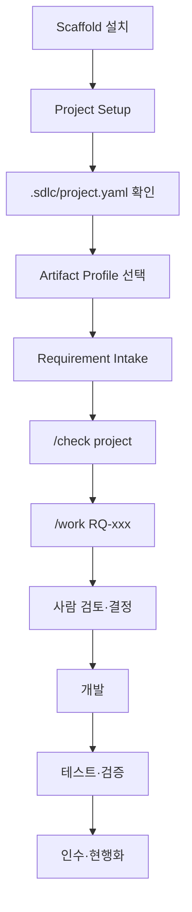

# SDLC Harness 시작하기 — v1.9 Human Control Plane

## 1. 문서 목적

이 문서는 처음 Harness를 받는 PM, BA, 설계자, 개발자, 테스트 담당자가 내부 Stage/Canonical JSON 구조를 외우지 않고 프로젝트를 시작하는 첫 진입점이다.

v1.9의 핵심은 다음 세 가지를 분리하는 것이다.

- **Stage**: Harness 내부 실행 의미. 일반 사용자가 선택할 대상이 아니다.
- **Template**: 문서의 모양과 Section을 정의한다.
- **Tailoring Profile**: Stage/Canonical/Evidence의 의미를 어떤 사람용 문서에 Projection할지 정의한다.

## 2. 언제 읽는가

- 신규 Greenfield/Brownfield/Hybrid 프로젝트에 Harness를 설치했을 때
- 기존 v1.8 프로젝트를 v1.9 방식으로 운영하려 할 때
- “3종/5종/Full 문서 중 무엇을 써야 하는가?”를 결정할 때
- `/work`를 실행했는데 어떤 문서를 보아야 할지 모르겠을 때

## 3. 선행조건

1. Repository 안에 Harness가 설치되어 있어야 한다.
2. 작업 Branch는 프로젝트 Branch 정책을 따라야 한다.
3. `.sdlc/project.yaml`을 생성할 권한이 있어야 한다.
4. Brownfield면 Source root와 최소 Build/Test 명령을 확인한다.
5. 모르는 업무정책은 임의로 채우지 말고 `unresolved`에 남긴다.

## 4. 전체 실행 흐름



사용자에게 필요한 기본 명령은 다음이다.

```bash
python sdlc/scripts/harness.py setup --name <project> --mode <GREENFIELD|BROWNFIELD|HYBRID|AUTO>
python sdlc/scripts/harness.py check --setup
python sdlc/scripts/harness.py intake <requirements.xlsx>
python sdlc/scripts/harness.py check project
python sdlc/scripts/harness.py work --target RQ-001
python sdlc/scripts/harness.py check RQ-001
```

## 5. 실제 Config 예제

가장 먼저 `.sdlc/project.yaml`에서 프로젝트 정책과 문서 Profile을 확인한다.

```yaml
schema_version: 1
project:
  name: HRIS
  mode: BROWNFIELD

delivery:
  profile: STANDARD

change:
  level_policy: AUTO

documents:
  language: ko-KR
  internal:
    profile: STANDARD_5
  customer:
    profile: CUSTOMER_STANDARD_3
  pm:
    profile: PM_STANDARD
  machine:
    visibility: HIDDEN
```

여기서 `delivery.profile: STANDARD`와 `documents.internal.profile: STANDARD_5`는 다른 설정이다.

- Delivery Profile: 내부 실행 깊이/정책
- Change Level: 개별 RQ 변경 영향 크기
- Artifact Profile: 사람이 받는 문서 구성

## 6. 생성되는 결과

정상 사용 시 사용자가 주로 보는 것은 다음이다.

- `docs/00_관리/요구사항_인입결과.md`
- `docs/00_관리/RQ_생성근거.md` — RQ가 왜 만들어졌는지 설명
- INTERNAL_IT Profile에 정의된 설계/개발 문서
- CUSTOMER Profile에 정의된 고객 공유 문서
- `/check project`, `/check RQ-xxx` Human Control View

Machine Evidence는 기본적으로 아래 Runtime 영역에 남고 Primary 산출물로 노출하지 않는다.

- `sdlc/runtime/work-runs/`
- `sdlc/runtime/change-level/`
- `sdlc/runtime/projections/`
- `.sdlc/runtime/effective/`

## 7. 역할별 Action

| 역할 | 기본적으로 보는 것 | 주로 하는 일 |
|---|---|---|
| PM | `/check project`, RQ Review | 우선순위·담당·사람 결정·인수 확인 |
| BA/분석가 | 업무정의/요구/Process 문서 | 업무 의미·정책·예외 검토 |
| 설계자 | 기능/상세설계 | Agent 초안 검토와 설계 확정 |
| 개발자 | Program/상세설계, Source Evidence | 구현·Legacy Discovery 보고 |
| 테스트 담당 | AC/TC, 테스트·인수결과 | Coverage와 실제 결과 검증 |
| 아키텍트 | L4/L5, Interface/Security/Architecture 영향 | 고위험 설계 의사결정 |
| 고객 업무담당자 | CUSTOMER Projection | 업무정책·범위·인수 판단 |
| Harness 관리자 | Machine Evidence, `--debug-stage` | Profile/Contract/Runtime 유지 |

## 8. 자주 틀리는 부분

- `FAST/STANDARD/FULL`을 문서 개수로 이해하지 않는다.
- L1이라고 문서를 1개만 만들어야 하는 것이 아니다.
- Custom Template만 넣고 Tailoring이 끝났다고 보지 않는다.
- `/work`에서 일반 사용자가 `--stage`나 `--artifact`를 습관적으로 직접 지정하지 않는다.
- Source에서 동작한다고 업무정책을 자동 확정하지 않는다.
- Customer 문서를 독립 SSOT로 사용하지 않는다.
- `STALE_VIEW`는 검토/승인 기준 문서로 사용하지 않는다.

## 9. Validation 방법

프로젝트 설정 확인:

```bash
python sdlc/scripts/harness.py check --setup
```

Tailoring Profile 직접 확인이 필요할 때만 Harness 관리자가 실행한다.

```bash
python sdlc/scripts/tailoring_runtime.py validate-profile --profile STANDARD_5
```

프로젝트 전체 Human View:

```bash
python sdlc/scripts/harness.py check project
```

Stage까지 필요한 Harness 관리자 디버그:

```bash
python sdlc/scripts/tailored_check.py project --debug-stage
```

Harness 자체의 External Agent/Human/Brownfield **실제 관찰 Pilot** 상태는 CI 결과와 분리해서 확인한다.

```bash
python sdlc/scripts/empirical_pilot_runtime.py status
```

여기서 `NOT_RUN`은 실패가 아니라 아직 실제 관찰 Evidence가 없다는 뜻이다. CI/Fixture PASS를 이 값 대신 사용하지 않는다.

## 10. 다음에 읽을 문서

- 표준 프로젝트 시작: `01_STANDARD_SCAFFOLD_사용가이드.md`
- 프로젝트 기술/운영 설정: `프로젝트_설정_가이드.md`
- 3종/5종/Full 선택: `03_TAILORING_설정가이드.md`
- Template/Ownership: `04_TEMPLATE_및_산출물_가이드.md`
- 역할별 업무: `05_이해관계자별_작업가이드.md`
- 고객사 Custom: `06_CUSTOM_SCAFFOLD_적용가이드.md`
- Brownfield SSOT/Drift: `07_BROWNFIELD_SSOT_현행화가이드.md`
- Harness 실제 실증 Pilot: `sdlc/validation/pilots/README.md`
