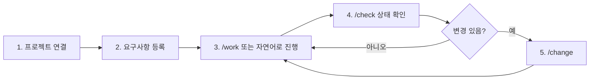
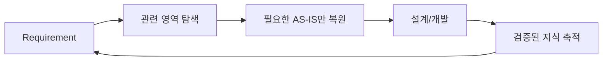
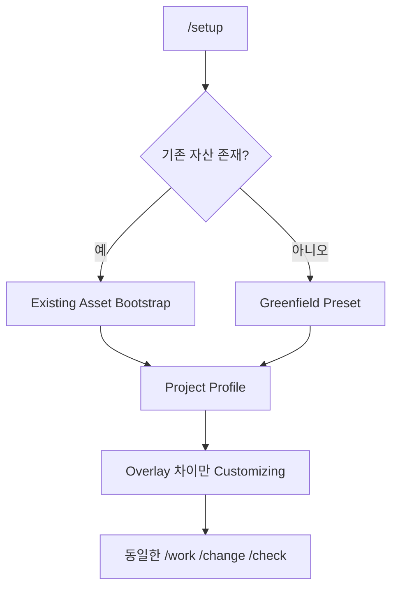
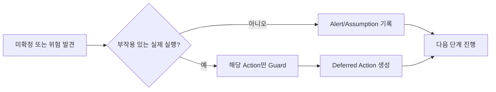
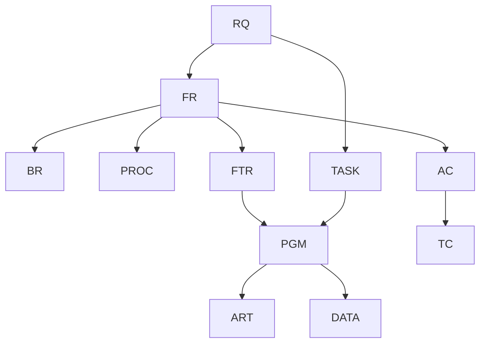
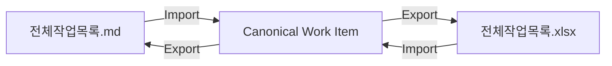
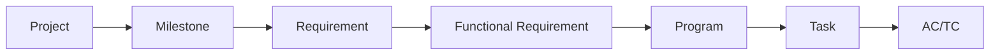
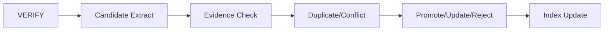
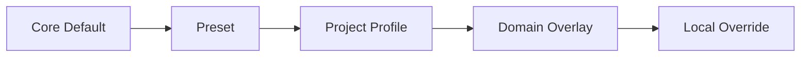

# AI-SDLC Harness
## Brownfield + Greenfield Current Full Design Baseline v1.5.1

> **문서 성격**
> v1.4의 Canonical Model, Brownfield JIT, Human Truth/System Evidence, `/work /change /check`, Static Analysis First, Context Pack, Knowledge Promotion, Git Semantic Merge, Telemetry, Capability/Decision/Contract/Continuity Governance를 상속한다.
> v1.5의 비숙련 사용자 UX, Brownfield/Greenfield/Hybrid 공통 적용, Non-blocking Process, 직관적 파일명, 전체작업목록 MD↔Excel, 한글 컬럼, PM Drill-down, Overlay Customizing, Quick Start/시각화 가이드를 유지한다.
> v1.5.1은 **GitHub Mermaid 렌더링 호환성 규칙과 자동 검증 계약을 추가한 Hotfix Baseline**이다.

# 0. Quick Start

일반 사용자는 Agent 내부 구조를 먼저 학습하지 않아도 된다.



1. Harness 관리자가 `/setup`으로 프로젝트를 연결한다.
2. 기존 프로젝트면 Source/README/가이드/Build/Test/DB/Interface를 탐색해 Profile 후보를 만든다.
3. 신규 프로젝트면 Preset을 선택한다.
4. 사용자는 `요구사항명 / 현재 문제 또는 요청내용 / 원하는 결과`만 등록한다.
5. `/work RQ-xxxx` 또는 자연어로 계속 진행한다.
6. `/check`에서 현재 단계, 남은 작업, 경고, 담당자/일정(있는 경우), 다음 추천을 본다.
7. 요구 변경은 `/change`로 남긴다.
8. 미확정 정보나 미완료 산출물이 있어도 다음 단계로 넘어갈 수 있다. 위험한 실제 실행만 Guard한다.

## 0.1 역할별 시작점

| 역할 | 먼저 볼 것 | 주 행동 |
|---|---|---|
| PM | `docs/00_관리/전체작업목록.md/.xlsx` | RQ→FR→PGM→TASK→AC/TC Drill-down, 담당/일정 Optional 지정 |
| 분석/설계 | 요구분석/프로세스/영향/기능설계 | `/work RQ-xxxx`, Agent 초안 Review |
| 개발 | PGM 설계 + TASK + 관련 Source/Standard | `/work TASK-xxxx` |
| 테스트 | AC/TC/Test Result/Verification | `/work`, `/check` |
| 운영 | 질문, 업무규칙, Operations Knowledge | 확인/피드백 |
| Harness 관리자 | `sdlc/config`, `sdlc/custom` | `/setup`, Profile/Preset/Overlay 관리 |

# 1. 목적과 적용 범위

Harness는 Brownfield, Greenfield, Hybrid 프로젝트에서 동일한 사용자 Contract로 SDLC를 수행한다.

핵심 목적:

1. 요구사항과 업무 의미를 구조화한다.
2. Brownfield는 기존 자산을 Just-in-Time으로 재사용해 역설계와 Customizing을 줄인다.
3. Greenfield는 Preset/Template/Standard로 빠르게 시작한다.
4. 요구사항 → 기능 → 프로그램 → Source → Test를 추적 가능하게 연결한다.
5. Agent에는 현재 작업에 필요한 Context만 제공한다.
6. 정보 부족을 Alert/Assumption으로 표시하되 사람의 Workflow 자체는 강제로 정지시키지 않는다.
7. 검증된 업무·기술 지식을 재사용 Knowledge로 승격한다.
8. Git 파일 Merge와 Canonical Semantic Merge를 분리한다.
9. Verified Task/Result를 기준으로 생산성과 비용을 측정한다.
10. Harness 자체 Rule/Skill/Template/Config/Schema도 Version/Capability로 관리한다.

# 2. 핵심 방법론

## 2.1 DDD + SDD

이 문서의 DDD는 Document-Driven Development다.

```text
Requirement
→ Analysis / Design
→ CHANGE
→ IMPACT
→ SPEC
→ PLAN
→ TASKS
→ IMPLEMENT
→ VERIFY
→ RESULT
→ Docs / Knowledge Sync
```

## 2.2 Brownfield JIT Documentation



기존 Source에 구현되어 있다는 이유만으로 Business Rule로 확정하지 않는다.

- `GIVEN`: 사람이 제공
- `OBSERVED`: Source/DB/Log에서 관찰
- `INFERRED`: Agent 추론
- `CONFIRMED`: 사람 또는 공식 문서로 확정
- `OPEN`: 미확정

## 2.3 Brownfield / Greenfield / Hybrid

Project Mode:

- `AUTO`
- `BROWNFIELD`
- `GREENFIELD`
- `HYBRID`



`/setup` 이후 Stage, Skill, Artifact, Canonical Contract는 Project Mode와 무관하게 동일하다.

# 3. Process Never Blocked

사용자가 다음 단계로 진행하려고 하면 Workflow/Stage 전체를 강제로 중지시키지 않는다.



처리 원칙:

- 미확정 정보 → `Alert + Assumption + OPEN`
- 미완료 산출물 → `PARTIAL / WARNING`
- 담당자/일정 미지정 → 빈 값 허용
- 선행 Task 미완료 → 후속 Task를 `PLANNED / AT_RISK`로 생성 가능
- 위험한 실제 동작 → 해당 동작만 `EXECUTION_GUARDED`

Execution Guard 대상 예:

- 운영 DB 위험 DML
- 미해결 Git Conflict 상태의 Source overwrite
- Canonical Schema 파손 write
- Published Display ID 중복 write
- 보안/안전 MUST 표준 위반 실행
- Release 불가능 상태의 배포 실행

Guard 중에도 분석, 설계, 테스트 설계, 다른 Task, 일정 재계획은 진행 가능하다.

# 4. 사용자 Lifecycle과 Skill

사용자 Stage:

```text
요구사항 → 분석/설계 → 개발 → 테스트 → 완료
```

내부 Stage:

```text
INTAKE → DECOMPOSE → CLARIFY → PROCESS → DISCOVERY → IMPACT
→ DESIGN → PROGRAM → DEVELOPMENT → TEST → VERIFY → KNOWLEDGE PROMOTION
```

사용자 Skill:

- `/work`: 현재 RQ/PGM/TASK의 다음 실행 가능 작업 진행
- `/change`: 자연어 변경을 CR로 구조화하고 영향 산출물 STALE 처리
- `/check`: 현재 Stage, 완료/미완료, Alert/Guard, 일정 Risk, 다음 추천 표시
- `/setup`: 관리자용 Project Bootstrap/Profile/Preset/Overlay/Validation

# 5. Canonical Model

MD/Excel은 View이고 Canonical Model이 Entity/Relation 원장이다.

Knowledge Entity:

- RQ Requirement
- FR Functional Requirement
- BR Business Rule
- PROC Process
- FTR Feature
- PGM Logical Program
- ART Physical Artifact
- DATA Table/Column
- CODE Code Master
- AC Acceptance Criteria
- TC Test Case
- INT Interview
- ASM Assumption
- ALT Alert
- CR Change Request

Execution Entity:

- MS Milestone
- WP Work Package
- TASK Task
- RES Resource/Person
- ASN Assignment



상태:

- Progress: `NOT_STARTED / WORKING / COMPLETE`
- Quality: `OK / WARNING / CRITICAL`
- Validity: `CURRENT / STALE / INVALID`
- Task: `NOT_STARTED / READY / IN_PROGRESS / BLOCKED / DONE / DEFERRED`

# 6. Target Resolver와 Scope

Target 해상도:

```text
RQ → FTR → PGM → TASK → ART / SYMBOL
```

Resolution 우선순위:

1. Explicit TASK ID
2. Explicit PGM ID
3. Explicit Source/Symbol
4. Explicit RQ + 자연어 Target
5. Active Context
6. Canonical Direct Relation
7. 현재 사용자 Assignment
8. Exact Name / Domain
9. Semantic Search

모호한 Target이면 Source write만 `DEFERRED_TARGET_DECISION`으로 보류한다. 분석, 후보 비교, 다른 Task는 계속한다.

# 7. Existing Asset Bootstrap

Brownfield는 다음 순서로 기존 자산을 재사용한다.

1. README/CONTRIBUTING/Architecture/사내 가이드
2. 실제 Source 구조와 Build 설정
3. 기존 Test/CI 규칙
4. DB/Mapper/Procedure/Interface 정의
5. 반복 코드 패턴
6. 부족한 부분만 Overlay

상태:

`DISCOVERED → ADOPTED / OVERRIDDEN / IGNORED`

Greenfield는 동일한 Contract를 Preset에서 시작한다.

# 8. 산출물과 파일명

파일은 폴더 밖에서 단독으로 보더라도 의미가 보여야 한다.

```text
<대표ID>_<짧은업무명>_<산출물종류>.<확장자>
```

예:

- `RQ-0042_휴가취소근태반영_요구사항.md`
- `RQ-0042_휴가취소근태반영_요구분석.md`
- `RQ-0042_휴가취소근태반영_프로세스분석.md`
- `RQ-0042_휴가취소근태반영_영향분석.md`
- `RQ-0042_휴가취소근태반영_기능설계.md`
- `PGM-ATT-0016_근태재계산_프로그램설계.md`
- `RQ-0042_휴가취소근태반영_구현결과.md`
- `RQ-0042_휴가취소근태반영_검증결과.md`

`requirement.md`, `impact-analysis.md`, `PGM-ATT-0016.md` 같은 일반명은 SUPERSEDED한다.

# 9. 전체 작업목록 MD↔Excel

필수 View:

```text
docs/00_관리/전체작업목록.md
docs/00_관리/전체작업목록.xlsx
```



양방향 Sync 원칙:

1. `작업ID`는 stable ID다.
2. `변경버전(revision)`과 `최근변경일시(updated_at)`를 Sync 기준으로 사용한다.
3. MD 또는 Excel 어느 쪽에서 수정해도 Canonical Import 후 다른 View를 재생성한다.
4. 양쪽이 동시에 다르게 수정되면 `SYNC_CONFLICT`를 생성하고 값을 조용히 덮어쓰지 않는다.
5. Sync Conflict가 있어도 다른 Work Item/Stage는 진행한다.
6. 사용자 Header는 한글 기본, 내부 key와 분리한다.
7. 컬럼명/순서는 `sdlc/config/worklist-columns.yaml`에서 관리한다.

대표 한글 컬럼:

`작업ID, 상위작업ID, 요구사항ID, 작업구분, 작업명, 단계, 상태, 품질상태, 유효상태, 담당자, 계획시작일, 계획종료일, 예상공수, 실제시작일, 실제종료일, 실제공수, 선행작업ID, 관련프로그램ID, 완료기준ID, 경고·확인사항, 최근변경일시, 변경버전, 비고`

# 10. PM Breakdown과 Optional Tracking



PM View:

- 요구사항별: FR, 설계 Coverage, Program Coverage, Task, AC/TC Coverage, Alert
- 프로그램별: 관련 RQ/FR, 변경유형, 개발/Test Task
- 작업별: 상태, 담당자, 일정, 선행작업, Risk
- 담당자별: 배정된 경우에만 작업량/일정

`담당자`, `계획시작일`, `계획종료일`, `예상공수`는 Optional이다.

# 11. Stage별 산출물 Contract

| 단계 | 핵심 내용 | 대표 산출물 |
|---|---|---|
| INTAKE | 요구사항명/문제/원하는 결과 | 요구사항 |
| DECOMPOSE/CLARIFY | FR, BR Candidate, AC, 질문/가정 | 요구분석 |
| PROCESS | AS-IS/TO-BE 업무흐름 | 프로세스분석 |
| DISCOVERY/IMPACT | Business/Functional/Technical Impact | 영향분석 |
| DESIGN | 목표 시스템 동작, Validation/State/Data/Tx/NFR | 기능설계 |
| PROGRAM | Logical Program, Physical Artifact, Spec | 프로그램목록/PGM 설계 |
| DEVELOPMENT | Context Pack 기반 Source 변경 | Source/구현결과 |
| TEST | AC→TC, 시나리오/결과 | 테스트 결과 |
| VERIFY | RQ/AC/PGM/Test 최종 확인 | 검증결과 |
| PROMOTION | 재사용 가능한 검증 지식 | BR/PROC/PGM/DATA Knowledge |

Stage 최소 Output이 있으면 다음 단계로 진행 가능하며 Quality/Validity는 별도로 관리한다.

# 12. Static Analysis / Impact

Brownfield는 전체 Repository를 LLM으로 먼저 읽지 않는다.

우선 생성/활용:

- Symbol/Call Graph
- DB/Mapper/Procedure Map
- Code Registry
- Interface Map

대표 Technical Flow:

```text
JSP → Controller → Service → Mapper → Procedure → Table
```

Impact는 Business / Functional / Technical을 구분하며 Candidate는 Evidence, Confidence, Status를 가진다.

# 13. Program / Development / Test

Program 변경유형:

- NEW
- MODIFY
- DELETE
- VERIFY_ONLY

Spec Level:

- L0 Reference
- L1 Simple Change
- L2 Logic/Transaction/Interface Change

Development Context:

```text
TASK → Canonical Context → Knowledge → Standards → Trace
→ Context Pack → Source 수정 → Scope Validation → Test → Canonical Update
```

Test는 `AC → TC → Test Result → Verification Result`를 연결한다. 실패/미수행을 숨기지 않는다.

# 14. Context Pack과 Token Economy

Priority:

- P0 Current RQ/TASK
- P1 Related BR/AC
- P2 Program Spec
- P3 Relevant Trace
- P4 Source Snippet
- P5 Historical Context

Retrieval:

```text
Canonical Model → Program Summary → Trace Graph → Relevant Symbol → Source Snippet → 필요 시 Full File
```

# 15. Knowledge Promotion

재사용 Knowledge 후보:

- Confirmed Business Rule/Process
- Program Responsibility/Summary
- Data/Code/Interface Meaning
- Architecture Decision
- Operational Constraint
- Known Edge Case
- Verified Test Pattern



상반된 Knowledge는 Conflict Entity로 남기고 조용히 overwrite하지 않는다.

# 16. Rule / Skill / Template / Standards

Rule은 항상 적용되는 최소 원칙만 둔다.

- Requirement와 Source Evidence 구분
- Production 변경은 RQ/TASK와 연결
- 정보 부족 시 Alert + Assumption
- Source만으로 Business Rule 확정 금지
- 기존 Architecture 우선
- 관련 없는 Refactoring 금지
- 위험 Production DB 작업 금지
- 변경 후 AC/Test 관계 확인

Development Standards는 관련 Section만 Context에 주입하며 Legacy와 충돌하면 Standard Deviation을 기록한다.

# 17. Overlay Customizing



코드 수정 없이 바꿀 수 있어야 하는 것:

- Stage 사용/숨김/별칭
- 산출물 생성 여부/이름
- 한글 컬럼명/프로젝트 용어
- Template Section
- Project/Domain Standard
- Alert Rule
- 파일명 규칙
- PM Tracking 컬럼
- Brownfield 탐색 위치
- Greenfield Preset

# 18. 사용자 Guide Contract

필수 문서:

- `sdlc/README.md`
- `sdlc/guides/01_SDLC_전체가이드.md`
- `sdlc/guides/02_SKILL_사용가이드.md`
- `sdlc/guides/03_TEMPLATE_산출물가이드.md`
- `sdlc/guides/04_HARNESS_커스터마이징가이드.md`

각 가이드의 상단에는 Quick Start가 있어야 하고 주요 단락에는 workflow 시각화를 둔다.

# 19. Mermaid GitHub 호환 Contract

GitHub는 Markdown의 `mermaid` fenced block을 렌더링한다. Harness 산출물은 GitHub 호환성을 위해 다음 규칙을 따른다.

## 19.1 라벨 규칙

특수문자가 없더라도 일반 flowchart node label은 quoted label을 기본으로 한다.

```text
A["일반 라벨"]
Q{"확인이 필요한가?"}
```

금지 예:

```text
S[/setup]
B[/work 또는 계속 진행]
A[AC/TC]
```

권장 예:

```text
S["/setup"]
B["/work 또는 계속 진행"]
A["AC/TC"]
```

특히 `/`, `?`, 괄호, 콜론, 파이프 등 parser와 충돌할 수 있는 문자가 포함된 label은 반드시 quote한다.

## 19.2 자동 정규화

`sdlc/scripts/normalize_mermaid.py`를 제공한다.

```text
python sdlc/scripts/normalize_mermaid.py --check .
python sdlc/scripts/normalize_mermaid.py --write .
```

- `--check`: 수정이 필요한 Markdown이 있으면 실패
- `--write`: GitHub-safe quoted label로 정규화
- 명시적인 Mermaid shape(`A[/입력/]`, `A[(DB)]`)는 보존

# 20. Git / Merge

- Git: Source/Config/Document 파일 이력
- Canonical: RQ/PGM/TASK/DATA/Test 의미/관계

따라서 `Git File Merge + Semantic Canonical Merge`를 모두 본다.

기본 Branch는 `1 Task ≈ 1 Short-lived Branch`다.

Generated MD/Excel은 Binary 직접 Merge보다 Canonical Merge 후 Regenerate한다.

# 21. Telemetry / Metrics

핵심 Correlation:

- project_id
- user_id
- conversation_id
- generation_id
- rq_id
- task_id
- program_id
- stage
- skill
- branch/commit

핵심 Metric:

- Task/Requirement Cycle Time
- Verified Task
- First Pass Success/Rework
- Observable Token / Verified Task
- Read-to-Change Ratio
- Summary Reuse
- AI Cost / Verified Task
- Knowledge Reuse
- Target Auto Resolution/Correction
- Git/Semantic Conflict
- Merge-to-Verify Time

# 22. Config / Folder Contract

```text
PROJECT_ROOT/
├─ docs/
│  ├─ 00_관리/
│  ├─ 01_requirements/
│  ├─ 02_analysis/
│  ├─ 03_impact/
│  ├─ 04_design/
│  ├─ 05_program/
│  ├─ 06_data/
│  ├─ 07_test/
│  └─ 08_management/
├─ sdlc/
│  ├─ README.md
│  ├─ guides/
│  ├─ config/
│  ├─ custom/
│  ├─ design/
│  ├─ templates/
│  ├─ schema/
│  ├─ standards/
│  ├─ canonical/
│  ├─ knowledge/
│  ├─ trace/
│  ├─ runtime/
│  ├─ hooks/
│  ├─ scripts/
│  └─ metrics/
└─ .cursor/
   ├─ rules/
   ├─ skills/
   ├─ agents/
   └─ hooks.json
```

# 23. Design Governance

Harness 자체도 SDD 방식으로 관리한다.

```text
Previous Baseline
→ Capability / Decision / Contract
→ Design Change
→ Continuity Validation
→ Current Full Design
→ New Baseline
```

기존 ACTIVE Capability의 Silent Removal은 금지한다.

상태 변경은 `UNCHANGED / ENHANCED / SUPERSEDED / DEPRECATED` 중 하나로 기록한다.

# 24. Phase 0.5 구현 Contract

다음 구현 항목을 PoC로 진행한다.

1. `전체작업목록.md → Canonical → 전체작업목록.xlsx`
2. `전체작업목록.xlsx → Canonical → 전체작업목록.md`
3. 한글 Header ↔ 내부 key Mapping
4. stable `작업ID`, `revision`, `updated_at`
5. Optional PM 필드 빈 값 round-trip
6. 동시 수정 `SYNC_CONFLICT`
7. RQ→FR→PGM→TASK 계층 보존
8. Mermaid `--check`를 문서 품질검사에 포함

Acceptance Criteria:

- MD→XLSX→MD 의미 손실 없음
- XLSX→MD→XLSX 한글 Header/순서 유지
- 담당자/일정/공수 빈 값 변환 성공
- 충돌 시 자동 overwrite 금지
- `작업ID`/계층/관련 ID 보존
- 현재 관리 Markdown의 Mermaid 정규화 검사 통과

# 25. PoC 이후 단계

- Phase 1: Canonical Core
- Phase 2: `/work` + Target Resolver
- Phase 3: Static Analysis + Trace
- Phase 4: Context Pack + Token Economy
- Phase 5: Program Spec + Development
- Phase 6: Test / Verify
- Phase 7: Knowledge Promotion
- Phase 8: `/change` + STALE Propagation
- Phase 9: Git Semantic Merge
- Phase 10: Metrics / PM View

# 26. v1.4 → v1.5.1 Continuity

| 기존 개념 | 상태 | v1.5.1 처리 |
|---|---|---|
| Canonical Model | UNCHANGED | 관계 원장 유지 |
| Human Truth/System Evidence | UNCHANGED | 출처 구분 유지 |
| Brownfield JIT | ENHANCED | Greenfield/Hybrid 공통 Contract |
| Approval-free/Alert-driven | ENHANCED | Process Never Blocked 명시 |
| Hard Block | ENHANCED | Workflow Block이 아닌 Execution Guard |
| `/work /change /check` | UNCHANGED | `/setup` 관리자 Bootstrap 보강 |
| Static Analysis First | UNCHANGED | Existing Asset Bootstrap과 연결 |
| Generic artifact filename | SUPERSEDED | ID+업무명+산출물종류 |
| PM Task/Resource/Schedule | ENHANCED | Drill-down + Optional Tracking |
| Excel Generated Artifact | ENHANCED | 전체작업목록 MD↔Excel 양방향 View |
| Config/Templates/Standards | ENHANCED | Preset/Profile/Domain Overlay/Local Override |
| User Guide | ENHANCED | Quick Start + workflow Contract |
| Mermaid 자유 라벨 | ENHANCED | GitHub-safe quoted label + normalizer |
| Knowledge/Git/Metrics/Governance | UNCHANGED | 기존 Capability 유지 |

# Appendix A. 사용자 요구 9개 Traceability

| # | 요구사항 | 반영 |
|---|---|---|
| 1 | Agent 비숙련자도 구조를 따라감 | Quick Start, 역할별 진입점, 사용자 Guide |
| 2 | 기존/신규 공통 + 기존 자산 재사용 | Project Mode, Existing Asset Bootstrap, Preset |
| 3 | 단계 진행 강제 Block 금지 | Process Never Blocked + Execution Guard |
| 4 | 파일명 직관적 | ID+짧은업무명+산출물종류 |
| 5 | 전체 작업목록 + Excel 양방향 | Canonical Work Item MD/XLSX View |
| 6 | MD/Excel 한글 컬럼 | worklist-columns.yaml Mapping |
| 7 | PM 세부 Breakdown + 담당/일정 Optional | Project→MS→RQ→FR→PGM→TASK→AC/TC |
| 8 | 쉬운 Harness Customizing | Core→Preset→Profile→Domain Overlay→Local Override |
| 9 | SDLC/SKILL/Template/단계 상세 Guide | Quick Start + workflow + Mermaid 안전 규칙 |

# Appendix B. Baseline 선언

- Baseline Version: v1.5.1
- Previous Baseline: v1.5
- Change Type: Hotfix + Documentation Quality Contract
- Silent Removal: 금지
- 일반 업무 Workflow: Non-blocking
- 위험 실제 실행: Execution Guard
- Mermaid Rendering: quoted label 기본 + normalizer 검사
- Current Full Design: 본 문서
