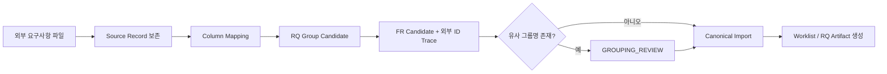
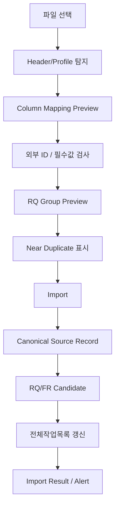

# AI-SDLC Harness v1.5.2-rc.1 Candidate Delta
## Bulk Requirement Intake / External ID / RQ-FR Grouping

> 이 문서는 `validation/v1.5.1-requirements-pilot-v0.1` 브랜치 전용 Candidate다. `main` Baseline을 변경하지 않는다.

## Quick Start

대량 요구사항 파일은 원본 행을 먼저 보존하고, 바로 내부 RQ로 확정하지 않는다.



## 1. 배경

실제 `요구사항목록.xlsx` 142건 검증에서 다음 구조가 확인되었다.

- 외부 Requirement ID가 이미 존재한다.
- `요구사항명`은 상위 기능 성격이다.
- 각 행의 `요구사항`은 저장/조회/등록/수정/삭제/송신/수신/집계 등 세부 동작이다.
- 일정/담당자는 비어 있을 수 있다.
- 동일/유사 상위 제목이 여러 행에서 반복된다.

v1.5.1의 RQ→FR 모델은 적합하지만 Import Contract가 부족하다.

## 2. Source Requirement Record

대량 Import 시 원본 한 행을 다음 Source Record로 보존한다.

```yaml
source_record_id: SRCREQ-000001
source_file: 요구사항목록.xlsx
source_sheet: Sheet1
source_row: 3
source_hash: sha256:...
external_requirement_id: REQ_TM_FL001
level1: 근태관리
level2: 근무계획 수립(탄력근로제)
source_requirement_name: 탄력근로제 개선 최초근무계획 자동 설정하는 기능
source_requirement_text: 탄력근로제 근무계획 저장
planned_start: null
planned_end: null
assignee: null
raw_text_preserved: true
```

Source Record는 Canonical Business Truth 자체가 아니라 **입력 Provenance**다.

## 3. External ID 정책

- 외부 ID(`REQ_TM_*`)는 삭제/재채번하지 않는다.
- 내부 RQ/FR Display ID와 외부 ID는 별도 필드로 유지한다.
- 외부 ID는 기본적으로 해당 세부 FR에 연결한다.
- 한 외부 ID가 여러 FR로 분리될 경우 relation을 명시하고 원본 ID는 모두 보존한다.
- 중복 외부 ID가 발견되면 overwrite하지 않고 `DUPLICATE_EXTERNAL_ID` Alert를 만든다.

## 4. RQ/FR Grouping

기본 Candidate Group Key:

```text
Level1 + Level2 + source_requirement_name exact text
```

Candidate 변환:

```text
Group → RQ Candidate
Source Row → FR Candidate
external_requirement_id → FR.external_requirement_id
```

### 4.1 Exact 우선

문자열이 정확히 같은 경우에만 자동 그룹 Candidate를 생성한다.

### 4.2 Semantic Auto Merge 금지

예:

- `10분단위 근무계획 개선 선택적근무관리 반영을 구현`
- `10분단위 근무계획 개선 선택적근무관리 반영하는 기능`

의미가 비슷하더라도 자동 병합하지 않는다.

```text
GROUPING_REVIEW
→ 추천 병합안 표시
→ 사용자가 병합하지 않아도 각각 진행 가능
```

## 5. Raw / Normalized Text

원문을 조용히 수정하지 않는다.

```yaml
raw_text: "근무스케쥴 조회"
normalized_text: "근무스케줄 조회"
normalization_status: SUGGESTED
```

- `raw_text`: 원본 증거
- `normalized_text`: 검색/표시/추천용 Derived 값
- Agent가 자동으로 Business Meaning을 변경하지 않는다.

NBSP, 괄호, 영문 대소문자, `Report`, `calendar` 같은 표기도 같은 정책을 적용한다.

## 6. Missing Context 처리

대량 요구사항에 `현재 문제`, 상세 `원하는 결과`, Business Rule이 없을 수 있다.

```text
값 없음
→ 임의 확정 금지
→ OPEN + Alert
→ 필요한 Clarify Question 생성
→ 다음 단계 진행 가능
```

세부 요구 동작을 원하는 결과로 해석할 경우 `INFERRED`로 기록한다.

## 7. Bulk Intake Workflow



Preview에서 경고가 있어도 안전한 행은 계속 Import한다.

## 8. Import Result

필수 집계:

- Source Rows
- Imported Rows
- Skipped Rows
- Duplicate External IDs
- RQ Candidate Count
- FR Candidate Count
- GROUPING_REVIEW Count
- Missing Context Count
- Invalid Row Count

Invalid Row가 있어도 전체 Import를 강제 중단하지 않는다.

## 9. Worklist 연계

초기 Import 시 Worklist에는 최소 다음을 생성한다.

```text
RQ Candidate
└ FR Candidate
```

DISCOVERY 이후 PGM/TASK/AC/TC가 생성되면 같은 전체작업목록에 확장한다.

외부 Requirement ID는 Worklist 사용자 View에서도 조회 가능해야 한다. 이를 위해 `외부요구사항ID` 컬럼을 Optional 표준 컬럼 후보로 추가한다.

## 10. Brownfield Source 미연결 상태

Source Repository가 없을 경우 허용 상태:

- INTAKE: 진행
- DECOMPOSE: 진행
- CLARIFY: 진행
- PROCESS: Candidate 진행
- DISCOVERY: `WAITING_FOR_SOURCE_PROFILE`
- IMPACT: `CANDIDATE_ONLY`
- PROGRAM: `DEFERRED_TARGET_DECISION`
- DEVELOPMENT: Source Write 불가
- TEST: Candidate
- VERIFY: Evidence 대기

Workflow 전체는 Block하지 않는다.

## 11. v1.5.1 대비 상태

| Capability | 상태 | 변경 |
|---|---|---|
| Requirement Intake | ENHANCED | Bulk file import 추가 |
| External Traceability | ENHANCED | 외부 ID/Source Record 추가 |
| RQ→FR | ENHANCED | Grouping Candidate 정책 추가 |
| Human Truth/Evidence | UNCHANGED | 원본/추론 분리 유지 |
| Non-blocking Workflow | ENHANCED | Partial Import/Deferred 단계 명시 |
| PM Optional Tracking | UNCHANGED | 빈 일정/담당자 허용 |
| Brownfield JIT | UNCHANGED | Source 연결 후 Discovery |
| Worklist MD↔XLSX | ENHANCED | 외부 Requirement ID View 연계 후보 |

## 12. Candidate Acceptance Criteria

1. 142개 외부 행의 ID가 손실 없이 보존된다.
2. 정확히 동일한 상위 제목은 RQ Candidate로 그룹핑할 수 있다.
3. 유사하지만 다른 제목은 자동 병합하지 않는다.
4. 각 세부 행은 원본 파일/Sheet/행으로 역추적 가능하다.
5. 담당자/일정이 비어 있어도 Import가 성공한다.
6. 문제/결과가 부족해도 OPEN Alert를 남기고 다음 단계로 진행한다.
7. Source Repository가 없으면 Source Write만 Deferred되고 요구분석은 계속된다.
8. Import 결과가 전체작업목록에 RQ/FR 수준으로 반영될 수 있다.
