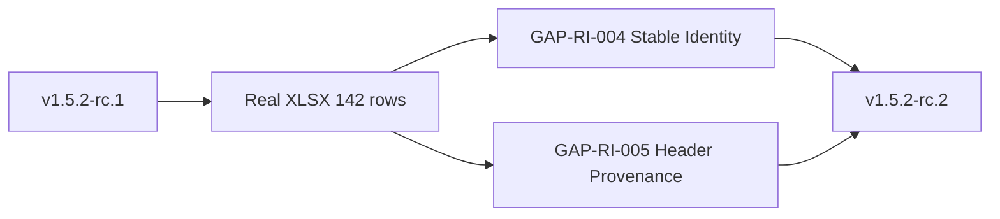
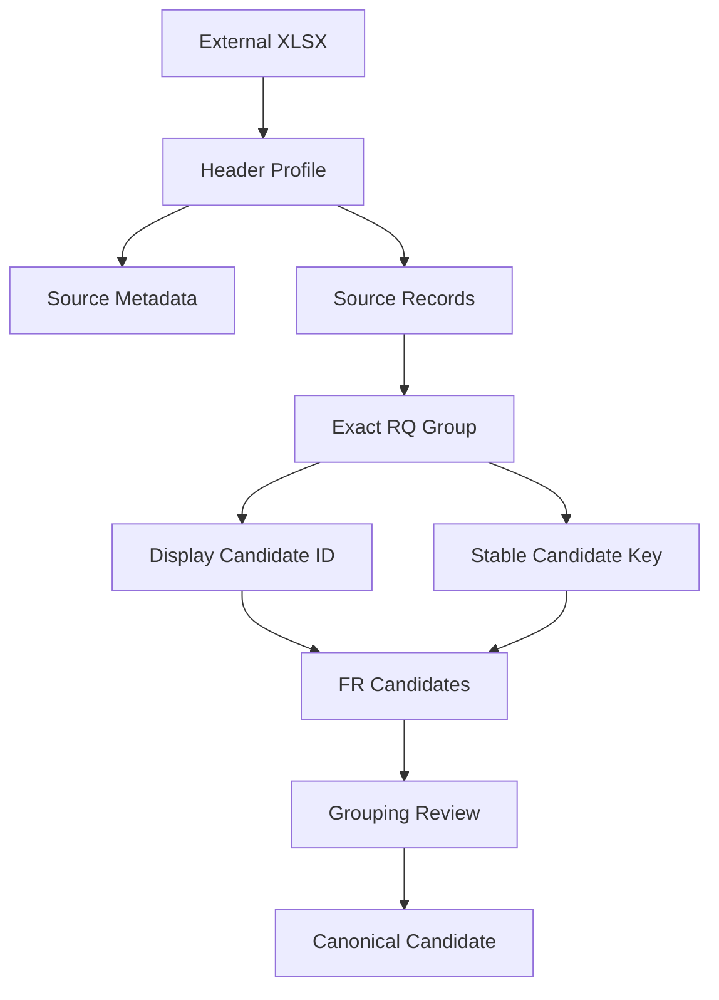

# Candidate Design Delta v1.5.2-rc.2 — Requirement Intake Real-file Validation

## Quick Start

이 Candidate는 v1.5.1 Baseline과 v1.5.2-rc.1 Requirement Intake PoC를 상속한다. 실제 142건 XLSX를 통과시키며 발견된 **재-import 식별 안정성**과 **Source Header provenance**를 보강한다.



## 1. 해결하려는 문제

### GAP-RI-004 Stable Re-import Candidate Identity

순번 기반 `RQ-CAND-0001`은 사람이 읽기 쉽지만 입력 순서가 바뀌면 동일한 exact group의 표시 번호가 변할 수 있다. Grouping Review 판단이나 후속 Vertical Slice가 재-import 뒤에도 같은 후보를 찾으려면 안정적인 비교 키가 필요하다.

### GAP-RI-005 Group Header Provenance Execution

`requirement-intake-columns.example.yaml`은 `preserve_group_header_row: true`를 선언했지만 v0.2 runtime output은 실제 1행 그룹 Header를 보존하지 않았다. Config Contract와 구현 사이의 차이다.

## 2. 기존 설계

- Exact RQ Grouping: `(Level1, Level2, 요구사항명)`
- FR Candidate: Excel 세부 행 1건당 1개
- External Requirement ID 보존
- raw / normalized text 분리
- 유사 문구 자동 병합 금지
- Invalid / Duplicate Non-blocking

## 3. 변경 설계

### Stable Key

표시용 `candidate_id`는 유지하면서 비교/재-import용 키를 additive하게 둔다.

```text
RQ Candidate stable_key
= sha256(Level1 + unit-separator + Level2 + unit-separator + Requirement Name)

FR Candidate stable_key
= external:<external_requirement_id>
```

이 키는 Canonical Published ID가 아니라 **Candidate 재식별용**이다. Canonical 승격 시 기존 UID + Display ID 원칙을 따른다.

### Header Provenance

Import output에 `source_metadata`를 추가한다.

```yaml
source_metadata:
  source_file:
  source_sheet:
  source_hash:
  effective_header_row:
  effective_headers: []
  group_header_rows: []
```

`preserve_group_header_row: false`이면 `group_header_rows`는 비운다.

## 4. Workflow



## 5. Canonical Model 영향

- 기존 RQ/FR Canonical Entity는 변경하지 않는다.
- Candidate layer에 `stable_key`를 추가한다.
- Source provenance에 header metadata를 추가한다.
- Canonical promotion 시 `stable_key`를 Published Display ID로 사용하지 않는다.

## 6. Artifact 영향

- `sdlc/scripts/import_requirements.py`: ENHANCED
- `tests/test_import_requirements.py`: ENHANCED
- Requirement import JSON schema: v1 → v2
- `docs/00_관리/요구사항_인입결과.md`: ENHANCED
- 기존 Worklist 계약: UNCHANGED

## 7. Backward Compatibility

기존 필드는 삭제하지 않는다. `stable_key`, `parent_rq_stable_key`, `source_metadata`만 추가한다. 기존 consumer가 unknown field를 무시하면 그대로 동작한다.

`schema_version`이 2로 증가하므로 strict schema consumer는 migration이 필요하다.

## 8. Migration

1. v1 output consumer가 strict schema인지 확인한다.
2. Candidate 비교 시 `stable_key` 우선, 없으면 기존 `candidate_id`로 fallback한다.
3. 기존 저장된 v1 output은 강제 재작성하지 않는다.
4. 다음 import부터 v2 output을 생성한다.

## 9. Validation Criteria

- 실제 142건 XLSX가 모두 Import된다.
- FL 39 / TE 103 External ID가 모두 보존된다.
- Exact Grouping은 22 RQ / 142 FR을 생성한다.
- 유사 문구 5건은 Review이며 자동 병합되지 않는다.
- raw → normalized 변환을 역추적할 수 있다.
- RQ stable key는 같은 group key에 대해 입력 행 순서와 무관하다.
- 1행 그룹 Header가 config에 따라 provenance로 보존된다.
- Requirement Intake + Worklist 전체 unittest가 통과한다.
- 모든 Markdown Mermaid가 GitHub-safe다.

## 10. 기존 Capability 상태

| Capability | 상태 | 설명 |
|---|---|---|
| Brownfield / Greenfield / Hybrid | UNCHANGED | Project Mode 영향 없음 |
| Non-blocking Workflow | UNCHANGED | Invalid/중복 처리 유지 |
| External Requirement ID | ENHANCED | FR stable key에도 외부 ID 활용 |
| Bulk Requirement Intake | ENHANCED | 재-import 비교 안정성 추가 |
| RQ-FR Grouping | ENHANCED | exact grouping + stable key |
| Raw Text Preservation | ENHANCED | header provenance까지 확대 |
| Worklist MD↔Excel | UNCHANGED | 기존 계약 유지 |
| Canonical UID / Display ID | UNCHANGED | Candidate stable key와 구분 |
| Mermaid GitHub Compatibility | UNCHANGED | 모든 신규 flowchart label quote |

## 11. Known Gap / Next

실제 Application Source가 없으므로 DISCOVERY 이후의 PGM/ART/DATA 확정은 여전히 `INPUT_REQUIRED / DEFERRED`다. 다음 권장 검증은 Application Source를 연결한 Brownfield Vertical Slice다.
