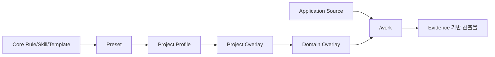
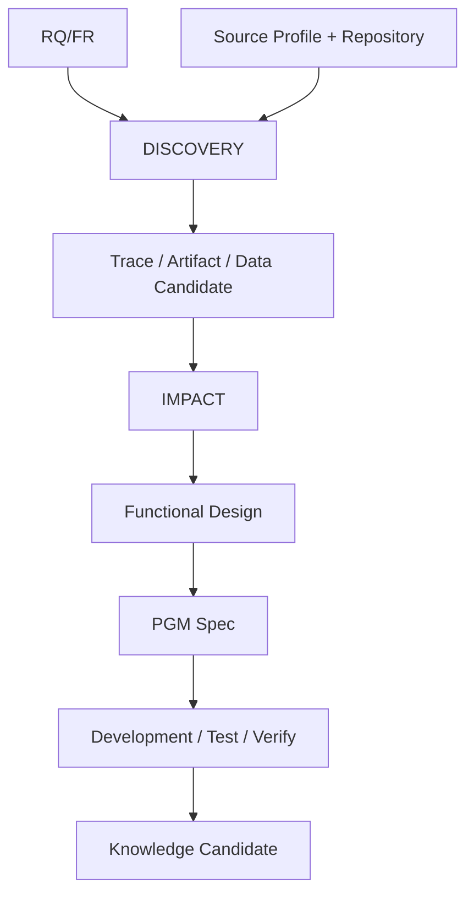

# AI-SDLC Harness v1.5.3-rc.1 Candidate Delta
## Source-enabled Portable Harness Structure

## Quick Start

다른 프로젝트에는 Core Harness를 그대로 복사하고 프로젝트 차이만 Overlay한다.



## 1. 해결하려는 문제

v1.5.1은 Rule/Skill/Template/Overlay의 설계 계약을 정의했지만 현재 Repository에는 `.cursor/rules`, `.cursor/skills`, `sdlc/templates`가 실제 이식 가능한 Package로 materialize되어 있지 않았다. Source가 연결된 프로젝트에서 DISCOVERY 이후 어떤 Evidence를 Skill이 읽고 어떤 Template에 남겨야 하는지도 자동 검증되지 않았다.

### GAP-HS-001 Portable Harness Package Materialization
- 유형: Implementation Gap + Contract Gap
- 조치: Core Rule/Skill/Template 실제 파일 구조 생성

### GAP-HS-002 Rule → Skill → Template Stage Contract
- 유형: Contract Gap
- 조치: machine-readable `harness-package-contract.json`과 Validator 추가

### GAP-HS-003 Source Input Contract
- 유형: Configuration Gap
- 조치: Source roots/build/test/evidence/write policy를 `source-profile`로 분리

### GAP-HS-004 Overlay Isolation
- 유형: Design/Configuration Gap
- 조치: Core를 수정하지 않고 Project/Domain 차이만 관리하는 Skeleton과 precedence 고정

### GAP-HS-005 Runtime Overlay Resolution
- 유형: Implementation Gap
- 상태: DESIGNED_NOT_IMPLEMENTED
- 조치: 이번 Candidate에서는 적용 순서와 폴더/계약까지만 고정한다. Template Section merge, Rule/Config materialization 같은 실제 Runtime resolver는 후속 PoC에서 구현한다.

## 2. 기존 설계

설계상 사용자 Skill은 `/work /change /check /setup`, `/work` 내부 Reference는 requirement~verify, Template는 Markdown 중심, Customization은 Core→Preset→Profile→Domain→Local 순이었다. 하지만 파일/검증 계약이 아직 충분히 구현되지 않았다.

## 3. 변경 설계

```text
PROJECT_ROOT/
├─ .cursor/
│  ├─ rules/
│  │  ├─ 00-core.mdc
│  │  └─ 10-project.mdc
│  └─ skills/
│     ├─ work/
│     │  ├─ SKILL.md
│     │  └─ references/{requirement..verify}.md
│     ├─ change/SKILL.md
│     ├─ check/SKILL.md
│     └─ setup/SKILL.md
└─ sdlc/
   ├─ config/
   │  ├─ project-profile.example.yaml
   │  └─ source-profile.example.yaml
   ├─ design/contracts/harness-package-contract.json
   ├─ templates/core/*.md
   ├─ custom/
   │  ├─ project/{config,rules,templates,standards}/
   │  └─ domain/<domain>/{config,rules,templates,standards}/
   └─ scripts/validate_harness_structure.py
```

## 4. Source-enabled Workflow



DISCOVERY 이후 Source 기반 사실에는 가능한 범위에서 `Artifact/File`, `Symbol/Locator`, `Source Hash`, `Confidence`, `Status`를 남긴다. Source relation은 Business Truth 자동 확정 근거가 아니다.

## 5. Canonical Model 영향

기존 RQ/FR/PGM/ART/DATA/TASK/AC/TC Entity는 유지한다. 새로운 Entity를 필수 추가하지 않는다. 다만 ART/PGM/DATA relation의 Evidence locator와 Source hash를 Artifact 생성 계약에서 명시적으로 요구한다.

## 6. Artifact 영향

- 기존 주요 산출물 종류: 유지/ENHANCED
- `impact-analysis`, `functional-design`, `program-spec`, `implementation-result`, `test-scenario`, `verification-result`: Source Evidence Section 강화
- `interview-questions`: CLARIFY용 Markdown Template 추가
- Template 파일명은 Runtime Artifact명이 아니라 Core Template 이름이므로 영문 고정명을 허용한다. 생성되는 사용자 문서는 기존 직관적 한글 suffix 규칙을 유지한다.

## 7. Backward Compatibility

- `/work /change /check /setup`: UNCHANGED
- Non-blocking Workflow / Execution Guard: UNCHANGED
- Canonical SoT / Generated View: UNCHANGED
- Requirement Intake/External ID: UNCHANGED
- Worklist MD↔Excel: UNCHANGED
- Static Analysis First: ENHANCED (Source Profile에서 명시)
- Overlay Customization: ENHANCED (Skeleton/precedence/Validator 추가; Runtime resolver는 후속 구현)

## 8. Migration

1. Core `.cursor`와 `sdlc/templates/core`를 프로젝트에 배치한다.
2. `project-profile.example.yaml`을 실제 `project-profile.yaml`로 복사한다.
3. `source-profile.example.yaml`을 실제 `source-profile.yaml`로 복사하고 Source root/build/test를 설정한다.
4. 프로젝트 차이는 `sdlc/custom/project`, Domain 차이는 `sdlc/custom/domain/<domain>`에 둔다.
5. `python sdlc/scripts/validate_harness_structure.py .`를 실행한다.

## 9. Validation Criteria

- 모든 Core Rule/Skill/Template 필수 파일 존재
- `/work` Reference 10종이 동일 Contract Section 보유
- DISCOVERY~VERIFY Template가 Evidence locator/confidence를 보유
- Project Overlay precedence가 고정되어 Core silent override 방지
- Source Profile가 Static Analysis First / Ambiguous Write / Execution Guard 계약 보유
- 기존 Requirement Intake + Worklist regression 유지
- 전체 Markdown Mermaid GitHub-safe

## 10. Capability 상태

| Capability | 상태 |
|---|---|
| Brownfield JIT | ENHANCED |
| Static Analysis First | ENHANCED |
| Rule/Skill/Template Governance | ENHANCED |
| Overlay Customization | ENHANCED |
| `/work /change /check /setup` | UNCHANGED |
| Canonical Traceability | UNCHANGED |
| Process Never Blocked | UNCHANGED |
| Execution Guard | UNCHANGED |
| Requirement Intake | UNCHANGED |
| Worklist MD↔Excel | UNCHANGED |

## 11. 아직 미구현

- Project/Domain Overlay를 실제 실행 Context로 병합하는 Runtime Resolver
- Template Section-level merge/materialization engine
- Stack별 Static Analyzer Adapter 및 Source semantic accuracy 검증

따라서 본 Candidate의 Overlay 판정은 **구조/계약 PASS**이지 실제 Runtime merge 구현 완료를 의미하지 않는다.
