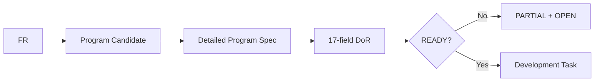

# AI-SDLC Harness v1.5.4-rc.1 — Full Requirement Java Pilot / Program Readiness Delta

## Quick Start
기존 PROGRAM 단계는 Source/Program 관계를 잡는 데는 충분했지만 실제 Java 구현 전에 필요한 DTO/Rule/DB/Concurrency/Security/NFR 확정도를 강제하지 않았다.

## Problem
대표 1-RQ Pilot의 Program Spec은 구조 검증에는 PASS였으나 Production Source 구현 판단에는 얕았다.

## Changed Design
1. Program Reference에 Implementation Readiness 판정을 추가한다.
2. Program Spec Template에 DTO/Data/Transaction/Concurrency/Idempotency/Integration/Error/Security/NFR/DoR를 추가한다.
3. `program-spec-readiness.json`을 Core Contract로 추가한다.
4. `validate_program_spec.py`가 필수 Section과 READY 오판을 검증한다.
5. `SIMULATED_REFERENCE_ARCHITECTURE` 또는 `OPEN_REAL_SOURCE`가 있으면 READY가 될 수 없다.

## Full Requirement Pilot
- Actual XLSX: 142 requirements
- RQ groups: 22
- Detailed PGM candidates: 142
- RQ workflow docs generated locally: 264
- Detailed program specs generated locally: 142
- Java reference source files: 73
- Java compile/catalog coverage: 142/142 PASS
- Production READY: 0/142

## Capability Status
- Requirement Intake: UNCHANGED
- Overlay Resolution: UNCHANGED
- Program Specification: ENHANCED
- Program Readiness Validation: NEW
- Real Source Semantic Accuracy: UNCHANGED / PENDING

## New Gaps
- GAP-PS-001 Program Specification Implementation Readiness Contract — IMPLEMENTED
- GAP-PS-002 Full Requirement → Source Symbol Coverage Contract — PILOT VALIDATED
- GAP-PS-003 Candidate Architecture must not satisfy Real Source Evidence — IMPLEMENTED

## Backward Compatibility
기존 Program Spec의 공통 8개 Template Section은 유지한다. 새 상세 Section은 additive enhancement다.

## Validation Criteria
- 기존 Harness/Requirement/Overlay/Worklist regression PASS
- Program Spec readiness tests PASS
- Mermaid check PASS
- 실제 Source가 없는 Pilot은 READY=0을 유지
