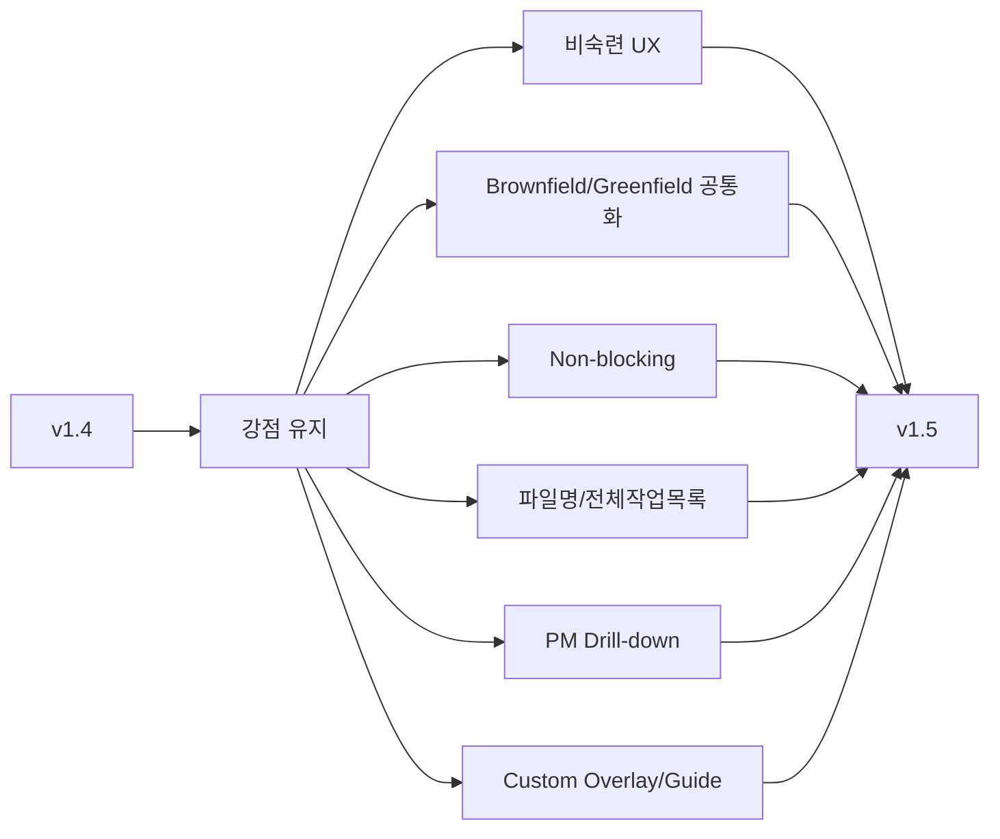

# v1.4 사용자 요구사항 적합성 검토

## Quick Result

첨부 v1.4는 Canonical Model, Alert-driven Workflow, PM Task/Resource, Config/Template/Skill 구조가 잘 잡혀 있어 PoC 기반선으로는 충분하다. 다만 사용자 요구 9개 중 **완전 충족은 일부이며, 1/2/3/7/8/9는 부분 충족, 4/5/6은 구조적 보완이 필요**하다.

## 9개 요구사항별 판정

| # | 요구사항 | v1.4 판정 | 근거/문제 | v1.5 조치 |
|---|---|---|---|---|
| 1 | Agent 비숙련 인력도 전체 구조를 따라감 | 부분적합 | `/work /change /check`, 역할별 UX는 좋지만 문서 최상단 Quick Start와 단계별 사용자 길잡이가 부족 | Quick Start, 역할별 진입점, 단계 가이드 Contract 추가 |
| 2 | 기존/신규 프로젝트 공통 적용, 기존 자산 재사용 | 미흡~부분적합 | Brownfield는 매우 강하지만 Greenfield/Hybrid Project Mode와 기존 가이드 자동 Bootstrap이 명시되지 않음 | AUTO/BROWNFIELD/GREENFIELD/HYBRID, Existing Asset Bootstrap, Preset 추가 |
| 3 | 단계 진행 강제 Block 금지 | 부분적합 | Approval-free는 충족. 하지만 `Hard Block`, ambiguous write 중단 표현이 Workflow 자체 차단처럼 보일 수 있음 | Process Never Blocked + 특정 위험 Action만 Execution Guard, Deferred Action 도입 |
| 4 | 파일명만으로 내용 파악 | 미흡 | `requirement.md`, `impact-analysis.md`, `PGM-ATT-0016.md`는 폴더 밖에서 의미가 약함 | `<ID>_<짧은업무명>_<산출물종류>` 규칙 |
| 5 | 전체 작업목록 + Excel 양방향 Convert | 미흡 | `task-plan.xlsx`, `pm-status.xlsx`는 있으나 하나의 전체 Work List와 MD↔Excel 계약이 없음 | `전체작업목록.md/.xlsx`, stable ID/revision 기반 양방향 Import/Export 계약 |
| 6 | MD/Excel 컬럼을 직관적 한글로 | 미흡 | Task Schema가 영문 개념 중심이며 사용자 표시 Header 계약 없음 | 한글 컬럼 표준 및 내부 key mapping 추가 |
| 7 | PM 상세 Breakdown + 작업자/일정 Optional | 부분적합 | Milestone/RQ/WP/TASK와 Schedule/Assignment는 좋음. FR/PGM/AC/TC까지 Drill-down하는 단일 View가 부족 | Project→MS→RQ→FR→PGM→TASK→AC/TC Drill-down, 담당/일정 Optional 명시 |
| 8 | Harness 관리자 쉬운 Customizing | 부분적합 | config/templates/standards 분리는 좋지만 Core 수정 없이 Override하는 우선순위와 Overlay 구조가 부족 | Core→Preset→Project Profile→Domain Overlay→Local Override 추가 |
| 9 | SDLC/SKILL/Template/단계 상세 가이드, Quick Start, 단락별 시각화 | 부분적합 | 설계 자체는 상세하지만 사용자 가이드 문서 Contract와 상단 Quick Start/단락별 workflow 요구가 불충분 | 필수 Guide 4종, 표준 단락, Mermaid workflow 규칙 추가 |

## 유지해야 할 v1.4 강점

- Canonical Model을 관계 원장으로 두고 MD/Excel을 View로 보는 구조
- Human Truth / System Evidence / Agent Inference 분리
- Brownfield JIT Documentation과 Static Analysis First
- `/work /change /check`로 사용자 진입점을 최소화한 UX
- Alert + Assumption으로 미확정을 숨기지 않는 구조
- RQ/PGM/TASK 해상도 분리와 Scope Validation
- Knowledge Promotion / Freshness / Conflict
- Git Merge와 Semantic Merge 분리
- Capability/Decision/Contract/Continuity Validator 기반 Harness Governance

## 변경 우선순위

1. P0: Quick Start, Non-blocking Process 의미 명확화, 파일명 규칙, 전체작업목록/한글 컬럼
2. P1: Brownfield/Greenfield/Hybrid Bootstrap, PM Drill-down, Custom Overlay
3. P1: SDLC/SKILL/TEMPLATE/Customizing 상세 가이드
4. P2: 실제 MD↔Excel Converter 구현과 Sync Conflict 자동화는 PoC 구현 단계에서 계약 테스트로 검증

## 설계 결정

- 기존 v1.4 핵심 Capability는 삭제하지 않는다.
- `Hard Block`은 폐기하지 않고 **Execution Guard로 의미를 좁혀 ENHANCED** 처리한다.
- 기존 일반 파일명은 **ID+업무명+산출물종류 규칙으로 SUPERSEDED**한다.
- Brownfield JIT은 유지하며 Greenfield/Hybrid를 같은 Delivery Contract로 확장한다.
