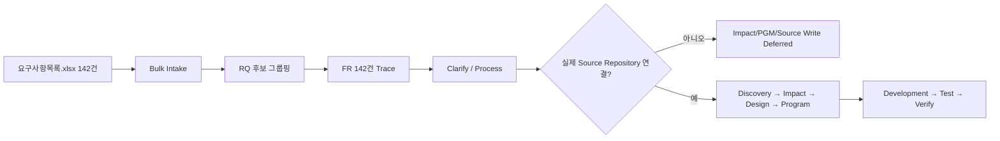

# 요구사항목록 단계별 실행가능성 검증

> Branch: `validation/v1.5.1-requirements-pilot-v0.1`  
> Branch Version: `requirements-pilot-v0.1.0`  
> Design Baseline: `v1.5.1`  
> 입력: `요구사항목록.xlsx` 142건  
> 원칙: 본 검증 결과와 보완안은 이 validation branch에서만 관리하며 `main`에는 병합하지 않는다.

## Quick Result

현재 v1.5.1 설계는 **요구사항 인입부터 분석/설계 후보 생성까지는 진행 가능**하다. 다만 실제 업로드 목록처럼 대량의 외부 요구사항 ID와 상위 요구사항명/세부 동작이 함께 오는 경우를 위한 `Bulk Intake + External ID + RQ/FR Grouping` 계약이 부족하다.

Brownfield 실제 Source Repository가 아직 연결되지 않은 상태에서는 **DISCOVERY/IMPACT 이후의 Program 확정, Source 수정, Test/Verify 완료는 실행할 수 없다.** 이는 Workflow 전체 Block이 아니라 Evidence/Target 부족으로 해당 실행만 `DEFERRED` 처리해야 한다.



## 1. 입력 데이터 구조 검증

### 1.1 규모

- 전체 요구사항 행: **142건**
- 외부 ID 범위
  - `REQ_TM_FL001` ~ `REQ_TM_FL039`: 39건
  - `REQ_TM_TE001` ~ `REQ_TM_TE103`: 103건
- 일정/담당자: 현재 입력값 없음

### 1.2 Level2 분포

| Level2 | 건수 |
|---|---:|
| 근무계획 수립(탄력근로제) | 26 |
| 근태/휴가 (ESS) | 12 |
| 근태 Report | 8 |
| Interface | 2 |
| 근태기록 | 7 |
| 선택적근무제 | 2 |
| 근태마감 | 39 |
| 근태현황/통계 | 22 |
| Batch | 23 |
| 메인화면 | 1 |
| **합계** | **142** |

### 1.3 RQ/FR 후보 구조

업로드 파일은 `요구사항명`이 상위 기능을 표현하고, 각 행의 `요구사항`이 등록/수정/조회/삭제/송신/수신/집계 등의 세부 동작을 표현한다.

예:

```text
요구사항명: 탄력근로제 개선 최초근무계획 자동 설정하는 기능
├ REQ_TM_FL001 → 탄력근로제 근무계획 저장
├ REQ_TM_FL002 → 탄력근로제 근무계획 조회
└ REQ_TM_FL003 → 기본 근무스케줄에 따라 근무계획 생성 자동 저장
```

따라서 142개 행을 모두 독립 RQ로 만드는 것보다 다음이 현재 Canonical Model에 더 적합하다.

```text
외부 요구사항 파일
→ 동일 Level1 + Level2 + 요구사항명 기준 RQ 후보
→ 각 외부 요구사항 ID/세부 동작을 FR로 추적
```

원문 `요구사항명`을 **정확 문자열 기준**으로 그룹핑하면 22개 RQ 후보가 만들어진다. 의미가 비슷하지만 문구가 다른 항목은 자동 병합하지 않는다. 예를 들어 `선택적근무관리 반영을 구현`과 `선택적근무관리 반영하는 기능`은 `GROUPING_REVIEW`로 남긴다.

## 2. 단계별 검증

| Stage | 판정 | 현재 목록으로 가능한 것 | 부족한 것 / 조치 |
|---|---|---|---|
| INTAKE | **조건부 PASS** | 142건 외부 ID/업무구분/요구명/세부동작을 읽어 Candidate 생성 | Bulk Import, 외부 ID 보존, Source Provenance 계약 추가 필요 |
| DECOMPOSE | **조건부 PASS** | 상위 요구사항명 → RQ 후보, 각 행 → FR 후보 생성 가능 | RQ/FR 자동 그룹핑 규칙과 near-duplicate Review 필요 |
| CLARIFY | **PASS/WARNING** | 조회/등록/수정/삭제/송수신별 확인 질문 생성 가능 | Actor, 조건, Validation, 예외, 권한, 완료결과가 원본에 없음 |
| PROCESS | **조건부 PASS** | 전자결재 송신/수신/후처리, 마감, 집계 등의 Process Candidate 구성 가능 | 실제 순서와 업무규칙은 원문만으로 확정 불가. CHECK_REQUIRED |
| DISCOVERY | **INPUT REQUIRED** | Brownfield 탐색 대상 키워드/업무영역 생성 가능 | 실제 Application Source/Guide/DB/Interface Repository Profile 필요 |
| IMPACT | **CANDIDATE ONLY** | Level2/기능명 기반 Business/Functional 후보 생성 | Program/Source/Data 영향 확정에는 Static Analysis Evidence 필요 |
| DESIGN | **PARTIAL** | 요구별 목표 동작 초안과 OPEN 항목 생성 가능 | Input/Output, 상태, Data, Transaction, Authorization, Interface 상세 부족 |
| PROGRAM | **DEFERRED** | Batch/Interface/ESS 등의 Program Type 후보는 식별 가능 | 실제 PGM/ART/Symbol 매핑은 Source 없이는 확정 불가 |
| DEVELOPMENT | **DEFERRED** | TASK Candidate/Context 요구사항 정의 가능 | Source Write Target 없음. 실제 개발 불가 |
| TEST | **PARTIAL** | CRUD/조회/송수신 수준 AC/TC Candidate 생성 가능 | 기대값/업무규칙/경계조건/데이터 조건 부족 |
| VERIFY | **DEFERRED** | Verification 구조와 체크리스트 생성 가능 | 구현 Commit/Test Result Evidence 없음 |
| KNOWLEDGE PROMOTION | **NOT YET** | 요구사항 문구는 GIVEN Evidence로 보존 가능 | 요구 문구를 Confirmed BR/Technical Knowledge로 자동 승격하면 안 됨 |
| PM TRACKING | **PASS** | 요구사항/FR 상태 추적 가능. 담당자/일정은 빈 값 허용 | 없음. Optional Tracking 설계와 일치 |
| WORKLIST MD↔XLSX | **PASS (PoC)** | 한글 컬럼/stable ID/revision/Optional 필드 round-trip 구현됨 | 요구사항 원본 → Worklist Import Adapter는 별도 필요 |

## 3. 단계별 상세 판정

### 3.1 INTAKE

현재 입력에는 `요구사항명`, 세부 `요구사항`, 업무 Level1/Level2, 외부 요구사항 ID가 존재한다. 따라서 요청 자체는 충분히 인입할 수 있다.

하지만 v1.5.1의 최소 입력인 `현재 문제 또는 요청내용 / 원하는 결과`가 파일에서 명시적으로 분리되어 있지 않다. Harness는 이를 임의로 만들어 확정하면 안 된다.

권장 처리:

- `요구사항명` → RQ Candidate title
- `요구사항` → FR Candidate statement
- 현재 문제 → `OPEN`
- 원하는 결과 → 세부 동작으로 Candidate 작성하되 `GIVEN` 원문과 `INFERRED` 해석을 분리
- 일정/담당자 → `null`

### 3.2 DECOMPOSE

목록 자체가 이미 기능 단위로 상당히 세분화되어 있다. 따라서 Agent가 다시 142개 행을 과도하게 분해하지 않고 **Grouping/Normalization**을 먼저 해야 한다.

필수 Trace:

```text
외부 ID REQ_TM_TE023
→ Source Record
→ RQ Candidate: 10분단위 근무계획 개선 근태마감 반영을 구현
→ FR Candidate: 일근태입력/마감 전자결재 송신
```

내부 Display ID(`RQ-xxxx`, `FR-xxxx-xx`)와 외부 ID(`REQ_TM_*`)는 서로 대체하지 않고 모두 보존한다.

### 3.3 CLARIFY

다음 질문을 자동 생성할 수 있어 현재 방법론과 잘 맞는다.

- 누가 사용하는 기능인가?
- 등록/수정/삭제 가능 조건은 무엇인가?
- 마감 전/후 정책은 무엇인가?
- 전자결재 송신/수신 실패 시 상태는 무엇인가?
- Batch 수행 시점/재처리 정책은 무엇인가?
- 조회 항목/필터/권한/다운로드 범위는 무엇인가?
- 10분 단위 변경 시 기존 분 단위/반올림/절사 규칙은 무엇인가?

답이 없어도 Alert/Assumption으로 진행한다.

### 3.4 PROCESS

요구사항명과 세부 동작을 이용해 Process Candidate는 만들 수 있으나 순서는 확정할 수 없다.

예: `신청 등록 → 전자결재정보 조회 → 송신 → 수신 → 후처리`는 이름상 후보 흐름일 뿐이며 실제 Business Process로 `CONFIRMED` 처리하면 안 된다.

### 3.5 DISCOVERY / IMPACT

현재 GitHub 저장소에는 Harness 설계/PoC가 있고 실제 근태 Application Source는 연결되어 있지 않다. 따라서 현재 단계에서 할 수 있는 것은 탐색 키워드와 Candidate Scope 생성까지다.

필요 입력:

- 실제 Application Repository 또는 Workspace
- 기존 README/Architecture/개발가이드
- Source Root / Build / Test 구조
- DB/Mapper/Procedure/Interface 정의 위치

이 입력이 연결되면 현재 설계의 Brownfield Static Analysis First 절차로 진행 가능하다.

### 3.6 DESIGN

세부 동작 수준 초안은 생성 가능하지만 다음은 OPEN으로 남겨야 한다.

- Validation/상태전이
- Data CRUD 상세
- Transaction Boundary
- Authorization
- Interface Payload/Retry
- Batch Schedule/Idempotency
- Error/Logging/Audit

### 3.7 PROGRAM / DEVELOPMENT

`Batch`, `Interface`, `근태/휴가(ESS)` 등의 Level2는 Program 후보 탐색에 유용하지만 실제 PGM이나 Source File을 의미하지 않는다.

따라서 Source Repository가 없을 때는:

```text
PGM Candidate / TASK Candidate 생성 가능
Source Write = DEFERRED_TARGET_DECISION
```

으로 처리해야 한다.

### 3.8 TEST / VERIFY

예를 들어 `REQ_TM_TE001 10분단위 근무계획 등록`은 다음 정도의 Candidate AC는 만들 수 있다.

- 사용자가 10분 단위 근무계획을 등록할 수 있다.
- 저장 후 조회 시 등록값이 확인된다.

그러나 허용 범위, 중복, 시간 경계, 마감 상태, 권한, 계산 규칙이 없으므로 이를 최종 AC/TC로 확정하면 안 된다.

## 4. 발견된 설계 Gap

| Gap | 중요도 | 내용 | 제안 |
|---|---|---|---|
| GAP-RI-001 | P0 | 외부 Requirement ID 보존 계약 없음 | `external_requirement_id`/`source_ref` 추가 |
| GAP-RI-002 | P0 | 100건 이상 Bulk Intake 계약 없음 | Preview→Map→Import→Result 절차 추가 |
| GAP-RI-003 | P0 | 상위 요구사항명과 세부 행의 RQ/FR Mapping 규칙 부족 | Exact grouping + Review 정책 추가 |
| GAP-RI-004 | P1 | 원본에 문제/결과가 없을 때 처리 규칙 부족 | OPEN + Alert, 임의 확정 금지 |
| GAP-RI-005 | P1 | NBSP/표기차이/근무스케쥴 등 원문 Normalization 정책 부족 | `raw_text`와 `normalized_text` 분리 |
| GAP-RI-006 | P1 | 원본 행 Provenance 부족 | 파일/Sheet/행/Hash 저장 |
| GAP-RI-007 | P1 | 유사 요구사항명 자동 병합 위험 | Semantic merge 금지, `GROUPING_REVIEW` |
| GAP-RI-008 | P0 | Brownfield Source 미연결 시 단계 기대치 명확화 필요 | Discovery 이후 Candidate/Deferred 상태 계약 강화 |

## 5. 최종 판단

### 현재 설계로 가능한 범위

```text
요구사항목록 Import Candidate
→ RQ/FR 후보
→ Clarify
→ Process Candidate
→ Impact Candidate
→ Functional Design Draft
```

### 추가 입력 후 가능한 범위

```text
실제 Application Repository 연결
→ Static Analysis
→ Impact 확정
→ PGM Spec
→ TASK
→ Development
→ Test
→ Verify
→ Knowledge Promotion
```

따라서 **현재 설계는 방향과 Stage 구조는 실제 142건 요구사항에 적용 가능하지만, 대량 Requirement Intake Contract를 v1.5.2 후보로 보완해야 실무적으로 매끄럽게 진행 가능**하다는 결론이다.
