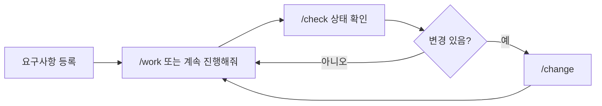
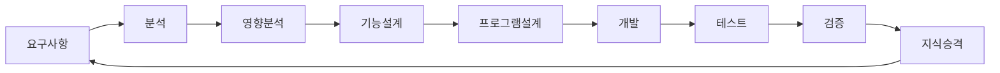
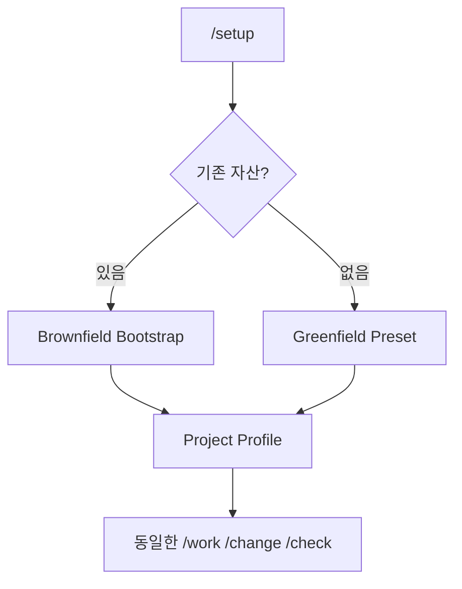

# AI-SDLC Harness 사용 가이드

## Quick Start

일반 사용자는 내부 Agent 구조를 몰라도 된다. 아래 세 동작만 우선 기억한다.

- 진행: `/work RQ-0042`, `/work TASK-0042-DEV-002`, 또는 `이 요구사항 계속 진행해줘`
- 변경: `/change` 또는 자연어로 변경 내용 입력
- 조회: `/check RQ-0042`
- 초기 설정은 Harness 관리자만 `/setup` 사용

미확정 사항이 있어도 업무 프로세스는 계속 진행할 수 있다. 위험한 운영 DB 변경, 충돌난 Source write 같은 **특정 실행행위만** Execution Guard 대상으로 둔다.

## 역할별 시작점

| 역할 | 먼저 볼 것 | 주 동작 |
|---|---|---|
| PM | `docs/00_관리/전체작업목록.md` | RQ→FR→PGM→TASK Drill-down, 담당/일정은 필요할 때만 지정 |
| 분석/설계 | 요구사항별 분석/설계 MD | `/work RQ-xxxx` |
| 개발 | PGM 프로그램설계 + 관련 TASK | `/work TASK-xxxx` |
| 테스트 | AC/TC와 검증 결과 | `/work` / `/check` |
| 운영 | 질문, 업무규칙, Operations Knowledge | 확인/피드백 |
| Harness 관리자 | `sdlc/config`, `sdlc/custom` | `/setup`, Overlay Customizing |

## 전체 SDLC

| 사용자 단계 | 주요 산출물 | 넘어갈 수 있는 조건 |
|---|---|---|
| 요구사항 | 요구사항 MD | 최소 요구 입력 존재 |
| 분석 | 요구분석/프로세스분석 | 미확정은 Alert/Assumption으로 이월 가능 |
| 영향분석 | 영향분석 | Candidate가 남아도 진행 가능 |
| 설계 | 기능설계 | PARTIAL/WARNING 상태로 진행 가능 |
| 프로그램 | 프로그램목록/PGM 설계 | 담당자/일정 미지정 가능 |
| 개발 | Source/구현결과 | 특정 위험 write만 Guard 가능 |
| 테스트 | 테스트 시나리오/결과 | 미수행 Test는 명시적으로 남김 |
| 검증 | 검증결과 | Release 불가면 Release Action만 Guard |

## 프로젝트 유형

- Brownfield: 기존 README/가이드/Source/Build/Test/DB 정의를 먼저 재사용
- Greenfield: 기본 Preset/Template 사용
- Hybrid: Module/Domain별 Overlay

> Mermaid 라벨에 `/`, `?`, 괄호 등 특수문자가 포함되면 GitHub 렌더러 호환성을 위해 `A["라벨"]`, `Q{"질문?"}`처럼 따옴표로 감싼다.

## 상세 문서

- `guides/01_SDLC_전체가이드.md`
- `guides/02_SKILL_사용가이드.md`
- `guides/03_TEMPLATE_산출물가이드.md`
- `guides/04_HARNESS_커스터마이징가이드.md`
- Current Full Design: `design/baselines/AI_SDLC_Harness_Full_Design_v1.5.md`
