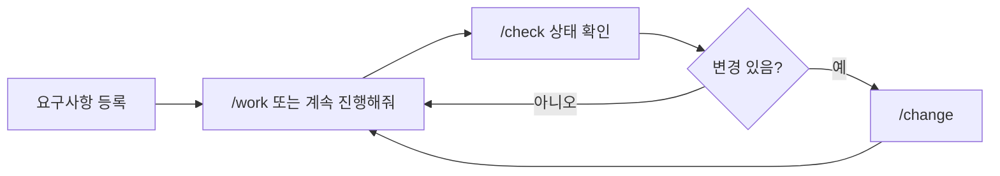
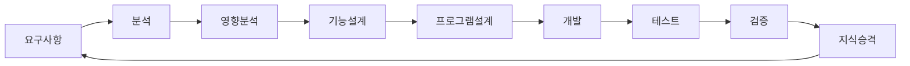
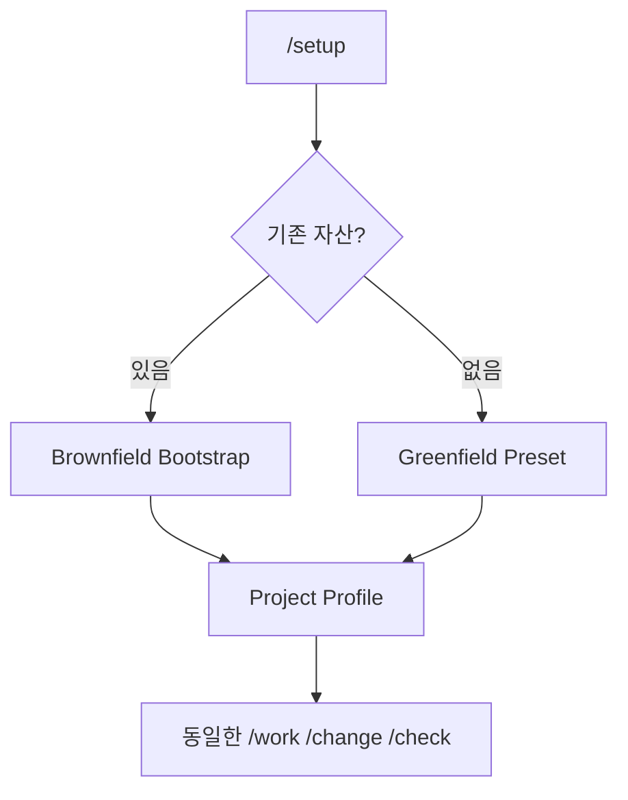

# AI-SDLC Harness 사용 가이드

## Quick Start

일반 사용자는 내부 Agent 구조를 몰라도 된다. 아래 세 동작만 우선 기억한다.

- 진행: `/work RQ-0042`, `/work TASK-0042-DEV-002`, 또는 `이 요구사항 계속 진행해줘`
- 변경: `/change` 또는 자연어로 변경 내용 입력
- 조회: `/check RQ-0042`
- 초기 설정은 Harness 관리자만 `/setup` 사용

미확정 사항이 있어도 업무 프로세스는 계속 진행할 수 있다. 위험한 운영 DB 변경, 충돌난 Source write 같은 **특정 실행행위만** Execution Guard 대상으로 둔다.

## 문서 작성과 고객 커뮤니케이션

- 사용자에게 보이는 내부 산출물은 한국어 자연어를 기본으로 한다.
- `RQ/FR/BR/PGM/TASK/AC/TC`는 시스템 추적 ID로 유지하되 문서에서는 `기능 요구사항(FR)`처럼 의미를 함께 표시한다.
- `/work` 문서 대상은 `internal`, `customer`, `both`로 선택할 수 있다.
- 고객 문서는 내부 Canonical/설계 산출물에서 파생하며 별도의 업무 사실을 만들지 않는다.
- 고객 문서는 6개 필수 단락과 프로젝트별 선택 단락을 조합한다.

## 고객 기존 문서를 BR 입력으로 제공할 때

기존 규정, 계약, 매뉴얼, 회의록, 엑셀, 슬라이드 등을 Harness 형식으로 다시 작성할 필요는 없다. 원본을 그대로 보존하고 `manifest.yaml`에서 최소 `document_id + path`만 등록하면 Intake를 시작할 수 있다. 문서 권위, 유효일, 담당부서, 업무 범위, 용어집, 결정 이력은 권장/선택 정보이며 모르면 `UNKNOWN`으로 둔다.

문서에서 추출된 업무 규칙은 원문 위치와 Source Hash를 가진 `BR 후보`로 관리하며 서로 충돌하는 문서는 자동으로 정답을 선택하지 않고 `BR_CONFLICT`로 고객 확인 대상으로 남긴다.

## 다른 프로젝트 적용

Core `.cursor/rules`, `.cursor/skills`, `sdlc/templates/core`, `sdlc/templates/customer`는 그대로 이식하고 `Project Profile + Source Profile + Terminology/Customer Document/BR Intake Profile + Project/Domain Overlay`만 프로젝트별로 Custom한다. 구조 검증은 `python sdlc/scripts/validate_harness_structure.py .`, 문서 경험 검증은 `python sdlc/scripts/validate_document_experience.py .`로 수행한다.

## 역할별 시작점

| 역할 | 먼저 볼 것 | 주 동작 |
|---|---|---|
| PM | `docs/00_관리/전체작업목록.md` | RQ→FR→PGM→TASK Drill-down, 담당/일정은 필요할 때만 지정 |
| 분석/설계 | 요구사항별 분석/설계 MD | `/work RQ-xxxx` |
| 개발 | PGM 프로그램설계 + 관련 TASK | `/work TASK-xxxx` |
| 테스트 | AC/TC와 검증 결과 | `/work` / `/check` |
| 고객/업무 담당 | 고객 협의서 View | 질문 확인, 합의, 인수 피드백 |
| 운영 | 질문, 업무규칙, 운영 인수 및 지식 정리 | 확인/피드백 |
| Harness 관리자 | `sdlc/config`, `sdlc/custom` | `/setup`, Overlay Customizing |

## 전체 SDLC

| 사용자 단계 | 주요 산출물 | 넘어갈 수 있는 조건 |
|---|---|---|
| 요구사항 | 요구사항 MD | 최소 요구 입력 존재 |
| 분석 | 요구분석/프로세스분석 | 미확정은 주의/가정으로 이월 가능 |
| 영향분석 | 영향분석 | Candidate가 남아도 진행 가능 |
| 설계 | 기능설계 | PARTIAL/WARNING 상태로 진행 가능 |
| 프로그램 | 프로그램목록/PGM 설계 | 담당자/일정 미지정 가능 |
| 개발 | Source/구현결과 | 특정 위험 write만 Guard 가능 |
| 테스트 | 테스트 시나리오/결과 | 미수행 Test는 명시적으로 남김 |
| 검증 | 검증결과 | Release 불가면 Release Action만 Guard |

## 프로젝트 유형

- Brownfield: 기존 README/가이드/Source/Build/Test/DB 정의를 먼저 재사용
- Greenfield: 기본 Preset/Template 사용
- Hybrid: Module/Domain별 Overlay

> Mermaid 라벨에 `/`, `?`, 괄호 등 특수문자가 포함되면 GitHub 렌더러 호환성을 위해 `A["라벨"]`, `Q{"질문?"}`처럼 따옴표로 감싼다.

## 상세 문서

- `guides/01_SDLC_전체가이드.md`
- `guides/02_SKILL_사용가이드.md`
- `guides/03_TEMPLATE_산출물가이드.md`
- `guides/04_HARNESS_커스터마이징가이드.md`
- `guides/05_전체작업목록_동기화가이드.md`
- `guides/06_요구사항_Bulk_Intake_가이드.md`
- `guides/07_Source_연결형_Harness_구조가이드.md`
- `guides/08_한글_산출물과_고객커뮤니케이션_가이드.md`
- `guides/09_비정형_고객문서_BR_Intake_가이드.md`
- Current Full Design: `design/baselines/AI_SDLC_Harness_Full_Design_v1.5.1.md`
