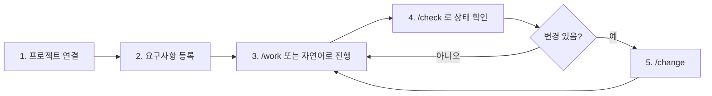
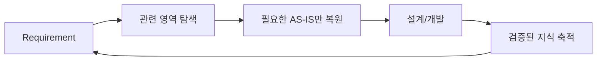
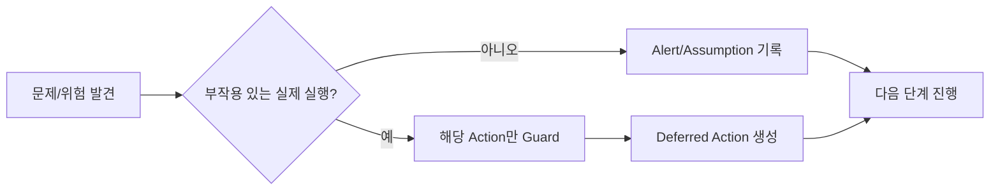
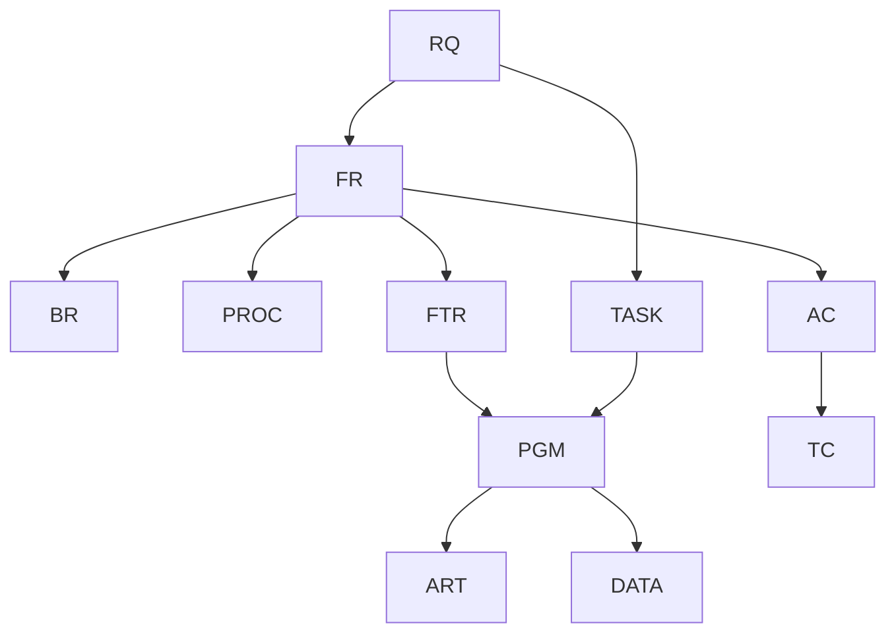
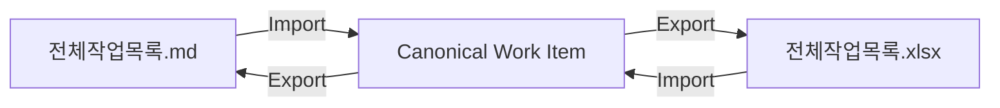
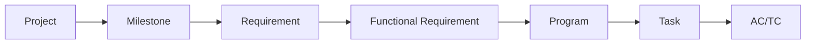
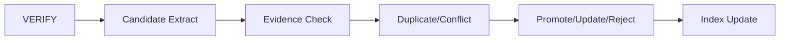
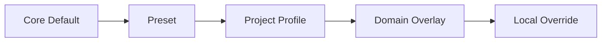

# AI-SDLC Harness
## Brownfield + Greenfield Current Full Design Baseline v1.5

> **문서 성격**
> v1.4의 Canonical Model, Brownfield JIT, Alert/Assumption, `/work /change /check`, Static Analysis First, Context Pack, Knowledge Promotion, Git Semantic Merge, Telemetry, Capability/Decision/Contract/Continuity Governance를 상속한다.
> v1.5는 비숙련 사용자 UX, Brownfield/Greenfield/Hybrid 공통 적용, Non-blocking Process, 직관적 파일명, 전체 작업목록 MD↔Excel, 한글 컬럼, PM Drill-down, Overlay Customizing, Quick Start/시각화 가이드를 강화한다.
> Silent Removal은 금지하며 기존 Capability 변경은 `UNCHANGED / ENHANCED / SUPERSEDED / DEPRECATED` 중 하나로 기록한다.

# 0. Quick Start

이 문서 전체를 읽지 않아도 아래 흐름만 알면 업무를 시작할 수 있다. 일반 사용자는 Agent, Canonical Model, Context Pack의 내부 동작을 먼저 학습할 필요가 없다.



## 0.1 10분 시작 절차

1. Harness 관리자가 `/setup`으로 프로젝트를 연결한다.
2. 기존 프로젝트면 README/가이드/Source/Build/Test/DB/Interface를 탐색해 Project Profile 후보를 만든다.
3. 신규 프로젝트면 기술스택/아키텍처 Preset을 선택한다.
4. 사용자는 `요구사항명 / 현재 문제 또는 요청내용 / 원하는 결과`만 등록한다.
5. 이후 `/work RQ-xxxx` 또는 `이 요구사항 계속 진행해줘`로 진행한다.
6. `/check`에서 현재 Stage, 남은 작업, 경고, 담당자/일정(지정된 경우), 다음 추천을 본다.
7. 변경이 생기면 `/change`로 남긴다.
8. 미확정 정보나 미완료 산출물이 있어도 다음 단계로 넘어갈 수 있다. 위험한 실제 실행만 Guard된다.

## 0.2 역할별 한 줄 사용법

| 역할 | 주로 보는 것 | 주 행동 |
|---|---|---|
| PM | `docs/00_관리/전체작업목록.md/.xlsx` | RQ→FR→PGM→TASK까지 Drill-down, 담당/일정은 필요할 때만 지정 |
| 분석/설계 | 요구분석/프로세스/영향/기능설계 | `/work RQ-xxxx` 후 Agent 초안 Review |
| 개발 | PGM 프로그램설계, TASK, 관련 Source/Standard | `/work TASK-xxxx` |
| 테스트 | AC/TC/Test Result/Verification | `/work`와 `/check` |
| 운영 | 질문, Business Rule, Operations Knowledge | 확인/피드백 |
| Harness 관리자 | `sdlc/config`, `sdlc/custom` | `/setup`, Preset/Profile/Overlay 관리 |

# 1. 목적과 적용 범위

Harness는 기존 운영 시스템(Brownfield), 신규 시스템(Greenfield), 두 방식이 공존하는 Hybrid 프로젝트에 공통 적용한다.

목적:

1. 요구사항을 구조화하고 업무 의미를 복원/정의한다.
2. Brownfield에서는 기존 Source/문서/DB/규칙을 Just-in-Time으로 재사용해 Customizing과 역설계를 줄인다.
3. Greenfield에서는 Preset/Template/Standard로 빠르게 시작한다.
4. 요구사항 → 기능 → 프로그램 → Source → Test를 추적 가능하게 연결한다.
5. Agent가 필요한 Context만 받아 분석·설계·개발·테스트를 수행한다.
6. 정보 부족을 숨기지 않고 Alert/Assumption으로 기록하되 업무 프로세스 자체는 막지 않는다.
7. 확인된 업무·기술 지식을 Knowledge Base로 축적한다.
8. Git 파일 Merge와 Canonical 의미 Merge를 함께 관리한다.
9. Agent 생산성/비용/활용도를 Verified Result 기준으로 측정한다.
10. Harness 자체의 Rule/Skill/Template/Config/Schema도 버전과 Capability로 관리한다.

최종 정의:

> **기존 프로젝트에서는 기존 자산을 최대한 재사용하고, 신규 프로젝트에서는 표준 Preset으로 빠르게 시작하며, 어느 경우에도 사람의 업무 흐름을 강제로 막지 않고 분석·설계·개발·테스트·지식 축적을 추적 가능하게 수행하는 AI-SDLC Harness**

# 2. 핵심 설계 원칙

## 2.1 Document-Driven Development + Spec-Driven Development

이 문서의 DDD는 Domain-Driven Design이 아니라 Document-Driven Development다.

```text
Requirement
→ Analysis / Design
→ CHANGE
→ IMPACT
→ SPEC
→ PLAN
→ TASKS
→ IMPLEMENT
→ VERIFY
→ RESULT
→ Docs / Knowledge Sync
```

- CHANGE: 왜 바꾸는가
- IMPACT: 어디에 영향을 주는가
- SPEC: 목표 동작은 무엇인가
- PLAN: 어떻게 구현할 것인가
- TASKS: 누가 실행할 최소 단위인가
- RESULT: 실제 무엇이 변경되었는가

## 2.2 Brownfield JIT Documentation

기존 시스템 전체를 먼저 역설계하지 않는다.



Source에 구현되어 있다는 이유만으로 Business Rule로 확정하지 않는다. Source는 `OBSERVED`, 사람이 제공한 정책은 `GIVEN`, Agent 판단은 `INFERRED`, 공식 확인 후 `CONFIRMED`로 구분한다.

## 2.3 Brownfield / Greenfield / Hybrid 공통 Contract

Project Mode:

- `AUTO`: 기존 자산 탐색 결과로 추천
- `BROWNFIELD`: 기존 프로젝트
- `GREENFIELD`: 신규 프로젝트
- `HYBRID`: 기존/신규 영역 공존

```mermaid
flowchart TD
    S[/setup] --> Q{기존 자산 존재?}
    Q -- 예 --> B[Existing Asset Bootstrap]
    Q -- 아니오 --> G[Greenfield Preset]
    B --> P[Project Profile]
    G --> P
    P --> O[Overlay 차이만 Customizing]
    O --> W[동일한 /work /change /check]
```

`/setup` 이후 Stage, Skill, Artifact, Canonical Contract는 Project Mode와 무관하게 동일하다.

## 2.4 Process Never Blocked

사용자가 다음 단계로 진행하려고 하면 Harness는 Workflow/Stage 전체를 강제로 정지시키지 않는다.

- 미확정 정보 → `Alert + Assumption + OPEN`
- 미완료 산출물 → `PARTIAL / WARNING`
- 담당자/일정 미지정 → 빈 값 허용
- 선행 Task 미완료 → 후속 Task를 `PLANNED / AT_RISK`로 생성 가능
- 위험한 실제 동작 → 해당 동작만 `EXECUTION_GUARDED`



기존 v1.4의 `Hard Block`은 **ENHANCED**되어 Execution Guard로 의미를 좁힌다.

Execution Guard 예:

- 운영 DB 위험 DML
- 미해결 Git Conflict 상태의 Source overwrite
- Canonical Schema를 파손하는 write
- Published Display ID 중복 write
- 보안/안전 MUST 표준 위반 실행
- Release 불가능 상태에서의 배포 실행

Guard가 있어도 분석, 설계, 테스트 설계, 다른 Task, 일정 재계획은 계속할 수 있다.

# 3. 사용자 Lifecycle과 Skill

사용자에게 보이는 Stage:

```text
요구사항 → 분석/설계 → 개발 → 테스트 → 완료
```

내부 Stage:

```text
INTAKE
→ DECOMPOSE
→ CLARIFY
→ PROCESS
→ DISCOVERY
→ IMPACT
→ DESIGN
→ PROGRAM
→ DEVELOPMENT
→ TEST
→ VERIFY
→ KNOWLEDGE PROMOTION
```

Stage 최소 Output이 있으면 다음 단계로 진행할 수 있다. Quality/Validity는 별도 상태로 관리한다.

## 3.1 `/work`

현재 RQ/PGM/TASK에서 다음 실행 가능한 작업을 진행한다.

- `/work RQ-0042`
- `/work PGM-ATT-0016`
- `/work TASK-0042-DEV-002`
- `아까 하던 작업 계속해줘`

## 3.2 `/change`

자연어 변경을 `CLARIFICATION / BEHAVIOR_CHANGE / TECHNICAL_CHANGE / NEW_REQUIREMENT`로 구조화하고 관련 산출물을 STALE 처리한다.

## 3.3 `/check`

현재 Stage, 완료/미완료, Open Alert, Execution Guard, 일정 Risk, 다음 추천 작업을 보여준다.

## 3.4 `/setup`

Harness 관리자용. Repository Profile, Existing Asset Bootstrap, Preset, Overlay, Validation을 담당한다.

# 4. Truth / Evidence / Inference

중요 정보 상태:

- `GIVEN`: 사람이 제공
- `OBSERVED`: Source/DB/Log 등에서 관찰
- `INFERRED`: Agent 추론
- `CONFIRMED`: 사람 또는 공식 문서로 확정
- `OPEN`: 미확정

Human Truth:

- 요구사항, 업무 정책, 인터뷰, 예외정책, PM 일정/담당자, 승인된 Change

System Evidence:

- Source, Mapper, Procedure, Table/Column, Code Master, Batch, Interface, Test, Runtime Log

핵심 제약:

> Source 구현을 Business Requirement로 자동 확정하지 않는다.

# 5. Canonical Model

문서와 Excel은 View이고 Canonical Model이 Entity/Relation 원장이다.

Knowledge Entity:

- RQ Requirement
- FR Functional Requirement
- BR Business Rule
- PROC Process
- FTR Feature
- PGM Logical Program
- ART Physical Artifact
- DATA Table/Column
- CODE Code Master
- AC Acceptance Criteria
- TC Test Case
- INT Interview
- ASM Assumption
- ALT Alert
- CR Change Request

Execution Entity:

- MS Milestone
- WP Work Package
- TASK Task
- RES Resource/Person
- ASN Assignment

대표 관계:



상태:

- Progress: `NOT_STARTED / WORKING / COMPLETE`
- Quality: `OK / WARNING / CRITICAL`
- Validity: `CURRENT / STALE / INVALID`
- Task: `NOT_STARTED / READY / IN_PROGRESS / BLOCKED / DONE`

`BLOCKED`는 Workflow 전체 중단이 아니라 해당 Task의 즉시 실행 불가 상태이며 `DEFERRED`로 이월 가능하다.

# 6. Target Resolver와 Scope

해상도:

```text
RQ → FTR → PGM → TASK → ART / SYMBOL
```

우선순위:

1. Explicit TASK ID
2. Explicit PGM ID
3. Explicit Source/Symbol
4. Explicit RQ + 자연어 Target
5. Active Context
6. Canonical Direct Relation
7. 현재 사용자 Assignment
8. Exact Name / Domain
9. Semantic Search

Confidence: `HIGH / MEDIUM / LOW`.

Top 후보가 모호하면 **Source write만 보류**하고 `DEFERRED_TARGET_DECISION`으로 기록한다. 분석/설계/후보 비교/다른 Task는 계속한다.

다른 Logical Program, 신규 Interface/Batch/Table, High Risk Change가 발견되면 자동 확장하지 않고 Task Candidate를 만든다.

# 7. Brownfield Bootstrap과 Customizing 최소화

기존 프로젝트는 다음 순서로 재사용한다.

1. README/CONTRIBUTING/Architecture/사내 가이드
2. 실제 Source 구조와 Build 설정
3. 기존 Test/CI 규칙
4. DB/Mapper/Procedure/Interface 정의
5. 반복되는 코드 패턴
6. 부족한 부분만 Overlay

탐색 결과 상태:

`DISCOVERED → ADOPTED / OVERRIDDEN / IGNORED`

이 상태를 기록해 Agent가 기존 프로젝트 규칙과 Harness 기본값을 혼동하지 않게 한다.

# 8. 산출물과 파일명

## 8.1 파일명 규칙

파일은 폴더 밖에서 단독으로 보더라도 의미가 보여야 한다.

```text
<대표ID>_<짧은업무명>_<산출물종류>.<확장자>
```

예:

- `RQ-0042_휴가취소근태반영_요구사항.md`
- `RQ-0042_휴가취소근태반영_요구분석.md`
- `RQ-0042_휴가취소근태반영_프로세스분석.md`
- `RQ-0042_휴가취소근태반영_영향분석.md`
- `RQ-0042_휴가취소근태반영_기능설계.md`
- `PGM-ATT-0016_근태재계산_프로그램설계.md`
- `RQ-0042_휴가취소근태반영_구현결과.md`
- `RQ-0042_휴가취소근태반영_검증결과.md`

원칙:

- ID는 Traceability, 짧은업무명은 사람의 이해를 담당한다.
- 파일명은 80자 권장 상한.
- `/ \\ : * ? " < > |` 금지.
- Relation은 경로가 아니라 UID로 연결해 rename에 안전하게 한다.

기존 `requirement.md`, `impact-analysis.md`, `PGM-ATT-0016.md` 같은 일반명은 **SUPERSEDED**한다.

## 8.2 사용자 문서 구조

```text
docs/
├─ 00_관리/
│  ├─ 전체작업목록.md
│  └─ 전체작업목록.xlsx
├─ 01_requirements/
│  └─ RQ-0042/RQ-0042_휴가취소근태반영_요구사항.md
├─ 02_analysis/
│  └─ RQ-0042/
│     ├─ RQ-0042_휴가취소근태반영_요구분석.md
│     ├─ RQ-0042_휴가취소근태반영_인터뷰.xlsx
│     └─ RQ-0042_휴가취소근태반영_프로세스분석.md
├─ 03_impact/
│  └─ RQ-0042/RQ-0042_휴가취소근태반영_영향분석.md
├─ 04_design/
│  └─ RQ-0042/RQ-0042_휴가취소근태반영_기능설계.md
├─ 05_program/
│  ├─ program-list.xlsx
│  └─ RQ-0042/specs/PGM-ATT-0016_근태재계산_프로그램설계.md
├─ 06_data/
├─ 07_test/
│  └─ RQ-0042/RQ-0042_휴가취소근태반영_검증결과.md
└─ 08_management/
   └─ RQ-0042/RQ-0042_휴가취소근태반영_구현결과.md
```

# 9. 전체 작업목록과 MD↔Excel 양방향 변환

프로젝트에는 반드시 두 View가 존재한다.

```text
docs/00_관리/전체작업목록.md
docs/00_관리/전체작업목록.xlsx
```

둘은 동일한 Canonical Work Item을 표현한다.



양방향 변환 원칙:

1. `작업ID`는 stable ID이며 rename/정렬과 무관하다.
2. `변경버전(revision)`과 `최근변경일시(updated_at)`를 Sync 기준으로 사용한다.
3. MD 또는 Excel 어느 쪽에서 수정해도 Canonical Import 후 다른 View를 재생성한다.
4. 양쪽이 동시에 다른 값으로 수정되면 값을 버리지 않고 `SYNC_CONFLICT`를 생성한다.
5. Sync Conflict가 있어도 다른 Work Item과 다음 Stage 진행은 막지 않는다.
6. 사용자 표시 Header는 한글이 기본이며 내부 key와 분리한다.
7. Column 명/순서는 `sdlc/config/worklist-columns.yaml`에서 관리한다.

## 9.1 한글 컬럼 표준

| 한글 컬럼명 | 내부 key | 필수 | 의미 |
|---|---|---|---|
| 작업ID | work_item_id | 필수 | 안정 ID |
| 상위작업ID | parent_id | 선택 | Drill-down 계층 |
| 요구사항ID | requirement_id | 선택 | 관련 RQ |
| 작업구분 | item_type | 필수 | 요구사항/기능/프로그램/작업/테스트 |
| 작업명 | name | 필수 | 사람이 이해하는 이름 |
| 단계 | stage | 필수 | 분석/설계/개발/테스트 등 |
| 상태 | status | 필수 | 미시작/진행중/완료/보류 등 |
| 품질상태 | quality | 선택 | 정상/경고/중요경고 |
| 유효상태 | validity | 선택 | 현재/변경필요/무효 |
| 담당자 | assignee | 선택 | PM Tracking |
| 계획시작일 | planned_start | 선택 | PM Tracking |
| 계획종료일 | planned_end | 선택 | PM Tracking |
| 예상공수 | estimated_effort | 선택 | PM Tracking |
| 실제시작일 | actual_start | 선택 | 실제 추적 |
| 실제종료일 | actual_end | 선택 | 실제 추적 |
| 실제공수 | actual_effort | 선택 | 실제 추적 |
| 선행작업ID | dependency_ids | 선택 | Dependency |
| 관련프로그램ID | program_ids | 선택 | PGM 연결 |
| 완료기준ID | acceptance_test_ids | 선택 | AC/TC 연결 |
| 경고·확인사항 | alerts | 선택 | Open Alert 요약 |
| 최근변경일시 | updated_at | 자동 | Sync 기준 |
| 변경버전 | revision | 자동 | Sync 기준 |
| 비고 | note | 선택 | 자유 입력 |

# 10. PM Breakdown과 Optional Tracking

PM 관리 계층:



PM은 같은 Work List에서 깊이를 바꿔 본다.

- 요구사항별: FR, 설계 Coverage, Program Coverage, Task, AC/TC Coverage, Alert
- 프로그램별: 관련 RQ/FR, 변경유형, 개발/Test Task
- 작업별: 상태, 담당자(선택), 일정(선택), 선행작업, Risk
- 담당자별: 배정된 경우에만 작업량/일정 View

`담당자`, `계획시작일`, `계획종료일`, `예상공수`는 모두 **Optional**이다. 미지정이어도 상태 추적과 Stage 진행은 가능하다.

Rolling-wave Planning:

- L1 ROUGH: 요구 초기
- L2 REFINED: Impact 완료
- L3 COMMITTED: Program List/Task/담당자 확정 시점

사람 배정이나 일정 입력은 완료조건이 아니다.

# 11. 분석/설계/프로그램/개발/Test Contract

## 11.1 Requirement Intake

사람이 쓰는 최소 항목:

- 요구사항명
- 현재 문제 또는 요청내용
- 원하는 결과

권장: 유지조건, 우선순위, 참고자료, 목표일정.

RQ는 Business Goal → FR → BR Candidate → AC로 분해한다.

## 11.2 Existing System Discovery

Brownfield는 전체 Repository를 LLM으로 먼저 읽지 않는다.

- Symbol/Call Graph
- DB/Mapper/Procedure Map
- Code Registry
- Interface Map

후보를 줄인 뒤 Relevant Symbol/Source Snippet을 읽는다.

## 11.3 Impact Analysis

Impact는 반드시 세 층으로 구분한다.

1. Business Impact
2. Functional Impact
3. Technical Impact

Candidate는 Evidence, Confidence, Status를 가진다.

- Status: `CONFIRMED / CANDIDATE / CHECK_REQUIRED`
- Confidence: `HIGH / MEDIUM / LOW`

Technical Relation만으로 Business Impact를 확정하지 않는다.

## 11.4 Functional Design

- 기능개요
- 정상흐름
- Input/Output
- Validation/State
- Exception
- Data Change
- Transaction
- Authorization
- Interface
- Logging/Audit
- NFR
- AC Mapping

## 11.5 Program Model

```text
Feature → Logical Program → Physical Artifact
```

변경유형: `NEW / MODIFY / DELETE / VERIFY_ONLY`.

Program Spec Level:

- L0 Reference
- L1 Simple Change
- L2 Logic/Transaction/Interface Change

Program Spec은 역할, 변경이유, AS-IS, TO-BE, 흐름, Data, BR, Call Relation, Transaction, Error, 개발제약, Applicable Standards, Deviation, AC/Test Mapping을 포함한다.

신규 Program보다 기존 책임/Transaction/Interface/Architecture Convention 재사용을 우선한다.

## 11.6 Development

`TASK → Canonical Context → Knowledge → Standards → Trace → Context Pack → Source 수정 → Scope Validation → Test → Canonical Update` 순서다.

관련 없는 Refactoring은 하지 않는다.

## 11.7 Test / Verify

AC → TC → Test Result → Verification Result를 연결한다. 실패/미수행은 숨기지 않고 상태로 남긴다.

# 12. Context Pack / Token Economy

Agent 성능을 낮추지 않고 불필요한 Context를 제거한다.

Priority:

- P0 Current RQ/TASK
- P1 Related BR/AC
- P2 Program Spec
- P3 Relevant Trace
- P4 Source Snippet
- P5 Historical Context

Retrieval:

```text
Canonical Model
→ Program Summary
→ Trace Graph
→ Relevant Symbol
→ Source Snippet
→ 필요 시 Full File
```

Program Summary는 Responsibility, Entry, Calls, Tables, Procedures, Codes, BR, Exception, Source Hash를 가진다.

Overflow는 History 제거 → Full Doc Summary → Graph Depth 축소 → Full File을 Symbol로 축소 → Low-confidence Candidate 제거 순이다.

# 13. Rule / Skill / Template / Development Standards

Rule은 Always 적용되는 최소 원칙만 둔다.

예:

1. Requirement와 Source Evidence 구분
2. Production 변경은 RQ/TASK와 연결
3. 정보 부족 시 Alert + Assumption
4. Source만으로 Business Rule 확정 금지
5. 기존 Architecture 우선
6. 관련 없는 Refactoring 금지
7. 위험 Production DB 작업 금지
8. 변경 후 AC/Test 관계 확인

사용자 Skill은 `/work /change /check`, 관리자만 `/setup`.

Template Section은 목적, 작성기준, 필수여부, 예시를 가진다.

Development Standards는 Architecture, Frontend, Backend, Persistence, DB, Transaction, Exception, Logging, Security, Test Library로 분리하고 ID와 `MUST / SHOULD / REFERENCE` Level을 가진다.

Legacy와 MUST가 충돌하면 무리한 리팩터링 대신 `Standard Deviation`을 기록한다.

# 14. Knowledge Promotion / Retrieval

완료 문서 전체를 다음 Context에 넣지 않는다.

Reusable Knowledge:

- Confirmed Business Rule/Process
- Program Responsibility/Summary
- Data/Code/Interface Meaning
- Architecture Decision
- Operational Constraint
- Known Edge Case
- Verified Test Pattern

Knowledge Level:

- K1 Confirmed Business
- K2 Verified Technical
- K3 Historical Evidence

Promotion:



동일 의미는 Evidence 추가, 확장은 Version Update, 상반되면 Conflict Entity를 만든다. 조용히 overwrite하지 않는다.

Freshness:

- Technical: Source Hash
- Business: CR/Interview/Policy Change

Retrieval은 Direct Relation → Exact Program/Process/BR → Same Domain → Keyword → Semantic → Historical 순이다.

# 15. Harness Customizing

Core를 직접 수정하기 전에 Overlay를 사용한다.



권장 구조:

```text
sdlc/custom/
├─ project/
│  ├─ workflow-overrides.yaml
│  ├─ artifact-overrides.yaml
│  ├─ naming-overrides.yaml
│  └─ terminology.yaml
├─ domain/<domain>/
│  ├─ rules/
│  ├─ standards/
│  └─ templates/
└─ presets/
   ├─ brownfield-auto.yaml
   └─ greenfield-default.yaml
```

코드 수정 없이 바꿀 수 있어야 하는 것:

- Stage 사용/숨김/별칭
- 산출물 생성 여부와 이름
- 한글 컬럼명/프로젝트 용어
- Template Section 추가/제외
- Project/Domain Standard
- Alert Rule
- 파일명 규칙
- PM Tracking 컬럼
- Brownfield 탐색 경로/가이드 위치
- Greenfield Preset

Override가 ACTIVE Capability를 제거하면 Continuity Validator가 경고한다. Validation 경고는 일반 사용자의 업무 프로세스를 막지 않는다.

# 16. 사용자 Guide Contract

Harness 배포 시 다음 문서는 필수다.

- `sdlc/README.md`: 전체 Quick Start와 역할별 진입점
- `sdlc/guides/01_SDLC_전체가이드.md`
- `sdlc/guides/02_SKILL_사용가이드.md`
- `sdlc/guides/03_TEMPLATE_산출물가이드.md`
- `sdlc/guides/04_HARNESS_커스터마이징가이드.md`

모든 가이드의 첫 화면에는 Quick Start가 있어야 하고, 각 주요 단락에는 workflow Mermaid를 둔다.

단계 가이드 표준 단락:

1. 이 단계는 언제 하는가
2. 30초 Quick Start
3. Workflow 그림
4. 입력자료
5. 사람이 하는 일
6. Agent가 하는 일
7. 생성/갱신 산출물
8. 완료의 의미
9. 미확정이어도 넘어가는 방법
10. `/check` 확인 항목
11. 예시

# 17. Git / Merge / 동시개발

역할 분리:

- Git: Source/Config/Document 파일 이력
- Canonical: RQ/PGM/TASK/DATA/Test의 의미와 관계

따라서 `Git File Merge + Semantic Canonical Merge`를 수행한다.

기본 Branch:

```text
1 Task ≈ 1 Short-lived Branch
```

예: `task/RQ-0042/TASK-0042-DEV-002`.

Canonical은 전체 파일 대량 수정 대신 Branch Delta를 만들고 Main Snapshot과 Semantic Merge한다.

Field 정책:

- Human Scalar Truth: 양쪽 변경 시 Conflict
- Relation List: Set Union 가능
- Derived State: Recalculate
- Generated Summary: Regenerate
- PM Schedule/Assignment: 최신 PM Canonical 값 보존

Excel/Generated MD는 Binary 직접 Merge보다 Canonical Merge 후 재생성한다.

Merge 후 Changed Files → Changed Symbols → Incremental Static Analysis → Trace Update → Knowledge STALE → Related Test → Reverification.

# 18. Telemetry / Metrics

Hook Event:

- PROMPT
- TOOL_START/END/ERROR
- FILE_EDIT
- AGENT_RESPONSE/END
- COMPACTION

Correlation:

- project_id
- user_id
- conversation_id
- generation_id
- rq_id
- task_id
- program_id
- stage
- skill
- branch/commit

Hook은 중앙 DB에 동기 Insert하지 않고 Local JSONL → Batch/Flush → Metric Store.

Prompt/Response 원문보다 hash/length/category/RQ/TASK/Tool/File 중심으로 저장한다.

핵심 Metric:

- Task/Requirement Cycle Time
- Verified Task
- First Pass Success/Rework
- Observable Token / Verified Task
- Read-to-Change Ratio
- Summary Reuse
- AI Cost / Verified Task
- Knowledge Reuse
- Target Auto Resolution/Correction
- Git/Semantic Conflict
- Merge-to-Verify Time

Prompt Count나 Run Count 자체를 생산성으로 보지 않는다.

# 19. Config / Folder Contract

```text
PROJECT_ROOT/
├─ src/
├─ web/
├─ tests/
├─ docs/
│  ├─ 00_관리/
│  ├─ 01_requirements/
│  ├─ 02_analysis/
│  ├─ 03_impact/
│  ├─ 04_design/
│  ├─ 05_program/
│  ├─ 06_data/
│  ├─ 07_test/
│  └─ 08_management/
├─ sdlc/
│  ├─ README.md
│  ├─ guides/
│  ├─ config/
│  │  ├─ project.yaml
│  │  ├─ project-profile.yaml
│  │  ├─ worklist-columns.yaml
│  │  ├─ artifact-catalog.yaml
│  │  ├─ workflow.yaml
│  │  ├─ alerts.yaml
│  │  ├─ token-budget.yaml
│  │  ├─ metrics.yaml
│  │  ├─ target-resolution.yaml
│  │  ├─ knowledge.yaml
│  │  ├─ merge-policy.yaml
│  │  └─ design-continuity.yaml
│  ├─ custom/
│  ├─ design/
│  ├─ templates/
│  ├─ schema/
│  ├─ standards/
│  ├─ canonical/
│  ├─ knowledge/
│  ├─ trace/
│  ├─ runtime/
│  ├─ hooks/
│  ├─ scripts/
│  └─ metrics/
└─ .cursor/
   ├─ rules/
   ├─ skills/
   ├─ agents/
   └─ hooks.json
```

사람이 주로 수정: docs Human-owned 입력, `sdlc/config`, `sdlc/custom`, templates, standards, rules/skill 설명.

Harness 관리: canonical, runtime, trace 결과, metrics, Generated AUTO 영역, Knowledge Index/View.

# 20. Design Governance

Harness 자체도 SDD 방식으로 관리한다.

```text
DESIGN BASELINE
├ Capability Registry
├ Decision Registry
├ Contracts
└ Continuity Validator
      ↓
HARNESS IMPLEMENTATION
      ↓
PROJECT SDLC
```

Capability → Decision → Config → Skill → Implementation → Test로 연결한다.

Continuity 오류 예:

- 기존 ACTIVE Capability 누락
- Superseded/Deprecated 이유 없음
- Broken Dependency
- Decision vs Config 불일치
- Template/Skill/Metric Contract 누락
- Schema Migration 누락
- DECISION_REQUIRED
- Registry 변경 미기록

# 21. PoC 구현 순서

## Phase 0 — Design Baseline

- Manifest/Capabilities/Decisions/Contracts/Continuity

## Phase 0.5 — Usability / Bootstrap Contract

- Quick Start + 역할별 Guide
- Project Mode AUTO/BROWNFIELD/GREENFIELD/HYBRID
- Existing Asset Bootstrap
- 파일명 정책
- 전체작업목록 MD↔Excel Sync Contract
- 한글 Column Mapping
- Process Never Blocked + Execution Guard
- Custom Overlay

## Phase 1 — Canonical Core

RQ/FR/BR/PGM/TASK/AC/TC/ALT/ASM/Relations.

## Phase 2 — `/work` + Target Resolver

Explicit RQ/PGM/TASK, Active Context, State Router.

## Phase 3 — Static Analysis + Trace

기존 분석기 연결.

## Phase 4 — Context Pack + Token Economy

Program Summary, Hash Cache, Stage Budget.

## Phase 5 — Program Spec + Development

PGM List/Spec, Development Context, Source 수정.

## Phase 6 — Test / Verify

AC→TC, Verification Result, Verified Task.

## Phase 7 — Knowledge Promotion

BR/PROC/PGM Summary 우선.

## Phase 8 — Change / STALE Propagation

CR, Dependency traversal.

## Phase 9 — Git Semantic Merge

Task Branch, Revision, Branch Delta, Regeneration.

## Phase 10 — Metrics / PM View

Task Cost/Productivity, Requirement/Task/Resource View.

# 22. PoC 성공 기준

## UX
비숙련 사용자가 Quick Start와 `/work /change /check`만으로 전체 흐름을 따라갈 수 있는가.

## Project Mode
Brownfield는 기존 Source/Guide 재사용으로 Customizing이 줄고, Greenfield는 Preset으로 같은 Delivery Loop를 시작하는가.

## Non-blocking
미확정/미완료/위험사항이 있어도 위험 Action만 Guard되고 다른 단계/작업을 계속할 수 있는가.

## Work List / Excel
`전체작업목록.md ↔ 전체작업목록.xlsx`가 한글 Header와 stable ID/revision을 유지하며 양방향 변환되는가.

## PM
RQ→FR→PGM→TASK→AC/TC Drill-down이 가능하고 담당자/일정 미지정 상태도 정상 동작하는가.

## Requirement/Impact/Development/Test
FR 분해, Impact Recall/Precision, Program Spec 기반 Rework, AC→TC Coverage를 검증한다.

## Token/Knowledge/Metrics/Merge
Context 절감, 두 번째 RQ의 Knowledge 재사용, Agent Run→Verified Result 연결, Semantic Conflict/Freshness 탐지를 검증한다.

# 23. v1.5 Design Decisions

1. Brownfield JIT Documentation 유지
2. Canonical Model이 Entity/Relation 원장
3. Human Truth와 System Evidence 분리
4. Source 관찰을 Business Rule로 자동 확정 금지
5. Approval보다 Alert 기반 Workflow
6. **Workflow/Stage는 Non-blocking**
7. 위험한 부작용 Action만 Execution Guard
8. 일반 사용자 Skill은 `/work /change /check`
9. `/setup`은 관리자용
10. RQ/PGM/TASK Target 해상도 분리
11. Ambiguous Write는 해당 write만 defer
12. Static Analysis First
13. Program Summary/Context Pack 우선
14. UID + Display ID 분리, Published ID immutable
15. 완료 문서 전체 ≠ Knowledge
16. Structured Relation Retrieval 우선
17. Knowledge Conflict explicit
18. 개발표준은 Relevant Section만 주입
19. Legacy Standard Deviation 허용
20. Verified Task를 Productivity 핵심 단위로 사용
21. Git Merge와 Semantic Merge 분리
22. Generated Documents는 Canonical에서 재생성
23. Task Branch 기본
24. Full Design Inheritance / Silent Removal 금지
25. Brownfield/Greenfield/Hybrid는 동일 Stage/Skill/Artifact Contract 사용
26. Existing Asset Bootstrap으로 기존 프로젝트 Customizing 최소화
27. 파일명은 `ID + 짧은업무명 + 산출물종류`
28. 전체작업목록 MD/Excel은 Canonical Work Item의 양방향 View
29. 사용자 표시 Column은 한글 기본, 내부 key와 Mapping
30. PM 담당자/일정/공수는 Optional
31. Harness Customizing은 Core 수정보다 Overlay 우선
32. 필수 Guide는 상단 Quick Start + 주요 단락별 Workflow 시각화
33. 미해결 설계 충돌은 기록하고 질문하되 다른 안전한 업무 진행을 막지 않음

# 24. v1.4 → v1.5 Continuity

| v1.4 개념 | v1.5 상태 | 설명 |
|---|---|---|
| Canonical Model | UNCHANGED | 관계 원장 유지 |
| Human Truth/System Evidence | UNCHANGED | 출처 구분 유지 |
| Brownfield JIT | ENHANCED | Greenfield/Hybrid 공통 Contract 추가 |
| Approval-free/Alert-driven | ENHANCED | Process Never Blocked 명시 |
| Hard Block | ENHANCED | Workflow Block이 아닌 Execution Guard로 축소 |
| `/work /change /check` | UNCHANGED | `/setup` 관리자 UX 보강 |
| Static Analysis First | UNCHANGED | Existing Asset Bootstrap과 연결 |
| Generic artifact filename | SUPERSEDED | 직관적 파일명 규칙으로 대체 |
| PM Task/Resource/Schedule | ENHANCED | RQ→FR→PGM→TASK→AC/TC Drill-down + Optional Tracking |
| Excel Generated Artifact | ENHANCED | 전체작업목록 MD↔Excel 양방향 View Contract |
| Config/Templates/Standards | ENHANCED | Preset/Profile/Domain Overlay/Local Override |
| User Guide | ENHANCED | Quick Start + Mermaid workflow Contract |
| Knowledge/Git/Metrics/Governance | UNCHANGED | 기존 Capability 유지 |

# Appendix A. 9개 사용자 요구사항 Traceability

| # | 요구사항 | v1.4 판단 | v1.5 반영 | 대표 절 |
|---|---|---|---|---|
| 1 | Agent 비숙련자도 전체 구조를 따라감 | 부분적합 | Quick Start/역할별/단계 가이드 강화 | 0, 3, 16 |
| 2 | 기존/신규 공통, 기존 자산으로 Customizing 최소화 | 미흡~부분 | Project Mode/Bootstrap/Preset | 2.3, 7, 15 |
| 3 | 단계 진행 강제 Block 금지 | 부분적합 | Process Never Blocked + Action Guard | 2.4, 5, 6 |
| 4 | 파일명 직관적 | 미흡 | ID+업무명+산출물종류 | 8 |
| 5 | 전체 작업목록 + Excel 양방향 Convert | 미흡 | MD/XLSX Canonical View | 9 |
| 6 | MD/Excel 한글 컬럼 | 미흡 | 한글 Header Contract/YAML | 9.1 |
| 7 | PM 세부 Breakdown + 담당/일정 Optional | 부분적합 | Drill-down/Optional 명시 | 10 |
| 8 | 관리자 쉬운 Customizing | 부분적합 | Overlay 구조 | 7, 15, 19 |
| 9 | SDLC/SKILL/Template/단계 Guide + Quick Start + 시각화 | 부분적합 | 필수 Guide Contract | 0, 16 |

# Appendix B. 필수 상세 Guide

- `sdlc/README.md`
- `sdlc/guides/01_SDLC_전체가이드.md`
- `sdlc/guides/02_SKILL_사용가이드.md`
- `sdlc/guides/03_TEMPLATE_산출물가이드.md`
- `sdlc/guides/04_HARNESS_커스터마이징가이드.md`

# Appendix C. Baseline 선언

- Baseline Version: v1.5
- Previous Baseline: v1.4
- Silent Removal: 금지
- Current blocking `DECISION_REQUIRED`: 없음
- 일반 업무 Workflow: Non-blocking
- 위험 실제 실행: Execution Guard
- Current Full Design: 본 문서
