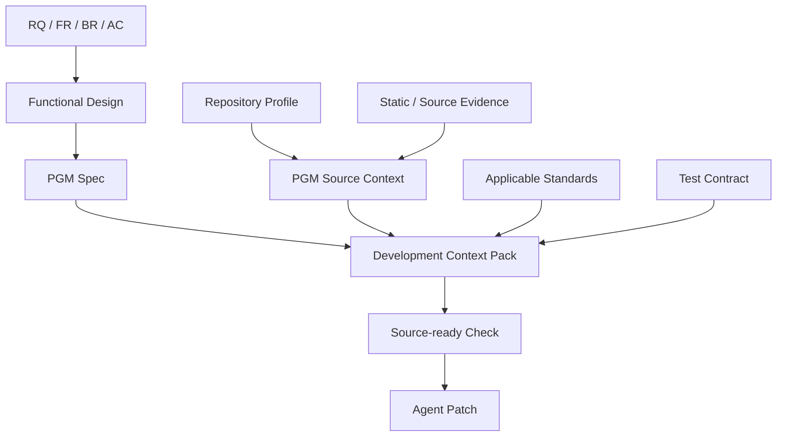

# 01. Source-ready Design + Brownfield Existing Source Context Contract

## Quick Start

`functional-design.md` 또는 `PGM Spec` 하나만으로 Agent에게 Source 생성을 지시하지 않는다.

Source 변경 직전에는 다음을 묶은 `Development Context Pack`을 만든다.

```text
Business Intent
+ Program Design
+ Current Source Evidence
+ Project Convention
+ Data / Transaction / Security
+ Test Contract
+ Change Boundary
= Development Context Pack
```

## Purpose

Brownfield에서 설계가 실제 코드 생성에 충분하려면 **TO-BE 설명**뿐 아니라 `현재 Source가 실제로 어떻게 생겼는지`와 `무엇을 유지해야 하는지`가 함께 전달되어야 한다.

## Current Problem

Pilot의 `PGM-ATT-CLOSE-001.md`는 변경 방향을 설명하지만 다음이 빠지면 Agent가 자의적으로 구현할 수 있다.

- 정확한 File/Symbol Target
- Source revision/hash
- 호출 관계와 Transaction 시작점
- Mapper interface ↔ XML statement 대응
- Parameter/Result type
- SQL Key/Index/Lock/Null semantics
- Project 고유 Error/Logging/Code convention
- 이미 존재하는 유사 구현
- Generated/Protected 영역
- 최소 회귀 Test

따라서 `설계문서 충분성`은 문서 페이지 수가 아니라 **Source Write에 필요한 계약 필드의 Coverage**로 측정한다.

## Design

### 1. Source-ready Gate

Source 생성/수정 전에 아래 8개 영역을 확인한다.

| 영역 | 필수 질문 |
|---|---|
| Intent | 어떤 RQ/FR/BR/AC를 구현하는가? |
| Target | 어떤 PGM/File/Symbol을 수정하는가? |
| AS-IS | 현재 구현은 실제로 어떻게 동작하는가? |
| TO-BE | 변경 후 동작/예외/상태는 무엇인가? |
| Data | Table/Column/Code/Query 의미와 Write 범위는? |
| Runtime Boundary | Transaction/Auth/Interface/Batch 경계는? |
| Convention | 기존 Project가 따르는 구현 패턴은? |
| Verification | 어떤 Test로 변경 성공과 비회귀를 확인하는가? |

하나라도 `CRITICAL OPEN`이면 Patch Proposal까지는 만들 수 있으나 해당 정보가 필요한 실제 Write는 보수적으로 제한한다.

### 2. Brownfield Source Profile

Project 최초 Bootstrap 시 Repository 전체를 문장으로 설명하지 않고 Profile을 만든다.

필수 범주:

- source roots / test roots / resource roots
- Java/Spring version
- MyBatis mapper 위치/namespace 규칙
- Controller/Service/DAO/Mapper layering
- Transaction annotation 위치 convention
- Exception/Error response convention
- Logging/Audit convention
- DB vendor/schema/package
- Code Master 위치
- build/test commands
- generated code / do-not-edit path
- legacy deviations

### 3. PGM Source Context

전체 Project Profile보다 더 구체적인 Program 단위 Context다.

```text
PGM-ATT-CLOSE-001
├ current responsibility
├ entry symbols
├ called-by / calls
├ mapper namespace/statements
├ read/write tables
├ transaction owner
├ known BR evidence
├ relevant standards
├ similar implementation reference
├ protected constraints
└ source hashes
```

### 4. Source Snippet Selection

전체 파일을 무조건 Context에 넣지 않는다.

우선순위:

1. 변경 Symbol
2. 같은 PGM의 직접 호출 Symbol
3. 관련 Mapper statement
4. 관련 Data definition
5. 동일 Pattern의 Reference implementation
6. 필요할 때만 Full file

## Workflow Diagram



## Data / Contract

`Development Context Pack` 최소 필드:

```yaml
context_pack:
  rq_id: RQ-PILOT-017
  fr_ids: [FR-P017-01, FR-P017-03, FR-P017-04]
  br_ids: [BR-P017-01, BR-P017-02, BR-P017-03]
  ac_ids: [AC-01, AC-03, AC-04, AC-05]
  task_id: TASK-P017-DEV-01
  program_id: PGM-ATT-CLOSE-001
  target:
    files:
      - src/main/java/com/acme/attendance/AttendanceCloseService.java
      - src/main/java/com/acme/attendance/AttendanceCloseMapper.java
      - src/main/resources/mapper/AttendanceCloseMapper.xml
    symbols:
      - AttendanceCloseService.closeDaily
      - AttendanceCloseMapper.hasApprovedCorrection
  source_revision:
    base_commit: fixture-v1
    source_hashes: {}
  as_is_summary: "30분 단위 절삭; 월마감 수정요청 정책 없음"
  to_be_summary: "10분 단위; 승인 수정요청 허용; FORCE_CLOSE 제외"
  data_contract:
    reads: [TB_WORK_PLAN, TB_ATT_CLOSE, TB_ATT_CORRECTION_REQ]
    writes: [TB_ATT_DAILY, TB_ATT_CLOSE]
  transaction_owner: AttendanceCloseService.closeDaily
  conventions:
    mapper_namespace: com.acme.attendance.AttendanceCloseMapper
    mapper_interface_xml_id_must_match: true
    unrelated_refactoring: DENY
  tests:
    required_ac: [AC-01, AC-03, AC-04, AC-05]
  open_alerts: []
```

## Brownfield Existing Source를 프로젝트에 제공하는 방법

권장 구조:

```text
sdlc/config/project.yaml
sdlc/config/brownfield-source-profile.yaml
sdlc/standards/project/
sdlc/trace/
sdlc/knowledge/programs/
```

단, Profile이 Source보다 우선하는 Truth는 아니다.

- Profile: Project Convention/Navigation Guide
- Source: Current Technical Evidence
- Test/Runtime: 실제 동작 Evidence

Profile과 Source가 충돌하면 Source revision을 재확인하고 Profile을 `STALE` 처리한다.

## Examples

MyBatis 프로젝트라면 Agent가 받는 핵심은 다음처럼 제한할 수 있다.

```text
AttendanceCloseService.closeDaily()
AttendanceCloseMapper.java
AttendanceCloseMapper.xml의 selectPlannedMinutes/isMonthClosed/hasApprovedCorrection/upsertDailyAttendance
TB_WORK_PLAN/TB_ATT_CLOSE/TB_ATT_CORRECTION_REQ 의미
Spring @Transactional convention
유사 Service의 validation-before-write 예
AC-01/03/04/05
```

이 Context만으로도 “아무 파일에 임의 코드를 추가”하는 것을 크게 줄일 수 있다.

## Failure Scenarios

### F1. PGM Spec만 있고 Current Source 없음
Agent가 존재하지 않는 Method/Layer를 가정할 수 있음 → `SOURCE_CONTEXT_INCOMPLETE`.

### F2. Source 전체만 있고 업무 Rule 없음
현행 Bug/Legacy Rule을 TO-BE로 복제할 수 있음 → BR/AC 필수.

### F3. Coding Standard만 있고 Project Convention 없음
표준상 올바르지만 기존 Architecture와 충돌할 수 있음 → `Standard Deviation`/유사 Source Reference 필요.

### F4. Summary hash가 오래됨
Source hash가 달라졌다면 Summary/PGM Context를 재생성.

### F5. Mapper XML만 수정하고 Interface 누락
Mapper namespace/statement/interface contract validator로 탐지.

## Validation

Source-ready 판정은 다음으로 검증한다.

- Target File/Symbol을 1회 내에 찾을 수 있는가?
- Developer가 추가 질문 없이 AS-IS/TO-BE를 설명할 수 있는가?
- Data Read/Write와 Transaction Boundary가 명확한가?
- Project Convention과 Deviation이 명시되는가?
- AC/Test가 Source change와 1:N으로 연결되는가?
- 실제 Patch가 Context 밖 unrelated file을 수정하지 않는가?

## DECISION_REQUIRED

1. `Development Context Pack`을 실제 Source Write의 필수 Contract로 할지
2. Source Profile을 Bootstrap 필수 산출물로 할지, 첫 RQ에서 JIT 생성할지
3. Context Pack에 실제 Source snippet을 저장할지 reference/hash만 저장하고 실행 시 Retrieval할지
