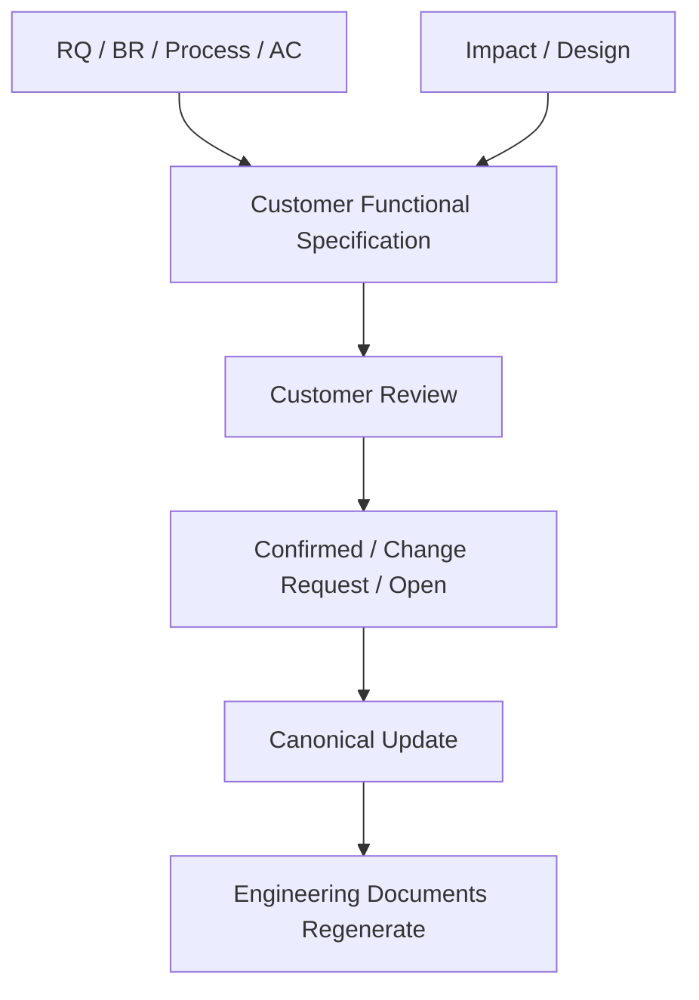

# 02. Customer Communication Artifact Contract

## Quick Start

내부 Engineering 문서와 고객 합의 문서를 분리한다.

```text
Canonical Meaning
├ Customer Functional Specification  ← 고객/PM/업무담당
├ Engineering Design                  ← 분석/설계
└ PGM / Development Context           ← 개발자/Agent
```

고객에게 `Mapper namespace`, `Source hash`, `Work Unit`까지 보여주는 것은 기본값이 아니다.

## Purpose

고객 Communication 문서는 다음 네 가지 질문에 답해야 한다.

1. 무엇을 왜 바꾸는가?
2. 어떤 업무 흐름/규칙/예외가 적용되는가?
3. 어디까지가 이번 Scope인가?
4. 무엇을 확인하면 완료라고 할 수 있는가?

## Current Problem

현재 `requirement-analysis.md`, `impact-analysis.md`, `functional-design.md`, `PGM Spec`은 Traceability에는 좋지만 고객 검토 관점에서는 다음 문제가 있다.

- 기술 용어와 내부 ID가 많음
- OPEN/INFERRED/CONFIRMED가 여러 문서에 분산됨
- 고객이 승인/확인할 Scope/Rule/AC가 한 화면에 모이지 않음
- 기술적 Impact와 고객 영향이 섞임
- 변경 전/후가 쉽게 비교되지 않음

## Design

### Customer Functional Specification 구조

1. 문서 목적 / 변경 배경
2. 대상 업무와 Scope
3. AS-IS / TO-BE
4. 업무 Process
5. Business Rule / 예외
6. 화면/API/Batch 등 고객 접점 변화
7. Data/권한 영향 — 고객이 이해할 수준
8. Acceptance Criteria
9. Open Questions / 고객 확인 필요사항
10. Out of Scope
11. 변경이력 / Source Reference

### Customer-safe Vocabulary

내부 용어를 고객용으로 변환한다.

| 내부 | 고객 View |
|---|---|
| RQ-PILOT-017 | 요구사항 번호/업무명 |
| BR-P017-02 | 업무 규칙 |
| PGM-ATT-CLOSE-001 | 관련 시스템 기능/프로그램(필요 시) |
| TB_ATT_DAILY | 근태 일집계 데이터(필요 시 실제 테이블 병기) |
| action_permissions | 진행/개발/검증 상태 |
| Target Write Proof | 개발 대상 확인 상태 |

### Customer Confirmation Field

고객이 확인해야 할 항목만 명시적으로 표시한다.

```yaml
customer_confirmation:
  required:
    - rule: "월마감 후 승인 수정요청은 재집계 허용"
    - exception: "FORCE_CLOSE는 제외"
    - ac: "승인/미승인/강제마감 테스트 결과"
  informational:
    - "MyBatis Mapper 추가"
```

## Workflow Diagram



## Data / Contract

Customer 문서 Metadata 예:

```yaml
document_type: customer_functional_spec
requirement_id: RQ-PILOT-017
revision: 3
customer_view_status: REVIEW_REQUIRED
scope_version: 2
source_artifacts:
  - requirement-analysis.md#rev3
  - process-analysis.md#rev2
  - functional-design.md#rev2
customer_confirmations:
  confirmed: []
  open: [BR-P017-02, BR-P017-03, AC-03, AC-05]
```

Customer 문서 자체를 Canonical SoT로 두지 않는다. 고객이 문서에서 수정/코멘트한 내용은 Change/Confirmation으로 Normalize한다.

## Examples

### RQ-PILOT-017 고객 View 핵심

```text
변경 목적
- 근태마감 계산에 10분 단위 근무계획을 반영

변경 후 정책
- 일반 마감: 10분 단위 계획 반영
- 월마감 후: 승인된 수정요청만 재집계
- 강제마감: 월마감 후 재집계 불가

고객 확인 필요
- 승인 수정요청의 승인 상태 기준
- FORCE_CLOSE 정의와 권한 주체
- 기존 월마감 데이터 재처리 필요 여부
```

고객은 Service/Mapper Method를 몰라도 업무 범위를 검토할 수 있다.

## Failure Scenarios

### F1. 내부 Functional Design을 그대로 고객에게 전달
기술 상세가 많아 핵심 정책 합의 누락 가능.

### F2. 고객 문서를 너무 요약
예외/AC가 빠져 “합의했다”는 의미가 모호해짐.

### F3. 고객 Word/Excel 수정본을 직접 Canonical로 덮어쓰기
동시 변경/의미 충돌 위험 → Change Normalize 필수.

### F4. Open Question을 문서 하단 Notes에만 둠
확인되지 않은 정책이 승인된 것처럼 보일 수 있음 → 고객 확인 섹션 필수.

## Validation

고객 Communication 문서는 다음 질문으로 Pilot 검증한다.

- 5분 안에 AS-IS/TO-BE를 설명 가능한가?
- 고객이 실제 결정해야 할 Rule/Exception이 별도로 보이는가?
- Acceptance Criteria를 업무 용어로 이해 가능한가?
- 기술 문서를 읽지 않고 Scope/Out-of-Scope를 확인 가능한가?
- 고객 변경사항이 어떤 내부 산출물을 STALE시키는지 역추적 가능한가?

## DECISION_REQUIRED

1. Customer Functional Specification을 모든 RQ 필수로 할지, 고객 프로젝트 Overlay로 선택할지
2. 고객 Confirmation을 문서 상태로만 관리할지 별도 Entity로 둘지
3. 고객 산출물을 MD+PDF/Word/Excel 중 어떤 View 조합으로 제공할지
