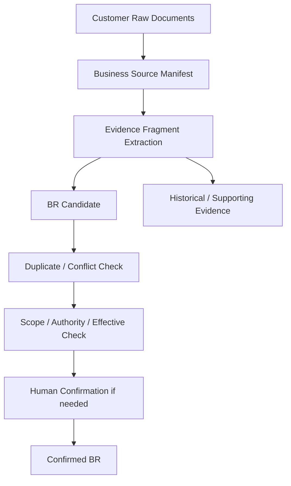

# 03. Business Source Package + BR Normalization Contract

## Quick Start

고객이 보유한 Word/PDF/Excel/PPT/회의록/운영매뉴얼/기존 설계서를 직접 `BR`로 간주하지 않는다.

```text
Raw Customer Document
→ Business Source Catalog
→ Extracted Evidence Fragment
→ BR Candidate
→ Scope / Authority / Effective Period 확인
→ CONFIRMED BR 또는 Historical Evidence
```

핵심은 **원문 보존 + 문장 단위 Provenance + 적용범위/권한/유효기간**이다.

## Purpose

프로젝트마다 문서 형식과 품질이 달라도 Agent가 같은 기준으로 업무 규칙 후보를 만들 수 있도록 최소 입력 Contract를 제공한다.

## Current Problem

비정형 고객문서를 단순 RAG 문서로만 넣으면 다음 문제가 생긴다.

- 어느 문서가 공식 정책이고 어느 문서가 참고자료인지 모름
- 오래된 문서와 최신 문서가 충돌
- 본사/법인/국가/조직별 적용범위 누락
- 화면 매뉴얼의 현행 구현 설명을 업무 정책으로 오인
- 회의록의 임시 합의를 영구 Rule로 승격
- 표/각주/부록의 조건을 놓침

반대로 모든 고객문서를 사전에 완벽한 BR 형식으로 재작성하라고 요구하면 도입비용이 너무 크다.

## Design

### 1. 고객이 준비해야 하는 것은 BR 파일이 아니라 Business Source Package

Project마다 다음 Package만 준비하면 된다.

```text
business-sources/
├ manifest.yaml
├ policy/
├ process/
├ requirements/
├ manuals/
├ legacy-design/
├ meeting-notes/
└ reference/
```

원본 파일은 가능한 한 변경하지 않는다.

### 2. manifest.yaml에서 문서 성격을 설명

각 파일에 최소 Metadata를 붙인다.

```yaml
sources:
  - source_id: BSRC-0012
    path: policy/근태운영정책_2026.pdf
    source_type: POLICY
    title: 근태 운영 정책
    authority: OFFICIAL_POLICY
    owner_role: 인사운영팀
    scope:
      company: ALL
      country: KR
      domain: ATTENDANCE
    effective_from: 2026-01-01
    effective_to: null
    supersedes: BSRC-0007
    confidentiality: INTERNAL
    extraction_hint:
      important_sections: [월마감, 수정요청, 강제마감]
```

문서 포맷보다 이 Metadata가 더 중요하다.

### 3. Source Type

권장 분류:

- `POLICY`: 공식 규정/정책
- `CONTRACT`: 계약/SLA/법적 요구
- `REQUIREMENT`: 프로젝트 요구사항
- `PROCESS`: 업무 프로세스/절차서
- `MANUAL`: 사용자/운영 매뉴얼
- `LEGACY_DESIGN`: 기존 분석/설계 문서
- `MEETING_NOTE`: 회의록/인터뷰 기록
- `SCREEN_SPEC`: 화면/리포트 정의
- `DATA_DEFINITION`: 데이터/코드 정의
- `REFERENCE`: 참고자료

### 4. Authority Level

문서가 BR Confirm Evidence가 될 수 있는 정도를 별도 표시한다.

```text
A1 OFFICIAL / APPROVED
A2 OWNER_CONFIRMED
A3 PROJECT_AGREED
A4 OBSERVED_MANUAL / LEGACY_DOC
A5 INFORMAL_NOTE / REFERENCE
```

예:

- 공식 취업규칙 → A1
- 업무 Owner 인터뷰 확인 → A2
- 프로젝트 회의 합의 → A3
- 오래된 사용자 매뉴얼 → A4
- 메일/메모 → A5

A4/A5만으로 High-blast BR을 자동 CONFIRMED하지 않는다.

### 5. Evidence Fragment

Agent는 문서 전체를 BR 하나로 만들지 않고 근거 Fragment를 만든다.

```yaml
evidence_fragment:
  id: BEV-0012-004
  source_id: BSRC-0012
  locator:
    section: "5.3 월마감 이후 수정"
    page: 17
  extracted_statement: "월마감 이후에는 승인된 수정요청만 재집계할 수 있다."
  extraction_mode: TEXT
  truth: GIVEN_DOCUMENT
```

### 6. BR Candidate 표준 포맷

```yaml
business_rule_candidate:
  id: BRC-ATT-0042
  statement: "월마감 이후에는 승인된 수정요청만 재집계할 수 있다."
  condition:
    - month_close_status = CLOSED
  action: ALLOW_RECALCULATION
  exception:
    - close_type = FORCE_CLOSE
  scope:
    country: KR
    company: ALL
    domain: ATTENDANCE
  effective:
    from: 2026-01-01
    to: null
  authority:
    level: A1
    owner_role: 인사운영팀
  evidence:
    - BEV-0012-004
  status: CANDIDATE
```

BR의 핵심은 `statement`만이 아니다.

- 조건
- 결과/행동
- 예외
- 적용범위
- 유효기간
- 확인권한
- Evidence

가 함께 있어야 재사용 가능한 Knowledge가 된다.

## Workflow Diagram



## Data / Contract

### 고객/프로젝트 Customizing Layer

고객마다 BR Schema를 새로 만들지 않는다. 대신 Mapping/Profile을 바꾼다.

```text
Global BR Contract
        ↑
Project Business Source Profile
        ↑
Customer Document Mapping
```

예:

```yaml
business_source_profile:
  customer: SAMPLE_CORP
  default_language: ko-KR
  source_type_rules:
    "*규정*.pdf": POLICY
    "*업무매뉴얼*.docx": MANUAL
    "*요구사항*.xlsx": REQUIREMENT
  authority_defaults:
    POLICY: A1
    REQUIREMENT: A3
    MANUAL: A4
    MEETING_NOTE: A5
  required_scope_fields: [domain]
  confirmation_required_when:
    - authority_below: A2
    - missing_scope: true
    - conflicting_evidence: true
    - high_blast_radius: true
```

### Excel/표 기반 자료

표 한 Row의 위치를 Provenance로 유지한다.

```yaml
locator:
  sheet: 요구사항목록
  row: 42
  legacy_id: REQ_TM_TE039
```

### PDF/Word/PPT

Page/Section/Heading/Slide를 Locator로 유지한다.

### 회의록

회의일, 발언/결정 주체, 결정 여부를 구분한다.

```yaml
meeting_evidence:
  meeting_date: 2026-09-01
  speaker_role: 업무책임자
  decision_state: CONFIRMED_IN_MEETING
```

## Examples

### Example A — 공식 정책 + Excel 요구사항

```text
Policy A1:
월마감 후 승인된 수정요청만 허용

Excel Requirement A3:
마감 후 수정요청 기능 개선

→ 하나의 BR Candidate에 Evidence 2개 연결
→ Policy가 Scope/Authority의 주 근거
→ Excel은 Change 요구의 근거
```

### Example B — 오래된 매뉴얼과 Current Source 충돌

```text
매뉴얼 A4: 월마감 후 수정 불가
Source OBSERVED: 특정 관리자 경로에서 수정 가능
```

둘 중 하나를 자동 Truth로 고르지 않는다.

```text
BR Candidate = CONFLICT / CHECK_REQUIRED
```

## Failure Scenarios

### F1. 모든 고객문서를 Vector DB에 넣고 답만 생성
문서 권위/시점/Scope를 잃음.

### F2. 파일명만으로 공식성 판단
최종/최종2/확정본 같은 이름은 Authority가 아님.

### F3. 기존 Source와 매뉴얼이 같으므로 BR 확정
둘 다 동일 Legacy behavior를 복제한 것일 수 있음.

### F4. Scope null을 Global로 해석
금지. Scope null은 `UNKNOWN`이다.

### F5. 최신 파일 날짜가 항상 승리
문서 작성일과 정책 유효일은 다를 수 있음.

## Validation

파일럿 고객문서 10~20개를 넣고 다음을 측정한다.

- 원문 Fragment까지 역추적 가능한 BR Candidate 비율
- Scope/Effective/Authority 결측률
- 서로 충돌하는 문서 탐지율
- Manual/Legacy Design을 잘못 Confirmed BR로 승격하는 비율
- 고객이 manifest metadata를 작성하는 데 걸리는 시간
- 고객별 새 문서형식 추가 시 Core Schema 변경 없이 Mapping만으로 처리 가능한지

## DECISION_REQUIRED

1. 고객이 `manifest.yaml`을 직접 작성할지 Harness가 초안을 만들고 고객이 확인할지
2. A1/A2 Authority 기준을 회사별 Overlay로 변경 가능하게 할지
3. 원문 파일을 Git에 둘지 문서저장소 Reference만 둘지
4. CONFIRMED BR의 공식 Owner/승인 Workflow를 별도 Entity로 관리할지
