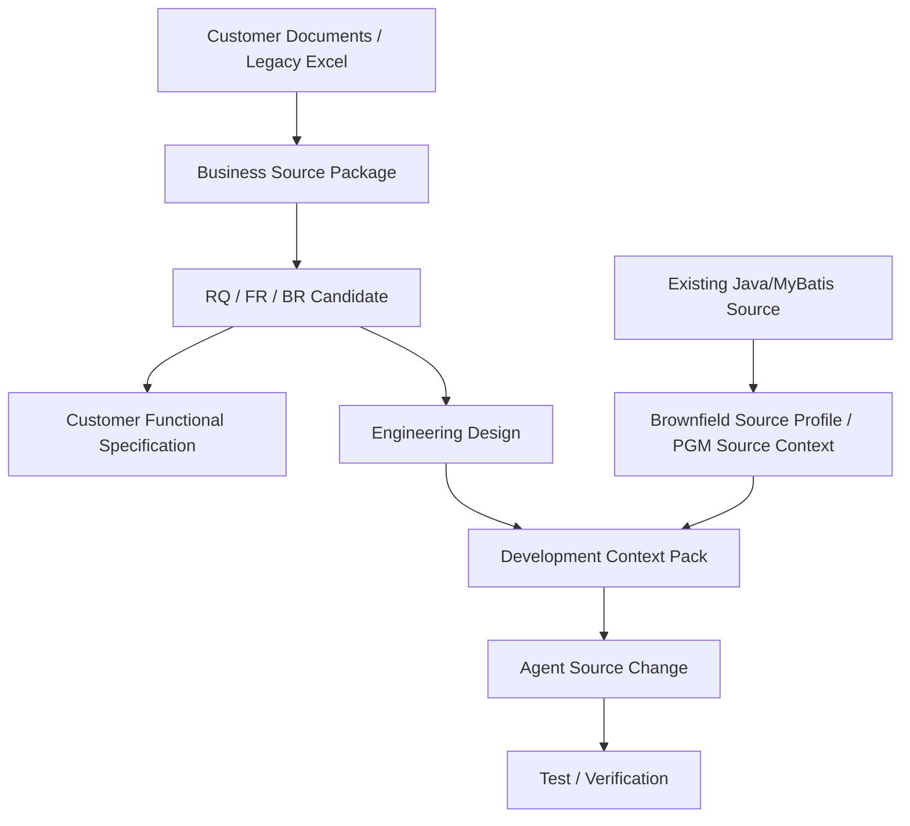

# Candidate A Extension — Source-ready Design / Customer Communication / Business Source Package

> 상태: `EXPERIMENT / NOT BASELINE`
> Parent: `SDLC_DESIGN_SESSION_SECOND/validation/candidate-a-requirements-xlsx-pilot`
> 원칙: Candidate A 계열만 확장하며 Candidate B와 결합하지 않는다.

## Quick Start

이 Branch는 Pilot에서 발견된 세 질문을 검증한다.

1. 설계문서만으로 Source를 생성할 수 있는가? Brownfield 기존 Source 가이드는 무엇을 줘야 하는가?
2. 내부 SDLC 산출물이 고객 Communication 문서로 충분한가?
3. 고객별 비정형 문서를 Business Rule 근거로 어떻게 제공해야 하는가?

권장 답은 각각 다음 세 계약이다.

```text
Engineering Design
+ Brownfield Source Evidence
→ Development Context Pack

Canonical/Engineering Artifact
→ Customer Communication View

Raw Customer Document
→ Business Source Package
→ BR Candidate
```

## Purpose

기존 `requirement-analysis.md`, `functional-design.md`, `PGM Spec`을 없애지 않고 다음 View/Contract를 추가한다.

- `Development Context Pack`: Source 생성에 필요한 실행 직전 Context
- `Brownfield Source Profile`: 기존 Project/Source를 Agent에게 설명하는 안정적인 가이드
- `Customer Functional Specification`: 고객과 Scope/Process/Rule/AC를 합의하는 외부 View
- `Business Source Package`: 비정형 고객문서를 원문 근거를 보존한 채 BR Candidate로 정규화하는 입력 계약

## Current Problem

Pilot의 PGM Spec은 `무엇을 변경할지`는 보여주지만 실제 Source 생성에 필요한 다음 정보가 약하다.

- 현재 File/Symbol과 Source hash
- 기존 Coding/Mapper Convention
- Transaction Boundary의 실제 위치
- Data/SQL Key 및 Null/Code 의미
- 수정 금지 영역과 Legacy Deviation
- 유사 구현 Reference
- Test Fixture/실행 명령

또한 내부 문서는 고객이 검토하기엔 Technical Detail이 많고, 반대로 Excel/회의록/운영매뉴얼을 바로 BR로 취급하면 Authority/Scope/유효기간이 사라진다.

## Design

### Three-view Separation

```text
Raw Evidence
    ↓
Canonical Meaning
    ├─ Customer View
    ├─ Analyst/Designer View
    └─ Developer Context Pack
```

한 문서가 고객 합의, 개발 코드 생성, Knowledge Evidence를 모두 담당하지 않는다.

## Workflow Diagram



## Data / Contract

세부 계약:

1. `01_source_ready_design_and_brownfield_context_contract.md`
2. `02_customer_communication_artifact_contract.md`
3. `03_business_source_package_and_br_normalization.md`

Templates:

- `templates/development-context-pack.yaml`
- `templates/brownfield-source-profile.yaml`
- `templates/customer-functional-spec.md`
- `templates/business-source-card.yaml`

## Examples

`RQ-PILOT-017` / `PGM-ATT-CLOSE-001` MyBatis Pilot을 예제로 사용한다.

## Failure Scenarios

- Functional Design만 주고 Agent에게 코드 생성 → Wrong Target/Convention Drift
- 전체 Repository를 Context로 투입 → Token 낭비/Noise
- 고객 운영매뉴얼 한 문장을 바로 `CONFIRMED BR`로 승격 → Knowledge Poisoning
- 내부 PGM Spec을 그대로 고객 승인문서로 사용 → 기술 상세에 업무 합의가 묻힘

## Validation

사용자가 다음을 비교 평가한다.

- Context Pack만으로 개발자가 수정 Target/제약/Test를 이해할 수 있는가?
- Customer Spec만으로 고객이 Scope/Rule/예외/AC를 검토할 수 있는가?
- Business Source Card가 원문과 BR Candidate를 역추적할 수 있는가?
- 고객별 문서 형태가 달라도 Parser가 아닌 Mapping/Profile 교체로 수용 가능한가?

## DECISION_REQUIRED

아직 Baseline에 확정하지 않는다.

- Development Context Pack을 DEVELOPMENT의 필수 입력으로 승격할지
- Customer Functional Specification을 필수 고객 산출물로 둘지 프로젝트 Overlay 선택으로 둘지
- Business Source Package를 고객 문서 Intake의 표준 계약으로 채택할지
