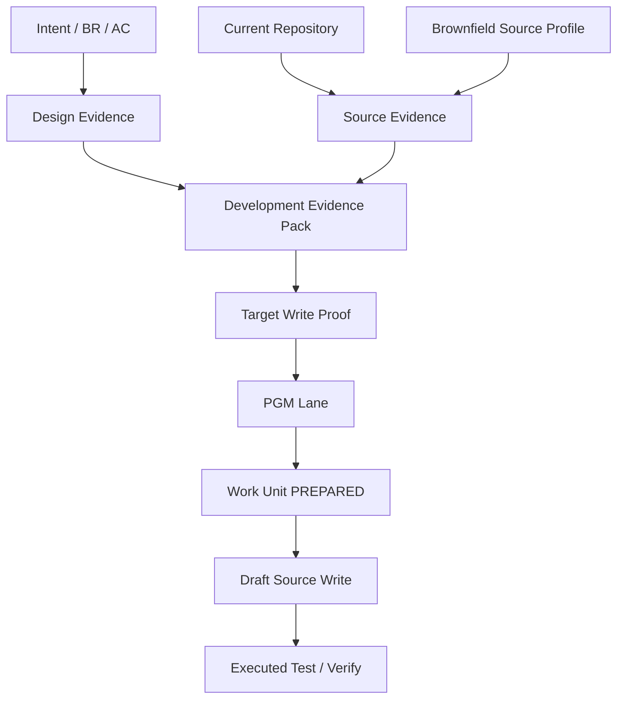

# 01. Source-ready Execution + Brownfield Evidence Contract

## Quick Start

Candidate B에서 `설계가 충분하다`는 것은 실제 Source Write를 바로 허용한다는 뜻이 아니다.

```text
Design Coverage
+ Current Source Evidence
+ Brownfield Convention
+ Target Write Proof
+ Work Unit / PGM Lane
= Draft Source Write Eligible
```

## Purpose

Brownfield Java/MyBatis 프로젝트에서 Source 생성/수정에 필요한 Evidence를 명시하고, 문서 완성도와 실제 실행 권한을 분리한다.

## Current Problem

PGM Spec이 상세해도 다음이 없으면 잘못된 Target 또는 기존 Architecture 파괴가 가능하다.

- Current commit/source hash
- File/Symbol의 실제 존재 확인
- Mapper Interface/XML namespace/statement 관계
- Service Transaction Boundary
- Data Read/Write 및 Lock/Key 의미
- Project-specific convention/legacy deviation
- Similar implementation reference
- Generated/Protected path
- 실행 가능한 Test 또는 최소 검증 계획

Candidate B는 여기에 다음을 추가로 요구한다.

- `target_write_proof`
- `action_permissions`
- Central Work Unit/idempotency
- Same-PGM Lane ownership

## Design

### 1. Evidence Layers

```text
E0 Intent Evidence
RQ / FR / BR / AC / CR

E1 Design Evidence
Process / Functional Design / PGM Spec

E2 Source Evidence
Current file/symbol/mapper/data/trace

E3 Project Convention Evidence
Architecture / standards / similar implementation

E4 Execution Evidence
Target Proof / Work Unit / PGM Lane

E5 Verification Evidence
Executed Test / AC coverage / runtime result
```

Actual Draft Source Write는 E0~E4가 충분해야 한다.

### 2. Brownfield Source Profile

Profile은 Project Navigation/Convention Evidence이며 Source Truth를 대체하지 않는다.

필수 항목:

- source/resource/test roots
- Spring/MyBatis/Oracle stack
- Layering 및 dependency direction
- Transaction owner convention
- Mapper namespace/statement contract
- DB schema/code master/procedure convention
- Error/log/audit/security pattern
- Build/test command
- protected/generated path
- dynamic SQL/batch/interface discovery hint
- legacy deviation
- profile verified commit/date

### 3. Target Write Proof

예:

```yaml
target_write_proof:
  program_id: PGM-ATT-CLOSE-001
  result: PASS
  current_revision: abc123
  invariant_check:
    task_program_relation: PASS
    program_artifact_relation: PASS
  evidence:
    - type: CANONICAL_RELATION
      ref: TASK-P017-DEV-01->PGM-ATT-CLOSE-001
    - type: CURRENT_SOURCE_SYMBOL
      ref: AttendanceCloseService.closeDaily
    - type: MAPPER_RELATION
      ref: AttendanceCloseMapper#AttendanceCloseMapper.xml
  ambiguity:
    top_candidate_gap: SAFE
```

High resolver confidence만으로 Proof PASS가 되지 않는다.

### 4. Execution Envelope

```yaml
action_permissions:
  draft_source_write: ALLOW
  merge: DENY
  release: DENY
  verify_pass: DENY
```

CRITICAL 업무가정이 있어도 B1 Option B 조건에 따라 Draft Write가 가능할 수 있으나 Merge/Release는 별도 판단한다.

## Workflow Diagram



## Data / Contract

Development Evidence Pack 최소 필드:

```yaml
development_evidence_pack:
  subject:
    rq_id: RQ-PILOT-017
    task_id: TASK-P017-DEV-01
    program_id: PGM-ATT-CLOSE-001
  evidence_revision:
    canonical: 12
    source_commit: abc123
  intent:
    fr_ids: []
    br_ids: []
    ac_ids: []
  target:
    files: []
    symbols: []
  source_context:
    current_summary: null
    source_hashes: {}
    mapper_contract: []
    data_contract: []
    transaction_owner: null
  project_convention:
    profile_revision: null
    standards: []
    similar_references: []
    protected_paths: []
  blind_spots: []
  assumptions: []
  target_write_proof: null
  action_permissions: {}
  work_unit_requirement: REQUIRED
```

## Examples

MyBatis Pilot에서 Agent가 받아야 할 최소 Current Source:

- `AttendanceCloseService.closeDaily`
- `AttendanceCloseMapper` 관련 method
- `AttendanceCloseMapper.xml` 관련 statements
- `TB_WORK_PLAN`, `TB_ATT_CLOSE`, `TB_ATT_CORRECTION_REQ`, `TB_ATT_DAILY`
- Service-level Transaction convention
- 승인조건 validation 후 write하는 유사 구현
- AC-01/03/04/05

이후 Target Proof가 통과하고 PGM Lane을 획득해야 실제 Draft Source Write를 허용한다.

## Failure Scenarios

### F1. Source Profile은 최신이지만 Target Symbol이 삭제됨
Profile은 Navigation hint일 뿐. Current Source 확인 실패 → Proof FAIL.

### F2. Program Summary만 두 개 확보
동일한 stale summary 계열은 독립 Evidence 두 개로 세지 않는다.

### F3. Mapper XML current, Java Interface stale
Interface/XML invariant FAIL → Source Write DENY 또는 proposal only.

### F4. Central Store unavailable
분석/Context Pack 생성은 가능하지만 Work Unit을 만들 수 없어 actual Source Write DENY.

### F5. Same PGM Lane busy
Context/patch proposal 준비는 가능, actual write는 WAIT/DENY.

## Validation

- Wrong Target fixture에서 Proof가 실제 write를 차단하는가?
- Source hash 변경 시 Context Pack을 stale 처리하는가?
- Mapper Interface/XML mismatch를 탐지하는가?
- 중앙 Store 장애 중 actual write가 발생하지 않는가?
- 동일 PGM 경쟁 시 한 Lane owner만 actual write 가능한가?

## DECISION_REQUIRED

1. Development Evidence Pack 필수 Coverage threshold
2. Target Proof 독립 Evidence 최소 개수와 High-risk 추가 요구
3. Profile freshness 정책과 자동 regeneration 시점
4. Proposal-only를 허용할 Evidence minimum
