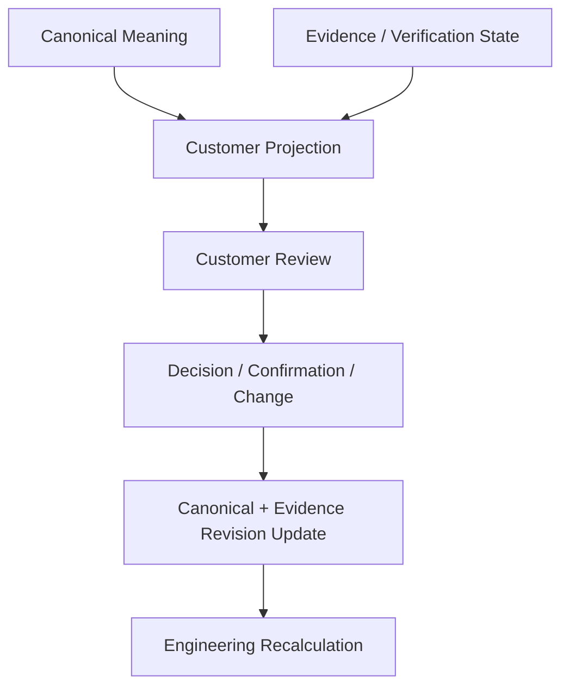

# 02. Customer Decision & Acceptance View Contract

## Quick Start

고객에게 내부 Stage/Work Unit 상태를 그대로 보여주지 않는다. 대신 고객이 이해해야 할 상태만 다음 세 축으로 단순화한다.

1. `업무합의 상태`: CONFIRMED / REVIEW_REQUIRED / OPEN
2. `구현 상태`: NOT_STARTED / IN_PROGRESS / IMPLEMENTED
3. `검증 상태`: NOT_TESTED / TESTED_WITH_GAPS / VERIFIED

내부 `progress`, `action_permissions`, `work_unit`, `lane`은 Engineering View에 남긴다.

## Purpose

Candidate B의 복잡한 실행 안전성 정보를 고객 Communication에 필요한 수준으로 Projection하면서도, 미확정 정책이나 미실행 검증을 숨기지 않는다.

## Current Problem

- 내부 `progress=COMPLETE`를 고객이 "기능 완료"로 오해할 수 있음
- `source_write=ALLOW`, `merge=DENY` 같은 세부 권한은 고객 검토의 핵심이 아님
- 반대로 고객에게 단순 완료율만 보여주면 Open Rule/Test Gap이 감춰짐

## Design

### Customer View Sections

1. 변경 배경 / 목표
2. Scope / Out of Scope
3. AS-IS / TO-BE
4. 업무 Process
5. Rule / Exception
6. 고객 영향 화면·Batch·Interface·운영
7. Acceptance Criteria
8. 고객 결정 필요사항
9. 구현/검증 현황
10. 변경 이력

### Internal → Customer Projection

| Internal | Customer Projection |
|---|---|
| BR status=CANDIDATE + confirmation required | 업무합의 `REVIEW_REQUIRED` |
| Stage progress=COMPLETE, verify_pass=DENY | 검증 `NOT_TESTED` 또는 `TESTED_WITH_GAPS` |
| Draft Source Write applied | 구현 `IN_PROGRESS` |
| Executed test + AC coverage + verify PASS | 검증 `VERIFIED` |
| Merge/Release DENY | 필요 시 `배포 준비 전` 표시 |
| Work Unit recovery | 고객 View 기본 숨김, 일정/리스크 영향 시만 표시 |

### Customer Decision Record

고객 확인이 필요한 Rule마다 다음을 기록한다.

```yaml
customer_decision:
  decision_id: CDEC-P017-01
  subject: "월마감 후 승인 수정요청 재집계"
  options:
    - 승인된 수정요청 허용
    - 월마감 후 전면 차단
  current_proposal: "승인된 수정요청 허용, FORCE_CLOSE 제외"
  evidence_refs: [BR-P017-02, BR-P017-03]
  status: REVIEW_REQUIRED
  decision_owner_role: 인사운영책임자
```

고객의 선택은 Change/Confirmation Event로 Canonical에 반영한다.

## Workflow Diagram



## Data / Contract

Customer status는 내부 상태를 단순화하되 거짓으로 낙관하지 않는다.

```yaml
customer_status:
  business_agreement: REVIEW_REQUIRED
  implementation: IN_PROGRESS
  verification: NOT_TESTED
  release_readiness: NOT_READY
  open_customer_decisions: 2
  open_technical_risks: 1
```

`verification=VERIFIED`는 내부 `verify_pass=ALLOW/PASS`와 실행 Test Evidence가 있어야만 가능하다.

## Examples

RQ-PILOT-017 예:

```text
업무합의: REVIEW_REQUIRED
- 월마감 후 승인 수정요청 허용: 제안됨
- FORCE_CLOSE 제외: 확인 필요

구현: IN_PROGRESS
- Java/MyBatis 수정안 작성됨

검증: NOT_TESTED
- Test Scenario 정의됨
- 실제 Test 실행 결과 없음
```

이 표현은 `progress=COMPLETE`보다 고객에게 의미가 명확하다.

## Failure Scenarios

### F1. Internal COMPLETE → Customer 완료
금지. Verify Evidence가 없으면 고객 검증 완료로 표시하지 않는다.

### F2. 기술 Risk를 모두 고객에게 노출
고객 의사결정과 무관한 내부 세부는 숨기되 일정/Scope/품질 영향이 있으면 요약한다.

### F3. 고객 확인을 문서 승인 한 번으로 처리
Rule별 Decision/Confirmation을 추적하지 못함 → Decision Record 사용.

### F4. 고객 문서 수정본을 그대로 Source of Truth로 처리
Change Normalize 및 revision 비교가 필요.

## Validation

- 고객이 5분 내 현재 업무합의/구현/검증 상태를 구분할 수 있는가?
- `COMPLETE` 오해가 사라지는가?
- 고객 결정 필요사항이 Rule/AC에 직접 연결되는가?
- 변경 결정 후 어떤 Engineering Artifact가 STALE 되는지 추적 가능한가?

## DECISION_REQUIRED

1. 고객 상태 축을 3개로 유지할지 Release Readiness를 별도 축으로 둘지
2. Customer Decision을 Canonical Entity로 승격할지
3. 고객 문서를 MD 기반 생성 후 PDF/Word로 배포할지, Customer Portal View를 둘지
