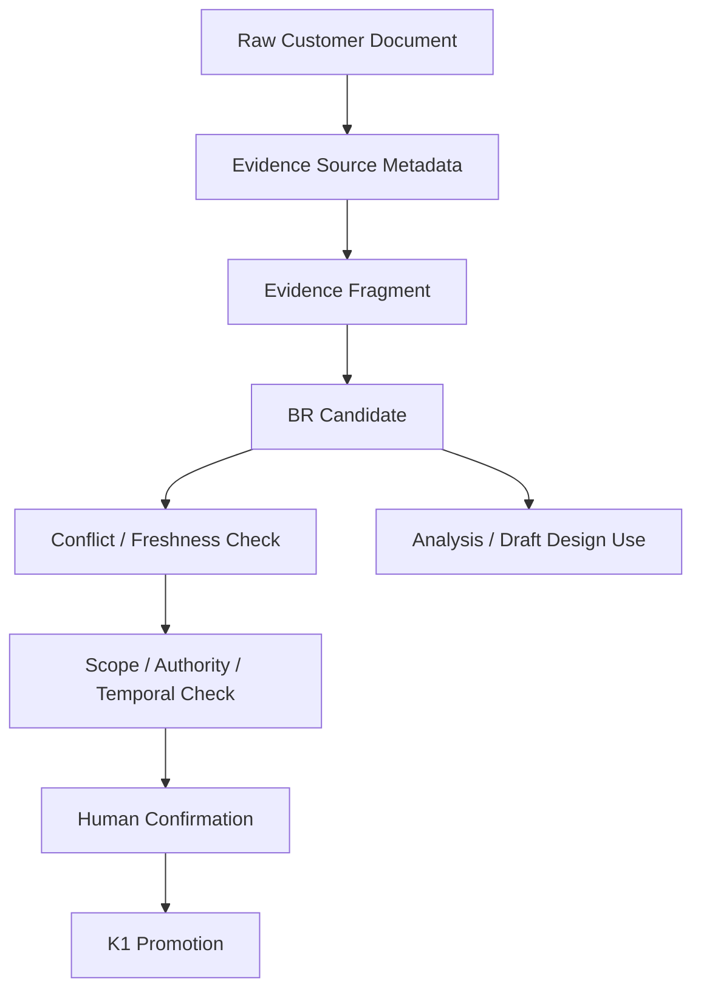

# 03. Business Evidence Package + K1 Promotion Contract

## Quick Start

고객 비정형 문서는 먼저 `Business Evidence Package`로 등록한다. Agent가 BR Candidate를 만들 수는 있지만, High-blast K1은 B4 Option B에 따라 사람이 Scope/Temporal/Authority를 확인하기 전까지 Promotion하지 않는다.

```text
Raw Document
→ Evidence Source Metadata
→ Evidence Fragment
→ BR Candidate
→ Scope / Authority / Effective / Freshness Check
→ Human Confirmation
→ K1 Eligible
```

## Purpose

고객별 문서형식이 달라도 동일한 Evidence Contract로 Business Rule을 안전하게 추출하고, `문서가 존재함`과 `공식 Business Truth임`을 분리한다.

## Current Problem

RAG/검색만으로 고객문서를 활용하면 다음을 놓치기 쉽다.

- 공식 정책/참고 문서의 Authority 차이
- 국가/법인/조직/업무범위
- 시행일/폐기일/대체문서
- 회의록에서 결정된 것과 논의만 된 것의 차이
- Legacy Manual과 Current Policy 충돌
- 동일 문서의 오래된 Revision

Candidate B 관점에서는 이 결측이 K1 Promotion과 실제 Source generation의 blast radius를 키운다.

## Design

### 1. Evidence Source Metadata

```yaml
evidence_source:
  source_id: BSRC-0012
  source_type: POLICY
  title: 근태 운영 정책
  uri: null
  revision: 5
  authority:
    level: A1
    owner_role: 인사운영팀
  scope:
    country: KR
    company: ALL
    domain: ATTENDANCE
  effective:
    from: 2026-01-01
    to: null
  supersedes: [BSRC-0007]
  freshness:
    last_verified_at: null
    content_hash: null
```

### 2. Authority

- A1 OFFICIAL_APPROVED
- A2 OWNER_CONFIRMED
- A3 PROJECT_AGREED
- A4 LEGACY_MANUAL_OR_DESIGN
- A5 INFORMAL_REFERENCE

Authority는 Confidence와 다르다. A5 문장이 명확하더라도 공식 적용 권한은 낮을 수 있다.

### 3. Evidence Fragment

```yaml
evidence_fragment:
  id: BEV-0012-004
  source_id: BSRC-0012
  locator:
    page: 17
    section: "월마감 이후 수정"
  statement: "월마감 이후 승인된 수정요청만 재집계 가능"
  observed_scope:
    country: KR
  extraction_confidence: HIGH
```

### 4. BR Candidate Evidence Envelope

```yaml
br_candidate:
  id: BRC-ATT-0042
  statement: "월마감 이후 승인된 수정요청만 재집계할 수 있다."
  conditions:
    - month_close_status = CLOSED
  result: ALLOW_RECALCULATION
  exceptions:
    - close_type = FORCE_CLOSE
  scope:
    country: KR
    company: ALL
    domain: ATTENDANCE
  effective:
    from: 2026-01-01
    to: null
  authority:
    level: A1
    owner_role: 인사운영팀
  evidence:
    - BEV-0012-004
  conflicts: []
  freshness:
    state: CURRENT
  blast_radius: HIGH
  status: CANDIDATE
  action_permissions:
    use_for_analysis: ALLOW
    use_for_draft_design: ALLOW
    k1_promotion: REQUIRES_HUMAN_CONFIRMATION
```

### 5. High-blast K1 Guard

다음은 기본적으로 Human confirmation을 요구한다.

- 국가/법인 전사 정책
- 권한/보안 규칙
- 급여/근태 마감
- 법적/계약 조건
- 데이터 보존/개인정보
- 다수 Program에 걸친 공통 Rule

확인해야 할 필드:

- `scope`
- `effective_from/to`
- `authority owner`
- `exceptions`
- conflict resolution

## Workflow Diagram



## Data / Contract

### Project Customization

Core BR/Evidence Schema는 유지하고 프로젝트별 Profile만 바꾼다.

```yaml
business_evidence_profile:
  customer: SAMPLE_CORP
  default_language: ko-KR
  mappings:
    - pattern: "*규정*.pdf"
      source_type: POLICY
      default_authority: A1
    - pattern: "*업무매뉴얼*.docx"
      source_type: MANUAL
      default_authority: A4
    - pattern: "*회의록*.docx"
      source_type: MEETING_NOTE
      default_authority: A5
    - pattern: "*요구사항*.xlsx"
      source_type: REQUIREMENT
      default_authority: A3
  guards:
    missing_scope: HUMAN_REVIEW
    conflicting_evidence: HUMAN_REVIEW
    high_blast_radius: HUMAN_REVIEW
    stale_source: REVERIFY
```

### Document Locator

- Excel: sheet/row/legacy ID
- PDF: page/section
- Word: heading/paragraph anchor
- PPT: slide/object
- Meeting: date/agenda/speaker/decision state

원문 Locator가 없는 BR Candidate는 K1 Promotion 대상이 되지 않는다.

## Examples

### Policy + Requirement + Source

```text
A1 Policy: 월마감 후 승인 수정요청만 허용
A3 Excel RQ: 마감후 수정요청 개선
OBSERVED Source: 승인 상태 체크 없음
```

결론:

- Policy → Business Rule Authority 근거
- Excel → Change 필요 근거
- Source → AS-IS Technical Evidence
- BR Candidate는 Policy와 Scope를 기준으로 작성
- Source가 다르다는 이유로 Policy를 무효화하지 않음

### Manual vs Policy Conflict

```text
A4 Manual: 월마감 후 모든 수정 불가
A1 Policy: 승인 수정요청 허용
```

자동 overwrite하지 않고 conflict를 기록하고 최신 Effective/Owner를 확인한다.

## Failure Scenarios

### F1. 문서가 최신 수정일이라 자동 우선
파일 수정일과 정책 Effective는 다름.

### F2. 같은 문장을 여러 문서에서 발견해 독립 Evidence로 계산
동일 원본의 복사본이면 Evidence family 하나로 본다.

### F3. Scope null을 global로 해석
금지. `UNKNOWN_SCOPE`로 K1 Promotion 제한.

### F4. 회의록 참석자가 많으므로 Authority 높음
Authority는 참석자 수가 아니라 결정권자/공식성으로 판단.

### F5. Legacy Manual + Source가 일치하므로 Confirmed
둘 다 과거 동작을 설명할 뿐 현재 공식 정책인지 별도 확인 필요.

## Validation

- BR Candidate에서 원문 locator 누락률
- Authority/Scope/Effective 결측 탐지율
- 복사본 Evidence 중복 제거율
- Conflict detection recall
- High-blast K1 Human confirmation 누락 0건
- 프로젝트별 문서 mapping 추가 시 Core Schema 변경 여부

## DECISION_REQUIRED

1. A1~A5 Authority를 표준값으로 둘지 프로젝트 Overlay로 완전 대체 가능하게 할지
2. High-blast 판정 규칙을 Domain별 설정으로 둘지
3. 고객 확인을 별도 `CustomerDecision` Entity로 연결할지
4. Source 문서 원본을 중앙 저장할지 URI+hash만 관리할지
