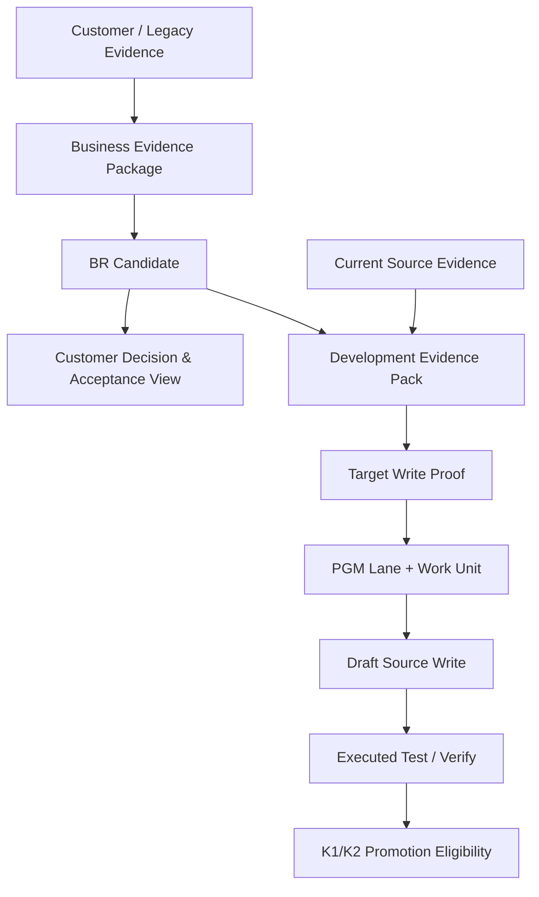

# Candidate B Extension — Source-ready Execution / Customer Evidence View / Business Evidence Package

> 상태: `EXPERIMENT / NOT BASELINE`
> Parent: `SDLC_DESIGN_SESSION_SECOND/validation/candidate-b-requirements-xlsx-pilot`
> 원칙: Candidate B 계열만 확장하며 Candidate A와 결합하지 않는다.

## Quick Start

Pilot 이후 세 질문을 Candidate B 방식으로 확장한다.

1. 어떤 Evidence가 있어야 설계가 실제 Source Write에 충분한가?
2. 고객에게 내부 Action Permission 복잡성을 노출하지 않으면서 합의/검증 가능한 문서를 어떻게 제공하는가?
3. 고객의 비정형 문서를 BR/K1 근거로 사용할 때 Scope/Authority/Freshness를 어떻게 보장하는가?

```text
Engineering Design + Current Source Evidence
→ Development Evidence Pack
→ Target Write Proof
→ Work Unit / PGM Lane
→ Draft Source Write

Canonical Meaning + Evidence State
→ Customer Decision & Acceptance View

Raw Customer Document
→ Business Evidence Package
→ BR Candidate
→ Human Scope/Temporal Confirmation
→ K1 Promotion
```

## Purpose

Candidate B의 `workflow continuation != execution permission` 원칙을 Source-ready, 고객 Communication, Business Knowledge Intake에도 적용한다.

## Current Problem

- 문서가 충분해 보여도 Current Source revision/Target Proof가 없으면 Wrong Target 가능
- 고객에게 `progress=COMPLETE`, Work Unit, Lane 같은 내부 상태를 그대로 보여주면 의미가 복잡함
- 고객문서가 많아도 Authority/Scope/Effective/Freshness가 없으면 K1 Knowledge Poisoning 위험

## Design

세 View를 분리한다.

1. `Development Evidence Pack`: 개발 Agent용
2. `Customer Decision & Acceptance View`: 고객/PM용
3. `Business Evidence Package`: BR/K1 근거 관리용

## Workflow Diagram



## Data / Contract

- `01_source_ready_execution_and_brownfield_evidence_contract.md`
- `02_customer_decision_acceptance_view_contract.md`
- `03_business_evidence_package_and_k1_contract.md`

Templates:

- `templates/development-evidence-pack.yaml`
- `templates/brownfield-source-profile.yaml`
- `templates/customer-decision-acceptance-view.md`
- `templates/business-evidence-card.yaml`

## Examples

기존 `RQ-PILOT-017`, `PGM-ATT-CLOSE-001`, `WU-P017-001` Pilot을 기준으로 한다.

## Failure Scenarios

- PGM Spec + 오래된 Source Summary만으로 actual write ALLOW
- 고객 문서의 `COMPLETE`를 최종 검증 완료로 해석
- 최신 파일이란 이유로 A4/A5 문서를 K1로 자동 Promotion
- 중앙 Store 장애 중 Local fallback Source Write 수행

## Validation

- Source Evidence와 Target Proof가 실제 Target 오수정을 줄이는가?
- 고객 View가 내부 상태를 숨기면서도 결정/미확정/검증상태는 보존하는가?
- 비정형 고객문서를 K1 후보로 만들 때 Scope/Authority/Freshness 결측을 확실히 표면화하는가?

## DECISION_REQUIRED

- Development Evidence Pack을 actual Source Write 필수 입력으로 할지
- 고객 View의 검증상태를 몇 단계로 단순화할지
- Business Evidence Package의 Authority/Scope 확인을 K1 Promotion mandatory guard로 둘지
