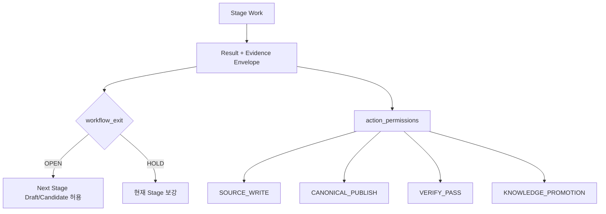
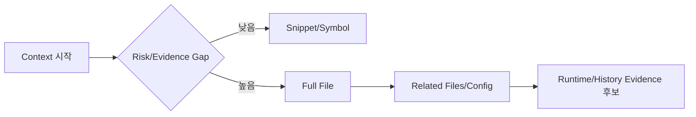

# 01. Stage Evidence Contract

> 상태: `EXPERIMENT`
> 목적: Stage가 문서 존재 여부가 아니라 Evidence와 Action Permission을 기준으로 다음 행동을 결정하게 한다.

# 1. Quick Start

Stage 결과는 다음 두 질문에 각각 답해야 한다.

1. **다음 분석/설계 작업을 계속할 수 있는가?**
2. **실제 Side Effect를 실행할 수 있는가?**



# 2. Common Contract

```yaml
stage_result:
  stage: IMPACT
  subject_id: RQ-xxxx
  progress: WORKING
  quality: WARNING
  validity: CURRENT
  workflow_exit: OPEN
  required_input:
    - requirement_candidate
  optional_input:
    - source_trace
  outputs:
    - impact_candidate
  evidence:
    observed: []
    given: []
    inferred: []
    confirmed: []
  evidence_revision:
    canonical_revision: null
    source_commit: null
  missing_evidence:
    - source_repository
    - static_analysis_result
  blind_spots:
    - trigger
    - dynamic_sql
  alerts: []
  assumptions: []
  action_permissions:
    source_write: DENY
    canonical_publish: CANDIDATE_ONLY
    verify_pass: DENY
    knowledge_k1: DENY
    knowledge_k2: DENY
  execution_guards:
    - code: TARGET_WRITE_PROOF_MISSING
      action: source_write
  next_stage:
    - DESIGN_DRAFT
```

# 3. Status Semantics

기존 Progress/Quality/Validity를 유지한다.

## Progress

- `NOT_STARTED`
- `WORKING`
- `COMPLETE`

## Quality

- `OK`
- `WARNING`
- `CRITICAL`

## Validity

- `CURRENT`
- `STALE`
- `INVALID`

Candidate B는 새로운 단일 종합 상태를 만들지 않는다. 대신 `workflow_exit`와 `action_permissions`를 별도 필드로 둔다.

## workflow_exit

- `OPEN`: 다음 Stage의 안전한 Draft/Candidate 작업 진행 가능
- `HOLD`: 현재 Stage 자체의 필수 구조가 없어 다음 Stage 결과가 의미를 갖지 못함

`HOLD`는 일반적으로 문서 미완료가 아니라 **식별 가능한 Subject/Input 자체가 없는 경우**에만 사용한다.

예:

- Raw Requirement row가 존재하나 문제/원하는 결과가 없다 → `OPEN`
- 어떤 Requirement와도 연결되지 않은 임의 Source patch만 있다 → VERIFY 기준 Subject가 없어 `HOLD`

## action_permissions

대표 값:

- `ALLOW`
- `DENY`
- `CANDIDATE_ONLY`
- `PROPOSAL_ONLY`
- `REQUIRES_DECISION`

Action별로 독립 평가한다.

# 4. Evidence Sufficiency Rule

`Evidence Type`은 권위나 충분성을 의미하지 않는다.

```text
GIVEN / OBSERVED / INFERRED / CONFIRMED
!=
AUTHORITY / SCOPE / FRESHNESS / SUFFICIENCY
```

Business Truth/Knowledge에 다음 Metadata가 필요하다.

- `authority`
- `scope.company`
- `scope.country`
- `scope.organization`
- `scope.role`
- `effective_from`
- `effective_to`
- `confirmed_at`
- `last_verified_at`
- `source`

Global 적용을 선언하려면 scope가 비어 있다는 뜻이 아니라 `scope=GLOBAL`이 명시돼야 한다.

# 5. Stage Contract Matrix

| Stage | Required Input | Optional Input | Output | Workflow Exit | Side Effect Permission 핵심 |
|---|---|---|---|---|---|
| INTAKE | 원본/신규 요구 입력 + provenance | 문제/원하는 결과/유지조건 | Raw/Candidate Requirement | 원본 식별 가능하면 OPEN | Published RQ는 Mapping/Review 계약 충족 시만 |
| DECOMPOSE | RQ Candidate | Legacy mapping, domain terms | FR/AC Candidate, split alert | Draft 가능하면 OPEN | RQ/FR Publish는 grouping review 기준 필요 |
| CLARIFY | RQ/FR Candidate | 기존 Knowledge | 질문/ALT/ASM | 질문 생성 가능하면 OPEN | BR CONFIRMED/K1 금지 unless authority/scope evidence |
| PROCESS | FR + 현재 알려진 Truth | Source/운영자료 | AS-IS/TO-BE Draft | OPEN | PROC Confirm/Promotion은 Truth evidence 필요 |
| DISCOVERY | Search subject + repo/profile | Static/runtime/DB metadata | Trace/Evidence Candidate | Repo 미제공이어도 query/checklist 생성 후 OPEN | Discovery COMPLETE는 evidence source 존재 필요 |
| IMPACT | RQ/FR + discovery result 또는 missing declaration | Runtime/human/business evidence | Business/Functional/Technical Impact | Candidate 생성 시 OPEN | MODIFY/VERIFY_ONLY 확정 및 Source Write는 coverage/target proof 필요 |
| DESIGN | FR/PROC/Impact Candidate | Standards/NFR | Functional Design Draft | OPEN | Tx/Auth/Security 미확정은 표시, Source Write permission과 분리 |
| PROGRAM | Design + discovery evidence | Existing program summary | PGM/ART candidate/spec | PGM 탐색 조건이 있으면 OPEN | PGM CONFIRMED는 source-bound evidence 필요 |
| DEVELOPMENT | TASK + PGM/ART + target proof | Context escalation evidence | Patch proposal 또는 Source change | 다른 Task/분석은 OPEN | actual Source Write는 Target Write Proof + current revision 필요 |
| TEST | AC + target behavior | Source/Test env | TC/Test result candidate | Scenario draft는 OPEN | Test PASS는 executed result + environment provenance 필요 |
| VERIFY | RQ/AC + implementation + executed tests | runtime/business review | Verification Result | evidence 부족해도 NOT_READY 결과 생성 가능 | VERIFY PASS는 required evidence set 충족 시만 |
| PROMOTION | Verified candidate | additional authority | K1/K2/K3 Candidate | 다음 RQ와 독립 | K1/K2 promotion은 applicability/freshness/verification rule 필요 |

# 6. Stage-specific Exit Conditions

## INTAKE

`workflow_exit=OPEN` 조건:

- 원본 provenance 또는 사용자 입력 source가 식별됨
- 최소 하나의 제목/상세/의도 텍스트가 존재

다음이 없어도 진행 가능:

- 담당자
- 일정
- 완전한 문제정의
- 완전한 Desired Outcome

Alert로 남긴다.

## DISCOVERY

Source가 없으면 `DISCOVERY COMPLETE`가 아니다.

허용:

```text
Discovery Query
Blind Spot Checklist
Evidence Request
```

금지:

```text
Trace Confirmed
PGM Confirmed
Impact Complete with Technical Coverage
```

## IMPACT

필수 결과 Metadata:

- `coverage_basis`
- `coverage_scope`
- `blind_spots`
- `unresolved_dynamic_edges`
- `runtime_evidence_used`
- `critical_consumer_review`

Static Analyzer 결과가 HIGH confidence여도 `blind_spots != []`이면 confidence가 completeness를 뜻한다고 표시하지 않는다.

## DEVELOPMENT

`Target Confidence`와 `Source Write Permission`은 분리한다.

```text
Target Confidence = HIGH
Target Write Proof = FAIL
→ Patch Proposal 가능
→ Source Write DENY
```

## VERIFY

`PASS` 조건은 최소:

- implementation result 존재
- executed TC result 존재
- AC coverage 계산 가능
- test environment/provenance 존재
- critical unresolved evidence가 release 의미를 뒤집지 않는지 표시

TC 문서만 있으면 `DRAFT`, 실행하지 않았으면 `NOT_EXECUTED`다.

# 7. Risk-based Context Escalation

기본 Retrieval:

```text
Canonical
→ Program Summary
→ Trace
→ Symbol
→ Snippet
→ Full File
```

다음 Trigger에서는 자동 확대 후보를 만든다.

- Transaction
- Security/Auth
- Shared Procedure
- Dynamic SQL
- Reflection/DI/Config dispatch
- Batch
- Interface
- Cross-program Rule
- High-risk Change
- Stale Summary
- Conflicting Evidence
- Trigger/Package State



Token Budget은 soft optimization이며 HIGH/CRITICAL risk에서 completeness보다 우선하지 않는다.

# 8. Failure Conditions

다음은 Contract FAIL이다.

1. Output 파일이 있다는 이유만으로 Stage COMPLETE
2. Source Evidence 없이 PROGRAM CONFIRMED
3. Source Evidence 없이 actual Source Write
4. Executed Test Result 없이 VERIFY PASS
5. `CONFIRMED`이지만 scope/effective period 없는 K1을 Global로 재사용
6. Static HIGH confidence를 Impact completeness로 표시
7. CRITICAL Alert 때문에 분석/설계 전체 Workflow 강제 Block
8. Execution Guard가 해당 Action이 아닌 전체 RQ를 정지
9. Stale evidence revision으로 Source Write
10. `blind_spots`가 존재하지만 사용자 View에서 숨김

# 9. User-facing Translation

내부 상태를 그대로 보여주지 않는다.

| 내부 | 사용자 표시 예 |
|---|---|
| workflow_exit=OPEN, source_write=DENY | `분석/설계는 계속할 수 있습니다. 실제 소스 수정은 근거 확인 후 진행됩니다.` |
| quality=WARNING | `확인이 필요한 항목이 있습니다.` |
| blind_spots 존재 | `아직 확인되지 않은 영향 영역이 있습니다.` |
| verify_pass=DENY | `테스트 결과가 없어 완료 검증은 아직 할 수 없습니다.` |
| recovery_required | `이전 실행이 중간에 중단되어 복구 확인이 필요합니다.` |

Agent 비숙련 사용자는 Evidence Envelope 자체를 이해하지 않아도 된다.
