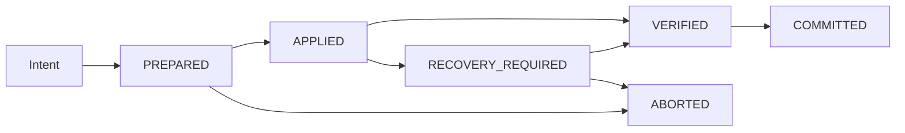

# 02. Work Unit / Recovery / Target Write Contract

> 상태: `EXPERIMENT`
> 목적: `/work` 재실행, crash, partial failure, wrong target 상황에서 Source/Canonical/Test/Generated Doc가 서로 다른 상태로 남는 것을 방지한다.

# 1. Quick Start

실제 Side Effect는 `Work Execution Unit` 안에서 수행한다.



핵심 원칙:

- 동일 intent 재실행은 동일 `idempotency_key`를 재사용한다.
- `COMMITTED` Work Unit은 같은 Side Effect를 다시 적용하지 않는다.
- Source patch 성공 후 Canonical update 실패 같은 상태는 `RECOVERY_REQUIRED`이며 정상 COMPLETE로 보지 않는다.

# 2. Work Unit Schema

```yaml
work_unit:
  work_unit_id: WU-...
  intent_id: INTENT-...
  idempotency_key: sha256(project|branch|task|intent|target_revision)
  project_id: PROJECT-...
  environment: DEV
  branch: task/...
  rq_id: RQ-...
  task_id: TASK-...
  program_id: PGM-...
  base_commit: abc123
  canonical_base_revision: 12
  target_write_proof_id: TWP-...
  state: PREPARED
  side_effects:
    - type: SOURCE_PATCH
      target: src/...
      before_fingerprint: sha256:...
      after_fingerprint: null
      status: PENDING
    - type: CANONICAL_DELTA
      target: PGM-...
      status: PENDING
    - type: GENERATED_DOC
      target: docs/...
      status: PENDING
  verification:
    test_result_ids: []
    invariant_result: PENDING
  compensation:
    strategy: REVERT_PATCH_AND_DISCARD_DELTA
```

# 3. Journal State

## PREPARED

- intent와 target이 고정됨
- current source revision 확인
- Target Write Proof 평가
- 예상 Side Effect 목록 기록
- 실제 변경 전 상태

## APPLIED

- 하나 이상의 Side Effect가 적용됨
- 아직 최종 검증/commit 전
- crash 발생 시 반드시 recovery scan 대상

## VERIFIED

- 적용된 Side Effect fingerprint 검증
- Canonical invariant 검사
- 필요한 Test 수행 결과 연결
- Generated Artifact revision 일치 확인

## COMMITTED

- Work Unit 결과를 정상 결과로 노출 가능
- 동일 idempotency key 재실행 시 재적용하지 않고 기존 결과 반환

## RECOVERY_REQUIRED

- APPLIED 이후 일부 Side Effect 실패/불명확
- `/check`에서 정상 DONE으로 숨기지 않음
- 자동 retry 가능 여부를 Side Effect별 판단

## ABORTED

- 실제 변경 전 Guard 실패 또는 compensation 완료

# 4. Idempotency Contract

`idempotency_key`는 최소 다음을 포함한다.

```text
project_id
+ branch/workspace
+ task or explicit target
+ normalized intent
+ target source/canonical revision
```

동일 key에 대해:

- PREPARED: resume 가능
- APPLIED: fingerprint 확인 후 resume/recover
- VERIFIED: commit continuation
- COMMITTED: duplicate side effect 금지, 기존 result 반환
- ABORTED: intent가 같아도 revision이 바뀌면 새 key 필요

Idempotency는 “같은 문장을 두 번 입력하면 무조건 같은 key”가 아니다. Target revision이 바뀌면 새로운 실행이다.

# 5. Target Write Proof

Target Resolver confidence와 별도로 mutating action에는 `Target Write Proof`가 필요하다.

```yaml
target_write_proof:
  proof_id: TWP-...
  candidate_target: PGM-ATT-0016
  artifact: src/.../AttendanceService.java
  resolver_confidence: HIGH
  evidence:
    - type: TASK_PGM_RELATION
      revision: 18
    - type: CURRENT_SOURCE_TRACE
      revision: commit:abc123
    - type: SYMBOL_MATCH
      symbol: recalcAttendance
  current_revision_verified: true
  ambiguity_check:
    top1: 0.93
    top2: 0.51
  scope_invariant:
    task_to_pgm: PASS
    pgm_to_artifact: PASS
    artifact_exists: PASS
  write_permission: ALLOW
```

최소 원칙:

1. `resolver_confidence=HIGH`만으로 ALLOW하지 않는다.
2. 현재 source/canonical revision을 확인한다.
3. TASK↔PGM↔ART 관계 invariant를 확인한다.
4. 가능하면 서로 다른 계열의 Evidence를 2개 이상 요구한다.
5. stale summary만으로는 proof가 되지 않는다.
6. ambiguity가 임계값 이내면 `REQUIRES_DECISION`.

# 6. Evidence Independence

서로 다른 파일에 같은 오래된 Summary가 복제된 것은 독립 Evidence 2개가 아니다.

권장 Evidence family:

- Explicit Human/Task Mapping
- Canonical Direct Relation
- Current Source Symbol/Path
- Static Trace
- Runtime Trace
- Test/Failure Location
- Repository Convention

두 Evidence가 동일 generated summary를 source로 공유하면 `independence=false`로 표시한다.

# 7. Source Write vs Patch Proposal

근거가 부족해도 Workflow 전체를 막지 않는다.

```text
Target 후보 생성
→ Context 수집
→ Diff/Patch Proposal 작성
→ 실제 Workspace Apply는 Guard
```

`Patch Proposal`은 실제 Source 파일을 변경하지 않는 산출물이다.

다음은 별도 DECISION_REQUIRED다.

- CRITICAL business uncertainty가 남아 있어도 short-lived branch에 실제 patch apply를 허용할지

# 8. Canonical Invariants

Work Unit commit 전에 최소 검사:

- 모든 relation endpoint 존재
- Published Display ID unique
- source-bound entity에 source/evidence revision 존재
- Generated Artifact에 canonical revision 존재
- CURRENT 상태는 dependency freshness 검사 통과
- TASK↔PGM↔ART write target relation 유효
- deleted/dangling relation 0
- same work unit의 side effect result가 journal과 일치

# 9. Partial Failure Scenarios

## Case WU-01 — Source Apply 성공, Canonical 실패

Expected:

```text
state = RECOVERY_REQUIRED
Source fingerprint = changed
Canonical delta = failed
Generated Doc = not committed
/work retry = source patch 재적용 금지
```

Recovery:

- source fingerprint가 expected after와 같으면 Canonical delta부터 resume
- 다르면 사용자/merge conflict 판단

## Case WU-02 — Canonical 성공, Doc generation 실패

Canonical을 rollback할 필요가 없는 derived-view 실패라면:

```text
state = RECOVERY_REQUIRED
recovery_action = REGENERATE_VIEW
```

Doc가 SoT가 아니므로 Canonical을 조용히 되돌리지 않는다.

## Case WU-03 — Test 실패

Source/Canonical apply가 성공했더라도:

```text
state != COMMITTED_AS_VERIFIED
VERIFY_PASS = DENY
```

정책에 따라 branch commit 자체는 존재할 수 있지만 Harness 결과는 verified completion으로 표시하지 않는다.

## Case WU-04 — Crash 후 `/work` 재실행

동일 key의 APPLIED unit 발견:

- 새 patch 생성 금지
- before/after fingerprint 확인
- resume 또는 recovery route

## Case WU-05 — Target revision 변경

PREPARED 이후 다른 commit이 target 파일을 변경:

```text
current_revision_verified = false
write_permission = DENY
reason = TARGET_REVISION_CHANGED
```

새 Context/Proof 후 새 Work Unit을 만든다.

# 10. Recovery Journal Retention

Pilot 최소:

- Branch가 존재하는 동안 journal 보존
- Merge/close 후 감사용 summary 보존
- Prompt 원문/secret은 journal에 저장하지 않음
- source diff 자체 저장 정책은 repository security policy를 따름

# 11. Security Boundary

Work Unit에는 최소 다음 guard context가 필요하다.

- `project_id`
- `environment`
- data classification
- model/provider allowlist result
- secret redaction result
- production write policy
- generated document ACL class

기본 Pilot 정책:

- Production DB write: DENY
- Secret detected outbound context: DENY until redacted
- Unapproved model/provider: DENY outbound action
- 분석/로컬 문서화는 가능한 범위에서 계속

# 12. Failure Conditions

1. 동일 `/work` retry가 같은 Source patch를 두 번 적용
2. Source 변경 성공/Canonical 실패인데 DONE 표시
3. recovery journal 없이 partial side effect를 추측으로 재실행
4. stale target revision으로 patch apply
5. HIGH confidence 하나만으로 Source Write ALLOW
6. Target proof가 동일 stale summary의 복제 evidence만 사용
7. Test 실패인데 VERIFIED/COMMITTED 결과를 PASS로 표시
8. Production DB write guard가 전체 분석 workflow까지 차단
9. compensation 불가능한 Side Effect를 rollback 가능하다고 표시
10. journal에 secret/prompt 원문을 무조건 저장
