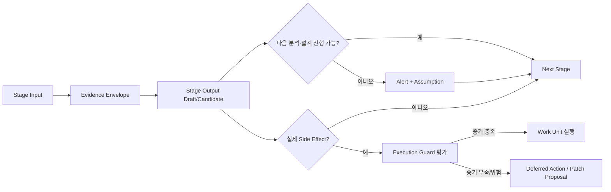

# Stage Evidence + Execution Contract — Sample B

> 상태: `EXPERIMENT / NOT BASELINE`
> 기준 Baseline: `AI_SDLC_Harness_Full_Design_v1.5.1.md`
> Branch: `SDLC_DESIGN_SESSION_SECOND/design/stage-evidence-execution-contract-sample-b`
> 목적: v1.5.1의 `Stage 최소 Output이 있으면 다음 단계 진행 가능` 원칙을 유지하면서, Red Team이 지적한 Silent COMPLETE/PASS/HIGH 전파를 막기 위한 Stage Evidence/Execution Contract를 독립 Candidate로 검증한다.
> 병합 정책: 사용자 비교/선택 전 `main` 및 다른 Candidate Branch에 병합하지 않는다.

# Quick Start

Candidate B의 핵심은 **Workflow 진행 가능 여부와 실제 Side Effect 실행 가능 여부를 분리**하는 것이다.



일반 사용자는 새로운 내부 상태를 외울 필요가 없다.

- `/work`: 가능한 분석/설계/초안을 계속 진행한다.
- `/check`: `진행 가능`, `확인이 필요함`, `실제 수정은 보류됨`처럼 사용자 문구로 표시한다.
- `/change`: 기존과 동일하게 Change/STALE 전파를 수행한다.

# Purpose

이 Candidate는 다음 문제를 해결하는지 검증한다.

1. 문서가 생성됐다는 이유만으로 Stage가 의미상 COMPLETE가 되는 문제
2. Source 없는 PROGRAM COMPLETE, Test 없는 VERIFY PASS 같은 false-positive
3. HIGH confidence Wrong Target이 그대로 Source Write 권한으로 연결되는 문제
4. `/work` 재실행 시 Source/Canonical/Doc/Alert가 중복 생성되는 문제
5. Partial Failure 뒤 `/check`가 정상 상태를 보여주는 문제
6. Static Analyzer blind spot이 결과에서 사라지는 문제
7. CRITICAL business uncertainty가 Draft와 Release를 같은 방식으로 막거나 허용하는 문제

# Current Problem

v1.5.1은 Non-blocking 원칙과 Execution Guard를 명확히 했지만 Stage Contract는 아직 요약 수준이다.

```text
Stage 최소 Output 존재
→ 다음 단계 진행 가능
```

이 규칙만 구현하면 다음 오해가 생길 수 있다.

```text
Impact Candidate 문서 존재
→ IMPACT COMPLETE
→ PGM Candidate 생성
→ Target Confidence HIGH
→ Source Write
```

하지만 `Impact Candidate 문서 존재`와 `Source Write에 충분한 영향 근거`는 동일하지 않다.

Candidate B는 이를 다음 두 축으로 분리한다.

```text
Workflow Continuation
!=
Execution Permission
```

# Design Hypothesis

모든 Stage는 공통 `Stage Evidence Envelope`를 출력한다.

```text
Required Input
Optional Input
Output
Quality
Validity
Evidence
Alert
Assumption
Exit Condition
Next Stage
Execution Guard
```

추가 핵심:

- `workflow_exit`: 다음 Stage의 draft/candidate 작업을 시작할 수 있는가
- `action_permissions`: Source Write, Canonical Publish, VERIFY PASS, K1/K2 Promotion 등 Side Effect별 허용 여부
- `missing_evidence`: 현재 결과가 무엇을 모르는지 구조화
- `blind_spots`: Analyzer/Source가 관찰하지 못한 영역
- `evidence_revision`: 판단이 어떤 Source/Canonical revision을 기준으로 했는지

# Candidate A와의 관계

Candidate B는 Candidate A를 수정하거나 상속하지 않는다.

- Candidate A: Legacy Requirement Intake Normalizer + MD↔Excel Sync 중심
- Candidate B: Stage Evidence + Target Write + Recovery/Idempotency 중심

두 설계는 결합 가능성이 있지만 **사용자 선택 전 자동 결합하지 않는다.** Sample 검증에서는 첨부 Excel의 관찰 사실(142 Raw Row, 22 제목 Group 등)만 공통 Fixture로 사용한다.

# Documents

1. `01_stage_evidence_contract.md`
   - Stage별 Required/Optional/Output/Evidence/Exit/Guard 계약
2. `02_work_unit_recovery_target_write_contract.md`
   - Work Unit, Recovery Journal, Idempotency, Target Write Proof
3. `03_sample_validation_and_comparison.md`
   - 요구사항목록.xlsx Sample 적용, Silent Failure 검증, Candidate 비교
4. `04_decision_required.md`
   - 사용자 선택이 필요한 설계 충돌
5. `contract-tests/stage-contract-cases.yaml`
   - Stage false COMPLETE/PASS 방지 Case
6. `contract-tests/work-unit-cases.yaml`
   - Retry/Crash/Wrong Target/Partial Failure Case

# Capability Continuity

| Capability | 상태 | Candidate B 처리 |
|---|---|---|
| Canonical Model | UNCHANGED | SoT 원칙 유지 |
| Human Truth/System Evidence | ENHANCED | scope/revision/evidence sufficiency 추가 |
| Process Never Blocked | ENHANCED | workflow_exit와 action permission 분리 |
| Execution Guard | ENHANCED | Side Effect별 guard reason/required evidence |
| Target Resolver | ENHANCED | confidence와 write permission 분리 |
| Static Analysis First | ENHANCED | blind_spots/coverage_basis 명시 |
| Context Pack | ENHANCED | risk-based escalation trigger 정의 |
| Knowledge Promotion | ENHANCED | K1/K2 promotion permission을 Stage action으로 분리 |
| Git/Semantic Merge | UNCHANGED | 본 Candidate에서 merge policy 자체는 변경하지 않음 |
| Candidate A Intake/Sync | UNCHANGED / INDEPENDENT | 기존 Branch 수정 없음 |

Silent Removal은 없다.

# Success Condition

Candidate B가 유효하려면 다음이 동시에 성립해야 한다.

```text
정보 부족에도 Draft/Candidate 작업은 계속 가능
+
Source 없는 PROGRAM COMPLETE는 불가
+
Target Confidence만으로 Source Write 불가
+
Test Result 없는 VERIFY PASS 불가
+
K1 scope/authority/effective period 없는 Global Promotion 불가
+
/work 재실행 시 Side Effect 중복 0
+
Partial Failure가 정상 COMPLETE로 보이지 않음
```
