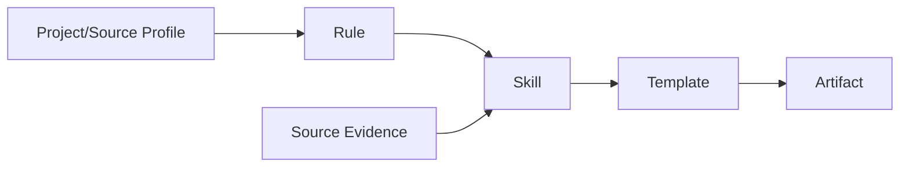

# Source-enabled Harness Structure 검증

## Quick Start

이 검증은 실제 업무 Source의 Business Truth를 가정하지 않는다. **Source Repository가 연결되었다고 가정했을 때 필요한 Input Contract와 Rule→Skill→Template 구조가 완전한지**를 검증한다.

## 1. 판정

`STRUCTURAL PASS / SEMANTIC SOURCE VALIDATION PENDING`

다른 프로젝트에 Harness Structure를 적용하고 Source/Profile만 Custom하는 목적에는 사용할 수 있다. 실제 Program/Table/Business Rule 정확성은 대상 프로젝트 Source를 연결한 후 별도 검증해야 한다.

## 2. 검증 대상

| 구분 | 검증 |
|---|---|
| Core Rule | Truth/Evidence 분리, Non-blocking, Execution Guard, Traceability |
| Project Rule | Profile/Overlay resolution |
| User Skill | `/work /change /check /setup` |
| Work References | requirement~verify 10개 |
| Core Templates | Requirement~Verification + Operations Knowledge |
| Source Profile | Source root/build/test/evidence/write policy |
| Overlay | Project/Domain 차이 분리 |
| Validator | Stage별 Reference/Template/Evidence contract 자동 검사 |

## 3. Source가 들어왔을 때 기대 구조

| Stage | Source 입력 | Skill Reference | 주요 산출물 Template |
|---|---|---|---|
| DECOMPOSE | 선택 | requirement | requirement-analysis |
| CLARIFY | 선택 | clarify | interview-questions |
| PROCESS | 보조 | process | process-analysis |
| DISCOVERY | 필수 | discovery | impact-analysis의 Source Evidence |
| IMPACT | 필수 | impact | impact-analysis |
| DESIGN | 필수/기존자산 | design | functional-design |
| PROGRAM | 필수 | program | program-spec |
| DEVELOPMENT | 필수 | development | implementation-result |
| TEST | Source/Test 필요 | test | test-scenario |
| VERIFY | Source/Build/Test Evidence | verify | verification-result |

## 4. Portable / Custom 경계

### 그대로 이식하는 Core
- `.cursor/rules/00-core.mdc`
- `.cursor/skills/**`
- `sdlc/templates/core/**`
- `sdlc/design/contracts/harness-package-contract.json`
- `sdlc/scripts/validate_harness_structure.py`

### 프로젝트마다 Custom
- Project Profile
- Source roots / build / test command
- Architecture / coding / DB / test standards
- Project Rule
- Domain Rule
- Template 추가 Section/표시명
- PM 컬럼/Artifact 생성 정책

## 5. 중요한 검증 결론

1. Source 경로/Framework를 Core Skill에 하드코딩하면 이식성이 깨지므로 Source Profile로 분리해야 한다.
2. Rule은 짧은 invariant, Skill은 실행 절차, Template는 산출물 구조로 역할을 분리해야 한다.
3. Source-enabled Stage는 `Artifact/File + Symbol/Locator + Source Hash + Confidence/Status`가 산출물에 들어갈 자리가 반드시 있어야 한다.
4. Source 구현은 `OBSERVED`이며 Business Rule `CONFIRMED`와 분리해야 한다.
5. Project Custom은 Core copy/fork보다 Overlay가 기본이어야 유지보수와 Baseline upgrade가 가능하다.
6. Template를 프로젝트마다 통째로 복사하면 Upgrade diff가 커지므로 Section-level 차이만 Overlay하는 방향이 적합하다.

## 6. 아직 실제 Source가 필요한 검증

- Static Analyzer별 정확한 Adapter
- PGM/ART/DATA Candidate recall/precision
- Build/Test command 자동 탐지 정확도
- 실제 Source hash/freshness 갱신
- Standard Resolver의 Stack별 Section 선택
- 실제 `/work TASK` Source write scope correctness

따라서 현재 결과는 Structure/Contract에는 PASS이고, 실제 프로젝트 Source 의미 검증은 다음 Branch에서 수행한다.
