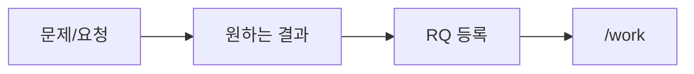
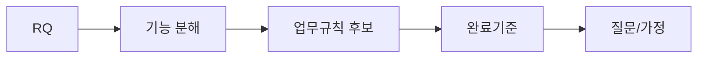
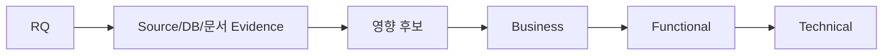
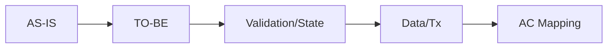
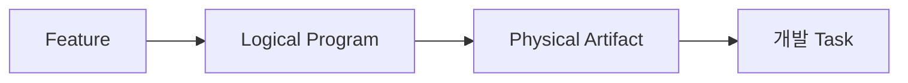
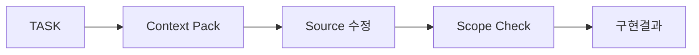
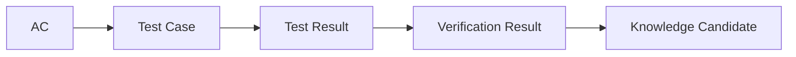

# SDLC 전체 가이드

## Quick Start

`요구사항 등록 → /work 반복 → /check → 변경 시 /change`만으로 기본 업무를 진행한다.


## 1. 요구사항



최소 입력은 `요구사항명`, `현재 문제/요청내용`, `원하는 결과`다. 기술 구현방식을 미리 확정할 필요는 없다.

## 2. 분석



사람은 Agent가 만든 기능 분해와 질문을 검토한다. 답이 늦어져도 Alert/Assumption으로 남기고 진행할 수 있다.

## 3. 영향분석



Brownfield는 Static Analysis와 기존 가이드를 우선 활용한다. Greenfield는 Architecture/Preset을 기준으로 영향 후보를 정한다.

## 4. 기능설계



특정 Java Method보다 목표 시스템 동작을 정의한다. 미확정 항목은 표시하고 다음 단계로 이월할 수 있다.

## 5. 프로그램설계



기존 Program 재사용을 우선한다. 파일명은 `PGM-ID_짧은업무명_프로그램설계.md` 형식을 사용한다.

## 6. 개발



위험한 write가 Guard되어도 다른 Source 조사, 설계 보완, 다른 Task 진행은 가능하다.

## 7. 테스트/검증



실패나 미수행 Test는 숨기지 않고 상태로 남긴다. Release 불가능하면 Release Action만 Guard한다.

## 8. 전체 작업 추적

`docs/00_관리/전체작업목록.md`와 `.xlsx`는 동일한 Work Item View다. PM은 RQ→FR→PGM→TASK→AC/TC까지 세분화해서 볼 수 있다. 담당자/계획일정/공수는 Optional이다.

## Mermaid 작성 규칙

GitHub 호환성을 위해 노드 라벨은 기본적으로 따옴표로 감싼다. 특히 `/`, `?`, 괄호, 콜론 등 특수문자를 포함한 라벨은 반드시 다음 형태를 사용한다.

```text
A["/work"]
Q{"기존 자산?"}
```
