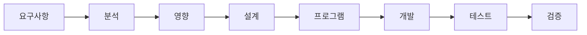
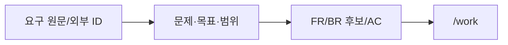
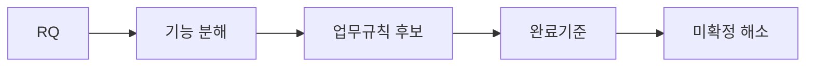
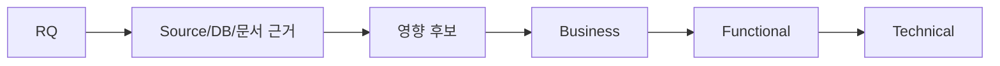
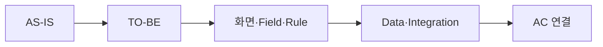
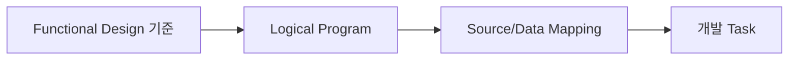
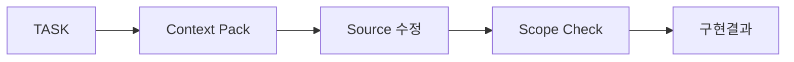
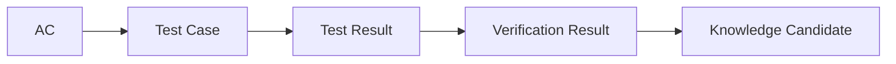

# SDLC 전체 가이드

## Quick Start

`요구사항 등록 → /work 반복 → /check → 변경 시 /change`만으로 기본 업무를 진행한다.

같은 업무정보를 단계마다 다시 작성하지 않는다. 이전 단계의 기준 문서를 참조하고 현재 단계에서 새로 결정되거나 구현되는 내용만 추가한다.



## 1. 요구사항 정의



요구 원문과 분석결과는 하나의 활성 Requirement Artifact에서 관리한다. 최소 입력은 요구 원문 또는 `요구사항명`, `현재 문제/요청내용`, `원하는 결과`다. 기술 구현방식을 미리 확정할 필요는 없다.

`requirement-analysis.md`는 기존 링크 호환용 Legacy View이며 신규 분석 내용을 작성하지 않는다.

## 2. 분석/미확정 해소



사람은 Agent가 만든 기능 분해와 실제 결과를 바꾸는 미확정 사항을 검토한다. 사람에게 보이는 OPEN 상태는 `미확정 / 확인중 / 제안 / 확정 / 보류`를 기본으로 하며 내부 분류 코드를 외울 필요가 없다.

## 3. 영향분석



Brownfield는 Static Analysis와 기존 가이드를 우선 활용한다. Framework/ORM/Message 관계의 완전한 분석은 Project Impact Adapter가 필요할 수 있다. Adapter가 없으면 `PARTIAL_PROJECT_ADAPTER_REQUIRED`로 표시하고 완전 분석으로 과장하지 않는다.

## 4. 기능설계



Functional Design은 목표 시스템의 업무/기능 의미를 정의하는 기준 문서다. 6하원칙, 화면/Field 의미, CRUD 의미, 핵심 업무 규칙, 논리 Data 요구, 권한/예외, AC를 여기에서 관리한다.

## 5. 프로그램 구현 명세



Program Spec은 Functional Design을 반복하지 않는다. 실제 PGM/Entry Point/Source Symbol, DTO/API/DB Mapping, Query/Table/Column, Transaction, Integration 기술계약, Error/Security/Observability, TASK/AC/TC/Source 연결과 구현 준비도만 추가한다.

기존 Program 재사용을 우선한다. 17개 구현 준비도는 17개 별도 Section이 아니라 하나의 준비도 표에서 확인한다.

## 6. 개발



위험한 write가 Guard되어도 다른 Source 조사, 설계 보완, 다른 Task 진행은 가능하다.

## 7. 테스트/검증



실패나 미수행 Test는 숨기지 않고 상태로 남긴다. Release 불가능하면 Release Action만 Guard한다.

## 8. Source 변경 후 재검토

현재 Core 구현은 Source Hash Drift와 Reverse Review Candidate까지다. 전체 Reverse Engineering, Program Spec 자동 재생성, Business Truth 자동 갱신 기능으로 표현하지 않는다.

## 9. 전체 작업 추적

`docs/00_관리/전체작업목록.md`와 `.xlsx`는 동일한 Work Item View다. PM은 RQ→FR→PGM→TASK→AC/TC까지 세분화해서 볼 수 있다. 담당자/계획일정/공수는 Optional이다.

## Mermaid 작성 규칙

GitHub 호환성을 위해 노드 라벨은 기본적으로 따옴표로 감싼다. 특히 `/`, `?`, 괄호, 콜론 등 특수문자를 포함한 라벨은 반드시 다음 형태를 사용한다.

```text
A["/work"]
Q{"기존 자산?"}
```
