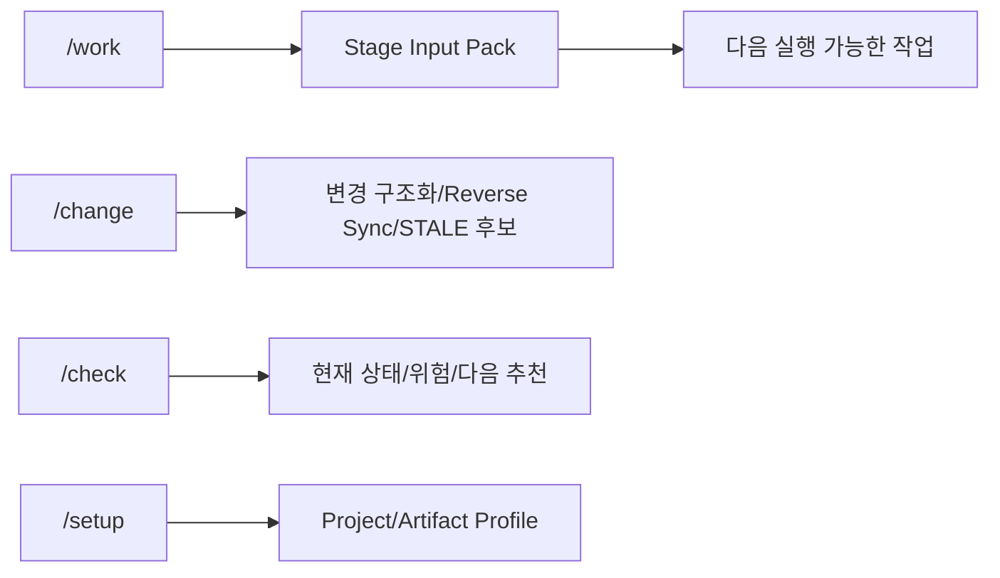
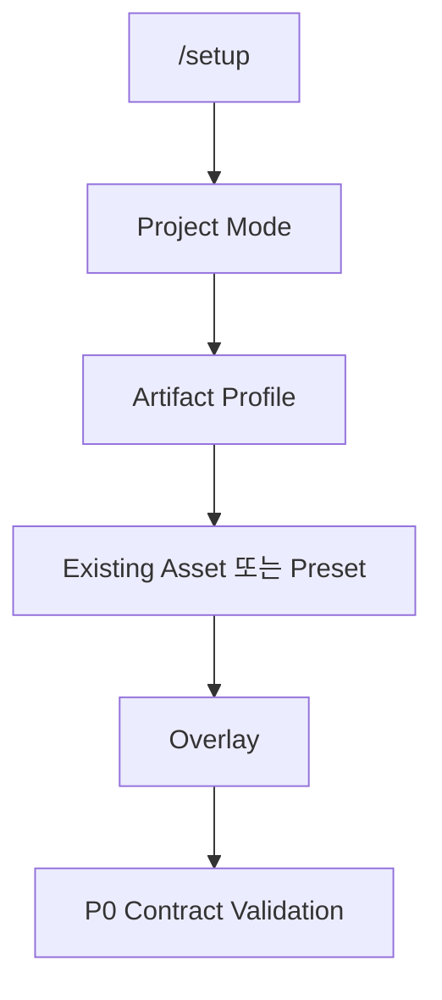

# SKILL 사용 가이드

## Quick Start



일반 사용자는 기존처럼 `/work`, `/change`, `/check`만 사용한다. P0부터 Agent 내부에서는 각 Stage 실행 전에 `Stage Input Pack`을 만들고 deterministic validation 후 다음 Agent/Stage로 넘긴다.

## `/work`

현재 RQ/PGM/TASK를 다음 실행 가능한 상태로 진행한다.

- `/work RQ-0042`
- `/work PGM-ATT-0016`
- `/work TASK-0042-DEV-002`
- `아까 하던 요구사항 계속 진행해줘`

P0 규칙:

1. 원본 Requirement ID를 먼저 보존한다.
2. RQ Boundary가 모호하면 `RQ_CANDIDATE + OPEN`으로 유지한다.
3. Stage Input Pack에 Target, Evidence, OPEN, Constraint, 다음 Action을 기록한다.
4. Validator가 실패하면 잘못된 상태를 다음 Stage의 확정 사실로 전달하지 않는다.
5. Target이 애매하면 Source write만 보류하고 후보 분석과 다른 비차단 작업은 계속한다.

## `/change`

자연어 변경 또는 Source Diff를 구조화한다.

- 사람이 알려준 변경: CR → 영향 관계 → STALE 후보
- Source에서 발견한 변경: Source Diff → PGM/ART → Semantic Change Candidate → 관련 RQ/FR/BR/AC/TC → STALE 후보

Source 변경을 Business Truth로 자동 승격하지 않는다. `BUSINESS_RULE_CANDIDATE`, `SECURITY_BEHAVIOR`, `UNKNOWN`은 검토가 필요하다.

## `/check`

다음을 짧게 보여준다.

- 현재 Stage
- 완료/미완료
- Boundary 상태
- Open Alert/Execution Guard
- 담당자/일정(있는 경우)
- 다음 추천 작업과 Escalation 대상

## `/setup`

Harness 관리자용이다.



Artifact Profile 기본값은 `STANDARD`다.

- `LITE`: 작은/저위험 프로젝트. Human Artifact를 최소화한다.
- `STANDARD`: 일반 고객 프로젝트 기본값.
- `ENTERPRISE`: 규제/고위험/병렬개발에서 추가 Guard를 활성화한다.

내부 Canonical Trace와 Stage Input Pack은 Profile에 관계없이 유지한다.

## Low-Agent Skill Contract

모든 Stage Skill은 다음 구조를 따른다.

`Purpose → Required/Optional Input → Precondition → Retrieval → Atomic Steps → Decision Rules → Output Schema → Quality Check → Alert → Stop → Escalation → Do Not → Example`

상세 계약: `sdlc/design/contracts/low-agent-execution-contract.md`

핵심 원칙:

- 모르는 값은 OPEN
- Source 관찰은 OBSERVED
- Business Decision은 Human
- Required/ID/Reference/Boundary Cardinality는 Validator
- 다음 Agent가 이전 Conversation History를 필요로 하지 않도록 Handoff

## P0 Validator

```text
python sdlc/scripts/validate_p0_contracts.py stage-pack <stage-input-pack.yaml>
python sdlc/scripts/validate_p0_contracts.py rq-boundary <requirement-boundary.yaml>
python sdlc/scripts/test_p0_contracts.py
```

## Mermaid 작성 주의

Skill 명처럼 `/`로 시작하는 문자열을 `S[/setup]`처럼 쓰지 않는다. GitHub에서는 shape 문법으로 해석될 수 있으므로 `S["/setup"]`처럼 작성한다.
