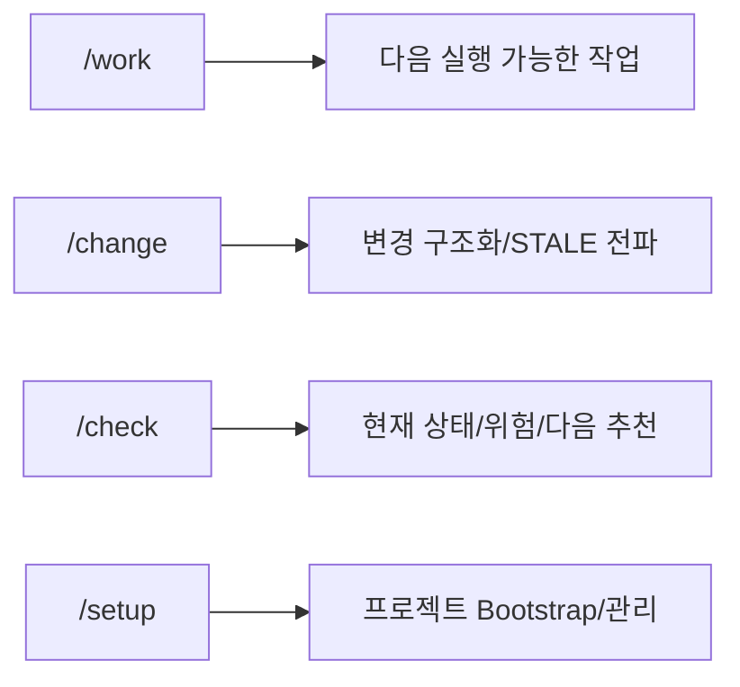
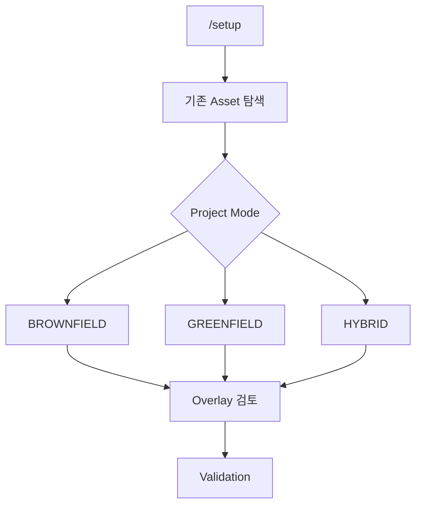

# SKILL 사용 가이드

## Quick Start

## `/work`

현재 RQ/PGM/TASK를 다음 실행 가능한 상태로 진행한다.

- `/work RQ-0042`
- `/work PGM-ATT-0016`
- `/work TASK-0042-DEV-002`
- `아까 하던 요구사항 계속 진행해줘`

Target이 애매하면 Source write만 보류하고 후보 분석과 다른 작업은 계속한다.

## `/change`

자연어 변경을 CR로 구조화하고 관련 BR/PROC/PGM/TASK/AC/TC를 STALE 처리한다.

- `월 마감 이후에는 재계산하지 않는 것으로 바뀌었어.`

## `/check`

다음을 짧게 보여준다.

- 현재 Stage
- 완료/미완료
- Open Alert/Execution Guard
- 담당자/일정(있는 경우)
- 다음 추천 작업

## `/setup`

Harness 관리자용이다.

## Mermaid 작성 주의

Skill 명처럼 `/`로 시작하는 문자열을 `S[/setup]`처럼 쓰지 않는다. GitHub에서는 shape 문법으로 해석될 수 있으므로 `S["/setup"]`처럼 작성한다.
