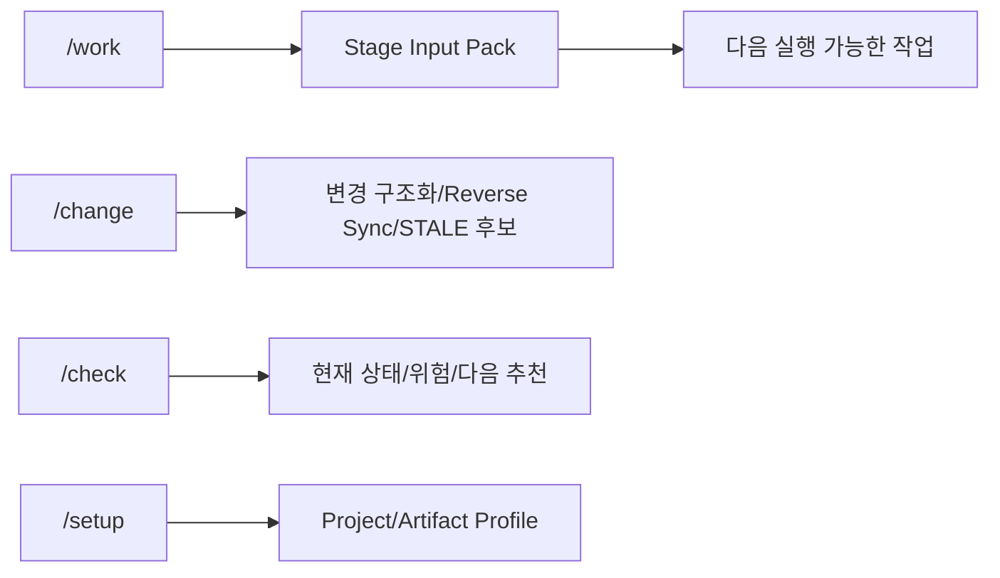
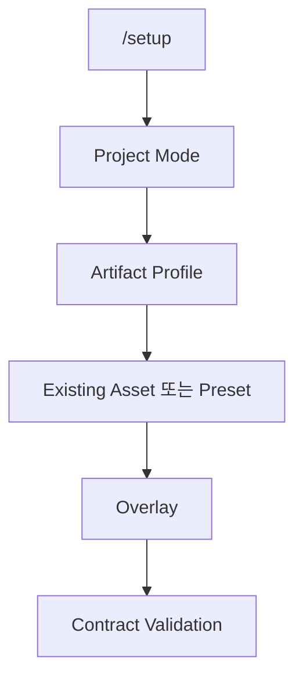

# SKILL 사용 가이드

## Quick Start



일반 사용자는 기존처럼 `/work`, `/change`, `/check`만 사용한다. P0부터 Agent 내부에서는 각 Stage 실행 전에 `Stage Input Pack`을 만들고 deterministic validation 후 다음 Agent/Stage로 넘긴다.

## `/work`

현재 RQ/PGM/TASK 또는 Candidate Review를 다음 실행 가능한 상태로 진행한다.

- `/work RQ-0042`
- `/work PGM-ATT-0016`
- `/work TASK-0042-DEV-002`
- `/work RQR-6BB6D66548`
- `아까 하던 요구사항 계속 진행해줘`

P0~P0.4 규칙:

1. 원본 Requirement ID를 먼저 보존한다.
2. Legacy Inventory는 `SOURCE_ROW → deterministic Candidate Group`으로 정규화한다.
3. 여러 Row는 기본적으로 Group-level Stage Input Pack으로 넘긴다.
4. RQ Boundary가 모호하면 `RQ_GROUP_CANDIDATE + OPEN`으로 유지한다.
5. Candidate Group은 전체작업목록에서 Canonical 요구사항이 아니라 `RQ_GROUP_REVIEW` 작업으로 보인다.
6. Human/L2가 Boundary를 `CONFIRMED`하기 전에는 Canonical Publish를 허용하지 않는다.
7. Source가 연결되면 Direct Trace 또는 bounded retrieval로 PGM/ART/Symbol/Data Evidence를 `OBSERVED`로 수집한다.
8. RQ Boundary가 OPEN이어도 Technical Discovery/Impact Candidate는 진행할 수 있다.
9. Source Diff는 Semantic Change Candidate와 STALE/Review Candidate를 만들지만 Human Truth를 자동 수정하지 않는다.
10. Test Stage에서는 AC Coverage와 Runtime Execution을 분리하고, 실행하지 않은 TC를 PASS로 표시하지 않는다.
11. VERIFY는 모든 필수 TC의 실제 실행 Evidence와 환경 조건이 충족될 때만 `VERIFIED_PASS`가 될 수 있다.
12. Validator가 실패하면 잘못된 상태를 다음 Stage의 확정 사실로 전달하지 않는다.

### Legacy Requirement Review 흐름

```text
Legacy Row
→ Exact Candidate Group
→ RQ_GROUP_REVIEW
→ Human/L2 Boundary Decision
→ CONFIRMED + Evidence + Decision Revision
→ Preallocated Canonical IDs
→ Canonical Publish Request
→ PUBLISH_READY
```

`OPEN / PROVISIONAL / UNRESOLVED` 상태는 Publish 대상이 아니다.

### Brownfield Discovery / Reverse Sync 흐름

```text
Candidate/RQ Context
→ Direct Trace Manifest 또는 bounded retrieval
→ Source File/Symbol/Mapper/Table Evidence
→ Impact Candidate
→ Source Diff
→ Semantic Change Candidate
→ Direct Technical Artifact = STALE_CANDIDATE
→ Requirement/BR = REVIEW_CANDIDATE
→ Human Truth = PROTECTED
```

Source 조건식은 `OBSERVED Behavior`이며 자동 `CONFIRMED Business Rule`이 아니다.

### TEST / VERIFY 흐름

```text
Acceptance Criteria
→ Test Contract
→ AC↔TC Coverage
→ Source Evidence Set Binding
→ Test Execution Result
→ Runtime Evidence / Explicit NOT_EXECUTED
→ Verification Gate
→ VERIFIED_PASS | VERIFIED_FAIL | PARTIAL_EVIDENCE | CONTRACT_PASS_RUNTIME_NOT_EXECUTED
```

중요:

- `AC Coverage 100%`는 Test 설계 Coverage다. 실행 성공이 아니다.
- `PASSED / FAILED`는 actual result + 실행 Evidence가 있어야 한다.
- 실제 Runtime이 없으면 `CONTRACT_PASS_RUNTIME_NOT_EXECUTED`까지만 가능하다.
- Synthetic Fixture는 Production `VERIFIED_PASS`로 승격하지 않는다.
- 미검토 `BUSINESS_RULE_CANDIDATE`가 있으면 `VERIFIED_PASS`를 차단한다.

## `/change`

자연어 변경 또는 Source Diff를 구조화한다.

- 사람이 알려준 변경: CR → 영향 관계 → STALE 후보
- Source에서 발견한 변경: Source Diff → PGM/ART → Semantic Change Candidate → 관련 RQ/FR/BR/AC/TC → STALE/Review 후보

Source 변경을 Business Truth로 자동 승격하지 않는다. `BUSINESS_RULE_CANDIDATE`, `SECURITY_BEHAVIOR`, `UNKNOWN`은 검토가 필요하다.

## `/check`

다음을 짧게 보여준다.

- 현재 Stage
- 완료/미완료
- Boundary 상태
- Candidate Review 상태
- Canonical Publish 가능 여부
- Source Provider/Revision
- Direct PGM/ART Evidence
- Reverse Sync / STALE Candidate
- AC↔TC Coverage
- Test 실행 상태와 Evidence
- Verification 상태
- Blind Spot
- Open Alert/Execution Guard
- 담당자/일정(있는 경우)
- 다음 추천 작업과 Escalation 대상

## `/setup`

Harness 관리자용이다.



Artifact Profile 기본값은 `STANDARD`다.

- `LITE`: 작은/저위험 프로젝트. Human Artifact를 최소화한다.
- `STANDARD`: 일반 고객 프로젝트 기본값.
- `ENTERPRISE`: 규제/고위험/병렬개발에서 추가 Guard를 활성화한다.

내부 Canonical Trace와 Stage Input Pack은 Profile에 관계없이 유지한다.

## Low-Agent Skill Contract

모든 Stage Skill은 다음 구조를 따른다.

`Purpose → Required/Optional Input → Precondition → Retrieval → Atomic Steps → Decision Rules → Output Schema → Quality Check → Alert → Stop → Escalation → Do Not → Example`

상세 계약: `sdlc/design/contracts/low-agent-execution-contract.md`

핵심 원칙:

- 모르는 값은 OPEN
- Source 관찰은 OBSERVED
- Business Decision은 Human
- Required/ID/Reference/Boundary Cardinality는 Validator
- 다음 Agent가 이전 Conversation History를 필요로 하지 않도록 Handoff

## Validator / Utility

### P0

```text
python sdlc/scripts/validate_p0_contracts.py stage-pack <stage-input-pack.yaml>
python sdlc/scripts/validate_p0_contracts.py rq-boundary <requirement-boundary.yaml>
python sdlc/scripts/test_p0_contracts.py
```

### P0.1

```text
python sdlc/scripts/normalize_legacy_requirements.py <source-rows.yaml> -o <normalization.yaml>
python sdlc/scripts/test_p01_contracts.py
```

### P0.2

```text
python sdlc/scripts/build_requirement_review_queue.py <candidate-groups.yaml> <stable-crosswalk.yaml> -o <review-queue.yaml>
python sdlc/scripts/validate_p02_contracts.py review-queue <review-queue.yaml>
python sdlc/scripts/prepare_canonical_publish.py <confirmed-review.yaml> --rq <preallocated-rq-id> -o <publish-request.yaml>
python sdlc/scripts/validate_p02_contracts.py publish-request <publish-request.yaml>
python sdlc/scripts/test_p02_contracts.py
```

Canonical ID allocator와 실제 Registry Write Adapter는 P0.2 범위 밖이다. ID를 추측해서 만들지 않고, 사전 할당된 ID가 없으면 `PUBLISH_READY` 이전에 중단한다.

### P0.3

```text
python sdlc/scripts/discover_source_evidence.py <source-root> <trace-manifest.yaml> -o <discovery.yaml>
python sdlc/scripts/validate_p03_contracts.py discovery <discovery.yaml>
python sdlc/scripts/build_reverse_sync_candidate.py <before-root> <after-root> <trace-manifest.yaml> -o <reverse-sync.yaml>
python sdlc/scripts/validate_p03_contracts.py reverse-sync <reverse-sync.yaml>
python sdlc/scripts/test_p03_contracts.py
```

Direct Trace가 없으면 파일명/이름 similarity만으로 PGM을 Confirmed하지 않는다. Runtime/Procedure/Trigger/외부 Consumer는 별도 Evidence가 없으면 Blind Spot으로 남긴다.

### P0.4

```text
python sdlc/scripts/validate_p04_contracts.py test-contract <test-contract.yaml>
python sdlc/scripts/validate_p04_contracts.py test-execution <test-contract.yaml> <test-execution-result.yaml>
python sdlc/scripts/build_verification_result.py <test-contract.yaml> <test-execution-result.yaml> -o <verification-result.yaml>
python sdlc/scripts/validate_p04_contracts.py verification <test-contract.yaml> <test-execution-result.yaml> <verification-result.yaml>
python sdlc/scripts/test_p04_contracts.py
```

`VERIFIED_PASS`는 문서/코드 inspection으로 만들지 않는다. 실제 Runtime Test Evidence, Source Evidence Set 일치, blocker 해소, Business Rule 검토, Production Source 조건이 모두 필요하다.

## Mermaid 작성 주의

Skill 명처럼 `/`로 시작하는 문자열을 `S[/setup]`처럼 쓰지 않는다. GitHub에서는 shape 문법으로 해석될 수 있으므로 `S["/setup"]`처럼 작성한다.
